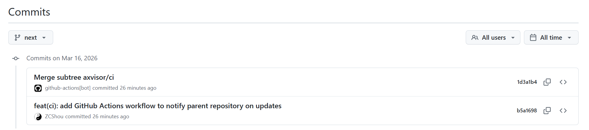
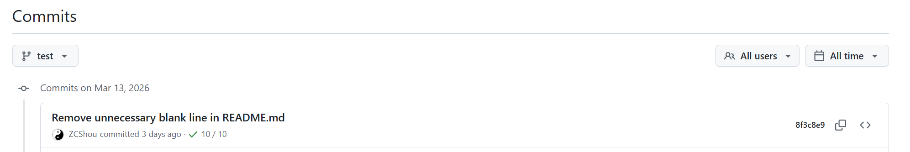
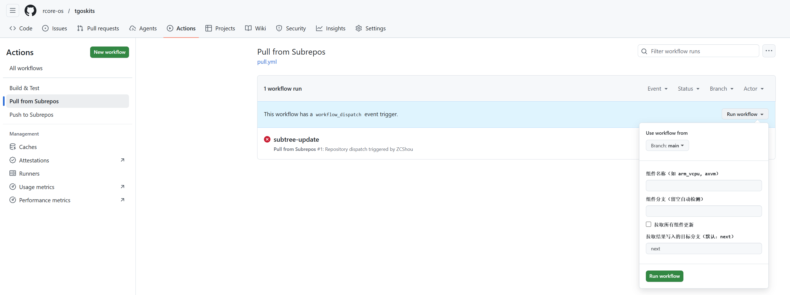
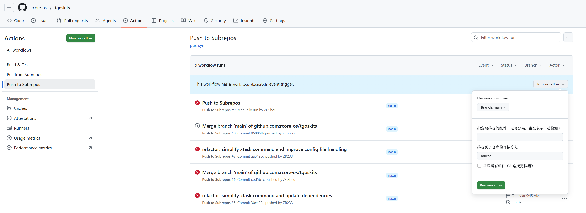

# TGOSKits 仓库管理指南

本文档详细介绍 TGOSKits 主仓库的架构设计、组件管理机制以及同步方案。

---

## 1. 概述

### 1.1 项目简介

TGOSKits 是一个面向操作系统开发的系统组件集成仓库。该仓库通过 Git Subtree 技术将多个独立的组件仓库整合到一个统一的主仓库中，为操作系统开发提供完整的组件生态从而统一开发过程。

### 1.2 核心特性

- **🎯 统一管理** - 在单一仓库中集中管理所有操作系统相关组件，简化依赖管理
- **📜 历史保留** - 完整保留每个组件的独立开发历史和提交记录，便于追溯和审计
- **🔄 双向同步** - 支持主仓库和组件仓库之间的双向代码同步，实现协作开发
- **🚀 独立开发** - 组件可以在独立仓库中开发、测试和发布，保持模块化
- **📦 版本控制** - 支持按分支或标签锁定组件版本，确保稳定性
- **🔧 灵活配置** - 通过 CSV 文件灵活配置组件，支持自动检测和手动指定

### 1.3 仓库架构

TGOSKits 采用分层架构设计，将不同类型的组件组织到不同目录：

```
tgoskits/
├── components/          # 可复用的库和模块（60+ 组件）
│   ├── Hypervisor/     # 虚拟化相关组件
│   ├── ArceOS/         # ArceOS 框架组件
│   ├── Starry/         # StarryOS 组件
│   └── rCore/          # rCore 相关组件
│
├── os/                 # 操作系统项目
│   ├── arceos/         # ArceOS - 模块化操作系统框架
│   ├── axvisor/        # Axvisor - ArceOS Hypervisor
│   └── StarryOS/       # StarryOS - 教学操作系统
│
├── scripts/            # 管理脚本
│   └── repo/           # 仓库管理工具
│       ├── repo.py     # Git Subtree 管理脚本（Python）
│       └── repos.csv   # 组件仓库配置清单
│
├── docs/               # 项目文档
└── xtask/              # 构建和开发任务工具
```

---

## 2. 组件管理

### 2.1 组件分类体系

TGOSKits 通过 Git Subtree 技术来管理着 **60+ 位于独立仓库的组件**，按照功能和应用场景分为以下几大类：

| 分类 | 数量 | 说明 | 代表组件 |
|------|------|------|----------|
| **Hypervisor** | 20 | 虚拟化相关组件，支持 ARM/RISC-V/x86 架构 | `arm_vcpu`, `axvm`, `axvisor_api`, `riscv_vcpu` |
| **ArceOS** | 24 | ArceOS 框架核心组件和驱动 | `axcpu`, `axsched`, `axerrno`, `axio`, `axdriver_crates` |
| **OS** | 3 | 完整的操作系统项目 | `arceos`, `axvisor`, `StarryOS` |
| **Starry** | 9 | StarryOS 相关组件 | `starry-process`, `starry-signal`, `starry-vm`, `axpoll` |
| **rCore** | 1 | rCore 生态组件 | `bitmap-allocator` |

### 2.2 组件配置文件

与 Git Submodule 不同，Git Subtree 的一个设计缺陷是 **本身不记录组件的来源信息**，这意味着无法通过 Git 命令直接查询 "这个目录来自哪个仓库"。

| 特性 | Git Submodule | Git Subtree |
|------|---------------|-------------|
| **配置文件** | `.gitmodules` 自动记录 URL、路径 | ❌ 无内置配置文件 |
| **远程信息** | 持久保存在 `.git/config` | ❌ 临时 remote 用完即删 |
| **来源追溯** | `git submodule status` 可查询 | ❌ 只能从 commit message 推断，且不全面 |

因此，TGOSKits 使用 [scripts/repo/repos.csv](scripts/repo/repos.csv) 作为**外部配置清单**来记录每个组件的来源 URL（哪个远程仓库）、目标路径（在主仓库中的位置）、分支/版本信息、分类和描述元数据等信息。每行记录一条信息，基本格式为 `url,branch,target_dir,category,description`，其中各个字段含义如下：

| 字段 | 必填 | 说明 | 示例 |
|------|:----:|------|------|
| `url` | ✅ | 组件仓库的 Git URL | `https://github.com/org/repo` |
| `branch` | ❌ | 分支或标签名，留空自动检测 | `dev`, `v0.2.2`, `main` |
| `target_dir` | ✅ | 组件在主仓库中的目标路径 | `components/arm_vcpu` |
| `category` | ❌ | 组件分类标签 | `Hypervisor`, `ArceOS`, `OS` |
| `description` | ❌ | 组件描述信息 | `ARM virtual CPU support` |

### 2.3 组件管理工具

`repo.py` 是一个对 Git Subtree 相关命令封装后的管理工具，其工作严重依赖 [scripts/repo/repos.csv](scripts/repo/repos.csv) 配置文件。

#### 2.3.1 列出已有组件

使用如下命令可以查看当前仓库所有配置的组件的基本信息。

```bash
# 列出所有组件
python3 scripts/repo/repo.py list

# 按分类过滤
python3 scripts/repo/repo.py list --category Hypervisor
python3 scripts/repo/repo.py list --category ArceOS
python3 scripts/repo/repo.py list --category OS
```

#### 2.3.2 添加新组件

将新的组件仓库添加到主仓库：

```bash
# 添加组件（自动检测分支）
python3 scripts/repo/repo.py add \
  --url https://github.com/org/new-component \
  --target components/new-component \
  --category Hypervisor

# 添加组件（指定分支）
python3 scripts/repo/repo.py add \
  --url https://github.com/org/new-component \
  --target components/new-component \
  --branch dev \
  --category Hypervisor \
  --description "New component description"
```

**执行流程：**
1. 验证参数完整性
2. 检查 CSV 中是否已存在相同 URL 或 target_dir
3. 添加组件信息到 CSV 文件
4. 创建临时 remote 并 fetch 代码
5. 使用 `git subtree add` 命令添加组件
6. 清理临时 remote

**前置条件：**
- 工作目录必须干净（无未提交更改）
- URL 和 target_dir 不能与已有组件冲突

#### 2.3.3 移除组件

从配置和仓库中移除组件：

```bash
# 仅从 CSV 中移除配置
python3 scripts/repo/repo.py remove old-component

# 同时删除本地目录
python3 scripts/repo/repo.py remove old-component --remove-dir
```

#### 2.3.4 切换分支

切换组件到不同的分支或标签：

```bash
# 切换到 dev 分支
python3 scripts/repo/repo.py branch arm_vcpu dev

# 切换回 main 分支
python3 scripts/repo/repo.py branch arm_vcpu main
```

此命令会：
1. 从新分支拉取更新
2. 自动更新 CSV 配置文件中的 branch 字段

#### 2.3.5 批量初始化

批量初始化仅用于首次批量初始化已有的独立组件。该命令实现从 CSV 文件中读取所有组件，然后批量添加所有组件到当前仓库，添加采用了 `git subtree add` 命令完整保留原仓库的提交历史记录。

```bash
# 从默认 CSV 初始化
python3 scripts/repo/repo.py init -f scripts/repo/repos.csv

# 从自定义 CSV 初始化
python3 scripts/repo/repo.py init -f /path/to/repos.csv
```

**特点：**
- 已存在的目录会自动跳过
- 适合新环境快速初始化

---

### 2.4 分支自动检测

当 [scripts/repo/repos.csv](scripts/repo/repos.csv) 中的组件配置中的 `branch` 字段为空时，`repo.py` 会通过 `detect_branch()` 方法自动检测仓库的默认分支。检测逻辑如下：

```
1. 尝试检查 remote 是否存在 main 分支
   └── git rev-parse <remote>/main
   └── 如果存在，返回 'main'

2. 尝试检查 remote 是否存在 master 分支
   └── git rev-parse <remote>/master
   └── 如果存在，返回 'master'

3. 查询 remote 的 HEAD 分支
   └── git remote show <remote>
   └── 解析输出中的 "HEAD branch" 字段
   └── 如果找到，返回该分支名

4. 兜底返回 'main'
```

在执行 `list`、`add`、`pull`、`push` 命令时，如果不指定分支都会自动检测分支。但是需要注意以下几个问题：

- 检测过程会创建临时 remote，fetch 完成后自动清理
- 优先检测 `main` 分支，符合 GitHub 新仓库的默认命名规范
- 对于使用非标准分支名的仓库，建议在 CSV 中显式指定 branch

## 3. 同步机制

为了同时保持统一仓库的开发便捷性与独立组件仓库的灵活性，`repo.py`还提供了 `tgoskits` 主仓库与独立组件仓库的之间的同步功能。并且配合在 CI 中的使用，还可实现自动同步。

### 3.1 Git Subtree 技术原理

**Git Subtree** 是一种将外部 Git 仓库的历史完整合并到主仓库子目录中的技术。与 Git Submodule 仅存储指向外部仓库的引用不同，Subtree 会将外部仓库的所有提交历史作为主仓库历史的一部分永久保存。

Subtree 使用特殊的 `Subtree Merge Strategy` 合并策略处理不同根目录仓库之间的合并，支持生成单个合并提交，历史简洁但丢失外部仓库细节的 **Squash 模式** (`--squash`)以及保留外部仓库的所有提交历史，可完整追溯的 **Preserve History 模式**，核心包含三个关键机制：

1. **Merge Base 计算**：Git 能识别主仓库中已合并的 subtree 历史与外部仓库的公共基准点
2. **路径重写**：自动将外部仓库的文件路径映射到主仓库的子目录（如 `src/` → `components/arm_vcpu/src/`）
3. **Split 算法**：反向操作，从主仓库中提取子目录的提交历史，移除路径前缀后重建独立历史

```
┌─────────────────────────────────────────────────────────────────────┐
│                      Subtree 同步机制                               │
└─────────────────────────────────────────────────────────────────────┘

      独立组件仓库                           主仓库 (tgoskits)
      github.com/.../arm_vcpu               components/arm_vcpu/
              │                                     │
              │     ┌─────────────────────┐         │
    pull ◄────┼─────┤   git subtree pull  │◄────────┤  获取更新
              │     │   git merge -s      │         │
              │     │   subtree           │         │
              │     └─────────────────────┘         │
              │                                     │
              │     ┌─────────────────────┐         │
    ────►push─┼─────┤   git subtree push  │────────►│  推送修改
              │     │   git split + push  │         │
              │     └─────────────────────┘         │
              │                                     │

关键特性：
• 离线可用：克隆主仓库即可获得所有组件完整历史
• 历史保留：TGOSKits 使用 Preserve History 模式，保留组件开发历史
• 双向同步：支持主仓库与组件仓库之间的双向代码流动
• 自动路径映射：Subtree 策略自动处理路径前缀转换
```

### 3.2 手动同步

`scripts/repo/repo.py` 提供了 `pull` 和 `push` 命令分别实现从组件仓库同步到主仓库和从主仓库同步到组件仓库两个方向的同步。

> 注意，CI 默认配置了同步，可以在将修改提交当远程仓库后自动同步，一般无需手动同步

#### 3.2.1 从组件仓库同步到主仓库

当组件仓库有新的更新时，可以使用 `repo.py pull` 命令将组件子仓库中的更改同步到当前主仓库中的对应组件目录下。

##### 3.2.1.1 基本用法

```bash
# 拉取单个指定组件更新
python3 scripts/repo/repo.py pull arm_vcpu

# 拉取所有组件更新
python3 scripts/repo/repo.py pull --all

# 拉取指定组件的指定分支
python3 scripts/repo/repo.py pull arm_vcpu -b dev
```

##### 3.2.1.2 Pull 命令执行流程

```python
# 伪代码展示 pull 的工作流程
def pull_subtree(url, target_dir, branch):
    # 1. 检查组件是否已添加
    if not is_added(target_dir):
        # 如果未添加，自动执行 add 操作
        add_subtree(url, target_dir, branch)
        return
    
    # 2. 自动检测分支（如果未指定）
    if not branch:
        branch = detect_branch(url)  # 检测 main 或 master
    
    # 3. 执行 git subtree pull
    git subtree pull --prefix=target_dir url branch
    
    # 4. Git 自动创建合并提交
    # Merge subtree arm_vcpu/main
```

##### 3.2.1.3 强制模式

当遇到冲突或需要完全重置时，使用 `--force` 参数：

```bash
python3 scripts/repo/repo.py pull arm_vcpu --force
```

**强制模式执行流程：**
1. 从 Git 索引中移除组件目录 (`git rm -r --cached`)
2. 删除本地目录 (`rm -rf`)
3. 创建一个提交记录删除操作
4. 重新添加 subtree (`git subtree add`)

**适用场景：**
- 组件历史被重写（rebase/reset）
- 严重的合并冲突无法解决
- 需要完全重新同步组件

##### 3.2.1.4 示例



#### 3.2.2 从主仓库同步到组件仓库

当在主仓库中修改了组件代码后，可以使用 `repo.py push` 命令将对当前组件的更改推送回独立的组件子仓库中。

##### 3.2.2.1 基本用法

```bash
# 修改然后提交到本地仓库

# 推送单个指定组件
python3 scripts/repo/repo.py push arm_vcpu

# 推送所有组件
python3 scripts/repo/repo.py push --all

# 推送到指定组件的指定分支
python3 scripts/repo/repo.py push arm_vcpu -b dev
```

> **权限要求**：需要对组件仓库有写权限

> **冲突处理**：如果组件仓库有新提交，需要先 pull 再 push

##### 3.2.2.2 Push 命令执行流程

```python
# 伪代码展示 push 的工作流程
def push_subtree(url, target_dir, branch):
    # 1. 检查组件是否存在
    if not is_added(target_dir):
        raise Error("Subtree not found")
    
    # 2. 自动检测分支（如果未指定）
    if not branch:
        branch = detect_branch(url)
    
    # 3. 执行 git subtree push
    # Git 会创建一系列新的提交在组件仓库中
    git subtree push --prefix=target_dir url branch
    
    # 4. 组件仓库会收到新的提交
```

##### 3.2.2.3 示例

Git subtree 会将主仓库的提交拆分成组件仓库的独立提交，且推送的提交会保留原始作者信息和时间戳，与直接在独立子仓库推动代码别无二致！



### 3.3 自动同步

TGOSKits 仓库配置了 `.github/workflows/pull.yml` 和 `.github/workflows/push.yml` 两个 CI 文件，这两个 CI 文件中会直接调用 `scripts/repo/repo.py` 来实现自动化的双向同步。

#### 3.3.1 从组件仓库同步到主仓库

Pull 工作流由 `.github/workflows/pull.yml` 文件实现从子仓库拉取更新到主仓库的 **next 分支**，并支持如下两种触发方式：

- `workflow_dispatch`：管理员可以在 `tgoskits` 仓库的 `Actions -> Pull from Subrepos` 界面中手动同步特定组件或所有组件

    

- `repository_dispatch`：子仓库通过 webhook 发送 `subtree-update` 事件，子仓库有更新时自动通知主仓库，子仓库需要将如下 CI 文件放到自己仓库的 `.github/workflows/` 目录中，且配置 `PARENT_REPO_TOKEN` 给予子仓库相关权限，详见下面的的 CI 文件中的注释说明。

    ```yaml
    # ═══════════════════════════════════════════════════════════════════════════════
    # 组件仓库 GitHub Actions 配置模板
    # ═══════════════════════════════════════════════════════════════════════════════
    #
    # 此文件用于子仓库，当子仓库有更新时通知主仓库进行 subtree pull 同步。
    #
    # 【使用步骤】
    # ─────────────────────────────────────────────────────────────────────────────
    # 1. 将此文件复制到子仓库的 .github/workflows/ 目录：
    #    cp scripts/push.yml <子仓库>/.github/workflows/push.yml
    #
    # 2. 在子仓库中配置 Secret：
    #    GitHub 仓库 → Settings → Secrets → Actions → New repository secret
    #    名称: PARENT_REPO_TOKEN
    #    值: 具有主仓库 repo 权限的 Personal Access Token
    #
    # 3. 修改下方 env 块中的一个变量（标注了「需要修改」的行）：
    #    PARENT_REPO  - 主仓库路径，例如 rcore-os/tgoskits
    #    （subtree 目录由主仓库自动从 git 历史中推断，无需手动指定）
    #
    # 【Token 权限要求】
    # ─────────────────────────────────────────────────────────────────────────────
    # PARENT_REPO_TOKEN 需要 Classic Personal Access Token，权限包括：
    #   - repo (Full control of private repositories)
    #   或
    #   - Fine-grained token: Contents (Read and Write)
    #
    # 【触发条件】
    # ─────────────────────────────────────────────────────────────────────────────
    # - 自动触发：推送到 dev 或 main 分支时
    # - 手动触发：Actions → Notify Parent Repository → Run workflow
    #
    # 【工作流程】
    # ─────────────────────────────────────────────────────────────────────────────
    # 子仓库 push → 触发此工作流 → 调用主仓库 API → 主仓库 subtree pull
    #
    # 【注意事项】
    # ─────────────────────────────────────────────────────────────────────────────
    # - 主仓库需要配置接收 repository_dispatch 事件的同步工作流
    # - 如果不需要子仓库到主仓库的同步，可以不使用此文件
    #
    # ═══════════════════════════════════════════════════════════════════════════════

    name: Notify Parent Repository

    # 当有新的推送时触发
    on:
      push:
        branches:
          - dev    # 主仓库推送的目标分支
          - main   # 兼容直接在子仓库开发的情况
          - test
      workflow_dispatch:

    jobs:
      notify:
        runs-on: ubuntu-latest
        steps:
          - name: Get repository info
            id: repo
            env:
              GH_REPO_NAME: ${{ github.event.repository.name }}
              GH_REF_NAME: ${{ github.ref_name }}
              GH_SERVER_URL: ${{ github.server_url }}
              GH_REPOSITORY: ${{ github.repository }}
            run: |
              # 直接使用 GitHub Actions 内置变量，通过 env 传入避免 shell 注入
              COMPONENT="$GH_REPO_NAME"
              BRANCH="$GH_REF_NAME"
              # 构造标准 HTTPS URL，供主仓库按 URL 精确匹配 repos.list
              REPO_URL="${GH_SERVER_URL}/${GH_REPOSITORY}"

              echo "component=${COMPONENT}" >> $GITHUB_OUTPUT
              echo "branch=${BRANCH}" >> $GITHUB_OUTPUT
              echo "repo_url=${REPO_URL}" >> $GITHUB_OUTPUT

              echo "Component: ${COMPONENT}"
              echo "Branch: ${BRANCH}"
              echo "Repo URL: ${REPO_URL}"

          - name: Notify parent repository
            env:
              # ── 需要修改 ──────────────────────────────────────────────────────────
              PARENT_REPO: "rcore-os/tgoskits"       # 主仓库路径
              # ── 无需修改 ──────────────────────────────────────────────────────────
              DISPATCH_TOKEN: ${{ secrets.PARENT_REPO_TOKEN }}
              # 将用户可控内容通过 env 传入，避免直接插值到 shell 脚本
              COMMIT_MESSAGE: ${{ github.event.head_commit.message }}
              GIT_ACTOR: ${{ github.actor }}
              GIT_SHA: ${{ github.sha }}
              STEP_COMPONENT: ${{ steps.repo.outputs.component }}
              STEP_BRANCH: ${{ steps.repo.outputs.branch }}
              STEP_REPO_URL: ${{ steps.repo.outputs.repo_url }}
            run: |
              COMPONENT="$STEP_COMPONENT"
              BRANCH="$STEP_BRANCH"
              REPO_URL="$STEP_REPO_URL"

              echo "Notifying parent repository about update in ${COMPONENT}:${BRANCH}"

              # 使用 jq 安全构建 JSON，避免 commit message 中任何特殊字符导致注入
              PAYLOAD=$(jq -n \
                --arg component "$COMPONENT" \
                --arg branch    "$BRANCH" \
                --arg repo_url  "$REPO_URL" \
                --arg commit    "$GIT_SHA" \
                --arg message   "$COMMIT_MESSAGE" \
                --arg author    "$GIT_ACTOR" \
                '{
                  event_type: "subtree-update",
                  client_payload: {
                    component: $component,
                    branch:    $branch,
                    repo_url:  $repo_url,
                    commit:    $commit,
                    message:   $message,
                    author:    $author
                  }
                }')

              curl --fail --show-error -X POST \
                -H "Accept: application/vnd.github.v3+json" \
                -H "Authorization: token ${DISPATCH_TOKEN}" \
                https://api.github.com/repos/${PARENT_REPO}/dispatches \
                -d "$PAYLOAD"

              echo "Notification sent successfully"

          - name: Create summary
            env:
              STEP_COMPONENT: ${{ steps.repo.outputs.component }}
              STEP_BRANCH: ${{ steps.repo.outputs.branch }}
              STEP_REPO_URL: ${{ steps.repo.outputs.repo_url }}
              GIT_SHA: ${{ github.sha }}
              GIT_ACTOR: ${{ github.actor }}
            run: |
              COMPONENT="$STEP_COMPONENT"
              BRANCH="$STEP_BRANCH"
              REPO_URL="$STEP_REPO_URL"

              echo "## Notification Summary" >> $GITHUB_STEP_SUMMARY
              echo "" >> $GITHUB_STEP_SUMMARY
              echo "- **Component**: ${COMPONENT}" >> $GITHUB_STEP_SUMMARY
              echo "- **Branch**: ${BRANCH}" >> $GITHUB_STEP_SUMMARY
              echo "- **Repo URL**: ${REPO_URL}" >> $GITHUB_STEP_SUMMARY
              echo "- **Commit**: \`${GIT_SHA}\`" >> $GITHUB_STEP_SUMMARY
              echo "- **Author**: ${GIT_ACTOR}" >> $GITHUB_STEP_SUMMARY
              echo "- **Status**: ✅ Notification sent" >> $GITHUB_STEP_SUMMARY
    ```


`.github/workflows/pull.yml` 的完整工作流程：

```
┌─────────────────────────────────────────────────────────────────┐
│                    Pull Workflow 执行流程                        │
└─────────────────────────────────────────────────────────────────┘
                            │
                            ▼
                ┌────────────────────────┐
                │  1. Checkout 主仓库     │
                │     (目标分支)          │
                └────────────┬───────────┘
                            │
                            ▼
                ┌────────────────────────┐
                │  2. 获取参数 & 校验     │
                │  - 组件名称             │
                │  - 分支名               │
                │  - 目标分支             │
                └────────────┬───────────┘
                            │
                            ▼
                ┌────────────────────────┐
                │  3. 列出当前组件        │
                │  (repo.py list)        │
                └────────────┬───────────┘
                            │
                            ▼
            ┌───────────────┴──────────────┐
            │                              │
        pull_all=true                  pull_all=false
            │                              │
            ▼                              ▼
┌─────────────────────┐      ┌─────────────────────┐
│ 拉取所有组件         │      │ 拉取指定组件         │
│ (repo.py pull --all)│      │ (repo.py pull <name>)│
└──────────┬──────────┘      └──────────┬──────────┘
            │                              │
            └───────────────┬──────────────┘
                            │
                            ▼
                ┌────────────────────────┐
                │  4. 推送到目标分支      │
                │     (默认: next)        │
                └────────────────────────┘
```

**安全措施：**

1. **参数校验**：
- 分支名格式校验：只允许字母、数字、`/`、`.`、`_`、`-`
- 目标分支名格式校验

2. **白名单验证**：
- 验证组件名称必须在 `repos.csv` 配置的组件列表中
- 防止路径遍历和注入攻击

3. **权限最小化**：
- 只请求必要的 `contents: write` 权限
- 使用 `GITHUB_TOKEN` 而非 PAT（仅限主仓库内部操作）

**工作流示例：**

当开发者在独立的组件仓库中推送代码时，会自动触发主仓库的 Pull 工作流，将更新同步到主仓库。

```
┌─────────────────────────────────────────────────────────────────────────────┐
│            场景：组件仓库更新 → 主仓库同步 (repository_dispatch)             │
└─────────────────────────────────────────────────────────────────────────────┘

时间线    组件仓库 (arm_vcpu)              GitHub Actions                 主仓库 (tgoskits)
  │
  │     ┌─────────────────────┐
  │     │ Step 1: 开发者推送   │
  T1    │ git push origin dev │
  │     └──────────┬──────────┘
  │                │
  │                ▼
  │     ┌─────────────────────────────────────┐
  │     │ Step 2: 子仓库 CI 触发               │
  T2    │ .github/workflows/push.yml          │
  │     │ • 获取组件信息 (name, branch, url)   │
  │     │ • 构建 JSON payload                 │
  │     └──────────────────┬──────────────────┘
  │                        │
  │                        ▼
  │     ┌───────────────────────────────────────────────────────────┐
  │     │ Step 3: 调用主仓库 API                                     │
  T3    │ POST https://api.github.com/repos/rcore-os/tgoskits/...   │
  │     │ {                                                         │
  │     │   "event_type": "subtree-update",                         │
  │     │   "client_payload": {                                     │
  │     │     "component": "arm_vcpu",                              │
  │     │     "branch": "dev",                                      │
  │     │     "repo_url": "https://github.com/rcore-os/arm_vcpu",   │
  │     │     "commit": "abc1234...",                               │
  │     │     "author": "developer"                                 │
  │     │   }                                                       │
  │     │ }                                                         │
  │     └────────────────────────────┬──────────────────────────────┘
  │                                  │
  │                                  ▼           ┌─────────────────────────────┐
  │                                  │           │ Step 4: Pull 工作流触发      │
  T4                                 ├──────────► .github/workflows/pull.yml   │
  │                                  │           │ • 接收 repository_dispatch  │
  │                                  │           │ • 解析 client_payload       │
  │                                  │           │ • 校验组件白名单             │
  │                                  │           └──────────────┬──────────────┘
  │                                  │                          │
  │                                  │                          ▼
  │                                  │           ┌─────────────────────────────┐
  │                                  │           │ Step 5: 执行 Subtree Pull   │
  T5                                 │           │ git subtree pull            │
  │                                  │           │   --prefix=components/      │
  │                                  │           │   arm_vcpu                  │
  │                                  │           │   https://github.com/...    │
  │                                  │           │   dev                       │
  │                                  │           └──────────────┬──────────────┘
  │                                  │                          │
  │                                  │                          ▼
  │                                  │           ┌─────────────────────────────┐
  │                                  │           │ Step 6: 推送到目标分支       │
  T6                                 │           │ git push origin HEAD:next   │
  │                                  │           │                             │
  │                                  │           │ 主仓库 next 分支已更新       │
  │                                  │           └─────────────────────────────┘
  │                                  │
  ▼                                  ▼
```

**关键检查点：**

| 步骤 | 检查项 | 失败处理 |
|------|--------|----------|
| T2 | `PARENT_REPO_TOKEN` 是否配置 | 工作流失败，需配置 Secret |
| T3 | Token 是否有主仓库 `repo` 权限 | API 返回 401/403 |
| T4 | 组件是否在 `repos.csv` 白名单中 | 工作流跳过，记录警告 |
| T5 | 是否存在合并冲突 | 需手动解决或使用 `--force` |
| T6 | 是否有推送到 `next` 分支权限 | 使用 `GITHUB_TOKEN`，通常有权限 |

**拉取策略说明：**

- 默认只拉取到 next 分支

```
┌─────────────────────────────────────────────────────────────────────────────┐
│                         Pull 工作流拉取策略                                  │
└─────────────────────────────────────────────────────────────────────────────┘

组件仓库 (dev/main)                    主仓库 (tgoskits)
       │                                    │
       │  开发者推送更新                      │
       │                                    │
       ▼                                    │
┌─────────────────┐                         │
│   push.yaml     │                         │
│    CI 触发      │                         │
└────────┬────────┘                         │
         │                                  │
         │   repository_dispatch            │
         │   event                          │
         ▼                                  ▼
┌─────────────────────────────────────────────────────────────────┐
│                    Pull 工作流执行                               │
│                                                                 │
│  1. git subtree pull --prefix=components/arm_vcpu <url> dev    │
│  2. git push origin HEAD:next                                   │
│                                                                 │
└──────────────────────────┬──────────────────────────────────────┘
                           │
                           │       ┌────────────────────┼────────────────────┐
                           │       │                    │                    │
                           │       ▼                    ▼                    ▼
                           │  ┌─────────┐          ┌─────────┐          ┌─────────┐
                           └─►│  next   │          │  main   │          │  dev    │
                              │ (拉取)  │          │ (保护)  │          │ (保护)  │
                              └────┬────┘          └─────────┘          └─────────┘
                                   │
                                   │  测试验证
                                   │  合并 PR
                                   ▼
                              ┌─────────┐
                              │  main   │
                              │ (合并)  │
                              └─────────┘

为什么拉取到 next 而非 main？
• 保护主分支稳定性：组件更新可能引入 bug
• 允许集成测试：在 next 分支进行完整测试
• 批量同步支持：多个组件更新可一次性合并
• 可回滚：问题发现后可快速回滚 next 分支
• 审核流程：重要更新可要求 PR 审核
```

#### 3.3.2 从主仓库同步到组件仓库

Push 工作流由 `.github/workflows/push.yml` 文件实现将主仓库中修改的组件推送到子仓库，支持如下两种触发方式：

- `workflow_dispatch`： 管理员可以在 `tgoskits` 仓库的 `Actions -> Push to Subrepos` 界面中手动将特定组件或所有组件的修改同步到独立组件仓库

    

- `push`： 当将修改的代码推送到 `tgoskits` 的指定分支（当前仅配置了 `main` 分支）时自动触发推送到独立组件仓库

`.github/workflows/push.yml` 的完整工作流程：

```
┌─────────────────────────────────────────────────────────────────┐
│                    Push Workflow 执行流程                        │
└─────────────────────────────────────────────────────────────────┘
                              │
                              ▼
              ┌───────────────────────────────┐
              │  Job 1: detect-changes        │
              │  检测修改的组件                │
              └───────────────┬───────────────┘
                              │
                              ▼
                 ┌────────────────────────┐
                 │  分析修改的文件         │
                 │  (git diff)             │
                 └────────────┬───────────┘
                              │
                              ▼
                 ┌────────────────────────┐
                 │  匹配组件目录           │
                 │  (repos.csv)            │
                 └────────────┬───────────┘
                              │
                              ▼
                 ┌────────────────────────┐
                 │  输出组件列表           │
                 │  (逗号分隔)             │
                 └────────────┬───────────┘
                              │
                              ▼
              ┌───────────────┴──────────────┐
              │                              │
        has-changes=true              has-changes=false
              │                              │
              ▼                              ▼
  ┌─────────────────────┐           ┌──────────────┐
  │ Job 2: push-to-     │           │   工作流结束  │
  │      subrepos       │           └──────────────┘
  └──────────┬──────────┘
             │
             ▼
  ┌─────────────────────────┐
  │  配置 Git & 认证         │
  │  (SUBTREE_PUSH_TOKEN)   │
  └────────────┬────────────┘
               │
               ▼
  ┌─────────────────────────┐
  │  推送组件到 mirror 分支  │
  │  (repo.py push <name>)  │
  └────────────┬────────────┘
               │
               ▼
  ┌─────────────────────────┐
  │  生成推送摘要报告        │
  └─────────────────────────┘
```

**自动检测逻辑：**

```bash
# 1. 获取修改的文件列表
if [ "$GH_EVENT_NAME" = "push" ]; then
  CHANGED_FILES=$(git diff --name-only HEAD^ HEAD)
else
  CHANGED_FILES=$(git diff --name-only HEAD~1 HEAD)
fi

# 2. 从 repos.csv 获取组件目录
COMPONENT_DIRS=$(python3 scripts/repo/repo.py list | \
                 tail -n +3 | \
                 awk '{print $3}')

# 3. 分析修改的文件，找出涉及的组件
for file in $CHANGED_FILES; do
  for component in $COMPONENT_DIRS; do
    if [[ "$file" == "$component"* ]]; then
      # 找到修改的组件
      CHANGED_COMPONENTS["$component"]=1
    fi
  done
done
```

**权限配置：**

Push 工作流需要配置 Personal Access Token (PAT) 以推送到子仓库：

1. **创建 PAT**：
   - 访问：https://github.com/settings/tokens/new
   - 名称：`tgoskits-subtree-push`
   - 权限：`repo` (Full control of private repositories)
   - 过期时间：根据需要设置

2. **添加到仓库 Secrets**：
   ```
   仓库 → Settings → Secrets and variables → Actions → New repository secret
   - Name: SUBTREE_PUSH_TOKEN
   - Value: <粘贴 PAT>
   ```

3. **认证配置**：
   ```bash
   # 工作流自动配置 Git 凭据
   if [ -n "$SUBTREE_PUSH_TOKEN" ]; then
     git config --global credential.helper store
     printf 'https://x-access-token:%s@github.com\n' "$SUBTREE_PUSH_TOKEN" \
       > ~/.git-credentials
   fi
   ```

**工作流示例：**

当开发者在主仓库中修改了组件代码后，可以手动触发 Push 工作流，将修改推送到对应的独立组件仓库。

```
┌─────────────────────────────────────────────────────────────────────────────┐
│            场景：主仓库修改 → 组件仓库同步 (workflow_dispatch)                 │
└─────────────────────────────────────────────────────────────────────────────┘

时间线    主仓库 (tgoskits)               GitHub Actions               组件仓库 (arm_vcpu)
  │
  │     ┌─────────────────────────────────────┐
  │     │ Step 1: 开发者修改组件代码           │
  T1    │ 编辑 components/arm_vcpu/src/...    │
  │     │ git add . && git commit -m "fix: ..."│
  │     │ git push origin main                 │
  │     └──────────────────┬──────────────────┘
  │                        │
  │                        ▼
  │     ┌──────────────────────────────────────────────────────┐
  │     │ Step 2: 手动触发 Push 工作流                          │
  T2    │ Actions → Push to Subrepos → Run workflow            │
  │     │                                                      │
  │     │ 输入参数:                                             │
  │     │   components: "arm_vcpu"    (或 push_all: true)      │
  │     │   branch: "mirror"          (目标分支)                │
  │     └────────────────────────────┬─────────────────────────┘
  │                                │
  │                                ▼
  │     ┌──────────────────────────────────────────────────────┐
  │     │ Step 3: Job 1 - detect-changes                       │
  T3    │                                                      │
  │     │ ┌──────────────────────────────────────────────────┐ │
  │     │ │ 3.1 分析修改的文件                                │ │
  │     │ │     git diff --name-only HEAD^ HEAD              │ │
  │     │ │     → components/arm_vcpu/src/lib.rs             │ │
  │     │ │     → components/arm_vcpu/Cargo.toml             │ │
  │     │ └──────────────────────────────────────────────────┘ │
  │     │                                                       │
  │     │ ┌──────────────────────────────────────────────────┐ │
  │     │ │ 3.2 匹配组件目录                                  │ │
  │     │ │     匹配到组件: arm_vcpu                          │ │
  │     │ └──────────────────────────────────────────────────┘ │
  │     │                                                       │
  │     │ ┌──────────────────────────────────────────────────┐ │
  │     │ │ 3.3 输出组件列表                                  │ │
  │     │ │     changed_components=arm_vcpu                  │ │
  │     │ └──────────────────────────────────────────────────┘ │
  │     └────────────────────────────┬─────────────────────────┘
  │                                │
  │                                ▼
  │     ┌──────────────────────────────────────────────────────┐
  │     │ Step 4: Job 2 - push-to-subrepos                     │
  T4    │                                                      │
  │     │ ┌──────────────────────────────────────────────────┐ │
  │     │ │ 4.1 配置 Git 认证                                 │ │
  │     │ │     使用 SUBTREE_PUSH_TOKEN                       │ │
  │     │ │     git config credential.helper store           │ │
  │     │ └──────────────────────────────────────────────────┘ │
  │     │                                                      │
  │     │ ┌──────────────────────────────────────────────────┐ │
  │     │ │ 4.2 执行 Subtree Push                             │ │
  │     │ │     git subtree push                              │ │
  │     │ │       --prefix=components/arm_vcpu                │ │
  │     │ │       https://github.com/rcore-os/arm_vcpu        │ │
  │     │ │       mirror                                      │ │
  │     │ │                                                   │ │
  │     │ │     Git 自动拆分提交:                              │ │
  │     │ │     • 筛选影响 arm_vcpu 的提交                     │ │
  │     │ │     • 移除路径前缀                                 │ │
  │     │ │     • 重建独立历史                                 │ │
  │     │ └──────────────────────────────────────────────────┘ │
  │     │                                                       │
  │     │ ┌──────────────────────────────────────────────────┐ │
  │     │ │ 4.3 生成摘要报告                                   │ │
  │     │ │     • 推送的组件列表                               │ │
  │     │ │     • 每个组件的提交数量                           │ │
  │     │ │     • 推送状态 (成功/失败)                         │ │
  │     │ └──────────────────────────────────────────────────┘ │
  │     └──────────────────────────┬───────────────────────────┘
  │                                │
  │                                │              ┌─────────────────────────────┐
  T5                               ├─────────────►│ Step 5: 组件仓库收到推送     │
  │                                │              │ arm_vcpu/mirror 分支更新    │
  │                                │              │                            │
  │                                │              │ 维护者可审核后合并到 main    │
  │                                │              └─────────────────────────────┘
  ▼                                ▼
```

**关键检查点：**

| 步骤 | 检查项 | 失败处理 |
|------|--------|----------|
| T2 | 参数格式是否正确 | 工作流验证失败 |
| T3 | 是否检测到组件修改 | 无修改则跳过 Job 2 |
| T4.1 | `SUBTREE_PUSH_TOKEN` 是否配置 | 认证失败 |
| T4.2 | 目标仓库是否有写权限 | Push 失败，返回 403 |
| T4.2 | 是否存在冲突（远程有新提交） | 需先执行 Pull 同步 |
| T5 | 组件仓库 `mirror` 分支是否存在 | 自动创建 |

**推送策略说明：**

- **目标分支**：所有组件推送到子仓库的 `mirror` 分支（默认）
- **分支保护**：不直接推送到 `main`/`master`，避免影响子仓库稳定性
- **合并流程**：子仓库维护者审核 `mirror` 分支后合并到主分支

```
┌─────────────────────────────────────────────────────────────────────────────┐
│                         Push 工作流推送策略                                  │
└─────────────────────────────────────────────────────────────────────────────┘

主仓库 (main)                      组件仓库
       │                              │
       │  修改 components/arm_vcpu/   │
       │                              │
       ▼                              │
┌─────────────────┐                   │
│ git subtree push│                   │
│                 │                   │
│ 拆分提交历史     │                   │
│ • 筛选相关提交   │                   │
│ • 移除路径前缀   │                   │
│ • 重建独立历史   │                   │
└────────┬────────┘                   │
         │                            │
         │       ┌────────────────────┼────────────────────┐
         │       │                    │                    │
         │       ▼                    ▼                    ▼
         │  ┌─────────┐          ┌─────────┐          ┌─────────┐
         └─►│ mirror  │          │  main   │          │  dev    │
            │ (推送)  │          │ (保护)  │          │ (保护)  │
            └────┬────┘          └─────────┘          └─────────┘
                 │
                 │  维护者审核
                 │  PR / Merge
                 ▼
            ┌─────────┐
            │  main   │
            │ (合并)  │
            └─────────┘

为什么不直接推送到 main？
• 保护主分支稳定性
• 允许维护者审核变更
• 支持测试和验证流程
• 可拒绝有问题的变更
```

**触发条件：**
- 主仓库手动触发 `Push to Subrepos` 工作流
- （可选）推送到主仓库特定分支时自动触发（需在 `push.yml` 中配置 `push` 事件）
