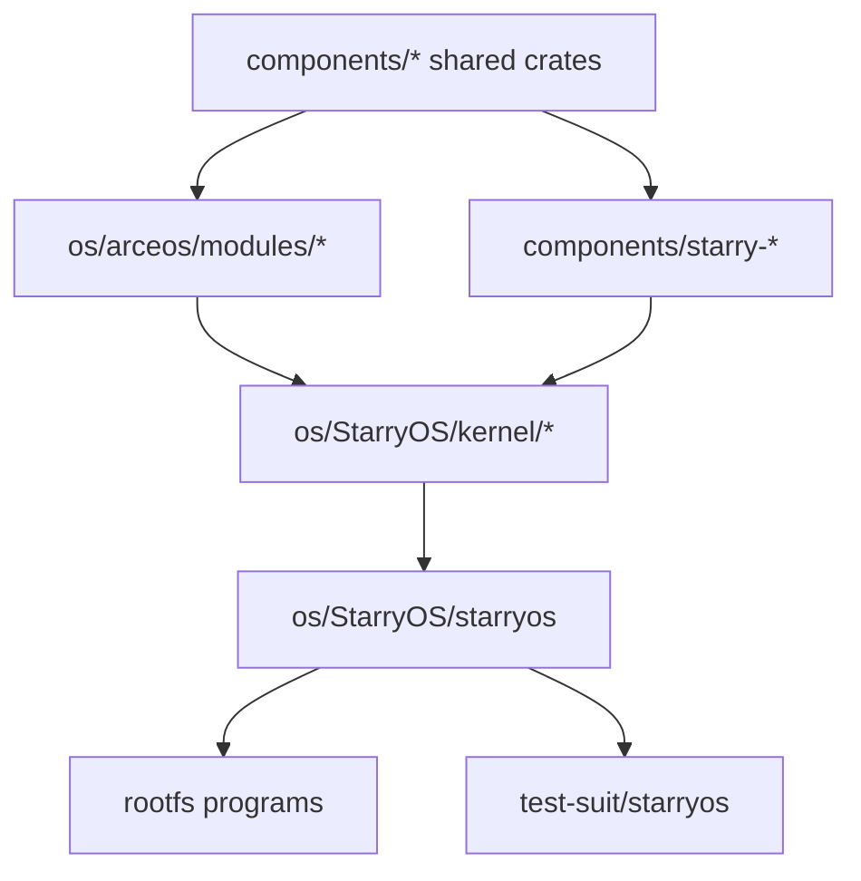

# StarryOS 开发指南

StarryOS 是 TGOSKits 工作区中的 Linux 兼容操作系统内核，构建于 ArceOS 模块层之上。其架构可视为三层协同：共享基础组件提供通用能力，ArceOS 模块层提供操作系统底层支撑，StarryOS 自身的内核逻辑和 rootfs 用户态实现 Linux 兼容行为。本文档介绍 StarryOS 的源码组织结构、构建与运行入口、架构概览、开发工作流、测试验证方法及调试手段。

## 1. 源码组织

StarryOS 的源码分布在 `os/StarryOS/`、`components/` 和 `os/arceos/` 三个区域。理解哪些目录属于 StarryOS 自身、哪些属于被复用的共享层，是评估改动影响范围的关键。

| 路径 | 角色 | 什么时候会改到 |
| --- | --- | --- |
| `os/StarryOS/kernel/` | StarryOS 内核实现 | syscall、进程、内存、文件系统、驱动接入 |
| `os/StarryOS/starryos/` | 启动包与 feature 组合 | 改启动入口、包级 feature、平台筛选 |
| `components/starry-*` | Starry 专用复用组件 | `starry-process`、`starry-signal`、`starry-vm`、`starry-smoltcp` 等 |
| `components/axpoll`、`components/rsext4` 等 | Starry 常用共享组件 | I/O 多路复用、文件系统等 |
| `os/arceos/modules/*` | StarryOS 复用的底层能力 | HAL、任务、驱动、网络、内存 |
| `test-suit/starryos/` | 系统测试入口 | 回归测试 |

## 2. 构建与运行

StarryOS 提供两种构建与运行方式：仓库根目录的 `cargo xtask starry` 统一入口和 `os/StarryOS/` 下的本地 Makefile 入口。两者使用不同的 rootfs 镜像位置（详见第 6 节），首次使用建议统一使用根目录入口。

### 仓库根目录的推荐入口

```bash
cargo xtask starry rootfs --arch riscv64
cargo xtask starry run --arch riscv64 --package starryos
```

根目录入口的特点：

- `rootfs` 会将镜像准备到 StarryOS 的目标产物目录
- `run` 在发现磁盘镜像缺失时也会自动补准备
- 默认包为 `starryos`

首次使用建议采用 `riscv64` 架构。熟悉流程后，可尝试：

```bash
cargo xtask starry run --arch loongarch64 --package starryos
```

### `os/StarryOS/` 里的本地入口

```bash
cd os/StarryOS
make rootfs ARCH=riscv64
make ARCH=riscv64 run
```

常用快捷命令：

```bash
make rv
make la
```

本地 Makefile 路径的特点：

- rootfs 固定复制到 `os/StarryOS/make/disk.img`
- 更适合调试 StarryOS 自身的 `make/` 构建行为

## 3. 架构概览

StarryOS 的能力来自三个层次：`components/` 下的共享基础 crate、`components/starry-*` 下的 StarryOS 专用组件、以及 `os/arceos/modules/` 下的 ArceOS 内核模块。以下流程图展示了这些层次之间的关系，有助于判断改动会从哪一层开始传播。



该链路中最关键的判断依据为：

- 修改底层通用能力：通常修改 `components/*` 或 `os/arceos/modules/*`
- 修改 Linux 兼容行为：通常修改 `components/starry-*` 或 `os/StarryOS/kernel/*`
- 修改启动包、feature 组合或目标平台范围：修改 `os/StarryOS/starryos`

## 4. 开发工作流

本节介绍 StarryOS 开发中常见的几类改动。无论修改共享基础能力、StarryOS 专用组件、内核逻辑还是启动配置，均应按推荐顺序逐步验证，先确保底层消费者工作正常，再验证上层行为。

### 4.1 修改共享基础能力

若修改内容涉及以下模块：

- `components/axerrno`、`components/kspin` 这类基础 crate
- 或 `os/arceos/modules/axhal`、`axtask`、`axdriver`、`axnet`

建议先确认 ArceOS 最小路径仍正常工作，再回到 StarryOS 验证：

```bash
cargo xtask arceos run --package arceos-helloworld --arch riscv64
cargo xtask starry run --arch riscv64 --package starryos
```

### 4.2 修改 StarryOS 专用组件或内核逻辑

若修改内容涉及以下模块：

- `components/starry-process`
- `components/starry-signal`
- `components/starry-vm`
- `components/starry-smoltcp`
- `os/StarryOS/kernel/*`

建议直接从 StarryOS 路径开始验证：

```bash
cargo xtask starry rootfs --arch riscv64
cargo xtask starry run --arch riscv64 --package starryos
```

### 4.3 新增 syscall 或用户可见行为

此类改动通常同时涉及以下两部分：

- `os/StarryOS/kernel/` 中的 syscall / 进程 / 文件系统逻辑
- rootfs 中的测试程序或用户态验证脚本

推荐的开发流程为：

1. 在内核中完成实现
2. 准备最小用户态程序触发该行为
3. 将程序放入 rootfs
4. 启动 StarryOS 验证行为

使用 Musl 工具链编译静态测试程序时，通常将其复制进挂载后的 rootfs 镜像中。

### 4.4 修改启动包和 Feature 组合

`os/StarryOS/starryos/Cargo.toml` 定义了包级 feature（如 `qemu`、`smp`、`vf2`）。若改动属于"启动形态"而非"内核算法"，应优先查看此文件而非直接进入 kernel。

## 5. 测试与验证

StarryOS 提供从日常运行到系统测试的多层验证入口。根目录 xtask 适合快速迭代，本地 Makefile 适合需要精细控制的场景，系统测试用于自动化回归。

### 日常运行

```bash
cargo xtask starry rootfs --arch riscv64
cargo xtask starry run --arch riscv64 --package starryos
```

### 系统测试

```bash
cargo xtask test starry --target riscv64gc-unknown-none-elf
```

根测试入口实际运行的是 `test-suit/starryos` 下的 `starryos-test` 包，而非普通的 `starryos` 包，更适合自动化回归。

### 本地 Makefile 路径

```bash
cd os/StarryOS
make rootfs ARCH=riscv64
make ARCH=riscv64 run
make ARCH=riscv64 debug
```

## 6. Rootfs 管理

StarryOS 的 rootfs 管理有两点需特别注意：根目录 xtask 路径与本地 Makefile 路径使用不同的镜像位置，且彼此不会自动共享。理解此点可避免"已下载 rootfs 却仍报镜像缺失"的困惑。

### 两种路径不共享默认镜像位置

- 根目录 `cargo xtask starry rootfs` 使用目标产物目录下的 `disk.img`
- `os/StarryOS/Makefile` 使用 `os/StarryOS/make/disk.img`

这意味着：

- 在根目录下载 rootfs 后，`make rootfs` 不一定省略复制步骤
- 在本地 Makefile 路径准备 rootfs 后，根目录 xtask 不一定直接复用

### 查看 rootfs 内容

使用本地 Makefile 路径时，可直接挂载 `os/StarryOS/make/disk.img`：

```bash
mkdir -p /mnt/rootfs
sudo mount -o loop os/StarryOS/make/disk.img /mnt/rootfs
ls /mnt/rootfs
sudo umount /mnt/rootfs
```

使用根目录 xtask 路径时，需先确认实际生成的 `disk.img` 位于哪个目标产物目录，再按同样方式挂载。

## 7. 调试指南

StarryOS 的调试手段与 ArceOS 类似，支持日志级别调整和 GDB 调试。排查启动问题时，建议先确认 rootfs 是否存在、当前使用的运行路径，然后根据最近的改动范围缩小排查方向。

### 查看详细日志

通过本地 Makefile 传入 `LOG` 变量：

```bash
cd os/StarryOS
make ARCH=riscv64 LOG=debug run
```

### 使用 GDB

本地入口已内置 `debug` / `justrun` 路径，比自己组合 QEMU 参数更可靠：

```bash
cd os/StarryOS
make ARCH=riscv64 debug
```

### 排查顺序

若 StarryOS 未按预期启动，建议按以下顺序排查：

1. rootfs 是否存在
2. 当前使用的是根目录 xtask 路径还是本地 Makefile 路径
3. 最近的改动位于共享组件、ArceOS 模块还是 StarryOS 内核

## 8. 延伸阅读

以下是深入理解 StarryOS 及其上下文的推荐阅读顺序。

- [starryos-internals.md](starryos-internals.md): StarryOS 的叠层架构、syscall 分发、进程与地址空间机制
- [components.md](components.md): 从组件视角理解共享依赖如何接入 StarryOS
- [build-system.md](build-system.md): rootfs 位置、xtask 与 Makefile 的边界说明
- [arceos-guide.md](arceos-guide.md): 当改动落在 ArceOS 共享模块层时的参考
