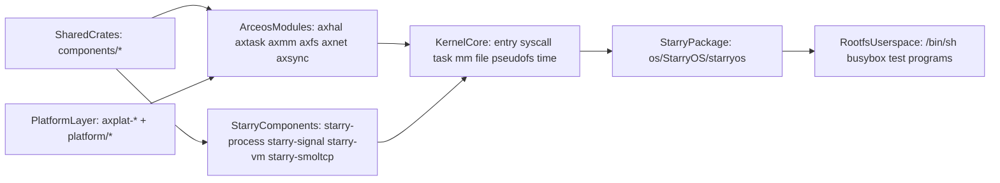
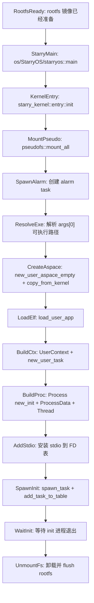
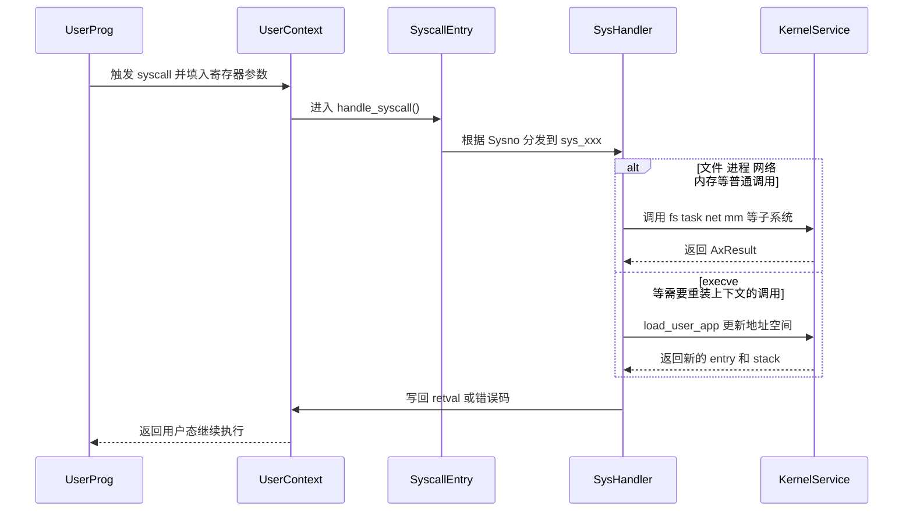
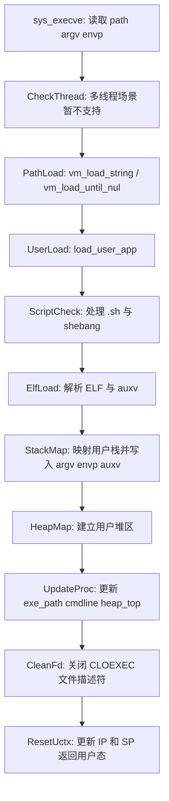
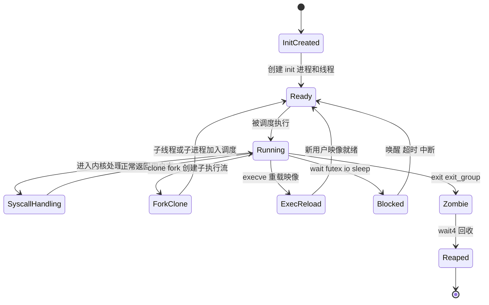

# StarryOS 深度技术解析

这篇文档面向准备修改 StarryOS 内核、补充 Linux 兼容语义、分析 syscall 路径、调整 rootfs 验证流程的开发者。与 [starryos-guide.md](starryos-guide.md) 相比，这里更关注内部结构与执行机制，而不是“先执行哪条命令”。

如果你还没有跑通过 StarryOS，建议先阅读 [quick-start.md](quick-start.md)。

## 1. 系统定位与设计目标

在 TGOSKits 中，StarryOS 不是一套完全孤立的内核，而是**建立在 ArceOS 基础能力之上的组件化宏内核系统**。它既继承了 ArceOS 的模块化、跨平台和 Rust 安全性，又引入了更接近 Linux 的进程、线程、syscall、文件系统和 rootfs 语义。

从开发视角看，StarryOS 的目标可以概括为：

| 目标 | 含义 | 典型落点 |
| --- | --- | --- |
| Linux 兼容语义 | 提供更接近 Linux 的用户态程序运行环境 | `kernel/src/syscall/*`、`kernel/src/task/*`、`kernel/src/file/*` |
| 复用 ArceOS 基础能力 | 不重复实现 HAL、调度、部分文件与网络基础设施 | `os/arceos/modules/*` |
| 组件化宏内核 | 在一个内核映像中组织多种子系统，但继续按组件边界拆分职责 | `components/starry-*`、`kernel/*` |
| 用户态验证闭环 | 通过 rootfs 和 init shell 验证系统行为，而不仅仅是跑单个内核函数 | `os/StarryOS/starryos`、rootfs 镜像、`test-suit/starryos` |

从系统角色上看，StarryOS 介于 “ArceOS 单内核应用运行时” 和 “完整 Linux 宏内核” 之间：它不是简单地给 ArceOS 增加一个 shell，而是把进程、地址空间、syscall 分发、伪文件系统、信号、资源限制等内核机制系统化组合了起来。

## 2. 总体架构与分层设计

StarryOS 的关键不是只有一个 `kernel/` 目录，而是多个层次共同组成最终可运行的系统。



阅读这张图时，可以重点抓住三件事：

- `rootfsUsers` 不是可有可无的附件，而是 StarryOS 验证 Linux 兼容行为的核心载体。
- `kernelCore` 并不直接从零实现全部底层能力，而是把 ArceOS 模块和 Starry 专用组件拼接成宏内核语义。
- 你改动 `arceosModules` 时，不只是 ArceOS 会受影响，StarryOS 也会被连带影响。

### 2.1 主要分层职责

| 层次 | 目录 | 职责 |
| --- | --- | --- |
| 用户态层 | rootfs 中的 shell、busybox、测试程序 | 触发 syscall、文件系统、进程管理等行为 |
| 启动包层 | `os/StarryOS/starryos` | 构造命令行与环境变量，进入内核入口 |
| 内核核心层 | `os/StarryOS/kernel` | `entry`、`syscall`、`task`、`mm`、`file`、`pseudofs`、`time` |
| Starry 专用组件层 | `components/starry-*` | 进程、信号、虚拟内存、网络兼容等抽象 |
| ArceOS 基础模块层 | `os/arceos/modules/*` | HAL、任务调度、同步、基础 I/O、文件与网络能力 |
| 平台层 | `platform/*`、`axplat-*` | 架构与板级支持 |

### 2.2 支持架构与当前状态

当前仓库中的 StarryOS README 给出的支持状态是：

- `riscv64`：可用
- `loongarch64`：可用
- `aarch64`：可用
- `x86_64`：仍在进行中

因此，如果你的工作目标是稳定验证内核语义，仍建议优先使用 `riscv64`。

## 3. 核心设计理念与实现机制

### 3.1 基于 ArceOS 的组件化宏内核

StarryOS 与传统“从零写起”的宏内核不同，它把不少底层职责继续留给 ArceOS：

- 任务与调度的基本运行时建立在 `axtask` 之上。
- 地址空间与页表能力复用了 `axmm` 系列基础设施。
- 文件系统、网络、HAL、日志等也依赖 `axfs`、`axnet`、`axhal`、`axlog` 等模块。

StarryOS 自己重点补齐的是“多进程、多线程、Linux syscall 语义、rootfs 用户态验证”这几部分。

### 3.2 进程与线程分离

StarryOS 在 `task` 子系统中把“进程共享状态”和“线程私有状态”明确分离：

| 对象 | 主要内容 | 语义 |
| --- | --- | --- |
| `ProcessData` | `proc`、`exe_path`、`cmdline`、`aspace`、`scope`、`rlim`、`signal`、`futex_table`、`umask` | 进程级共享状态 |
| `Thread` | `proc_data`、线程级 signal、time、`clear_child_tid`、`robust_list_head`、退出标志 | 线程级运行状态 |

这种拆分使得：

- `clone()` 可以根据 flags 决定是共享进程级资源，还是复制新的进程上下文。
- `execve()` 可以在保持进程身份的前提下，重装用户地址空间与程序映像。
- 线程切换时只需要切换线程级上下文，而资源、地址空间、信号行为仍可按进程或线程粒度维护。

### 3.3 syscall 分发是 StarryOS 的控制中枢

`kernel/src/syscall/mod.rs` 中的 `handle_syscall()` 是 StarryOS 的核心控制中枢之一。它做的事情很直接：

- 从 `UserContext` 读取 syscall 编号与参数。
- 将编号转换为 `Sysno`。
- 按功能域分发到 `fs`、`mm`、`task`、`signal`、`ipc`、`net` 等实现。
- 把返回值转换为 Linux 风格错误码写回 `UserContext`。

这意味着 StarryOS 的 Linux 兼容行为主要不是藏在一个巨大抽象层里，而是**明确定义在 syscall 分发与各子模块实现中**。

### 3.4 用户程序加载机制

StarryOS 的用户程序加载围绕 `mm::load_user_app()` 展开，它会：

- 解析路径或首个参数。
- 处理 shell 脚本与 shebang 解释器路径。
- 调用 ELF loader 解析二进制。
- 映射用户栈、写入 `argv/envp/auxv`。
- 建立用户堆区。
- 返回入口地址与用户栈顶。

这使得 `execve()` 不只是“替换当前进程路径字符串”，而是会重建当前线程接下来恢复用户态时看到的整个地址空间布局。

## 4. 主要功能组件的模块划分与交互关系

### 4.1 内核子系统总览

| 子系统 | 目录 | 职责 | 典型关联 |
| --- | --- | --- | --- |
| 启动入口 | `kernel/src/entry.rs` | 挂载伪文件系统、建立 init 进程与线程、准备 stdio、等待系统退出 | `mm`、`task`、`pseudofs`、`file` |
| syscall | `kernel/src/syscall/*` | 按 Linux syscall 语义分发系统调用 | `task`、`mm`、`file`、`ipc`、`net` |
| task | `kernel/src/task/*` | 进程/线程、futex、资源限制、统计、信号与定时器联动 | `starry-process`、`starry-signal`、`axtask` |
| mm | `kernel/src/mm/*` | 地址空间、ELF 装载、用户内存访问、I/O 映射 | `starry-vm`、`axmm` |
| file | `kernel/src/file/*` | 文件描述符表、文件系统对象、stdio、I/O 多路复用联动 | `axfs`、`pseudofs` |
| pseudofs | `kernel/src/pseudofs/*` | `/proc`、`/dev` 等伪文件系统挂载与设备节点 | `file` |
| time | `kernel/src/time/*` | 计时、时间相关 syscall 与统计支持 | `axtask`、`axhal` |

### 4.2 Starry 专用组件

当前仓库中的 Starry 专用组件主要包括：

- `components/starry-process`
- `components/starry-signal`
- `components/starry-vm`
- `components/starry-smoltcp`

可以把它们理解为“介于 ArceOS 基础模块和 StarryOS 内核实现之间”的中间层：

- 它们承载 Linux 兼容语义更强的抽象。
- 它们避免把所有逻辑都堆到 `kernel/` 目录里。
- 它们也让后续替换、扩展或复用变得更容易。

### 4.3 启动包与内核入口的关系

`os/StarryOS/starryos/src/main.rs` 的职责很轻：

```rust
pub const CMDLINE: &[&str] = &["/bin/sh", "-c", include_str!("init.sh")];

#[unsafe(no_mangle)]
fn main() {
    let args = CMDLINE.iter().copied().map(str::to_owned).collect::<Vec<_>>();
    let envs = [];
    starry_kernel::entry::init(&args, &envs);
}
```

它把命令行与环境准备好后，就把控制权交给 `starry_kernel::entry::init()`。真正的“宏内核初始化”发生在 `kernel/src/entry.rs` 中，而不是启动包本身。

## 5. 关键执行场景分析

### 5.1 从启动包到 init 进程的完整链路

下面这张流程图适合回答“StarryOS 启动时到底做了什么”：



这张图揭示了几个重要事实：

- `pseudofs::mount_all()` 很早就发生，说明 `/dev`、`/proc` 等伪文件系统不是后补功能，而是系统初始化的一部分。
- `copy_from_kernel()` 表示用户地址空间创建时会继承某些必要的内核映射，而不是完全空白。
- init 进程不是特殊的“内联函数执行”，而是通过 `new_user_task()` 和 `spawn_task()` 变成真正可调度任务。

### 5.2 syscall 分发路径

下面的时序图描述了一次典型 syscall 从用户态进入内核、再回到用户态的过程：



这张图对排查 syscall 问题很有帮助：

- 如果用户态得到 `ENOSYS`，优先看 `Sysno` 是否未覆盖。
- 如果 syscall 逻辑进入了 `sys_xxx` 但行为异常，就去对应子系统排查，而不是只盯着分发表。
- 如果问题只在 `execve()`、`clone()` 等复杂调用中出现，通常还要一起看 `task` 和 `mm`。

### 5.3 `execve()` 与 ELF 装载流程

`execve()` 是 StarryOS 最能体现“宏内核语义”的场景之一，因为它需要同时重写地址空间、用户栈、命令行和线程上下文。



这里最值得注意的几点是：

- `execve()` 当前在多线程场景下会返回 `WouldBlock`，说明这一语义还没有完全补齐。
- StarryOS 会处理脚本和 shebang，而不是只接受 ELF。
- `CLOEXEC` 文件描述符会在 `execve()` 后被清理，这与 Linux 语义保持一致。

### 5.4 进程与线程生命周期

下面的状态图可以帮助你把 `clone()`、`execve()`、`wait4()` 和 `exit()` 放在同一个视角下理解：



当你分析“某个程序为什么没有继续跑下去”时，这张图通常能帮助你迅速区分：

- 是不是卡在 `Blocked`。
- 是不是已经 `Zombie` 但父进程没有回收。
- 是不是 `execve()` 失败后没有完成 `Ready` 状态恢复。

## 6. 开发环境与构建指南

### 6.1 最小开发环境

StarryOS 需要的不只是 Rust 裸机目标，还经常需要 rootfs 与 Musl 交叉工具链：

- Rust toolchain 与裸机 target。
- QEMU。
- 必要时安装 Musl 交叉工具链，用于构建 rootfs 中的静态用户态程序。

StarryOS README 中提供了两种方式：

- Docker 方式：适合快速拉起统一环境。
- 手工方式：适合长期本地开发。

### 6.2 两套运行入口

| 入口 | 适合场景 | 命令 |
| --- | --- | --- |
| 根目录 xtask | 集成开发、和仓库统一测试保持一致 | `cargo xtask starry rootfs --arch riscv64`、`cargo xtask starry run --arch riscv64 --package starryos` |
| 本地 Makefile | 调 StarryOS 自己的构建逻辑与 GDB 路径 | `cd os/StarryOS && make rootfs ARCH=riscv64 && make ARCH=riscv64 run` |

常用最小路径如下：

```bash
cargo xtask starry rootfs --arch riscv64
cargo xtask starry run --arch riscv64 --package starryos
```

### 6.3 rootfs 的两个常见位置

StarryOS 最容易让人困惑的一点，是根 xtask 路径和本地 Makefile 路径不共享默认镜像位置：

- 根目录 xtask：通常围绕 `target/<triple>/<profile>/disk.img`
- 本地 Makefile：`os/StarryOS/make/disk.img`

因此，“我已经准备过 rootfs” 不等于另一套入口也能直接复用。

## 7. 核心 API 与内部接口使用说明

StarryOS 面向开发者最重要的不是“用户态 API”，而是几个内核内部接口。

### 7.1 启动入口

| 接口 | 位置 | 说明 |
| --- | --- | --- |
| `starry_kernel::entry::init(args, envs)` | `kernel/src/entry.rs` | 负责从启动参数创建 init 进程并启动用户态世界 |
| `load_user_app()` | `kernel/src/mm/loader.rs` | 装载 ELF、建立用户栈和堆、返回入口与栈顶 |
| `handle_syscall()` | `kernel/src/syscall/mod.rs` | syscall 分发总入口 |

### 7.2 进程/线程内部接口

| 对象/接口 | 作用 |
| --- | --- |
| `ProcessData::new()` | 组装进程共享状态 |
| `Thread::new()` | 创建线程私有状态 |
| `sys_clone()` | 根据 clone flags 创建子线程或子进程 |
| `sys_execve()` | 在当前进程中替换用户映像 |

### 7.3 典型内部使用样式

`sys_execve()` 的核心逻辑可以概括为：

```rust
let path = vm_load_string(path)?;
let args = vm_load_until_nul(argv)?
    .into_iter()
    .map(vm_load_string)
    .collect::<Result<Vec<_>, _>>()?;

let mut aspace = proc_data.aspace.lock();
let (entry_point, user_stack_base) =
    load_user_app(&mut aspace, Some(path.as_str()), &args, &envs)?;

uctx.set_ip(entry_point.as_usize());
uctx.set_sp(user_stack_base.as_usize());
```

它体现出三个开发上的关键点：

- 用户参数访问必须先通过 `vm_load_*` 系列接口做安全装载。
- 地址空间更新是 `execve()` 的核心工作，不只是更新路径名。
- 最终必须把新的 `IP/SP` 写回 `UserContext`，用户态才能真正跳转到新程序入口。

## 8. 调试、故障排查与优化方法

### 8.1 日志与 GDB

最直接的本地调试入口仍然是 Makefile：

```bash
cd os/StarryOS
make ARCH=riscv64 LOG=debug run
make ARCH=riscv64 debug
```

这比自己手拼 QEMU 参数更稳定，也更接近 StarryOS 自身的调试路径。

### 8.2 常见问题

| 现象 | 常见原因 | 建议排查点 |
| --- | --- | --- |
| 启动时报找不到 rootfs | 镜像没准备好，或用错了入口路径 | 先分清 xtask 路径还是 Makefile 路径 |
| 用户程序起不来 | `load_user_app()` 失败、ELF 不合法、shebang 解释错误 | 看 `mm/loader.rs` |
| syscall 返回 `ENOSYS` | 分发表未覆盖，或目标架构条件编译没命中 | 看 `kernel/src/syscall/mod.rs` |
| `execve()` 异常 | 多线程语义未覆盖、CLOEXEC/地址空间更新有误 | 看 `sys_execve()` 与 `load_user_app()` |
| 线程/进程行为异常 | `clone()` flags 处理或 `ProcessData` 共享状态不符合预期 | 看 `task/clone.rs`、`task/mod.rs` |

### 8.3 性能优化切入点

如果你要优化 StarryOS，常见入口有：

- syscall 分发开销：关注热路径 syscall 是否有不必要的复制、锁或抽象层。
- 进程创建与装载：关注 `clone()`、`execve()`、ELF loader 与地址空间映射。
- futex 与调度：关注 `task` 子系统与 `axtask` 的协作。
- 文件与 rootfs：关注 FD 表、伪文件系统与底层文件系统交互。

## 9. 二次开发建议与阅读路径

建议按下列顺序继续深入：

1. 从 `os/StarryOS/starryos/src/main.rs` 和 `kernel/src/entry.rs` 看系统启动主线。
2. 再看 `kernel/src/syscall/mod.rs`，理解 syscall 是如何分流到不同子系统的。
3. 进入 `kernel/src/task/*`、`kernel/src/mm/*` 深入理解进程、线程和地址空间。
4. 如果问题落在底层共享能力，再回到 [arceos-internals.md](arceos-internals.md) 对照 ArceOS 模块层。

关联阅读建议：

- [starryos-guide.md](starryos-guide.md)：更偏“目录、命令与运行方式”。
- [arceos-internals.md](arceos-internals.md)：更偏“StarryOS 所复用的底层模块”。
- [build-system.md](build-system.md)：更偏“xtask、Makefile、rootfs 与测试入口的关系”。
