# tgoskits 组件层次依赖分析

本文档覆盖 **137** 个 crate（与 `docs/crates/README.md` / `gen_crate_docs` 一致），按仓库内**直接**路径依赖自底向上分层。

由 `scripts/analyze_tgoskits_deps.py` 生成。

## 1. 统计概览

| 指标 | 数值 |
|------|------|
| 仓库内 crate | **137** |
| 内部有向边 | **505** |
| 最大层级 | **16** |
| SCC 数 | **137** |
| Lock 总包块 | **848** |
| Lock 内工作区包（与扫描交集） | **143** |
| Lock 外部依赖条目 | **705** |

### 1.1 分类

| 分类 | 数 |
|------|-----|
| ArceOS 层 | 30 |
| Axvisor 层 | 1 |
| StarryOS 层 | 2 |
| 工具层 | 2 |
| 平台层 | 2 |
| 测试层 | 9 |
| 组件层 | 91 |

## 2. 依赖图（按分类子图）

`A --> B` 表示 A 依赖 B。

```mermaid
flowchart TB
    subgraph sg_ArceOS__["<b>ArceOS 层</b>"]
        direction TB
        arceos_helloworld["arceos-helloworld\nv0.1.0"]
        arceos_helloworld_myplat["arceos-helloworld-myplat\nv0.1.0"]
        arceos_httpclient["arceos-httpclient\nv0.1.0"]
        arceos_httpserver["arceos-httpserver\nv0.1.0"]
        arceos_shell["arceos-shell\nv0.1.0"]
        arceos_api["arceos_api\nv0.3.0-preview.3"]
        arceos_posix_api["arceos_posix_api\nv0.3.0-preview.3"]
        axalloc["axalloc\nv0.3.0-preview.3"]
        axconfig["axconfig\nv0.3.0-preview.3"]
        axdisplay["axdisplay\nv0.3.0-preview.3"]
        axdma["axdma\nv0.3.0-preview.3"]
        axdriver["axdriver\nv0.3.0-preview.3"]
        axfeat["axfeat\nv0.3.0-preview.3"]
        axfs["axfs\nv0.3.0-preview.3"]
        axfs_ng["axfs-ng\nv0.3.0-preview.3"]
        axhal["axhal\nv0.3.0-preview.3"]
        axinput["axinput\nv0.3.0-preview.3"]
        axipi["axipi\nv0.3.0-preview.3"]
        axlibc["axlibc\nv0.3.0-preview.3"]
        axlog["axlog\nv0.3.0-preview.3"]
        axmm["axmm\nv0.3.0-preview.3"]
        axnet["axnet\nv0.3.0-preview.3"]
        axnet_ng["axnet-ng\nv0.3.0-preview.3"]
        axruntime["axruntime\nv0.3.0-preview.3"]
        axstd["axstd\nv0.3.0-preview.3"]
        axsync["axsync\nv0.3.0-preview.3"]
        axtask["axtask\nv0.3.0-preview.3"]
        bwbench_client["bwbench-client\nv0.1.0"]
        deptool["deptool\nv0.1.0"]
        mingo["mingo\nv0.6.0"]
    end
    subgraph sg_Axvisor__["<b>Axvisor 层</b>"]
        direction TB
        axvisor["axvisor\nv0.3.0-preview.2"]
    end
    subgraph sg_StarryOS__["<b>StarryOS 层</b>"]
        direction TB
        starry_kernel["starry-kernel\nv0.2.0-preview.2"]
        starryos["starryos\nv0.2.0-preview.2"]
    end
    subgraph sg____["<b>工具层</b>"]
        direction TB
        axbuild["axbuild\nv0.3.0-preview.3"]
        tg_xtask["tg-xtask\nv0.3.0-preview.3"]
    end
    subgraph sg____["<b>平台层</b>"]
        direction TB
        axplat_dyn["axplat-dyn\nv0.3.0-preview.3"]
        axplat_x86_qemu_q35["axplat-x86-qemu-q35\nv0.2.0"]
    end
    subgraph sg____["<b>测试层</b>"]
        direction TB
        arceos_affinity["arceos-affinity\nv0.1.0"]
        arceos_irq["arceos-irq\nv0.1.0"]
        arceos_memtest["arceos-memtest\nv0.1.0"]
        arceos_parallel["arceos-parallel\nv0.1.0"]
        arceos_priority["arceos-priority\nv0.1.0"]
        arceos_sleep["arceos-sleep\nv0.1.0"]
        arceos_wait_queue["arceos-wait-queue\nv0.1.0"]
        arceos_yield["arceos-yield\nv0.1.0"]
        starryos_test["starryos-test\nv0.3.0-preview.3"]
    end
    subgraph sg____["<b>组件层</b>"]
        direction TB
        aarch64_sysreg["aarch64_sysreg\nv0.1.1"]
        arm_pl011["arm_pl011\nv0.1.0"]
        arm_pl031["arm_pl031\nv0.2.1"]
        arm_vcpu["arm_vcpu\nv0.2.2"]
        arm_vgic["arm_vgic\nv0.2.1"]
        axaddrspace["axaddrspace\nv0.3.0"]
        axallocator["axallocator\nv0.2.0"]
        axbacktrace["axbacktrace\nv0.1.2"]
        axconfig_gen["axconfig-gen\nv0.2.1"]
        axconfig_macros["axconfig-macros\nv0.2.1"]
        axcpu["axcpu\nv0.3.0-preview.8"]
        axdevice["axdevice\nv0.2.1"]
        axdevice_base["axdevice_base\nv0.2.1"]
        axdriver_base["axdriver_base\nv0.1.4-preview.3"]
        axdriver_block["axdriver_block\nv0.1.4-preview.3"]
        axdriver_display["axdriver_display\nv0.1.4-preview.3"]
        axdriver_input["axdriver_input\nv0.1.4-preview.3"]
        axdriver_net["axdriver_net\nv0.1.4-preview.3"]
        axdriver_pci["axdriver_pci\nv0.1.4-preview.3"]
        axdriver_virtio["axdriver_virtio\nv0.1.4-preview.3"]
        axdriver_vsock["axdriver_vsock\nv0.1.4-preview.3"]
        axerrno["axerrno\nv0.2.2"]
        axfs_ng_vfs["axfs-ng-vfs\nv0.1.1"]
        axfs_devfs["axfs_devfs\nv0.1.2"]
        axfs_ramfs["axfs_ramfs\nv0.1.2"]
        axfs_vfs["axfs_vfs\nv0.1.2"]
        axhvc["axhvc\nv0.2.0"]
        axio["axio\nv0.3.0-pre.1"]
        axklib["axklib\nv0.3.0"]
        axplat["axplat\nv0.3.1-pre.6"]
        axplat_aarch64_bsta1000b["axplat-aarch64-bsta1000b\nv0.3.1-pre.6"]
        axplat_aarch64_peripherals["axplat-aarch64-peripherals\nv0.3.1-pre.6"]
        axplat_aarch64_phytium_pi["axplat-aarch64-phytium-pi\nv0.3.1-pre.6"]
        axplat_aarch64_qemu_virt["axplat-aarch64-qemu-virt\nv0.3.1-pre.6"]
        axplat_aarch64_raspi["axplat-aarch64-raspi\nv0.3.1-pre.6"]
        axplat_loongarch64_qemu_virt["axplat-loongarch64-qemu-virt\nv0.3.1-pre.6"]
        axplat_macros["axplat-macros\nv0.1.0"]
        axplat_riscv64_qemu_virt["axplat-riscv64-qemu-virt\nv0.3.1-pre.6"]
        axplat_x86_pc["axplat-x86-pc\nv0.3.1-pre.6"]
        axpoll["axpoll\nv0.1.2"]
        axsched["axsched\nv0.3.1"]
        axvcpu["axvcpu\nv0.2.2"]
        axvisor_api["axvisor_api\nv0.1.0"]
        axvisor_api_proc["axvisor_api_proc\nv0.1.0"]
        axvm["axvm\nv0.2.3"]
        axvmconfig["axvmconfig\nv0.2.2"]
        bitmap_allocator["bitmap-allocator\nv0.2.1"]
        cap_access["cap_access\nv0.1.0"]
        cargo_axplat["cargo-axplat\nv0.2.5"]
        cpumask["cpumask\nv0.1.0"]
        crate_interface["crate_interface\nv0.3.0"]
        crate_interface_lite["crate_interface_lite\nv0.1.0"]
        ctor_bare["ctor_bare\nv0.2.1"]
        ctor_bare_macros["ctor_bare_macros\nv0.2.1"]
        define_simple_traits["define-simple-traits\nv0.1.0"]
        define_weak_traits["define-weak-traits\nv0.1.0"]
        handler_table["handler_table\nv0.1.2"]
        hello_kernel["hello-kernel\nv0.1.0"]
        impl_simple_traits["impl-simple-traits\nv0.1.0"]
        impl_weak_partial["impl-weak-partial\nv0.1.0"]
        impl_weak_traits["impl-weak-traits\nv0.1.0"]
        int_ratio["int_ratio\nv0.1.2"]
        irq_kernel["irq-kernel\nv0.1.0"]
        kernel_guard["kernel_guard\nv0.1.3"]
        kspin["kspin\nv0.1.1"]
        lazyinit["lazyinit\nv0.2.2"]
        linked_list_r4l["linked_list_r4l\nv0.3.0"]
        memory_addr["memory_addr\nv0.4.1"]
        memory_set["memory_set\nv0.4.1"]
        page_table_entry["page_table_entry\nv0.6.1"]
        page_table_multiarch["page_table_multiarch\nv0.6.1"]
        percpu["percpu\nv0.2.3-preview.1"]
        percpu_macros["percpu_macros\nv0.2.3-preview.1"]
        range_alloc_arceos["range-alloc-arceos\nv0.1.4"]
        riscv_h["riscv-h\nv0.2.0"]
        riscv_plic["riscv_plic\nv0.2.0"]
        riscv_vcpu["riscv_vcpu\nv0.2.2"]
        riscv_vplic["riscv_vplic\nv0.2.1"]
        rsext4["rsext4\nv0.1.0"]
        scope_local["scope-local\nv0.1.2"]
        smoltcp["smoltcp\nv0.12.0"]
        smoltcp_fuzz["smoltcp-fuzz\nv0.0.1"]
        smp_kernel["smp-kernel\nv0.1.0"]
        starry_process["starry-process\nv0.2.0"]
        starry_signal["starry-signal\nv0.3.0"]
        starry_vm["starry-vm\nv0.3.0"]
        test_simple["test-simple\nv0.1.0"]
        test_weak["test-weak\nv0.1.0"]
        test_weak_partial["test-weak-partial\nv0.1.0"]
        timer_list["timer_list\nv0.1.0"]
        x86_vcpu["x86_vcpu\nv0.2.2"]
    end
    arceos_affinity --> axstd
    arceos_helloworld --> axstd
    arceos_helloworld_myplat --> axplat_aarch64_bsta1000b
    arceos_helloworld_myplat --> axplat_aarch64_phytium_pi
    arceos_helloworld_myplat --> axplat_aarch64_qemu_virt
    arceos_helloworld_myplat --> axplat_aarch64_raspi
    arceos_helloworld_myplat --> axplat_loongarch64_qemu_virt
    arceos_helloworld_myplat --> axplat_riscv64_qemu_virt
    arceos_helloworld_myplat --> axplat_x86_pc
    arceos_helloworld_myplat --> axstd
    arceos_httpclient --> axstd
    arceos_httpserver --> axstd
    arceos_irq --> axstd
    arceos_memtest --> axstd
    arceos_parallel --> axstd
    arceos_priority --> axstd
    arceos_shell --> axstd
    arceos_sleep --> axstd
    arceos_wait_queue --> axstd
    arceos_yield --> axstd
    arceos_api --> axalloc
    arceos_api --> axconfig
    arceos_api --> axdisplay
    arceos_api --> axdma
    arceos_api --> axdriver
    arceos_api --> axerrno
    arceos_api --> axfeat
    arceos_api --> axfs
    arceos_api --> axhal
    arceos_api --> axio
    arceos_api --> axipi
    arceos_api --> axlog
    arceos_api --> axmm
    arceos_api --> axnet
    arceos_api --> axruntime
    arceos_api --> axsync
    arceos_api --> axtask
    arceos_posix_api --> axalloc
    arceos_posix_api --> axconfig
    arceos_posix_api --> axerrno
    arceos_posix_api --> axfeat
    arceos_posix_api --> axfs
    arceos_posix_api --> axhal
    arceos_posix_api --> axio
    arceos_posix_api --> axlog
    arceos_posix_api --> axnet
    arceos_posix_api --> axruntime
    arceos_posix_api --> axsync
    arceos_posix_api --> axtask
    arceos_posix_api --> scope_local
    arm_vcpu --> axaddrspace
    arm_vcpu --> axdevice_base
    arm_vcpu --> axerrno
    arm_vcpu --> axvcpu
    arm_vcpu --> axvisor_api
    arm_vcpu --> percpu
    arm_vgic --> aarch64_sysreg
    arm_vgic --> axaddrspace
    arm_vgic --> axdevice_base
    arm_vgic --> axerrno
    arm_vgic --> axvisor_api
    arm_vgic --> memory_addr
    axaddrspace --> axerrno
    axaddrspace --> lazyinit
    axaddrspace --> memory_addr
    axaddrspace --> memory_set
    axaddrspace --> page_table_entry
    axaddrspace --> page_table_multiarch
    axalloc --> axallocator
    axalloc --> axbacktrace
    axalloc --> axerrno
    axalloc --> kspin
    axalloc --> memory_addr
    axalloc --> percpu
    axallocator --> axerrno
    axallocator --> bitmap_allocator
    axbuild --> axvmconfig
    axconfig --> axconfig_macros
    axconfig_macros --> axconfig_gen
    axcpu --> axbacktrace
    axcpu --> lazyinit
    axcpu --> memory_addr
    axcpu --> page_table_entry
    axcpu --> page_table_multiarch
    axcpu --> percpu
    axdevice --> arm_vgic
    axdevice --> axaddrspace
    axdevice --> axdevice_base
    axdevice --> axerrno
    axdevice --> axvmconfig
    axdevice --> memory_addr
    axdevice --> range_alloc_arceos
    axdevice --> riscv_vplic
    axdevice_base --> axaddrspace
    axdevice_base --> axerrno
    axdevice_base --> axvmconfig
    axdevice_base --> memory_addr
    axdisplay --> axdriver
    axdisplay --> axsync
    axdisplay --> lazyinit
    axdma --> axalloc
    axdma --> axallocator
    axdma --> axconfig
    axdma --> axhal
    axdma --> axmm
    axdma --> kspin
    axdma --> memory_addr
    axdriver --> axalloc
    axdriver --> axconfig
    axdriver --> axdma
    axdriver --> axdriver_base
    axdriver --> axdriver_block
    axdriver --> axdriver_display
    axdriver --> axdriver_input
    axdriver --> axdriver_net
    axdriver --> axdriver_pci
    axdriver --> axdriver_virtio
    axdriver --> axdriver_vsock
    axdriver --> axerrno
    axdriver --> axhal
    axdriver --> axplat_dyn
    axdriver --> crate_interface
    axdriver_block --> axdriver_base
    axdriver_display --> axdriver_base
    axdriver_input --> axdriver_base
    axdriver_net --> axdriver_base
    axdriver_virtio --> axdriver_base
    axdriver_virtio --> axdriver_block
    axdriver_virtio --> axdriver_display
    axdriver_virtio --> axdriver_input
    axdriver_virtio --> axdriver_net
    axdriver_virtio --> axdriver_vsock
    axdriver_vsock --> axdriver_base
    axfeat --> axalloc
    axfeat --> axbacktrace
    axfeat --> axconfig
    axfeat --> axdisplay
    axfeat --> axdriver
    axfeat --> axfs
    axfeat --> axfs_ng
    axfeat --> axhal
    axfeat --> axinput
    axfeat --> axipi
    axfeat --> axlog
    axfeat --> axnet
    axfeat --> axruntime
    axfeat --> axsync
    axfeat --> axtask
    axfeat --> kspin
    axfs --> axdriver
    axfs --> axerrno
    axfs --> axfs_devfs
    axfs --> axfs_ramfs
    axfs --> axfs_vfs
    axfs --> axio
    axfs --> cap_access
    axfs --> lazyinit
    axfs --> rsext4
    axfs_ng --> axalloc
    axfs_ng --> axdriver
    axfs_ng --> axerrno
    axfs_ng --> axfs_ng_vfs
    axfs_ng --> axhal
    axfs_ng --> axio
    axfs_ng --> axpoll
    axfs_ng --> axsync
    axfs_ng --> kspin
    axfs_ng --> scope_local
    axfs_ng_vfs --> axerrno
    axfs_ng_vfs --> axpoll
    axfs_devfs --> axfs_vfs
    axfs_ramfs --> axfs_vfs
    axfs_vfs --> axerrno
    axhal --> axalloc
    axhal --> axconfig
    axhal --> axcpu
    axhal --> axplat
    axhal --> axplat_aarch64_qemu_virt
    axhal --> axplat_dyn
    axhal --> axplat_loongarch64_qemu_virt
    axhal --> axplat_riscv64_qemu_virt
    axhal --> axplat_x86_pc
    axhal --> kernel_guard
    axhal --> memory_addr
    axhal --> page_table_multiarch
    axhal --> percpu
    axhvc --> axerrno
    axinput --> axdriver
    axinput --> axsync
    axinput --> lazyinit
    axio --> axerrno
    axipi --> axconfig
    axipi --> axhal
    axipi --> kspin
    axipi --> lazyinit
    axipi --> percpu
    axklib --> axerrno
    axklib --> memory_addr
    axlibc --> arceos_posix_api
    axlibc --> axerrno
    axlibc --> axfeat
    axlibc --> axio
    axlog --> crate_interface
    axlog --> kspin
    axmm --> axalloc
    axmm --> axerrno
    axmm --> axhal
    axmm --> kspin
    axmm --> lazyinit
    axmm --> memory_addr
    axmm --> memory_set
    axmm --> page_table_multiarch
    axnet --> axdriver
    axnet --> axerrno
    axnet --> axhal
    axnet --> axio
    axnet --> axsync
    axnet --> axtask
    axnet --> lazyinit
    axnet --> smoltcp
    axnet_ng --> axconfig
    axnet_ng --> axdriver
    axnet_ng --> axerrno
    axnet_ng --> axfs_ng
    axnet_ng --> axfs_ng_vfs
    axnet_ng --> axhal
    axnet_ng --> axio
    axnet_ng --> axpoll
    axnet_ng --> axsync
    axnet_ng --> axtask
    axnet_ng --> smoltcp
    axplat --> axplat_macros
    axplat --> crate_interface
    axplat --> handler_table
    axplat --> kspin
    axplat --> memory_addr
    axplat --> percpu
    axplat_aarch64_bsta1000b --> axconfig_macros
    axplat_aarch64_bsta1000b --> axcpu
    axplat_aarch64_bsta1000b --> axplat
    axplat_aarch64_bsta1000b --> axplat_aarch64_peripherals
    axplat_aarch64_bsta1000b --> kspin
    axplat_aarch64_bsta1000b --> page_table_entry
    axplat_aarch64_peripherals --> arm_pl011
    axplat_aarch64_peripherals --> arm_pl031
    axplat_aarch64_peripherals --> axcpu
    axplat_aarch64_peripherals --> axplat
    axplat_aarch64_peripherals --> int_ratio
    axplat_aarch64_peripherals --> kspin
    axplat_aarch64_peripherals --> lazyinit
    axplat_aarch64_phytium_pi --> axconfig_macros
    axplat_aarch64_phytium_pi --> axcpu
    axplat_aarch64_phytium_pi --> axplat
    axplat_aarch64_phytium_pi --> axplat_aarch64_peripherals
    axplat_aarch64_phytium_pi --> page_table_entry
    axplat_aarch64_qemu_virt --> axconfig_macros
    axplat_aarch64_qemu_virt --> axcpu
    axplat_aarch64_qemu_virt --> axplat
    axplat_aarch64_qemu_virt --> axplat_aarch64_peripherals
    axplat_aarch64_qemu_virt --> page_table_entry
    axplat_aarch64_raspi --> axconfig_macros
    axplat_aarch64_raspi --> axcpu
    axplat_aarch64_raspi --> axplat
    axplat_aarch64_raspi --> axplat_aarch64_peripherals
    axplat_aarch64_raspi --> page_table_entry
    axplat_dyn --> axalloc
    axplat_dyn --> axconfig_macros
    axplat_dyn --> axcpu
    axplat_dyn --> axdriver_base
    axplat_dyn --> axdriver_block
    axplat_dyn --> axdriver_virtio
    axplat_dyn --> axerrno
    axplat_dyn --> axklib
    axplat_dyn --> axplat
    axplat_dyn --> memory_addr
    axplat_dyn --> percpu
    axplat_loongarch64_qemu_virt --> axconfig_macros
    axplat_loongarch64_qemu_virt --> axcpu
    axplat_loongarch64_qemu_virt --> axplat
    axplat_loongarch64_qemu_virt --> kspin
    axplat_loongarch64_qemu_virt --> lazyinit
    axplat_loongarch64_qemu_virt --> page_table_entry
    axplat_macros --> crate_interface
    axplat_riscv64_qemu_virt --> axconfig_macros
    axplat_riscv64_qemu_virt --> axcpu
    axplat_riscv64_qemu_virt --> axplat
    axplat_riscv64_qemu_virt --> kspin
    axplat_riscv64_qemu_virt --> lazyinit
    axplat_riscv64_qemu_virt --> riscv_plic
    axplat_x86_pc --> axconfig_macros
    axplat_x86_pc --> axcpu
    axplat_x86_pc --> axplat
    axplat_x86_pc --> int_ratio
    axplat_x86_pc --> kspin
    axplat_x86_pc --> lazyinit
    axplat_x86_pc --> percpu
    axplat_x86_qemu_q35 --> axconfig_macros
    axplat_x86_qemu_q35 --> axcpu
    axplat_x86_qemu_q35 --> axplat
    axplat_x86_qemu_q35 --> int_ratio
    axplat_x86_qemu_q35 --> kspin
    axplat_x86_qemu_q35 --> lazyinit
    axplat_x86_qemu_q35 --> percpu
    axruntime --> axalloc
    axruntime --> axbacktrace
    axruntime --> axconfig
    axruntime --> axdisplay
    axruntime --> axdriver
    axruntime --> axfs
    axruntime --> axfs_ng
    axruntime --> axhal
    axruntime --> axinput
    axruntime --> axipi
    axruntime --> axklib
    axruntime --> axlog
    axruntime --> axmm
    axruntime --> axnet
    axruntime --> axnet_ng
    axruntime --> axplat
    axruntime --> axtask
    axruntime --> crate_interface
    axruntime --> ctor_bare
    axruntime --> percpu
    axsched --> linked_list_r4l
    axstd --> arceos_api
    axstd --> axerrno
    axstd --> axfeat
    axstd --> axio
    axstd --> kspin
    axstd --> lazyinit
    axsync --> axtask
    axsync --> kspin
    axtask --> axconfig
    axtask --> axerrno
    axtask --> axhal
    axtask --> axpoll
    axtask --> axsched
    axtask --> cpumask
    axtask --> crate_interface
    axtask --> kernel_guard
    axtask --> kspin
    axtask --> lazyinit
    axtask --> memory_addr
    axtask --> percpu
    axvcpu --> axaddrspace
    axvcpu --> axerrno
    axvcpu --> axvisor_api
    axvcpu --> memory_addr
    axvcpu --> percpu
    axvisor --> axaddrspace
    axvisor --> axbuild
    axvisor --> axconfig
    axvisor --> axdevice
    axvisor --> axdevice_base
    axvisor --> axerrno
    axvisor --> axhvc
    axvisor --> axklib
    axvisor --> axplat_x86_qemu_q35
    axvisor --> axstd
    axvisor --> axvcpu
    axvisor --> axvisor_api
    axvisor --> axvm
    axvisor --> axvmconfig
    axvisor --> cpumask
    axvisor --> crate_interface
    axvisor --> kernel_guard
    axvisor --> kspin
    axvisor --> lazyinit
    axvisor --> memory_addr
    axvisor --> page_table_entry
    axvisor --> page_table_multiarch
    axvisor --> percpu
    axvisor --> timer_list
    axvisor_api --> axaddrspace
    axvisor_api --> axvisor_api_proc
    axvisor_api --> crate_interface
    axvisor_api --> memory_addr
    axvm --> arm_vcpu
    axvm --> arm_vgic
    axvm --> axaddrspace
    axvm --> axdevice
    axvm --> axdevice_base
    axvm --> axerrno
    axvm --> axvcpu
    axvm --> axvmconfig
    axvm --> cpumask
    axvm --> memory_addr
    axvm --> page_table_entry
    axvm --> page_table_multiarch
    axvm --> percpu
    axvm --> riscv_vcpu
    axvm --> x86_vcpu
    axvmconfig --> axerrno
    ctor_bare --> ctor_bare_macros
    define_simple_traits --> crate_interface
    define_weak_traits --> crate_interface
    hello_kernel --> axplat
    hello_kernel --> axplat_aarch64_qemu_virt
    hello_kernel --> axplat_loongarch64_qemu_virt
    hello_kernel --> axplat_riscv64_qemu_virt
    hello_kernel --> axplat_x86_pc
    impl_simple_traits --> crate_interface
    impl_simple_traits --> define_simple_traits
    impl_weak_partial --> crate_interface
    impl_weak_partial --> define_weak_traits
    impl_weak_traits --> crate_interface
    impl_weak_traits --> define_weak_traits
    irq_kernel --> axconfig_macros
    irq_kernel --> axcpu
    irq_kernel --> axplat
    irq_kernel --> axplat_aarch64_qemu_virt
    irq_kernel --> axplat_loongarch64_qemu_virt
    irq_kernel --> axplat_riscv64_qemu_virt
    irq_kernel --> axplat_x86_pc
    kernel_guard --> crate_interface
    kspin --> kernel_guard
    memory_set --> axerrno
    memory_set --> memory_addr
    page_table_entry --> memory_addr
    page_table_multiarch --> axerrno
    page_table_multiarch --> memory_addr
    page_table_multiarch --> page_table_entry
    percpu --> kernel_guard
    percpu --> percpu_macros
    riscv_vcpu --> axaddrspace
    riscv_vcpu --> axerrno
    riscv_vcpu --> axvcpu
    riscv_vcpu --> axvisor_api
    riscv_vcpu --> crate_interface
    riscv_vcpu --> memory_addr
    riscv_vcpu --> page_table_entry
    riscv_vcpu --> riscv_h
    riscv_vplic --> axaddrspace
    riscv_vplic --> axdevice_base
    riscv_vplic --> axerrno
    riscv_vplic --> axvisor_api
    riscv_vplic --> riscv_h
    scope_local --> percpu
    smoltcp_fuzz --> smoltcp
    smp_kernel --> axconfig_macros
    smp_kernel --> axcpu
    smp_kernel --> axplat
    smp_kernel --> axplat_aarch64_qemu_virt
    smp_kernel --> axplat_loongarch64_qemu_virt
    smp_kernel --> axplat_riscv64_qemu_virt
    smp_kernel --> axplat_x86_pc
    smp_kernel --> memory_addr
    smp_kernel --> percpu
    starry_kernel --> axalloc
    starry_kernel --> axbacktrace
    starry_kernel --> axconfig
    starry_kernel --> axdisplay
    starry_kernel --> axdriver
    starry_kernel --> axerrno
    starry_kernel --> axfeat
    starry_kernel --> axfs_ng
    starry_kernel --> axfs_ng_vfs
    starry_kernel --> axhal
    starry_kernel --> axinput
    starry_kernel --> axio
    starry_kernel --> axlog
    starry_kernel --> axmm
    starry_kernel --> axnet_ng
    starry_kernel --> axpoll
    starry_kernel --> axruntime
    starry_kernel --> axsync
    starry_kernel --> axtask
    starry_kernel --> kernel_guard
    starry_kernel --> kspin
    starry_kernel --> memory_addr
    starry_kernel --> memory_set
    starry_kernel --> page_table_multiarch
    starry_kernel --> percpu
    starry_kernel --> scope_local
    starry_kernel --> starry_process
    starry_kernel --> starry_signal
    starry_kernel --> starry_vm
    starry_process --> kspin
    starry_process --> lazyinit
    starry_signal --> axcpu
    starry_signal --> kspin
    starry_signal --> starry_vm
    starry_vm --> axerrno
    starryos --> axfeat
    starryos --> starry_kernel
    starryos_test --> axfeat
    starryos_test --> starry_kernel
    test_simple --> crate_interface
    test_simple --> define_simple_traits
    test_simple --> impl_simple_traits
    test_weak --> crate_interface
    test_weak --> define_weak_traits
    test_weak --> impl_weak_traits
    test_weak_partial --> crate_interface
    test_weak_partial --> define_weak_traits
    test_weak_partial --> impl_weak_partial
    tg_xtask --> axbuild
    x86_vcpu --> axaddrspace
    x86_vcpu --> axdevice_base
    x86_vcpu --> axerrno
    x86_vcpu --> axvcpu
    x86_vcpu --> axvisor_api
    x86_vcpu --> crate_interface
    x86_vcpu --> memory_addr
    x86_vcpu --> page_table_entry

    classDef cat_comp fill:#e3f2fd,stroke:#1565c0,stroke-width:2px
    classDef cat_arceos fill:#e8f5e9,stroke:#2e7d32,stroke-width:2px
    classDef cat_starry fill:#fce4ec,stroke:#c2185b,stroke-width:2px
    classDef cat_axvisor fill:#e1f5fe,stroke:#01579b,stroke-width:2px
    classDef cat_plat fill:#f3e5f5,stroke:#6a1b9a,stroke-width:2px
    classDef cat_tool fill:#fff8e1,stroke:#f57f17,stroke-width:2px
    classDef cat_test fill:#efebe9,stroke:#5d4037,stroke-width:2px
    classDef cat_misc fill:#eceff1,stroke:#455a64,stroke-width:2px

    class aarch64_sysreg cat_comp
    class arceos_affinity cat_test
    class arceos_helloworld cat_arceos
    class arceos_helloworld_myplat cat_arceos
    class arceos_httpclient cat_arceos
    class arceos_httpserver cat_arceos
    class arceos_irq cat_test
    class arceos_memtest cat_test
    class arceos_parallel cat_test
    class arceos_priority cat_test
    class arceos_shell cat_arceos
    class arceos_sleep cat_test
    class arceos_wait_queue cat_test
    class arceos_yield cat_test
    class arceos_api cat_arceos
    class arceos_posix_api cat_arceos
    class arm_pl011 cat_comp
    class arm_pl031 cat_comp
    class arm_vcpu cat_comp
    class arm_vgic cat_comp
    class axaddrspace cat_comp
    class axalloc cat_arceos
    class axallocator cat_comp
    class axbacktrace cat_comp
    class axbuild cat_tool
    class axconfig cat_arceos
    class axconfig_gen cat_comp
    class axconfig_macros cat_comp
    class axcpu cat_comp
    class axdevice cat_comp
    class axdevice_base cat_comp
    class axdisplay cat_arceos
    class axdma cat_arceos
    class axdriver cat_arceos
    class axdriver_base cat_comp
    class axdriver_block cat_comp
    class axdriver_display cat_comp
    class axdriver_input cat_comp
    class axdriver_net cat_comp
    class axdriver_pci cat_comp
    class axdriver_virtio cat_comp
    class axdriver_vsock cat_comp
    class axerrno cat_comp
    class axfeat cat_arceos
    class axfs cat_arceos
    class axfs_ng cat_arceos
    class axfs_ng_vfs cat_comp
    class axfs_devfs cat_comp
    class axfs_ramfs cat_comp
    class axfs_vfs cat_comp
    class axhal cat_arceos
    class axhvc cat_comp
    class axinput cat_arceos
    class axio cat_comp
    class axipi cat_arceos
    class axklib cat_comp
    class axlibc cat_arceos
    class axlog cat_arceos
    class axmm cat_arceos
    class axnet cat_arceos
    class axnet_ng cat_arceos
    class axplat cat_comp
    class axplat_aarch64_bsta1000b cat_comp
    class axplat_aarch64_peripherals cat_comp
    class axplat_aarch64_phytium_pi cat_comp
    class axplat_aarch64_qemu_virt cat_comp
    class axplat_aarch64_raspi cat_comp
    class axplat_dyn cat_plat
    class axplat_loongarch64_qemu_virt cat_comp
    class axplat_macros cat_comp
    class axplat_riscv64_qemu_virt cat_comp
    class axplat_x86_pc cat_comp
    class axplat_x86_qemu_q35 cat_plat
    class axpoll cat_comp
    class axruntime cat_arceos
    class axsched cat_comp
    class axstd cat_arceos
    class axsync cat_arceos
    class axtask cat_arceos
    class axvcpu cat_comp
    class axvisor cat_axvisor
    class axvisor_api cat_comp
    class axvisor_api_proc cat_comp
    class axvm cat_comp
    class axvmconfig cat_comp
    class bitmap_allocator cat_comp
    class bwbench_client cat_arceos
    class cap_access cat_comp
    class cargo_axplat cat_comp
    class cpumask cat_comp
    class crate_interface cat_comp
    class crate_interface_lite cat_comp
    class ctor_bare cat_comp
    class ctor_bare_macros cat_comp
    class define_simple_traits cat_comp
    class define_weak_traits cat_comp
    class deptool cat_arceos
    class handler_table cat_comp
    class hello_kernel cat_comp
    class impl_simple_traits cat_comp
    class impl_weak_partial cat_comp
    class impl_weak_traits cat_comp
    class int_ratio cat_comp
    class irq_kernel cat_comp
    class kernel_guard cat_comp
    class kspin cat_comp
    class lazyinit cat_comp
    class linked_list_r4l cat_comp
    class memory_addr cat_comp
    class memory_set cat_comp
    class mingo cat_arceos
    class page_table_entry cat_comp
    class page_table_multiarch cat_comp
    class percpu cat_comp
    class percpu_macros cat_comp
    class range_alloc_arceos cat_comp
    class riscv_h cat_comp
    class riscv_plic cat_comp
    class riscv_vcpu cat_comp
    class riscv_vplic cat_comp
    class rsext4 cat_comp
    class scope_local cat_comp
    class smoltcp cat_comp
    class smoltcp_fuzz cat_comp
    class smp_kernel cat_comp
    class starry_kernel cat_starry
    class starry_process cat_comp
    class starry_signal cat_comp
    class starry_vm cat_comp
    class starryos cat_starry
    class starryos_test cat_test
    class test_simple cat_comp
    class test_weak cat_comp
    class test_weak_partial cat_comp
    class tg_xtask cat_tool
    class timer_list cat_comp
    class x86_vcpu cat_comp
```

## 3. 层级总览

```mermaid
flowchart TB
    direction TB
    L16["<b>层级 16</b><br/>堆叠层（依赖更底层 crate）<br/>`arceos-affinity`、`arceos-helloworld`、`arceos-helloworld-myplat`、`arceos-httpclient`、`arceos-httpserver`、`arceos-irq`、`arceos-memtest`、`arceos-parallel`、`arceos-priority`、`arceos-shell`、`arceos-sleep`、`arceos-wait-queue`、`arceos-yield`、`axvisor`"]
    classDef ls16 fill:#eceff1,stroke:#455a64,stroke-width:2px,color:#000
    class L16 ls16
    L15["<b>层级 15</b><br/>堆叠层（依赖更底层 crate）<br/>`axlibc`、`axstd`、`starryos`、`starryos-test`"]
    classDef ls15 fill:#f8bbd0,stroke:#c2185b,stroke-width:2px,color:#000
    class L15 ls15
    L14["<b>层级 14</b><br/>堆叠层（依赖更底层 crate）<br/>`arceos_api`、`arceos_posix_api`、`starry-kernel`"]
    classDef ls14 fill:#b2ebf2,stroke:#00838f,stroke-width:2px,color:#000
    class L14 ls14
    L13["<b>层级 13</b><br/>堆叠层（依赖更底层 crate）<br/>`axfeat`"]
    classDef ls13 fill:#ffcdd2,stroke:#c62828,stroke-width:2px,color:#000
    class L13 ls13
    L12["<b>层级 12</b><br/>堆叠层（依赖更底层 crate）<br/>`axruntime`"]
    classDef ls12 fill:#e1bee7,stroke:#6a1b9a,stroke-width:2px,color:#000
    class L12 ls12
    L11["<b>层级 11</b><br/>堆叠层（依赖更底层 crate）<br/>`axnet-ng`"]
    classDef ls11 fill:#ffe0b2,stroke:#ef6c00,stroke-width:2px,color:#000
    class L11 ls11
    L10["<b>层级 10</b><br/>堆叠层（依赖更底层 crate）<br/>`axdisplay`、`axfs`、`axfs-ng`、`axinput`、`axnet`"]
    classDef ls10 fill:#fff9c4,stroke:#f9a825,stroke-width:2px,color:#000
    class L10 ls10
    L9["<b>层级 9</b><br/>堆叠层（依赖更底层 crate）<br/>`axdriver`"]
    classDef ls9 fill:#e8f5e9,stroke:#2e7d32,stroke-width:2px,color:#000
    class L9 ls9
    L8["<b>层级 8</b><br/>堆叠层（依赖更底层 crate）<br/>`axdma`、`axsync`"]
    classDef ls8 fill:#eceff1,stroke:#455a64,stroke-width:2px,color:#000
    class L8 ls8
    L7["<b>层级 7</b><br/>堆叠层（依赖更底层 crate）<br/>`axipi`、`axmm`、`axtask`、`axvm`"]
    classDef ls7 fill:#f8bbd0,stroke:#c2185b,stroke-width:2px,color:#000
    class L7 ls7
    L6["<b>层级 6</b><br/>堆叠层（依赖更底层 crate）<br/>`arm_vcpu`、`axdevice`、`axhal`、`hello-kernel`、`irq-kernel`、`riscv_vcpu`、`smp-kernel`、`x86_vcpu`"]
    classDef ls6 fill:#b2ebf2,stroke:#00838f,stroke-width:2px,color:#000
    class L6 ls6
    L5["<b>层级 5</b><br/>堆叠层（依赖更底层 crate）<br/>`arm_vgic`、`axplat-aarch64-bsta1000b`、`axplat-aarch64-phytium-pi`、`axplat-aarch64-qemu-virt`、`axplat-aarch64-raspi`、`axvcpu`、`riscv_vplic`"]
    classDef ls5 fill:#ffcdd2,stroke:#c62828,stroke-width:2px,color:#000
    class L5 ls5
    L4["<b>层级 4</b><br/>堆叠层（依赖更底层 crate）<br/>`axdevice_base`、`axplat-aarch64-peripherals`、`axplat-dyn`、`axplat-loongarch64-qemu-virt`、`axplat-riscv64-qemu-virt`、`axplat-x86-pc`、`axplat-x86-qemu-q35`、`axvisor_api`、`starry-signal`"]
    classDef ls4 fill:#e1bee7,stroke:#6a1b9a,stroke-width:2px,color:#000
    class L4 ls4
    L3["<b>层级 3</b><br/>堆叠层（依赖更底层 crate）<br/>`axaddrspace`、`axalloc`、`axcpu`、`axlog`、`axplat`、`scope-local`、`starry-process`、`test-simple`、`test-weak`、`test-weak-partial`、`tg-xtask`"]
    classDef ls3 fill:#ffe0b2,stroke:#ef6c00,stroke-width:2px,color:#000
    class L3 ls3
    L2["<b>层级 2</b><br/>堆叠层（依赖更底层 crate）<br/>`axbuild`、`axconfig`、`axdriver_virtio`、`axfs_devfs`、`axfs_ramfs`、`impl-simple-traits`、`impl-weak-partial`、`impl-weak-traits`、`kspin`、`page_table_multiarch`、`percpu`"]
    classDef ls2 fill:#fff9c4,stroke:#f9a825,stroke-width:2px,color:#000
    class L2 ls2
    L1["<b>层级 1</b><br/>堆叠层（依赖更底层 crate）<br/>`axallocator`、`axconfig-macros`、`axdriver_block`、`axdriver_display`、`axdriver_input`、`axdriver_net`、`axdriver_vsock`、`axfs-ng-vfs`、`axfs_vfs`、`axhvc`、`axio`、`axklib`、`axplat-macros`、`axsched`、`axvmconfig`、`ctor_bare`、`define-simple-traits`、`define-weak-traits`、`kernel_guard`、`memory_set` …共23个"]
    classDef ls1 fill:#e8f5e9,stroke:#2e7d32,stroke-width:2px,color:#000
    class L1 ls1
    L0["<b>层级 0</b><br/>基础层（无仓库内直接依赖）<br/>`aarch64_sysreg`、`arm_pl011`、`arm_pl031`、`axbacktrace`、`axconfig-gen`、`axdriver_base`、`axdriver_pci`、`axerrno`、`axpoll`、`axvisor_api_proc`、`bitmap-allocator`、`bwbench-client`、`cap_access`、`cargo-axplat`、`cpumask`、`crate_interface`、`crate_interface_lite`、`ctor_bare_macros`、`deptool`、`handler_table` …共32个"]
    classDef ls0 fill:#eceff1,stroke:#455a64,stroke-width:2px,color:#000
    class L0 ls0
    L16 --> L15
    L15 --> L14
    L14 --> L13
    L13 --> L12
    L12 --> L11
    L11 --> L10
    L10 --> L9
    L9 --> L8
    L8 --> L7
    L7 --> L6
    L6 --> L5
    L5 --> L4
    L4 --> L3
    L3 --> L2
    L2 --> L1
    L1 --> L0
```




## 4. 层级表

| 层级 | 层名 | 分类 | crate | 版本 | 路径 |
|------|------|------|-------|------|------|
| 0 | 基础层（无仓库内直接依赖） | ArceOS 层 | `bwbench-client` | `0.1.0` | `os/arceos/tools/bwbench_client` |
| 0 | 基础层（无仓库内直接依赖） | ArceOS 层 | `deptool` | `0.1.0` | `os/arceos/tools/deptool` |
| 0 | 基础层（无仓库内直接依赖） | ArceOS 层 | `mingo` | `0.6.0` | `os/arceos/tools/raspi4/chainloader` |
| 0 | 基础层（无仓库内直接依赖） | 组件层 | `aarch64_sysreg` | `0.1.1` | `components/aarch64_sysreg` |
| 0 | 基础层（无仓库内直接依赖） | 组件层 | `arm_pl011` | `0.1.0` | `components/arm_pl011` |
| 0 | 基础层（无仓库内直接依赖） | 组件层 | `arm_pl031` | `0.2.1` | `components/arm_pl031` |
| 0 | 基础层（无仓库内直接依赖） | 组件层 | `axbacktrace` | `0.1.2` | `components/axbacktrace` |
| 0 | 基础层（无仓库内直接依赖） | 组件层 | `axconfig-gen` | `0.2.1` | `components/axconfig-gen/axconfig-gen` |
| 0 | 基础层（无仓库内直接依赖） | 组件层 | `axdriver_base` | `0.1.4-preview.3` | `components/axdriver_crates/axdriver_base` |
| 0 | 基础层（无仓库内直接依赖） | 组件层 | `axdriver_pci` | `0.1.4-preview.3` | `components/axdriver_crates/axdriver_pci` |
| 0 | 基础层（无仓库内直接依赖） | 组件层 | `axerrno` | `0.2.2` | `components/axerrno` |
| 0 | 基础层（无仓库内直接依赖） | 组件层 | `axpoll` | `0.1.2` | `components/axpoll` |
| 0 | 基础层（无仓库内直接依赖） | 组件层 | `axvisor_api_proc` | `0.1.0` | `components/axvisor_api/axvisor_api_proc` |
| 0 | 基础层（无仓库内直接依赖） | 组件层 | `bitmap-allocator` | `0.2.1` | `components/bitmap-allocator` |
| 0 | 基础层（无仓库内直接依赖） | 组件层 | `cap_access` | `0.1.0` | `components/cap_access` |
| 0 | 基础层（无仓库内直接依赖） | 组件层 | `cargo-axplat` | `0.2.5` | `components/axplat_crates/cargo-axplat` |
| 0 | 基础层（无仓库内直接依赖） | 组件层 | `cpumask` | `0.1.0` | `components/cpumask` |
| 0 | 基础层（无仓库内直接依赖） | 组件层 | `crate_interface` | `0.3.0` | `components/crate_interface` |
| 0 | 基础层（无仓库内直接依赖） | 组件层 | `crate_interface_lite` | `0.1.0` | `components/crate_interface/crate_interface_lite` |
| 0 | 基础层（无仓库内直接依赖） | 组件层 | `ctor_bare_macros` | `0.2.1` | `components/ctor_bare/ctor_bare_macros` |
| 0 | 基础层（无仓库内直接依赖） | 组件层 | `handler_table` | `0.1.2` | `components/handler_table` |
| 0 | 基础层（无仓库内直接依赖） | 组件层 | `int_ratio` | `0.1.2` | `components/int_ratio` |
| 0 | 基础层（无仓库内直接依赖） | 组件层 | `lazyinit` | `0.2.2` | `components/lazyinit` |
| 0 | 基础层（无仓库内直接依赖） | 组件层 | `linked_list_r4l` | `0.3.0` | `components/linked_list_r4l` |
| 0 | 基础层（无仓库内直接依赖） | 组件层 | `memory_addr` | `0.4.1` | `components/axmm_crates/memory_addr` |
| 0 | 基础层（无仓库内直接依赖） | 组件层 | `percpu_macros` | `0.2.3-preview.1` | `components/percpu/percpu_macros` |
| 0 | 基础层（无仓库内直接依赖） | 组件层 | `range-alloc-arceos` | `0.1.4` | `components/range-alloc-arceos` |
| 0 | 基础层（无仓库内直接依赖） | 组件层 | `riscv-h` | `0.2.0` | `components/riscv-h` |
| 0 | 基础层（无仓库内直接依赖） | 组件层 | `riscv_plic` | `0.2.0` | `components/riscv_plic` |
| 0 | 基础层（无仓库内直接依赖） | 组件层 | `rsext4` | `0.1.0` | `components/rsext4` |
| 0 | 基础层（无仓库内直接依赖） | 组件层 | `smoltcp` | `0.12.0` | `components/starry-smoltcp` |
| 0 | 基础层（无仓库内直接依赖） | 组件层 | `timer_list` | `0.1.0` | `components/timer_list` |
| 1 | 堆叠层 | 组件层 | `axallocator` | `0.2.0` | `components/axallocator` |
| 1 | 堆叠层 | 组件层 | `axconfig-macros` | `0.2.1` | `components/axconfig-gen/axconfig-macros` |
| 1 | 堆叠层 | 组件层 | `axdriver_block` | `0.1.4-preview.3` | `components/axdriver_crates/axdriver_block` |
| 1 | 堆叠层 | 组件层 | `axdriver_display` | `0.1.4-preview.3` | `components/axdriver_crates/axdriver_display` |
| 1 | 堆叠层 | 组件层 | `axdriver_input` | `0.1.4-preview.3` | `components/axdriver_crates/axdriver_input` |
| 1 | 堆叠层 | 组件层 | `axdriver_net` | `0.1.4-preview.3` | `components/axdriver_crates/axdriver_net` |
| 1 | 堆叠层 | 组件层 | `axdriver_vsock` | `0.1.4-preview.3` | `components/axdriver_crates/axdriver_vsock` |
| 1 | 堆叠层 | 组件层 | `axfs-ng-vfs` | `0.1.1` | `components/axfs-ng-vfs` |
| 1 | 堆叠层 | 组件层 | `axfs_vfs` | `0.1.2` | `components/axfs_crates/axfs_vfs` |
| 1 | 堆叠层 | 组件层 | `axhvc` | `0.2.0` | `components/axhvc` |
| 1 | 堆叠层 | 组件层 | `axio` | `0.3.0-pre.1` | `components/axio` |
| 1 | 堆叠层 | 组件层 | `axklib` | `0.3.0` | `components/axklib` |
| 1 | 堆叠层 | 组件层 | `axplat-macros` | `0.1.0` | `components/axplat_crates/axplat-macros` |
| 1 | 堆叠层 | 组件层 | `axsched` | `0.3.1` | `components/axsched` |
| 1 | 堆叠层 | 组件层 | `axvmconfig` | `0.2.2` | `components/axvmconfig` |
| 1 | 堆叠层 | 组件层 | `ctor_bare` | `0.2.1` | `components/ctor_bare/ctor_bare` |
| 1 | 堆叠层 | 组件层 | `define-simple-traits` | `0.1.0` | `components/crate_interface/test_crates/define-simple-traits` |
| 1 | 堆叠层 | 组件层 | `define-weak-traits` | `0.1.0` | `components/crate_interface/test_crates/define-weak-traits` |
| 1 | 堆叠层 | 组件层 | `kernel_guard` | `0.1.3` | `components/kernel_guard` |
| 1 | 堆叠层 | 组件层 | `memory_set` | `0.4.1` | `components/axmm_crates/memory_set` |
| 1 | 堆叠层 | 组件层 | `page_table_entry` | `0.6.1` | `components/page_table_multiarch/page_table_entry` |
| 1 | 堆叠层 | 组件层 | `smoltcp-fuzz` | `0.0.1` | `components/starry-smoltcp/fuzz` |
| 1 | 堆叠层 | 组件层 | `starry-vm` | `0.3.0` | `components/starry-vm` |
| 2 | 堆叠层 | ArceOS 层 | `axconfig` | `0.3.0-preview.3` | `os/arceos/modules/axconfig` |
| 2 | 堆叠层 | 工具层 | `axbuild` | `0.3.0-preview.3` | `scripts/axbuild` |
| 2 | 堆叠层 | 组件层 | `axdriver_virtio` | `0.1.4-preview.3` | `components/axdriver_crates/axdriver_virtio` |
| 2 | 堆叠层 | 组件层 | `axfs_devfs` | `0.1.2` | `components/axfs_crates/axfs_devfs` |
| 2 | 堆叠层 | 组件层 | `axfs_ramfs` | `0.1.2` | `components/axfs_crates/axfs_ramfs` |
| 2 | 堆叠层 | 组件层 | `impl-simple-traits` | `0.1.0` | `components/crate_interface/test_crates/impl-simple-traits` |
| 2 | 堆叠层 | 组件层 | `impl-weak-partial` | `0.1.0` | `components/crate_interface/test_crates/impl-weak-partial` |
| 2 | 堆叠层 | 组件层 | `impl-weak-traits` | `0.1.0` | `components/crate_interface/test_crates/impl-weak-traits` |
| 2 | 堆叠层 | 组件层 | `kspin` | `0.1.1` | `components/kspin` |
| 2 | 堆叠层 | 组件层 | `page_table_multiarch` | `0.6.1` | `components/page_table_multiarch/page_table_multiarch` |
| 2 | 堆叠层 | 组件层 | `percpu` | `0.2.3-preview.1` | `components/percpu/percpu` |
| 3 | 堆叠层 | ArceOS 层 | `axalloc` | `0.3.0-preview.3` | `os/arceos/modules/axalloc` |
| 3 | 堆叠层 | ArceOS 层 | `axlog` | `0.3.0-preview.3` | `os/arceos/modules/axlog` |
| 3 | 堆叠层 | 工具层 | `tg-xtask` | `0.3.0-preview.3` | `xtask` |
| 3 | 堆叠层 | 组件层 | `axaddrspace` | `0.3.0` | `components/axaddrspace` |
| 3 | 堆叠层 | 组件层 | `axcpu` | `0.3.0-preview.8` | `components/axcpu` |
| 3 | 堆叠层 | 组件层 | `axplat` | `0.3.1-pre.6` | `components/axplat_crates/axplat` |
| 3 | 堆叠层 | 组件层 | `scope-local` | `0.1.2` | `components/scope-local` |
| 3 | 堆叠层 | 组件层 | `starry-process` | `0.2.0` | `components/starry-process` |
| 3 | 堆叠层 | 组件层 | `test-simple` | `0.1.0` | `components/crate_interface/test_crates/test-simple` |
| 3 | 堆叠层 | 组件层 | `test-weak` | `0.1.0` | `components/crate_interface/test_crates/test-weak` |
| 3 | 堆叠层 | 组件层 | `test-weak-partial` | `0.1.0` | `components/crate_interface/test_crates/test-weak-partial` |
| 4 | 堆叠层 | 平台层 | `axplat-dyn` | `0.3.0-preview.3` | `platform/axplat-dyn` |
| 4 | 堆叠层 | 平台层 | `axplat-x86-qemu-q35` | `0.2.0` | `platform/x86-qemu-q35` |
| 4 | 堆叠层 | 组件层 | `axdevice_base` | `0.2.1` | `components/axdevice_base` |
| 4 | 堆叠层 | 组件层 | `axplat-aarch64-peripherals` | `0.3.1-pre.6` | `components/axplat_crates/platforms/axplat-aarch64-peripherals` |
| 4 | 堆叠层 | 组件层 | `axplat-loongarch64-qemu-virt` | `0.3.1-pre.6` | `components/axplat_crates/platforms/axplat-loongarch64-qemu-virt` |
| 4 | 堆叠层 | 组件层 | `axplat-riscv64-qemu-virt` | `0.3.1-pre.6` | `components/axplat_crates/platforms/axplat-riscv64-qemu-virt` |
| 4 | 堆叠层 | 组件层 | `axplat-x86-pc` | `0.3.1-pre.6` | `components/axplat_crates/platforms/axplat-x86-pc` |
| 4 | 堆叠层 | 组件层 | `axvisor_api` | `0.1.0` | `components/axvisor_api` |
| 4 | 堆叠层 | 组件层 | `starry-signal` | `0.3.0` | `components/starry-signal` |
| 5 | 堆叠层 | 组件层 | `arm_vgic` | `0.2.1` | `components/arm_vgic` |
| 5 | 堆叠层 | 组件层 | `axplat-aarch64-bsta1000b` | `0.3.1-pre.6` | `components/axplat_crates/platforms/axplat-aarch64-bsta1000b` |
| 5 | 堆叠层 | 组件层 | `axplat-aarch64-phytium-pi` | `0.3.1-pre.6` | `components/axplat_crates/platforms/axplat-aarch64-phytium-pi` |
| 5 | 堆叠层 | 组件层 | `axplat-aarch64-qemu-virt` | `0.3.1-pre.6` | `components/axplat_crates/platforms/axplat-aarch64-qemu-virt` |
| 5 | 堆叠层 | 组件层 | `axplat-aarch64-raspi` | `0.3.1-pre.6` | `components/axplat_crates/platforms/axplat-aarch64-raspi` |
| 5 | 堆叠层 | 组件层 | `axvcpu` | `0.2.2` | `components/axvcpu` |
| 5 | 堆叠层 | 组件层 | `riscv_vplic` | `0.2.1` | `components/riscv_vplic` |
| 6 | 堆叠层 | ArceOS 层 | `axhal` | `0.3.0-preview.3` | `os/arceos/modules/axhal` |
| 6 | 堆叠层 | 组件层 | `arm_vcpu` | `0.2.2` | `components/arm_vcpu` |
| 6 | 堆叠层 | 组件层 | `axdevice` | `0.2.1` | `components/axdevice` |
| 6 | 堆叠层 | 组件层 | `hello-kernel` | `0.1.0` | `components/axplat_crates/examples/hello-kernel` |
| 6 | 堆叠层 | 组件层 | `irq-kernel` | `0.1.0` | `components/axplat_crates/examples/irq-kernel` |
| 6 | 堆叠层 | 组件层 | `riscv_vcpu` | `0.2.2` | `components/riscv_vcpu` |
| 6 | 堆叠层 | 组件层 | `smp-kernel` | `0.1.0` | `components/axplat_crates/examples/smp-kernel` |
| 6 | 堆叠层 | 组件层 | `x86_vcpu` | `0.2.2` | `components/x86_vcpu` |
| 7 | 堆叠层 | ArceOS 层 | `axipi` | `0.3.0-preview.3` | `os/arceos/modules/axipi` |
| 7 | 堆叠层 | ArceOS 层 | `axmm` | `0.3.0-preview.3` | `os/arceos/modules/axmm` |
| 7 | 堆叠层 | ArceOS 层 | `axtask` | `0.3.0-preview.3` | `os/arceos/modules/axtask` |
| 7 | 堆叠层 | 组件层 | `axvm` | `0.2.3` | `components/axvm` |
| 8 | 堆叠层 | ArceOS 层 | `axdma` | `0.3.0-preview.3` | `os/arceos/modules/axdma` |
| 8 | 堆叠层 | ArceOS 层 | `axsync` | `0.3.0-preview.3` | `os/arceos/modules/axsync` |
| 9 | 堆叠层 | ArceOS 层 | `axdriver` | `0.3.0-preview.3` | `os/arceos/modules/axdriver` |
| 10 | 堆叠层 | ArceOS 层 | `axdisplay` | `0.3.0-preview.3` | `os/arceos/modules/axdisplay` |
| 10 | 堆叠层 | ArceOS 层 | `axfs` | `0.3.0-preview.3` | `os/arceos/modules/axfs` |
| 10 | 堆叠层 | ArceOS 层 | `axfs-ng` | `0.3.0-preview.3` | `os/arceos/modules/axfs-ng` |
| 10 | 堆叠层 | ArceOS 层 | `axinput` | `0.3.0-preview.3` | `os/arceos/modules/axinput` |
| 10 | 堆叠层 | ArceOS 层 | `axnet` | `0.3.0-preview.3` | `os/arceos/modules/axnet` |
| 11 | 堆叠层 | ArceOS 层 | `axnet-ng` | `0.3.0-preview.3` | `os/arceos/modules/axnet-ng` |
| 12 | 堆叠层 | ArceOS 层 | `axruntime` | `0.3.0-preview.3` | `os/arceos/modules/axruntime` |
| 13 | 堆叠层 | ArceOS 层 | `axfeat` | `0.3.0-preview.3` | `os/arceos/api/axfeat` |
| 14 | 堆叠层 | ArceOS 层 | `arceos_api` | `0.3.0-preview.3` | `os/arceos/api/arceos_api` |
| 14 | 堆叠层 | ArceOS 层 | `arceos_posix_api` | `0.3.0-preview.3` | `os/arceos/api/arceos_posix_api` |
| 14 | 堆叠层 | StarryOS 层 | `starry-kernel` | `0.2.0-preview.2` | `os/StarryOS/kernel` |
| 15 | 堆叠层 | ArceOS 层 | `axlibc` | `0.3.0-preview.3` | `os/arceos/ulib/axlibc` |
| 15 | 堆叠层 | ArceOS 层 | `axstd` | `0.3.0-preview.3` | `os/arceos/ulib/axstd` |
| 15 | 堆叠层 | StarryOS 层 | `starryos` | `0.2.0-preview.2` | `os/StarryOS/starryos` |
| 15 | 堆叠层 | 测试层 | `starryos-test` | `0.3.0-preview.3` | `test-suit/starryos` |
| 16 | 堆叠层 | ArceOS 层 | `arceos-helloworld` | `0.1.0` | `os/arceos/examples/helloworld` |
| 16 | 堆叠层 | ArceOS 层 | `arceos-helloworld-myplat` | `0.1.0` | `os/arceos/examples/helloworld-myplat` |
| 16 | 堆叠层 | ArceOS 层 | `arceos-httpclient` | `0.1.0` | `os/arceos/examples/httpclient` |
| 16 | 堆叠层 | ArceOS 层 | `arceos-httpserver` | `0.1.0` | `os/arceos/examples/httpserver` |
| 16 | 堆叠层 | ArceOS 层 | `arceos-shell` | `0.1.0` | `os/arceos/examples/shell` |
| 16 | 堆叠层 | Axvisor 层 | `axvisor` | `0.3.0-preview.2` | `os/axvisor` |
| 16 | 堆叠层 | 测试层 | `arceos-affinity` | `0.1.0` | `test-suit/arceos/task/affinity` |
| 16 | 堆叠层 | 测试层 | `arceos-irq` | `0.1.0` | `test-suit/arceos/task/irq` |
| 16 | 堆叠层 | 测试层 | `arceos-memtest` | `0.1.0` | `test-suit/arceos/memtest` |
| 16 | 堆叠层 | 测试层 | `arceos-parallel` | `0.1.0` | `test-suit/arceos/task/parallel` |
| 16 | 堆叠层 | 测试层 | `arceos-priority` | `0.1.0` | `test-suit/arceos/task/priority` |
| 16 | 堆叠层 | 测试层 | `arceos-sleep` | `0.1.0` | `test-suit/arceos/task/sleep` |
| 16 | 堆叠层 | 测试层 | `arceos-wait-queue` | `0.1.0` | `test-suit/arceos/task/wait_queue` |
| 16 | 堆叠层 | 测试层 | `arceos-yield` | `0.1.0` | `test-suit/arceos/task/yield` |

### 4.2 按层紧凑

| 层级 | 数 | 成员 |
|------|-----|------|
| 0 | 32 | `aarch64_sysreg` `arm_pl011` `arm_pl031` `axbacktrace` `axconfig-gen` `axdriver_base` `axdriver_pci` `axerrno` `axpoll` `axvisor_api_proc` `bitmap-allocator` `bwbench-client` `cap_access` `cargo-axplat` `cpumask` `crate_interface` `crate_interface_lite` `ctor_bare_macros` `deptool` `handler_table` `int_ratio` `lazyinit` `linked_list_r4l` `memory_addr` `mingo` `percpu_macros` `range-alloc-arceos` `riscv-h` `riscv_plic` `rsext4` `smoltcp` `timer_list` |
| 1 | 23 | `axallocator` `axconfig-macros` `axdriver_block` `axdriver_display` `axdriver_input` `axdriver_net` `axdriver_vsock` `axfs-ng-vfs` `axfs_vfs` `axhvc` `axio` `axklib` `axplat-macros` `axsched` `axvmconfig` `ctor_bare` `define-simple-traits` `define-weak-traits` `kernel_guard` `memory_set` `page_table_entry` `smoltcp-fuzz` `starry-vm` |
| 2 | 11 | `axbuild` `axconfig` `axdriver_virtio` `axfs_devfs` `axfs_ramfs` `impl-simple-traits` `impl-weak-partial` `impl-weak-traits` `kspin` `page_table_multiarch` `percpu` |
| 3 | 11 | `axaddrspace` `axalloc` `axcpu` `axlog` `axplat` `scope-local` `starry-process` `test-simple` `test-weak` `test-weak-partial` `tg-xtask` |
| 4 | 9 | `axdevice_base` `axplat-aarch64-peripherals` `axplat-dyn` `axplat-loongarch64-qemu-virt` `axplat-riscv64-qemu-virt` `axplat-x86-pc` `axplat-x86-qemu-q35` `axvisor_api` `starry-signal` |
| 5 | 7 | `arm_vgic` `axplat-aarch64-bsta1000b` `axplat-aarch64-phytium-pi` `axplat-aarch64-qemu-virt` `axplat-aarch64-raspi` `axvcpu` `riscv_vplic` |
| 6 | 8 | `arm_vcpu` `axdevice` `axhal` `hello-kernel` `irq-kernel` `riscv_vcpu` `smp-kernel` `x86_vcpu` |
| 7 | 4 | `axipi` `axmm` `axtask` `axvm` |
| 8 | 2 | `axdma` `axsync` |
| 9 | 1 | `axdriver` |
| 10 | 5 | `axdisplay` `axfs` `axfs-ng` `axinput` `axnet` |
| 11 | 1 | `axnet-ng` |
| 12 | 1 | `axruntime` |
| 13 | 1 | `axfeat` |
| 14 | 3 | `arceos_api` `arceos_posix_api` `starry-kernel` |
| 15 | 4 | `axlibc` `axstd` `starryos` `starryos-test` |
| 16 | 14 | `arceos-affinity` `arceos-helloworld` `arceos-helloworld-myplat` `arceos-httpclient` `arceos-httpserver` `arceos-irq` `arceos-memtest` `arceos-parallel` `arceos-priority` `arceos-shell` `arceos-sleep` `arceos-wait-queue` `arceos-yield` `axvisor` |
### 4.3 直接依赖 / 被直接依赖（仓库内组件）

下列仅统计**本仓库 137 个 crate 之间**的直接边（与 `gen_crate_docs` 的路径/workspace 解析一致）。
**层级**与本文 §4.1 一致（自底向上编号，0 为仅依赖仓库外的底层）。简介优先 `Cargo.toml` 的 `description`，否则取 crate 文档摘要，否则为路径启发说明；**不超过 50 字**。
列为空时记为 —。

| crate | 层级 | 简介（≤50字） | 直接依赖的组件 | 直接被依赖的组件 |
|-------|------|----------------|------------------|------------------|
| `aarch64_sysreg` | 0 | Address translation of system registers | — | `arm_vgic` |
| `arceos-affinity` | 16 | A simple demo to test the cpu affinity of tasks u… | `axstd` | — |
| `arceos-helloworld` | 16 | ArceOS 示例程序 | `axstd` | — |
| `arceos-helloworld-myplat` | 16 | ArceOS 示例程序 | `axplat-aarch64-bsta1000b` `axplat-aarch64-phytium-pi` `axplat-aarch64-qemu-virt` `axplat-aarch64-raspi` `axplat-loongarch64-qemu-virt` `axplat-riscv64-qemu-virt` `axplat-x86-pc` `axstd` | — |
| `arceos-httpclient` | 16 | ArceOS 示例程序 | `axstd` | — |
| `arceos-httpserver` | 16 | Simple HTTP server. Benchmark with Apache HTTP se… | `axstd` | — |
| `arceos-irq` | 16 | A simple demo to test the irq state of tasks unde… | `axstd` | — |
| `arceos-memtest` | 16 | 系统级测试与回归入口 | `axstd` | — |
| `arceos-parallel` | 16 | 系统级测试与回归入口 | `axstd` | — |
| `arceos-priority` | 16 | 系统级测试与回归入口 | `axstd` | — |
| `arceos-shell` | 16 | ArceOS 示例程序 | `axstd` | — |
| `arceos-sleep` | 16 | 系统级测试与回归入口 | `axstd` | — |
| `arceos-wait-queue` | 16 | A simple demo to test the wait queue for tasks un… | `axstd` | — |
| `arceos-yield` | 16 | 系统级测试与回归入口 | `axstd` | — |
| `arceos_api` | 14 | Public APIs and types for ArceOS modules | `axalloc` `axconfig` `axdisplay` `axdma` `axdriver` `axerrno` `axfeat` `axfs` `axhal` `axio` `axipi` `axlog` `axmm` `axnet` `axruntime` `axsync` `axtask` | `axstd` |
| `arceos_posix_api` | 14 | POSIX-compatible APIs for ArceOS modules | `axalloc` `axconfig` `axerrno` `axfeat` `axfs` `axhal` `axio` `axlog` `axnet` `axruntime` `axsync` `axtask` `scope-local` | `axlibc` |
| `arm_pl011` | 0 | ARM Uart pl011 register definitions and basic ope… | — | `axplat-aarch64-peripherals` |
| `arm_pl031` | 0 | System Real Time Clock (RTC) Drivers for aarch64 … | — | `axplat-aarch64-peripherals` |
| `arm_vcpu` | 6 | Aarch64 VCPU implementation for Arceos Hypervisor | `axaddrspace` `axdevice_base` `axerrno` `axvcpu` `axvisor_api` `percpu` | `axvm` |
| `arm_vgic` | 5 | ARM Virtual Generic Interrupt Controller (VGIC) i… | `aarch64_sysreg` `axaddrspace` `axdevice_base` `axerrno` `axvisor_api` `memory_addr` | `axdevice` `axvm` |
| `axaddrspace` | 3 | ArceOS-Hypervisor guest address space management … | `axerrno` `lazyinit` `memory_addr` `memory_set` `page_table_entry` `page_table_multiarch` | `arm_vcpu` `arm_vgic` `axdevice` `axdevice_base` `axvcpu` `axvisor` `axvisor_api` `axvm` `riscv_vcpu` `riscv_vplic` `x86_vcpu` |
| `axalloc` | 3 | ArceOS global memory allocator | `axallocator` `axbacktrace` `axerrno` `kspin` `memory_addr` `percpu` | `arceos_api` `arceos_posix_api` `axdma` `axdriver` `axfeat` `axfs-ng` `axhal` `axmm` `axplat-dyn` `axruntime` `starry-kernel` |
| `axallocator` | 1 | Various allocator algorithms in a unified interfa… | `axerrno` `bitmap-allocator` | `axalloc` `axdma` |
| `axbacktrace` | 0 | Backtrace for ArceOS | — | `axalloc` `axcpu` `axfeat` `axruntime` `starry-kernel` |
| `axbuild` | 2 | ArceOS build library This library provides the co… | `axvmconfig` | `axvisor` `tg-xtask` |
| `axconfig` | 2 | Platform-specific constants and parameters for Ar… | `axconfig-macros` | `arceos_api` `arceos_posix_api` `axdma` `axdriver` `axfeat` `axhal` `axipi` `axnet-ng` `axruntime` `axtask` `axvisor` `starry-kernel` |
| `axconfig-gen` | 0 | A TOML-based configuration generation tool for Ar… | — | `axconfig-macros` |
| `axconfig-macros` | 1 | Procedural macros for converting TOML format conf… | `axconfig-gen` | `axconfig` `axplat-aarch64-bsta1000b` `axplat-aarch64-phytium-pi` `axplat-aarch64-qemu-virt` `axplat-aarch64-raspi` `axplat-dyn` `axplat-loongarch64-qemu-virt` `axplat-riscv64-qemu-virt` `axplat-x86-pc` `axplat-x86-qemu-q35` `irq-kernel` `smp-kernel` |
| `axcpu` | 3 | Privileged instruction and structure abstractions… | `axbacktrace` `lazyinit` `memory_addr` `page_table_entry` `page_table_multiarch` `percpu` | `axhal` `axplat-aarch64-bsta1000b` `axplat-aarch64-peripherals` `axplat-aarch64-phytium-pi` `axplat-aarch64-qemu-virt` `axplat-aarch64-raspi` `axplat-dyn` `axplat-loongarch64-qemu-virt` `axplat-riscv64-qemu-virt` `axplat-x86-pc` `axplat-x86-qemu-q35` `irq-kernel` `smp-kernel` `starry-signal` |
| `axdevice` | 6 | A reusable, OS-agnostic device abstraction layer … | `arm_vgic` `axaddrspace` `axdevice_base` `axerrno` `axvmconfig` `memory_addr` `range-alloc-arceos` `riscv_vplic` | `axvisor` `axvm` |
| `axdevice_base` | 4 | Basic traits and structures for emulated devices … | `axaddrspace` `axerrno` `axvmconfig` `memory_addr` | `arm_vcpu` `arm_vgic` `axdevice` `axvisor` `axvm` `riscv_vplic` `x86_vcpu` |
| `axdisplay` | 10 | ArceOS graphics module | `axdriver` `axsync` `lazyinit` | `arceos_api` `axfeat` `axruntime` `starry-kernel` |
| `axdma` | 8 | ArceOS global DMA allocator | `axalloc` `axallocator` `axconfig` `axhal` `axmm` `kspin` `memory_addr` | `arceos_api` `axdriver` |
| `axdriver` | 9 | ArceOS device drivers | `axalloc` `axconfig` `axdma` `axdriver_base` `axdriver_block` `axdriver_display` `axdriver_input` `axdriver_net` `axdriver_pci` `axdriver_virtio` `axdriver_vsock` `axerrno` `axhal` `axplat-dyn` `crate_interface` | `arceos_api` `axdisplay` `axfeat` `axfs` `axfs-ng` `axinput` `axnet` `axnet-ng` `axruntime` `starry-kernel` |
| `axdriver_base` | 0 | Common interfaces for all kinds of device drivers | — | `axdriver` `axdriver_block` `axdriver_display` `axdriver_input` `axdriver_net` `axdriver_virtio` `axdriver_vsock` `axplat-dyn` |
| `axdriver_block` | 1 | Common traits and types for block storage drivers | `axdriver_base` | `axdriver` `axdriver_virtio` `axplat-dyn` |
| `axdriver_display` | 1 | Common traits and types for graphics device drive… | `axdriver_base` | `axdriver` `axdriver_virtio` |
| `axdriver_input` | 1 | Common traits and types for input device drivers | `axdriver_base` | `axdriver` `axdriver_virtio` |
| `axdriver_net` | 1 | Common traits and types for network device (NIC) … | `axdriver_base` | `axdriver` `axdriver_virtio` |
| `axdriver_pci` | 0 | Structures and functions for PCI bus operations | — | `axdriver` |
| `axdriver_virtio` | 2 | Wrappers of some devices in the `virtio-drivers` … | `axdriver_base` `axdriver_block` `axdriver_display` `axdriver_input` `axdriver_net` `axdriver_vsock` | `axdriver` `axplat-dyn` |
| `axdriver_vsock` | 1 | Common traits and types for vsock drivers | `axdriver_base` | `axdriver` `axdriver_virtio` |
| `axerrno` | 0 | Generic error code representation. | — | `arceos_api` `arceos_posix_api` `arm_vcpu` `arm_vgic` `axaddrspace` `axalloc` `axallocator` `axdevice` `axdevice_base` `axdriver` `axfs` `axfs-ng` `axfs-ng-vfs` `axfs_vfs` `axhvc` `axio` `axklib` `axlibc` `axmm` `axnet` `axnet-ng` `axplat-dyn` `axstd` `axtask` `axvcpu` `axvisor` `axvm` `axvmconfig` `memory_set` `page_table_multiarch` `riscv_vcpu` `riscv_vplic` `starry-kernel` `starry-vm` `x86_vcpu` |
| `axfeat` | 13 | Top-level feature selection for ArceOS | `axalloc` `axbacktrace` `axconfig` `axdisplay` `axdriver` `axfs` `axfs-ng` `axhal` `axinput` `axipi` `axlog` `axnet` `axruntime` `axsync` `axtask` `kspin` | `arceos_api` `arceos_posix_api` `axlibc` `axstd` `starry-kernel` `starryos` `starryos-test` |
| `axfs` | 10 | ArceOS filesystem module | `axdriver` `axerrno` `axfs_devfs` `axfs_ramfs` `axfs_vfs` `axio` `cap_access` `lazyinit` `rsext4` | `arceos_api` `arceos_posix_api` `axfeat` `axruntime` |
| `axfs-ng` | 10 | ArceOS filesystem module | `axalloc` `axdriver` `axerrno` `axfs-ng-vfs` `axhal` `axio` `axpoll` `axsync` `kspin` `scope-local` | `axfeat` `axnet-ng` `axruntime` `starry-kernel` |
| `axfs-ng-vfs` | 1 | Virtual filesystem layer for ArceOS | `axerrno` `axpoll` | `axfs-ng` `axnet-ng` `starry-kernel` |
| `axfs_devfs` | 2 | Device filesystem used by ArceOS | `axfs_vfs` | `axfs` |
| `axfs_ramfs` | 2 | RAM filesystem used by ArceOS | `axfs_vfs` | `axfs` |
| `axfs_vfs` | 1 | Virtual filesystem interfaces used by ArceOS | `axerrno` | `axfs` `axfs_devfs` `axfs_ramfs` |
| `axhal` | 6 | ArceOS hardware abstraction layer, provides unifi… | `axalloc` `axconfig` `axcpu` `axplat` `axplat-aarch64-qemu-virt` `axplat-dyn` `axplat-loongarch64-qemu-virt` `axplat-riscv64-qemu-virt` `axplat-x86-pc` `kernel_guard` `memory_addr` `page_table_multiarch` `percpu` | `arceos_api` `arceos_posix_api` `axdma` `axdriver` `axfeat` `axfs-ng` `axipi` `axmm` `axnet` `axnet-ng` `axruntime` `axtask` `starry-kernel` |
| `axhvc` | 1 | AxVisor HyperCall definitions for guest-hyperviso… | `axerrno` | `axvisor` |
| `axinput` | 10 | Input device management for ArceOS | `axdriver` `axsync` `lazyinit` | `axfeat` `axruntime` `starry-kernel` |
| `axio` | 1 | `std::io` for `no_std` environment | `axerrno` | `arceos_api` `arceos_posix_api` `axfs` `axfs-ng` `axlibc` `axnet` `axnet-ng` `axstd` `starry-kernel` |
| `axipi` | 7 | ArceOS IPI management module | `axconfig` `axhal` `kspin` `lazyinit` `percpu` | `arceos_api` `axfeat` `axruntime` |
| `axklib` | 1 | Small kernel-helper abstractions used across the … | `axerrno` `memory_addr` | `axplat-dyn` `axruntime` `axvisor` |
| `axlibc` | 15 | ArceOS user program library for C apps | `arceos_posix_api` `axerrno` `axfeat` `axio` | — |
| `axlog` | 3 | Macros for multi-level formatted logging used by … | `crate_interface` `kspin` | `arceos_api` `arceos_posix_api` `axfeat` `axruntime` `starry-kernel` |
| `axmm` | 7 | ArceOS virtual memory management module | `axalloc` `axerrno` `axhal` `kspin` `lazyinit` `memory_addr` `memory_set` `page_table_multiarch` | `arceos_api` `axdma` `axruntime` `starry-kernel` |
| `axnet` | 10 | ArceOS network module | `axdriver` `axerrno` `axhal` `axio` `axsync` `axtask` `lazyinit` `smoltcp` | `arceos_api` `arceos_posix_api` `axfeat` `axruntime` |
| `axnet-ng` | 11 | ArceOS network module | `axconfig` `axdriver` `axerrno` `axfs-ng` `axfs-ng-vfs` `axhal` `axio` `axpoll` `axsync` `axtask` `smoltcp` | `axruntime` `starry-kernel` |
| `axplat` | 3 | This crate provides a unified abstraction layer f… | `axplat-macros` `crate_interface` `handler_table` `kspin` `memory_addr` `percpu` | `axhal` `axplat-aarch64-bsta1000b` `axplat-aarch64-peripherals` `axplat-aarch64-phytium-pi` `axplat-aarch64-qemu-virt` `axplat-aarch64-raspi` `axplat-dyn` `axplat-loongarch64-qemu-virt` `axplat-riscv64-qemu-virt` `axplat-x86-pc` `axplat-x86-qemu-q35` `axruntime` `hello-kernel` `irq-kernel` `smp-kernel` |
| `axplat-aarch64-bsta1000b` | 5 | Implementation of `axplat` hardware abstraction l… | `axconfig-macros` `axcpu` `axplat` `axplat-aarch64-peripherals` `kspin` `page_table_entry` | `arceos-helloworld-myplat` |
| `axplat-aarch64-peripherals` | 4 | ARM64 common peripheral drivers with `axplat` com… | `arm_pl011` `arm_pl031` `axcpu` `axplat` `int_ratio` `kspin` `lazyinit` | `axplat-aarch64-bsta1000b` `axplat-aarch64-phytium-pi` `axplat-aarch64-qemu-virt` `axplat-aarch64-raspi` |
| `axplat-aarch64-phytium-pi` | 5 | Implementation of `axplat` hardware abstraction l… | `axconfig-macros` `axcpu` `axplat` `axplat-aarch64-peripherals` `page_table_entry` | `arceos-helloworld-myplat` |
| `axplat-aarch64-qemu-virt` | 5 | Implementation of `axplat` hardware abstraction l… | `axconfig-macros` `axcpu` `axplat` `axplat-aarch64-peripherals` `page_table_entry` | `arceos-helloworld-myplat` `axhal` `hello-kernel` `irq-kernel` `smp-kernel` |
| `axplat-aarch64-raspi` | 5 | Implementation of `axplat` hardware abstraction l… | `axconfig-macros` `axcpu` `axplat` `axplat-aarch64-peripherals` `page_table_entry` | `arceos-helloworld-myplat` |
| `axplat-dyn` | 4 | A dynamic platform module for ArceOS, providing r… | `axalloc` `axconfig-macros` `axcpu` `axdriver_base` `axdriver_block` `axdriver_virtio` `axerrno` `axklib` `axplat` `memory_addr` `percpu` | `axdriver` `axhal` |
| `axplat-loongarch64-qemu-virt` | 4 | Implementation of `axplat` hardware abstraction l… | `axconfig-macros` `axcpu` `axplat` `kspin` `lazyinit` `page_table_entry` | `arceos-helloworld-myplat` `axhal` `hello-kernel` `irq-kernel` `smp-kernel` |
| `axplat-macros` | 1 | Procedural macros for the `axplat` crate | `crate_interface` | `axplat` |
| `axplat-riscv64-qemu-virt` | 4 | Implementation of `axplat` hardware abstraction l… | `axconfig-macros` `axcpu` `axplat` `kspin` `lazyinit` `riscv_plic` | `arceos-helloworld-myplat` `axhal` `hello-kernel` `irq-kernel` `smp-kernel` |
| `axplat-x86-pc` | 4 | Implementation of `axplat` hardware abstraction l… | `axconfig-macros` `axcpu` `axplat` `int_ratio` `kspin` `lazyinit` `percpu` | `arceos-helloworld-myplat` `axhal` `hello-kernel` `irq-kernel` `smp-kernel` |
| `axplat-x86-qemu-q35` | 4 | Hardware platform implementation for x86_64 QEMU … | `axconfig-macros` `axcpu` `axplat` `int_ratio` `kspin` `lazyinit` `percpu` | `axvisor` |
| `axpoll` | 0 | A library for polling I/O events and waking up ta… | — | `axfs-ng` `axfs-ng-vfs` `axnet-ng` `axtask` `starry-kernel` |
| `axruntime` | 12 | Runtime library of ArceOS | `axalloc` `axbacktrace` `axconfig` `axdisplay` `axdriver` `axfs` `axfs-ng` `axhal` `axinput` `axipi` `axklib` `axlog` `axmm` `axnet` `axnet-ng` `axplat` `axtask` `crate_interface` `ctor_bare` `percpu` | `arceos_api` `arceos_posix_api` `axfeat` `starry-kernel` |
| `axsched` | 1 | Various scheduler algorithms in a unified interfa… | `linked_list_r4l` | `axtask` |
| `axstd` | 15 | ArceOS user library with an interface similar to … | `arceos_api` `axerrno` `axfeat` `axio` `kspin` `lazyinit` | `arceos-affinity` `arceos-helloworld` `arceos-helloworld-myplat` `arceos-httpclient` `arceos-httpserver` `arceos-irq` `arceos-memtest` `arceos-parallel` `arceos-priority` `arceos-shell` `arceos-sleep` `arceos-wait-queue` `arceos-yield` `axvisor` |
| `axsync` | 8 | ArceOS synchronization primitives | `axtask` `kspin` | `arceos_api` `arceos_posix_api` `axdisplay` `axfeat` `axfs-ng` `axinput` `axnet` `axnet-ng` `starry-kernel` |
| `axtask` | 7 | ArceOS task management module | `axconfig` `axerrno` `axhal` `axpoll` `axsched` `cpumask` `crate_interface` `kernel_guard` `kspin` `lazyinit` `memory_addr` `percpu` | `arceos_api` `arceos_posix_api` `axfeat` `axnet` `axnet-ng` `axruntime` `axsync` `starry-kernel` |
| `axvcpu` | 5 | Virtual CPU abstraction for ArceOS hypervisor | `axaddrspace` `axerrno` `axvisor_api` `memory_addr` `percpu` | `arm_vcpu` `axvisor` `axvm` `riscv_vcpu` `x86_vcpu` |
| `axvisor` | 16 | A lightweight type-1 hypervisor based on ArceOS | `axaddrspace` `axbuild` `axconfig` `axdevice` `axdevice_base` `axerrno` `axhvc` `axklib` `axplat-x86-qemu-q35` `axstd` `axvcpu` `axvisor_api` `axvm` `axvmconfig` `cpumask` `crate_interface` `kernel_guard` `kspin` `lazyinit` `memory_addr` `page_table_entry` `page_table_multiarch` `percpu` `timer_list` | — |
| `axvisor_api` | 4 | Basic API for components of the Hypervisor on Arc… | `axaddrspace` `axvisor_api_proc` `crate_interface` `memory_addr` | `arm_vcpu` `arm_vgic` `axvcpu` `axvisor` `riscv_vcpu` `riscv_vplic` `x86_vcpu` |
| `axvisor_api_proc` | 0 | Procedural macros for the `axvisor_api` crate | — | `axvisor_api` |
| `axvm` | 7 | Virtual Machine resource management crate for Arc… | `arm_vcpu` `arm_vgic` `axaddrspace` `axdevice` `axdevice_base` `axerrno` `axvcpu` `axvmconfig` `cpumask` `memory_addr` `page_table_entry` `page_table_multiarch` `percpu` `riscv_vcpu` `x86_vcpu` | `axvisor` |
| `axvmconfig` | 1 | A simple VM configuration tool for ArceOS-Hypervi… | `axerrno` | `axbuild` `axdevice` `axdevice_base` `axvisor` `axvm` |
| `bitmap-allocator` | 0 | Bit allocator based on segment tree algorithm. | — | `axallocator` |
| `bwbench-client` | 0 | A raw socket benchmark client. | — | — |
| `cap_access` | 0 | Provide basic capability-based access control to … | — | `axfs` |
| `cargo-axplat` | 0 | Manages hardware platform packages using `axplat` | — | — |
| `cpumask` | 0 | CPU mask library in Rust | — | `axtask` `axvisor` `axvm` |
| `crate_interface` | 0 | Provides a way to define an interface (trait) in … | — | `axdriver` `axlog` `axplat` `axplat-macros` `axruntime` `axtask` `axvisor` `axvisor_api` `define-simple-traits` `define-weak-traits` `impl-simple-traits` `impl-weak-partial` `impl-weak-traits` `kernel_guard` `riscv_vcpu` `test-simple` `test-weak` `test-weak-partial` `x86_vcpu` |
| `crate_interface_lite` | 0 | Provides a way to define an interface (trait) in … | — | — |
| `ctor_bare` | 1 | Register constructor functions for Rust at compli… | `ctor_bare_macros` | `axruntime` |
| `ctor_bare_macros` | 0 | Macros for registering constructor functions for … | — | `ctor_bare` |
| `define-simple-traits` | 1 | Define simple traits without default implementati… | `crate_interface` | `impl-simple-traits` `test-simple` |
| `define-weak-traits` | 1 | Define traits with default implementations using … | `crate_interface` | `impl-weak-partial` `impl-weak-traits` `test-weak` `test-weak-partial` |
| `deptool` | 0 | ArceOS 配套工具与辅助程序 | — | — |
| `handler_table` | 0 | A lock-free table of event handlers | — | `axplat` |
| `hello-kernel` | 6 | 可复用基础组件 | `axplat` `axplat-aarch64-qemu-virt` `axplat-loongarch64-qemu-virt` `axplat-riscv64-qemu-virt` `axplat-x86-pc` | — |
| `impl-simple-traits` | 2 | Implement the simple traits defined in define-sim… | `crate_interface` `define-simple-traits` | `test-simple` |
| `impl-weak-partial` | 2 | Partial implementation of WeakDefaultIf trait. Th… | `crate_interface` `define-weak-traits` | `test-weak-partial` |
| `impl-weak-traits` | 2 | Full implementation of weak_default traits define… | `crate_interface` `define-weak-traits` | `test-weak` |
| `int_ratio` | 0 | The type of ratios represented by two integers. | — | `axplat-aarch64-peripherals` `axplat-x86-pc` `axplat-x86-qemu-q35` |
| `irq-kernel` | 6 | 可复用基础组件 | `axconfig-macros` `axcpu` `axplat` `axplat-aarch64-qemu-virt` `axplat-loongarch64-qemu-virt` `axplat-riscv64-qemu-virt` `axplat-x86-pc` | — |
| `kernel_guard` | 1 | RAII wrappers to create a critical section with l… | `crate_interface` | `axhal` `axtask` `axvisor` `kspin` `percpu` `starry-kernel` |
| `kspin` | 2 | Spinlocks used for kernel space that can disable … | `kernel_guard` | `axalloc` `axdma` `axfeat` `axfs-ng` `axipi` `axlog` `axmm` `axplat` `axplat-aarch64-bsta1000b` `axplat-aarch64-peripherals` `axplat-loongarch64-qemu-virt` `axplat-riscv64-qemu-virt` `axplat-x86-pc` `axplat-x86-qemu-q35` `axstd` `axsync` `axtask` `axvisor` `starry-kernel` `starry-process` `starry-signal` |
| `lazyinit` | 0 | Initialize a static value lazily. | — | `axaddrspace` `axcpu` `axdisplay` `axfs` `axinput` `axipi` `axmm` `axnet` `axplat-aarch64-peripherals` `axplat-loongarch64-qemu-virt` `axplat-riscv64-qemu-virt` `axplat-x86-pc` `axplat-x86-qemu-q35` `axstd` `axtask` `axvisor` `starry-process` |
| `linked_list_r4l` | 0 | Linked lists that supports arbitrary removal in c… | — | `axsched` |
| `memory_addr` | 0 | Wrappers and helper functions for physical and vi… | — | `arm_vgic` `axaddrspace` `axalloc` `axcpu` `axdevice` `axdevice_base` `axdma` `axhal` `axklib` `axmm` `axplat` `axplat-dyn` `axtask` `axvcpu` `axvisor` `axvisor_api` `axvm` `memory_set` `page_table_entry` `page_table_multiarch` `riscv_vcpu` `smp-kernel` `starry-kernel` `x86_vcpu` |
| `memory_set` | 1 | Data structures and operations for managing memor… | `axerrno` `memory_addr` | `axaddrspace` `axmm` `starry-kernel` |
| `mingo` | 0 | ArceOS 配套工具与辅助程序 | — | — |
| `page_table_entry` | 1 | Page table entry definition for various hardware … | `memory_addr` | `axaddrspace` `axcpu` `axplat-aarch64-bsta1000b` `axplat-aarch64-phytium-pi` `axplat-aarch64-qemu-virt` `axplat-aarch64-raspi` `axplat-loongarch64-qemu-virt` `axvisor` `axvm` `page_table_multiarch` `riscv_vcpu` `x86_vcpu` |
| `page_table_multiarch` | 2 | Generic page table structures for various hardwar… | `axerrno` `memory_addr` `page_table_entry` | `axaddrspace` `axcpu` `axhal` `axmm` `axvisor` `axvm` `starry-kernel` |
| `percpu` | 2 | Define and access per-CPU data structures | `kernel_guard` `percpu_macros` | `arm_vcpu` `axalloc` `axcpu` `axhal` `axipi` `axplat` `axplat-dyn` `axplat-x86-pc` `axplat-x86-qemu-q35` `axruntime` `axtask` `axvcpu` `axvisor` `axvm` `scope-local` `smp-kernel` `starry-kernel` |
| `percpu_macros` | 0 | Macros to define and access a per-CPU data struct… | — | `percpu` |
| `range-alloc-arceos` | 0 | Generic range allocator | — | `axdevice` |
| `riscv-h` | 0 | RISC-V virtualization-related registers | — | `riscv_vcpu` `riscv_vplic` |
| `riscv_plic` | 0 | RISC-V platform-level interrupt controller (PLIC)… | — | `axplat-riscv64-qemu-virt` |
| `riscv_vcpu` | 6 | ArceOS-Hypervisor riscv vcpu module | `axaddrspace` `axerrno` `axvcpu` `axvisor_api` `crate_interface` `memory_addr` `page_table_entry` `riscv-h` | `axvm` |
| `riscv_vplic` | 5 | RISCV Virtual PLIC implementation. | `axaddrspace` `axdevice_base` `axerrno` `axvisor_api` `riscv-h` | `axdevice` |
| `rsext4` | 0 | 可复用基础组件 | — | `axfs` |
| `scope-local` | 3 | Scope local storage | `percpu` | `arceos_posix_api` `axfs-ng` `starry-kernel` |
| `smoltcp` | 0 | A TCP/IP stack designed for bare-metal, real-time… | — | `axnet` `axnet-ng` `smoltcp-fuzz` |
| `smoltcp-fuzz` | 1 | 可复用基础组件 | `smoltcp` | — |
| `smp-kernel` | 6 | 可复用基础组件 | `axconfig-macros` `axcpu` `axplat` `axplat-aarch64-qemu-virt` `axplat-loongarch64-qemu-virt` `axplat-riscv64-qemu-virt` `axplat-x86-pc` `memory_addr` `percpu` | — |
| `starry-kernel` | 14 | A Linux-compatible OS kernel built on ArceOS unik… | `axalloc` `axbacktrace` `axconfig` `axdisplay` `axdriver` `axerrno` `axfeat` `axfs-ng` `axfs-ng-vfs` `axhal` `axinput` `axio` `axlog` `axmm` `axnet-ng` `axpoll` `axruntime` `axsync` `axtask` `kernel_guard` `kspin` `memory_addr` `memory_set` `page_table_multiarch` `percpu` `scope-local` `starry-process` `starry-signal` `starry-vm` | `starryos` `starryos-test` |
| `starry-process` | 3 | Process management for Starry OS | `kspin` `lazyinit` | `starry-kernel` |
| `starry-signal` | 4 | Signal management library for Starry OS | `axcpu` `kspin` `starry-vm` | `starry-kernel` |
| `starry-vm` | 1 | Virtual memory management library for Starry OS | `axerrno` | `starry-kernel` `starry-signal` |
| `starryos` | 15 | A Linux-compatible OS kernel built on ArceOS unik… | `axfeat` `starry-kernel` | — |
| `starryos-test` | 15 | A Linux-compatible OS kernel built on ArceOS unik… | `axfeat` `starry-kernel` | — |
| `test-simple` | 3 | Integration tests for simple traits (without weak… | `crate_interface` `define-simple-traits` `impl-simple-traits` | — |
| `test-weak` | 3 | Integration tests for weak_default traits with FU… | `crate_interface` `define-weak-traits` `impl-weak-traits` | — |
| `test-weak-partial` | 3 | Integration tests for weak_default traits with PA… | `crate_interface` `define-weak-traits` `impl-weak-partial` | — |
| `tg-xtask` | 3 | 根工作区任务编排工具 | `axbuild` | — |
| `timer_list` | 0 | A list of timed events that will be triggered seq… | — | `axvisor` |
| `x86_vcpu` | 6 | x86 Virtual CPU implementation for the Arceos Hyp… | `axaddrspace` `axdevice_base` `axerrno` `axvcpu` `axvisor_api` `crate_interface` `memory_addr` `page_table_entry` | `axvm` |


## 5. Lock 外部依赖（关键词粗分）

| 类别 | 数 |
|------|-----|
| 工具库/其他 | 460 |
| 宏/代码生成 | 50 |
| 系统/平台 | 49 |
| 网络/协议 | 26 |
| 异步/并发 | 25 |
| 序列化/数据格式 | 23 |
| 加密/安全 | 21 |
| 日志/错误 | 12 |
| 命令行/配置 | 11 |
| 数据结构/算法 | 11 |
| 嵌入式/裸机 | 9 |
| 设备树/固件 | 8 |

<details><summary>列表</summary>

#### 加密/安全

- `digest 0.10.7`
- `fastrand 2.3.0`
- `getrandom 0.2.17`
- `getrandom 0.3.4`
- `getrandom 0.4.2`
- `iri-string 0.7.10`
- `oorandom 11.1.5`
- `rand 0.10.0`
- `rand 0.8.5`
- `rand 0.9.2`
- `rand_chacha 0.3.1`
- `rand_chacha 0.9.0`
- `rand_core 0.10.0`
- `rand_core 0.6.4`
- `rand_core 0.9.5`
- `ring 0.17.14`
- `ringbuf 0.4.8`
- `sha1 0.10.6`
- `sha2 0.10.9`
- `wasm-bindgen-shared 0.2.114`
- `windows-strings 0.5.1`

#### 命令行/配置

- `bitflags 1.3.2`
- `bitflags 2.11.0`
- `cargo_metadata 0.23.1`
- `clap 4.6.0`
- `clap_builder 4.6.0`
- `clap_derive 4.6.0`
- `clap_lex 1.1.0`
- `lenient_semver 0.4.2`
- `lenient_semver_parser 0.4.2`
- `lenient_semver_version_builder 0.4.2`
- `semver 1.0.27`

#### 宏/代码生成

- `borsh-derive 1.6.1`
- `bytecheck 0.6.12`
- `bytecheck_derive 0.6.12`
- `bytemuck_derive 1.10.2`
- `ctor-proc-macro 0.0.6`
- `ctor-proc-macro 0.0.7`
- `darling 0.13.4`
- `darling 0.20.11`
- `darling 0.21.3`
- `darling 0.23.0`
- `darling_core 0.13.4`
- `darling_core 0.20.11`
- `darling_core 0.21.3`
- `darling_core 0.23.0`
- `darling_macro 0.13.4`
- `darling_macro 0.20.11`
- `darling_macro 0.21.3`
- `darling_macro 0.23.0`
- `derive_more 2.1.1`
- `derive_more-impl 2.1.1`
- `dtor-proc-macro 0.0.5`
- `dtor-proc-macro 0.0.6`
- `enum-map-derive 0.17.0`
- `enumerable_derive 1.2.0`
- `enumset_derive 0.14.0`
- `heck 0.4.1`
- `heck 0.5.0`
- `num_enum_derive 0.7.6`
- `paste 1.0.15`
- `proc-macro-crate 3.5.0`
- `proc-macro-error-attr2 2.0.0`
- `proc-macro-error2 2.0.1`
- `proc-macro2 1.0.106`
- `proc-macro2-diagnostics 0.10.1`
- `ptr_meta_derive 0.1.4`
- `ptr_meta_derive 0.3.1`
- `quote 1.0.45`
- `regex-syntax 0.8.10`
- `rkyv_derive 0.7.46`
- `schemars_derive 1.2.1`
- `syn 1.0.109`
- `syn 2.0.117`
- `sync_wrapper 1.0.2`
- `synstructure 0.13.2`
- `version_check 0.9.5`
- `yoke-derive 0.7.5`
- `zerocopy-derive 0.7.35`
- `zerocopy-derive 0.8.47`
- `zerofrom-derive 0.1.6`
- `zerovec-derive 0.10.3`

#### 嵌入式/裸机

- `critical-section 1.2.0`
- `defmt 0.3.100`
- `defmt 1.0.1`
- `defmt-macros 1.0.1`
- `defmt-parser 1.0.0`
- `embedded-hal 1.0.0`
- `tock-registers 0.10.1`
- `tock-registers 0.8.1`
- `tock-registers 0.9.0`

#### 工具库/其他

- `aarch64-cpu 10.0.0`
- `aarch64-cpu 11.2.0`
- `aarch64-cpu-ext 0.1.4`
- `acpi 6.1.1`
- `addr2line 0.26.0`
- `adler2 2.0.1`
- `ahash 0.7.8`
- `ahash 0.8.12`
- `aho-corasick 1.1.4`
- `aliasable 0.1.3`
- `allocator-api2 0.2.21`
- `aml 0.16.4`
- `android_system_properties 0.1.5`
- `anes 0.1.6`
- `ansi_rgb 0.2.0`
- `anstream 0.6.21`
- `anstream 1.0.0`
- `anstyle 1.0.14`
- `anstyle-parse 0.2.7`
- `anstyle-parse 1.0.0`
- `anstyle-query 1.1.5`
- `anstyle-wincon 3.0.11`
- `arm-gic-driver 0.16.4`
- `arm-gic-driver 0.17.0`
- `as-any 0.3.2`
- `assert_matches 1.5.0`
- `atomic-waker 1.1.2`
- `autocfg 1.5.0`
- `aws-lc-rs 1.16.2`
- `aws-lc-sys 0.39.0`
- `ax_slab_allocator 0.4.0`
- `axconfig-gen 0.2.1`
- `axconfig-macros 0.2.1`
- `axdriver_input 0.1.4-preview.3`
- `axdriver_vsock 0.1.4-preview.3`
- `axfatfs 0.1.0-pre.0`
- `axin 0.1.0`
- `axplat-riscv64-visionfive2 0.1.0-pre.2`
- `axvisor_api 0.1.0`
- `axvisor_api_proc 0.1.0`
- `bare-metal 1.0.0`
- `bare-test-macros 0.2.0`
- `bcm2835-sdhci 0.1.1`
- `bindgen 0.72.1`
- `bit 0.1.1`
- `bit_field 0.10.3`
- `bitfield-struct 0.11.0`
- `bitmaps 3.2.1`
- `block-buffer 0.10.4`
- `borsh 1.6.1`
- `buddy-slab-allocator 0.2.0`
- `buddy_system_allocator 0.10.0`
- `buddy_system_allocator 0.12.0`
- `bumpalo 3.20.2`
- `byte-unit 5.2.0`
- `bytemuck 1.25.0`
- `camino 1.2.2`
- `cargo-platform 0.3.2`
- `cassowary 0.3.0`
- `cast 0.3.0`
- `castaway 0.2.4`
- `cesu8 1.1.0`
- `cexpr 0.6.0`
- `cfg-if 1.0.4`
- `cfg_aliases 0.2.1`
- `chrono 0.4.44`
- `ciborium 0.2.2`
- `ciborium-io 0.2.2`
- `ciborium-ll 0.2.2`
- `clang-sys 1.8.1`
- `colorchoice 1.0.5`
- `colored 3.1.1`
- `combine 4.6.7`
- `compact_str 0.8.1`
- `concurrent-queue 2.5.0`
- `console 0.15.11`
- `console 0.16.3`
- `const-default 1.0.0`
- `const-str 1.1.0`
- `const_fn 0.4.12`
- `convert_case 0.10.0`
- `convert_case 0.8.0`
- `core-foundation 0.10.1`
- `core-foundation 0.9.4`
- `core-foundation-sys 0.8.7`
- `core_detect 1.0.0`
- `cpp_demangle 0.5.1`
- `cpufeatures 0.2.17`
- `crate_interface 0.1.4`
- `crate_interface 0.3.0`
- `crc 3.4.0`
- `crc32fast 1.5.0`
- `criterion 0.5.1`
- `criterion-plot 0.5.0`
- `crossterm 0.28.1`
- `crossterm 0.29.0`
- `crossterm_winapi 0.9.1`
- `crunchy 0.2.4`
- `crypto-common 0.1.7`
- `ctor 0.4.3`
- `ctor 0.6.3`
- `cursive 0.21.1`
- `cursive-macros 0.1.0`
- `cursive_core 0.4.6`
- `deranged 0.5.8`
- `device_tree 1.1.0`
- `displaydoc 0.2.5`
- `dma-api 0.2.2`
- `dma-api 0.3.1`
- `dma-api 0.5.2`
- `dma-api 0.7.1`
- `document-features 0.2.12`
- `downcast-rs 2.0.2`
- `dtor 0.0.6`
- `dtor 0.1.1`
- `dunce 1.0.5`
- `dw_apb_uart 0.1.0`
- `dyn-clone 1.0.20`
- `either 1.15.0`
- `encode_unicode 1.0.0`
- `encoding_rs 0.8.35`
- `enum-map 2.7.3`
- `enum_dispatch 0.3.13`
- `enumerable 1.2.0`
- `enumn 0.1.14`
- `enumset 1.1.10`
- `env_filter 1.0.0`
- `equivalent 1.0.2`
- `errno 0.3.14`
- `event-listener 5.4.1`
- `event-listener-strategy 0.5.4`
- `extern-trait 0.4.1`
- `extern-trait-impl 0.4.1`
- `filetime 0.2.27`
- `find-msvc-tools 0.1.9`
- `flate2 1.1.9`
- `flatten_objects 0.2.4`
- `fnv 1.0.7`
- `foldhash 0.1.5`
- `foldhash 0.2.0`
- `form_urlencoded 1.2.2`
- `fs_extra 1.3.0`
- `funty 2.0.0`
- `fxmac_rs 0.2.1`
- `generic-array 0.14.7`
- `getopts 0.2.24`
- `gimli 0.33.0`
- `glob 0.3.3`
- `h2 0.4.13`
- `half 2.7.1`
- `hash32 0.3.1`
- `heapless 0.8.0`
- `heapless 0.9.2`
- `hermit-abi 0.5.2`
- `humantime 2.3.0`
- `iana-time-zone 0.1.65`
- `iana-time-zone-haiku 0.1.2`
- `icu_collections 1.5.0`
- `icu_locid 1.5.0`
- `icu_locid_transform 1.5.0`
- `icu_locid_transform_data 1.5.1`
- `icu_normalizer 1.5.0`
- `icu_normalizer_data 1.5.1`
- `icu_properties 1.5.1`
- `icu_properties_data 1.5.1`
- `icu_provider 1.5.0`
- `icu_provider_macros 1.5.0`
- `id-arena 2.3.0`
- `ident_case 1.0.1`
- `idna 0.5.0`
- `idna 1.0.1`
- `indicatif 0.18.4`
- `indoc 2.0.7`
- `inherit-methods-macro 0.1.0`
- `insta 1.46.3`
- `instability 0.3.12`
- `intrusive-collections 0.9.7`
- `io-kit-sys 0.4.1`
- `ipnet 2.12.0`
- `is-terminal 0.4.17`
- `is_terminal_polyfill 1.70.2`
- `itertools 0.10.5`
- `itertools 0.13.0`
- `itoa 1.0.18`
- `ixgbe-driver 0.1.1`
- `jiff 0.2.23`
- `jiff-static 0.2.23`
- `jkconfig 0.1.7`
- `jni 0.21.1`
- `jni-sys 0.3.0`
- `jobserver 0.1.34`
- `js-sys 0.3.91`
- `kasm-aarch64 0.2.0`
- `kernutil 0.2.0`
- `lazy_static 1.5.0`
- `leb128fmt 0.1.0`
- `libloading 0.8.9`
- `libredox 0.1.14`
- `libudev 0.3.0`
- `libudev-sys 0.1.4`
- `libz-sys 1.1.25`
- `linkme 0.3.35`
- `linkme-impl 0.3.35`
- `litemap 0.7.5`
- `litrs 1.0.0`
- `lock_api 0.4.14`
- `loongArch64 0.2.5`
- `lwext4_rust 0.2.0`
- `lzma-rs 0.3.0`
- `mach2 0.4.3`
- `managed 0.8.0`
- `matchit 0.8.4`
- `mbarrier 0.1.3`
- `md5 0.8.0`
- `memoffset 0.9.1`
- `mime 0.3.17`
- `mime_guess 2.0.5`
- `minimal-lexical 0.2.1`
- `miniz_oxide 0.8.9`
- `nb 1.1.0`
- `network-interface 2.0.5`
- `nom 7.1.3`
- `num 0.4.3`
- `num-align 0.1.0`
- `num-complex 0.4.6`
- `num-conv 0.2.0`
- `num-integer 0.1.46`
- `num-iter 0.1.45`
- `num-rational 0.4.2`
- `num-traits 0.2.19`
- `num_enum 0.7.6`
- `num_threads 0.1.7`
- `numeric-enum-macro 0.2.0`
- `object 0.37.3`
- `object 0.38.1`
- `once_cell 1.21.4`
- `once_cell_polyfill 1.70.2`
- `openssl-probe 0.2.1`
- `ostool 0.8.16`
- `ostool 0.9.0`
- `ouroboros 0.18.5`
- `ouroboros_macro 0.18.5`
- `page-table-generic 0.7.1`
- `pci_types 0.10.1`
- `pcie 0.5.0`
- `pcie 0.6.0`
- `percent-encoding 2.3.2`
- `phytium-mci 0.1.1`
- `pin-project-lite 0.2.17`
- `pin-utils 0.1.0`
- `pkg-config 0.3.32`
- `plain 0.2.3`
- `plotters 0.3.7`
- `plotters-backend 0.3.7`
- `plotters-svg 0.3.7`
- `portable-atomic 1.13.1`
- `portable-atomic-util 0.2.6`
- `powerfmt 0.2.0`
- `ppv-lite86 0.2.21`
- `prettyplease 0.2.37`
- `ptr_meta 0.1.4`
- `ptr_meta 0.3.1`
- `quinn 0.11.9`
- `quinn-proto 0.11.14`
- `quinn-udp 0.5.14`
- `r-efi 5.3.0`
- `r-efi 6.0.0`
- `radium 0.7.0`
- `ranges-ext 0.6.1`
- `ratatui 0.29.0`
- `raw-cpuid 10.7.0`
- `raw-cpuid 11.6.0`
- `rd-block 0.1.1`
- `rdif-base 0.7.0`
- `rdif-base 0.8.0`
- `rdif-block 0.7.0`
- `rdif-clk 0.5.0`
- `rdif-def 0.2.2`
- `rdif-intc 0.14.0`
- `rdif-pcie 0.2.0`
- `rdif-serial 0.6.0`
- `rdrive 0.20.0`
- `rdrive-macros 0.4.1`
- `redox_syscall 0.5.18`
- `redox_syscall 0.7.3`
- `ref-cast 1.0.25`
- `ref-cast-impl 1.0.25`
- `regex 1.12.3`
- `regex-automata 0.4.14`
- `rend 0.4.2`
- `reqwest 0.12.28`
- `reqwest 0.13.2`
- `rgb 0.8.53`
- `riscv 0.14.0`
- `riscv 0.16.0`
- `riscv-decode 0.2.3`
- `riscv-macros 0.2.0`
- `riscv-macros 0.4.0`
- `riscv-pac 0.2.0`
- `riscv-types 0.1.0`
- `riscv_goldfish 0.1.1`
- `rk3568_clk 0.1.0`
- `rk3588-clk 0.1.3`
- `rkyv 0.7.46`
- `rlsf 0.2.2`
- `rockchip-pm 0.4.1`
- `rstest 0.17.0`
- `rstest_macros 0.17.0`
- `rust_decimal 1.40.0`
- `rustc-demangle 0.1.27`
- `rustc-hash 2.1.1`
- `rustc_version 0.4.1`
- `rustsbi 0.4.0`
- `rustsbi-macros 0.0.2`
- `rustversion 1.0.22`
- `ruzstd 0.8.2`
- `ryu 1.0.23`
- `same-file 1.0.6`
- `sbi-rt 0.0.3`
- `sbi-spec 0.0.7`
- `schannel 0.1.29`
- `schemars 1.2.1`
- `scopeguard 1.2.0`
- `sdmmc 0.1.0`
- `seahash 4.1.0`
- `security-framework 3.7.0`
- `security-framework-sys 2.17.0`
- `serialport 4.9.0`
- `shlex 1.3.0`
- `signal-hook 0.3.18`
- `signal-hook-registry 1.4.8`
- `simd-adler32 0.3.8`
- `simdutf8 0.1.5`
- `similar 2.7.0`
- `simple-ahci 0.1.1-preview.1`
- `simple-sdmmc 0.1.0`
- `slab 0.4.12`
- `some-serial 0.3.1`
- `someboot 0.1.11`
- `somehal 0.6.5`
- `somehal-macros 0.1.2`
- `spin 0.10.0`
- `spin 0.9.8`
- `spin_on 0.1.1`
- `spinning_top 0.2.5`
- `spinning_top 0.3.0`
- `stable_deref_trait 1.2.1`
- `starry-fatfs 0.4.1-preview.2`
- `static_assertions 1.1.0`
- `strsim 0.10.0`
- `strsim 0.11.1`
- `strum 0.26.3`
- `strum 0.27.2`
- `strum 0.28.0`
- `strum_macros 0.26.4`
- `strum_macros 0.27.2`
- `strum_macros 0.28.0`
- `subtle 2.6.1`
- `svgbobdoc 0.3.0`
- `syscalls 0.8.1`
- `system-configuration 0.7.0`
- `system-configuration-sys 0.6.0`
- `tap 1.0.1`
- `tar 0.4.45`
- `tempfile 3.27.0`
- `termcolor 1.4.1`
- `tftpd 0.5.1`
- `time 0.3.47`
- `time-core 0.1.8`
- `time-macros 0.2.27`
- `tinystr 0.7.6`
- `tinytemplate 1.2.1`
- `tinyvec 1.11.0`
- `tinyvec_macros 0.1.1`
- `trait-ffi 0.2.11`
- `try-lock 0.2.5`
- `twox-hash 2.1.2`
- `typeid 1.0.3`
- `typenum 1.19.0`
- `uart_16550 0.4.0`
- `uboot-shell 0.2.2`
- `ucs2 0.3.3`
- `uefi 0.36.1`
- `uefi-macros 0.19.0`
- `uefi-raw 0.13.0`
- `uguid 2.2.1`
- `uluru 3.1.0`
- `unescaper 0.1.8`
- `unicase 2.9.0`
- `unicode-bidi 0.3.18`
- `unicode-ident 1.0.24`
- `unicode-normalization 0.1.25`
- `unicode-segmentation 1.12.0`
- `unicode-truncate 1.1.0`
- `unicode-width 0.1.14`
- `unicode-width 0.2.0`
- `unicode-xid 0.2.6`
- `unit-prefix 0.5.2`
- `untrusted 0.9.0`
- `ureq 3.2.0`
- `ureq-proto 0.5.3`
- `url 2.5.2`
- `utf-8 0.7.6`
- `utf16_iter 1.0.5`
- `utf8-width 0.1.8`
- `utf8_iter 1.0.4`
- `utf8parse 0.2.2`
- `uuid 1.22.0`
- `vcpkg 0.2.15`
- `virtio-drivers 0.7.5`
- `volatile 0.3.0`
- `volatile 0.4.6`
- `volatile 0.6.1`
- `volatile-macro 0.6.0`
- `walkdir 2.5.0`
- `want 0.3.1`
- `wasi 0.11.1+wasi-snapshot-preview1`
- `wasip2 1.0.2+wasi-0.2.9`
- `wasip3 0.4.0+wasi-0.3.0-rc-2026-01-06`
- `wasm-bindgen 0.2.114`
- `wasm-bindgen-macro 0.2.114`
- `wasm-bindgen-macro-support 0.2.114`
- `wasm-encoder 0.244.0`
- `wasm-metadata 0.244.0`
- `wasmparser 0.244.0`
- `weak-map 0.1.2`
- `web-sys 0.3.91`
- `web-time 1.1.0`
- `webpki-root-certs 1.0.6`
- `webpki-roots 1.0.6`
- `winapi 0.3.9`
- `winapi-util 0.1.11`
- `winnow 0.7.15`
- `winnow 1.0.0`
- `wit-bindgen 0.51.0`
- `wit-bindgen-core 0.51.0`
- `wit-bindgen-rust 0.51.0`
- `wit-bindgen-rust-macro 0.51.0`
- `wit-component 0.244.0`
- `wit-parser 0.244.0`
- `write16 1.0.0`
- `writeable 0.5.5`
- `wyz 0.5.1`
- `x2apic 0.5.0`
- `x86 0.52.0`
- `x86_64 0.15.4`
- `x86_rtc 0.1.1`
- `x86_vcpu 0.2.2`
- `x86_vlapic 0.2.1`
- `xattr 1.6.1`
- `xi-unicode 0.3.0`
- `yansi 1.0.1`
- `yoke 0.7.5`
- `zero 0.1.3`
- `zerocopy 0.7.35`
- `zerocopy 0.8.47`
- `zerofrom 0.1.6`
- `zeroize 1.8.2`
- `zerovec 0.10.4`
- `zmij 1.0.21`

#### 序列化/数据格式

- `base64 0.13.1`
- `base64 0.22.1`
- `byteorder 1.5.0`
- `bytes 1.11.1`
- `hex 0.4.3`
- `serde 1.0.228`
- `serde_core 1.0.228`
- `serde_derive 1.0.228`
- `serde_derive_internals 0.29.1`
- `serde_json 1.0.149`
- `serde_path_to_error 0.1.20`
- `serde_repr 0.1.20`
- `serde_spanned 1.0.4`
- `serde_urlencoded 0.7.1`
- `toml 0.9.12+spec-1.1.0`
- `toml_datetime 0.6.11`
- `toml_datetime 0.7.5+spec-1.1.0`
- `toml_datetime 1.0.1+spec-1.1.0`
- `toml_edit 0.22.27`
- `toml_edit 0.25.5+spec-1.1.0`
- `toml_parser 1.0.10+spec-1.1.0`
- `toml_write 0.1.2`
- `toml_writer 1.0.7+spec-1.1.0`

#### 异步/并发

- `async-channel 2.5.0`
- `async-trait 0.1.89`
- `crossbeam-channel 0.5.15`
- `crossbeam-deque 0.8.6`
- `crossbeam-epoch 0.9.18`
- `crossbeam-utils 0.8.21`
- `futures 0.3.32`
- `futures-channel 0.3.32`
- `futures-core 0.3.32`
- `futures-executor 0.3.32`
- `futures-io 0.3.32`
- `futures-macro 0.3.32`
- `futures-sink 0.3.32`
- `futures-task 0.3.32`
- `futures-timer 3.0.3`
- `futures-util 0.3.32`
- `parking_lot 0.12.5`
- `parking_lot_core 0.9.12`
- `rayon 1.11.0`
- `rayon-core 1.13.0`
- `tokio 1.50.0`
- `tokio-macros 2.6.1`
- `tokio-rustls 0.26.4`
- `tokio-util 0.7.18`
- `wasm-bindgen-futures 0.4.64`

#### 数据结构/算法

- `arrayvec 0.7.6`
- `bitvec 1.0.1`
- `hashbrown 0.12.3`
- `hashbrown 0.14.5`
- `hashbrown 0.15.5`
- `hashbrown 0.16.1`
- `indexmap 2.13.0`
- `lru 0.12.5`
- `lru 0.16.3`
- `lru-slab 0.1.2`
- `smallvec 1.15.1`

#### 日志/错误

- `anyhow 1.0.102`
- `crc-catalog 2.4.0`
- `env_logger 0.10.2`
- `env_logger 0.11.9`
- `log 0.4.29`
- `thiserror 1.0.69`
- `thiserror 2.0.18`
- `thiserror-impl 1.0.69`
- `thiserror-impl 2.0.18`
- `tracing 0.1.44`
- `tracing-attributes 0.1.31`
- `tracing-core 0.1.36`

#### 系统/平台

- `cc 1.2.57`
- `cmake 0.1.57`
- `libc 0.2.183`
- `linux-raw-sys 0.12.1`
- `linux-raw-sys 0.4.15`
- `memchr 2.8.0`
- `nix 0.26.4`
- `rustix 0.38.44`
- `rustix 1.1.4`
- `smccc 0.2.2`
- `winapi-i686-pc-windows-gnu 0.4.0`
- `winapi-x86_64-pc-windows-gnu 0.4.0`
- `windows-core 0.62.2`
- `windows-implement 0.60.2`
- `windows-interface 0.59.3`
- `windows-link 0.2.1`
- `windows-registry 0.6.1`
- `windows-result 0.4.1`
- `windows-sys 0.45.0`
- `windows-sys 0.52.0`
- `windows-sys 0.59.0`
- `windows-sys 0.60.2`
- `windows-sys 0.61.2`
- `windows-targets 0.42.2`
- `windows-targets 0.52.6`
- `windows-targets 0.53.5`
- `windows_aarch64_gnullvm 0.42.2`
- `windows_aarch64_gnullvm 0.52.6`
- `windows_aarch64_gnullvm 0.53.1`
- `windows_aarch64_msvc 0.42.2`
- `windows_aarch64_msvc 0.52.6`
- `windows_aarch64_msvc 0.53.1`
- `windows_i686_gnu 0.42.2`
- `windows_i686_gnu 0.52.6`
- `windows_i686_gnu 0.53.1`
- `windows_i686_gnullvm 0.52.6`
- `windows_i686_gnullvm 0.53.1`
- `windows_i686_msvc 0.42.2`
- `windows_i686_msvc 0.52.6`
- `windows_i686_msvc 0.53.1`
- `windows_x86_64_gnu 0.42.2`
- `windows_x86_64_gnu 0.52.6`
- `windows_x86_64_gnu 0.53.1`
- `windows_x86_64_gnullvm 0.42.2`
- `windows_x86_64_gnullvm 0.52.6`
- `windows_x86_64_gnullvm 0.53.1`
- `windows_x86_64_msvc 0.42.2`
- `windows_x86_64_msvc 0.52.6`
- `windows_x86_64_msvc 0.53.1`

#### 网络/协议

- `axum 0.8.8`
- `axum-core 0.5.6`
- `http 1.4.0`
- `http-body 1.0.1`
- `http-body-util 0.1.3`
- `http-range-header 0.4.2`
- `httparse 1.10.1`
- `httpdate 1.0.3`
- `hyper 1.8.1`
- `hyper-rustls 0.27.7`
- `hyper-util 0.1.20`
- `mio 1.1.1`
- `mmio-api 0.2.1`
- `rustls 0.23.37`
- `rustls-native-certs 0.8.3`
- `rustls-pki-types 1.14.0`
- `rustls-platform-verifier 0.6.2`
- `rustls-platform-verifier-android 0.1.1`
- `rustls-webpki 0.103.9`
- `signal-hook-mio 0.2.5`
- `socket2 0.6.3`
- `starry-smoltcp 0.12.1-preview.1`
- `tower 0.5.3`
- `tower-http 0.6.8`
- `tower-layer 0.3.3`
- `tower-service 0.3.3`

#### 设备树/固件

- `fdt-edit 0.2.3`
- `fdt-parser 0.4.18`
- `fdt-raw 0.3.0`
- `fitimage 0.1.2`
- `kernel-elf-parser 0.3.4`
- `multiboot 0.8.0`
- `vm-fdt 0.3.0`
- `xmas-elf 0.9.1`

</details>
