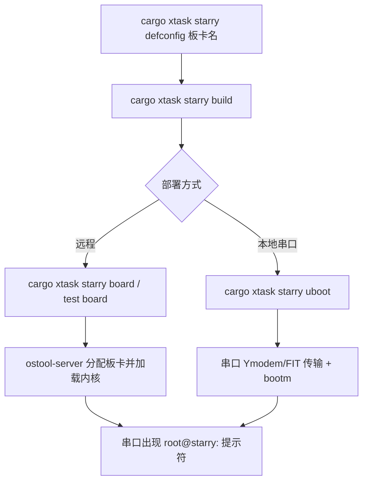

# StarryOS 实板刷写参考：RK3588 与 VisionFive 2

> 适用仓库：`tgoskits` / StarryOS  
> 最后更新：2026-08-04  
> 相关文档：[StarryOS 快速上手](../../../docs/docs/quickstart/starryos.md)、[板卡管理](../../../docs/docs/build/board.md)、[StarryOS 测试套件 GUIDE](../../../test-suit/starryos/GUIDE.md)

本文档说明如何将 **StarryOS 内核**部署到两块常见实板：

| 板卡 | SoC | 架构 / Target | ostool `board_type` |
|---|---|---|---|
| Orange Pi 5 Plus（及同类 RK3588/RK3588S） | Rockchip RK3588 | `aarch64` / `aarch64-unknown-none-softfloat` | `OrangePi-5-Plus` |
| VisionFive 2 | StarFive JH7110 | `riscv64` / `riscv64gc-unknown-none-elf` | `VisionFive2` |

**术语说明**：本仓库中的「刷写 / 部署」通常指把编译好的 StarryOS **内核 ELF**（必要时转为 FIT）通过 **ostool-server** 或 **本地 U-Boot 串口**加载到板卡 RAM 并启动，**不是**重新烧录整张 SD 卡镜像。板卡需预先具备可启动的 **U-Boot + Linux rootfs**（ext4 分区）；StarryOS 复用该 rootfs 作为用户态根文件系统。

---

## 0. 硬件准备：接线、按键与串口

本节说明手边单板调试时的物理连接。若使用实验室 **ostool 远程板卡池**，串口通常已由机架接好，只需 `cargo xtask board connect`；本地 U-Boot 刷写则必须自备 USB 转 TTL 并完成下列接线。

### 0.1 通用工具

| 物品 | 说明 |
|---|---|
| **USB 转 TTL（3.3 V）** | 必须 **3.3 V 电平**；Orange Pi 建议 **CH340** 芯片且支持 **1500000** 波特率，避免部分 CP2102/PL2303 在高波特率下乱码 |
| **杜邦线** | 3 根：GND、TX、RX |
| **5 V/4 A Type-C 电源** | 两块板均用 Type-C 供电；勿用 PC USB 口长期带载 |
| **microSD 卡** | 已烧录厂商 **U-Boot + Linux ext4 rootfs** 镜像 |
| **（可选）HDMI + 键鼠** | 无串口时可看桌面；StarryOS / U-Boot 调试仍推荐串口 |
| **（可选）网线** | Linux 下 SSH/rsync 部署 rootfs 文件 |

Linux 串口权限：

```bash
sudo usermod -aG dialout $USER   # 重新登录后生效
ls /dev/ttyUSB*                  # 常见为 /dev/ttyUSB0
```

**交叉接线原则**（两块板相同）：TTL 的 **RX 接板子 TX**，TTL 的 **TX 接板子 RX**，**GND 共地**。接反了无输出时，交换 TX/RX 即可。

**进入 U-Boot 命令行**（本地串口或 `board connect` 均适用）：上电后在串口出现 `Hit any key to stop autoboot:` 时按 **空格**（Space），提示符变为 `=>`。一次性注入环境变量后 `boot`，**不要** `saveenv`（见 [board-uboot-fsck-repair](../../../.claude/skills/board-uboot-fsck-repair/SKILL.md)）。

---

### 0.2 Orange Pi 5 Plus（RK3588）

#### 板载接口与按键位置

| 项目 | 说明 |
|---|---|
| **尺寸** | 约 100 mm × 75 mm |
| **供电** | **5 V / 4 A Type-C**；板上有 **两个 Type-C 外形口**——**靠近 RJ45 网口** 的为 **电源口**；另一个为 USB Device，**不能当电源** |
| **调试串口** | 板边 **独立 3 pin 排针**（丝印/Debug UART），**不是** 40 pin 扩展口 |
| **存储** | microSD 或 eMMC；Linux rootfs 常见为 **`/dev/mmcblk0p2`** |
| **网口** | 2 × 2.5G（RTL8125），Linux 默认用户 `orangepi` |

#### 按键

| 按键 | 用途 |
|---|---|
| **电源键** | 短按上电 / 关机（具体行为随镜像） |
| **MaskROM** | **烧录整卡镜像 / 进 MASKROM** 时使用：先插好 USB 线到 PC（RKDevTool），**按住 MaskROM → 接 Type-C 电源 → 松开 MaskROM**；工具应提示发现 MASKROM 设备。**StarryOS 日常刷内核不需要按此键** |
| **RECOVERY** | 厂商 recovery 流程（Android / 特定恢复镜像）；**StarryOS 部署一般不用** |
| **（串口）Space** | U-Boot 倒计时中断，进入 `=>` 命令行 |

#### 调试串口接线（3 pin → USB-TTL）

板子 3 pin 排针丝印通常为 **GND、TXD、RXD**（以 PCB 为准）：

```
  PC USB                    Orange Pi 5 Plus
 ┌─────────┐                ┌──────────────────┐
 │ USB-TTL │  GND ──────────│ GND  (调试排针)   │
 │ 3.3 V   │  RX  ──────────│ TXD  (板→PC)     │
 │         │  TX  ──────────│ RXD  (PC→板)     │
 └─────────┘                └──────────────────┘
```

| 参数 | 值 |
|---|---|
| 波特率 | **1500000** |
| 数据位 / 校验 / 停止位 | 8N1 |
| 流控 | None |
| Linux 设备节点 | `/dev/ttyUSB0`（见 `orangepi-5-plus-uboot.toml`） |
| 内核控制台 | `ttyS2,1500000`（设备树 `serial@feb50000`） |

#### Ubuntu 串口设置与验证（1500000 / 8N1 / 无流控）

**1. 确认 USB-TTL 已识别**

```bash
ls -l /dev/ttyUSB*
dmesg | tail -20
```

常见设备为 `/dev/ttyUSB0`。权限（二选一）：

```bash
sudo usermod -aG dialout $USER   # 重新登录后生效
# 或临时：sudo chmod 666 /dev/ttyUSB0
```

**2. 打开串口终端（推荐 picocom）**

```bash
sudo apt install picocom

picocom -b 1500000 --flow n /dev/ttyUSB0
```

- `-b 1500000`：波特率  
- `--flow n`：无流控（8N1）  
- 退出：`Ctrl+A`，再按 `Ctrl+X`

也可用 minicom：

```bash
sudo apt install minicom
sudo minicom -D /dev/ttyUSB0 -b 1500000
# 交互配置：sudo minicom -s
#   Serial Device: /dev/ttyUSB0
#   Bps/Par/Bits: 1500000 8N1
#   Hardware / Software Flow Control: No
```

**3. 用 stty 设置并查看参数**

在**未占用**该设备时（先退出 picocom/minicom）：

```bash
stty -F /dev/ttyUSB0 1500000 cs8 -cstopb -parenb -crtscts raw -echo
stty -F /dev/ttyUSB0 -a
```

期望输出中包含：

```text
speed 1500000 baud; ...
cs8 -parenb -cstopb ...
-crtscts ...
```

快速检查：

```bash
stty -F /dev/ttyUSB0 -a | grep -E 'speed|cs8|parenb|cstopb|crtscts'
```

| 字段 | 含义 |
|---|---|
| `speed 1500000 baud` | 波特率正确 |
| `cs8 -parenb -cstopb` | 8 数据位、无校验、1 停止位（8N1） |
| `-crtscts` | 无硬件流控 |

若 `stty` 报不支持 1500000，优先改用 **picocom**（会自动协商波特率）；或换 **CH340** USB-TTL 模块。

**4. 如何确认设置成功**

1. 软件侧：`stty -F /dev/ttyUSB0 -a` 见上表三项均符合。  
2. 硬件侧：串口终端已打开 → 给 Orange Pi **上电** → 应看到可读的 U-Boot / Linux 日志，例如 `U-Boot`、`Hit any key to stop autoboot`、`Starting kernel ...`。  
3. 若全是乱码：检查是否误用 115200、TX/RX 是否接反、模块是否支持 1.5M。

**5. 一键检查脚本（可选）**

```bash
DEV=/dev/ttyUSB0
stty -F "$DEV" 1500000 cs8 -cstopb -parenb -crtscts raw -echo
echo "=== 当前串口参数 ==="
stty -F "$DEV" -a | grep -E 'speed|cs8|parenb|cstopb|crtscts'
echo "=== 打开 picocom，给板子上电看日志 ==="
picocom -b 1500000 --flow n "$DEV"
```

#### eMMC 版故障排查

手边 Orange Pi 5 Plus **eMMC 版**若出现 `starry uboot` 卡在 `Waiting...`、SPL 报 `mmc_init: -123` / `Invalid GPT`、MaskROM 与 SPI 恢复、`loady`/`No TFTP config`、`setenv ... Timeout`（1500000 串口 TX 不稳定）等问题，见专门文档：[Orange Pi 5 Plus 实板故障排查与恢复指南](board-orangepi-5-plus-troubleshooting.md)（§3.2–§3.4）。

#### 推荐上电顺序（本地 U-Boot 刷 StarryOS）

1. **先** 接好 3 pin 串线与 Type-C 电源（可先不插电）。
2. 在 PC 打开串口终端（1500000）。
3. 插入已烧 Linux 的 SD 卡，上电。
4. 若要改 U-Boot 环境：见 `Hit any key` 时按 **Space** → `setenv extraboardargs ...` → `boot`。
5. 另开终端执行 `cargo xtask starry uboot --uboot-config os/StarryOS/configs/board/orangepi-5-plus-uboot.toml`（ostool 经串口传内核并 `bootm`）。

#### 官方资料

- [Orange Pi 5 Plus Wiki](http://www.orangepi.org/orangepiwiki/index.php/Orange_Pi_5_Plus)（调试串口 §2.18）
- 用户手册 PDF：搜索 “Orange Pi 5 Plus User Manual v1.8”

---

### 0.3 VisionFive 2（JH7110）

#### 板载接口与按键位置

| 项目 | 说明 |
|---|---|
| **供电** | **USB Type-C** + 5 V 电源适配器（建议 ≥ 3 A） |
| **调试串口** | 走 **40 pin GPIO 排针** 上的 UART（无独立 3 pin 调试口） |
| **存储** | microSD / eMMC / NVMe（依镜像与启动模式）；SD 卡根分区常见 **`mmcblk1p4`** 等，以 `df` / 镜像说明为准 |
| **复位键** | 面板 **Reset**：长按 **≥ 3 s** 强制复位 |
| **网口** | 2 × RJ45；Debian 默认用户 `user` / 密码 `starfive` |

#### 启动模式拨码（Switch_2：RGPIO_1 / RGPIO_0）

拨码在板子 **Switch_2** 位置（以 StarFive 丝印为准）。**刷 StarryOS 前请确认与启动介质一致**：

| RGPIO_1 | RGPIO_0 | 启动源 | 典型用途 |
|:---:|:---:|---|---|
| L (0) | L (0) | QSPI Nor Flash | 默认 SPI 中的 SPL/U-Boot |
| L (0) | H (1) | **SDIO / microSD** | **SD 卡 Linux（常用）** |
| H (1) | L (0) | eMMC | eMMC 系统 |
| H (1) | H (1) | UART | **仅 Bootloader 恢复**：上电串口输出 `CCCC...`，XMODEM 传 recovery |

> StarFive 文档建议日常用 **SD 或 eMMC 镜像**；QSPI 内 SPL/U-Boot 可能偏旧。StarryOS 部署 **不需要** 切到 UART(1,1) 模式，除非你要恢复 Bootloader。

#### 40 pin 调试 UART 接线

VisionFive 2 控制台 UART 引脚（与 [VisionFive 2 QSG](https://doc-en.rvspace.org/VisionFive2/PDF/VisionFive2_QSG.pdf) 一致）：

| 40 pin 物理针脚 | 信号 | 接 USB-TTL |
|---:|---|---|
| **6** | GND | GND |
| **8** | **GPIO5（UART TX，板→PC）** | **RX** |
| **10** | **GPIO6（UART RX，PC→板）** | **TX** |

```
  PC USB                     VisionFive 2 (40-pin)
 ┌─────────┐                 ┌─────────────────────┐
 │ USB-TTL │  GND ───────────│ pin 6  GND          │
 │ 3.3 V   │  RX  ───────────│ pin 8  GPIO5 / TX   │
 │         │  TX  ───────────│ pin 10 GPIO6 / RX   │
 └─────────┘                 └─────────────────────┘
```

| 参数 | 值 |
|---|---|
| 波特率 | **115200** |
| 数据位 / 校验 / 停止位 | 8N1 |
| Linux 设备节点 | `/dev/ttyUSB0` |

Ubuntu 设置与验证步骤同 **§0.2**，将波特率改为 **115200** 即可，例如：

```bash
picocom -b 115200 --flow x /dev/ttyUSB0
# 或
stty -F /dev/ttyUSB0 115200 cs8 -cstopb -parenb -crtscts raw -echo
stty -F /dev/ttyUSB0 -a | grep -E 'speed|cs8|parenb|cstopb|crtscts'
```

成功标志：上电后串口出现可读 U-Boot 日志或 Debian 登录提示（`user` / `starfive`）。

#### 推荐上电顺序

1. 确认 **Switch_2** 与 SD/eMMC 启动方式一致（SD 卡一般为 **0,1**）。
2. 插入已烧 Debian/Linux 的 microSD。
3. 接好 40 pin 串线（115200），打开终端。
4. Type-C 上电；Linux 下可见登录提示，或 U-Boot 阶段按 **Space** 进 `=>`。
5. 远程 StarryOS：`cargo xtask starry board --board-config os/StarryOS/configs/board/visionfive2-board.toml`。

#### 官方资料

- [VisionFive 2 Quick Start Guide (PDF)](https://doc-en.rvspace.org/VisionFive2/PDF/VisionFive2_QSG.pdf) — §3.4 串口登录、§4 Bootloader 恢复
- [40-Pin GPIO Header User Guide](https://doc-en.rvspace.org/VisionFive2/40-Pin_GPIO_Header_UG/StarFive_40_Pin_GPIO_Header_UG/debugging_uart_gpio.html)

---

## 1. 通用前置条件

### 1.1 开发机环境

```bash
# 仓库根目录
cd tgoskits

# 使用仓库 pinned nightly + rustfmt
rustup show

# 首次使用板卡服务（可选，远程实板）
cargo xtask board config    # 编辑 ~/.ostool/config.toml，填写 ostool-server 地址
cargo xtask board ls        # 应列出 OrangePi-5-Plus、VisionFive2 等
```

### 1.2 两种部署路径

| 路径 | 适用场景 | 入口命令 |
|---|---|---|
| **A. 远程 ostool** | CI / 实验室板卡池、self-hosted runner | `cargo xtask starry board` / `cargo xtask starry test board` |
| **B. 本地 U-Boot 串口** | 手边单板 + USB 串口 | `cargo xtask starry uboot --uboot-config ...` |



### 1.3 板卡侧 SD 卡要求

1. **U-Boot** 可正常 autoboot 或手动 `boot`。
2. **Linux rootfs** 位于 eMMC/SD 的 ext4 分区（Orange Pi 常见为 `mmcblk0p2`）。
3. StarryOS 启动后挂载该 ext4 为 `/`，**不单独制作 Starry 专用 rootfs 分区**（与 LicheeRV SG2002 路径相同）。
4. 若 Linux 因 fsck 失败无法启动，先按 [board-uboot-fsck-repair](../../../.claude/skills/board-uboot-fsck-repair/SKILL.md) 修复，再刷 StarryOS。

### 1.4 串口参数（常见默认值）

硬件接线与按键详见 **§0**。软件侧默认：

| 板卡 | 波特率 | 本地 U-Boot 配置 |
|---|---|---|
| Orange Pi 5 Plus | **1500000** | `os/StarryOS/configs/board/orangepi-5-plus-uboot.toml` |
| VisionFive 2 | **115200** | 见 ostool 或自写 `visionfive2-uboot.toml` |

---

## 2. Orange Pi 5 Plus（RK3588）

### 2.1 配置文件一览

| 用途 | 路径 |
|---|---|
| 构建配置（features / SMP） | `os/StarryOS/configs/board/orangepi-5-plus.toml` |
| 远程 board 运行 | `os/StarryOS/configs/board/orangepi-5-plus-board.toml` |
| 本地 U-Boot 串口 | `os/StarryOS/configs/board/orangepi-5-plus-uboot.toml` |
| 设备树（DTB） | `os/StarryOS/configs/board/orangepi-5-plus.dtb` |
| test-suit boot（等价） | `test-suit/starryos/board-orangepi-5-plus/boot/board-orangepi-5-plus.toml` |

构建配置已启用 RK3588 相关驱动：`rockchip-soc`、`rockchip-sdhci`、`rk3588-pcie`、`realtek-rtl8125`、`rknpu` 等；默认 **8 核**（`max_cpu_num = 8`）。

### 2.2 构建 StarryOS 内核

```bash
cargo xtask starry config ls
cargo xtask starry defconfig orangepi-5-plus
cargo xtask starry build
# 等价于显式指定：
# cargo xtask starry build --arch aarch64 --config <snapshot 中的 build info>
```

产物为 StarryOS 内核 ELF，由 ostool 在 board 运行时加载。

### 2.3 路径 A：远程 ostool 刷写并启动

**一次性冒烟（boot 用例）：**

```bash
cargo xtask starry test board \
  --board orangepi-5-plus \
  -c board-orangepi-5-plus/boot
```

**手动 board 运行：**

```bash
cargo xtask starry board \
  --board-config os/StarryOS/configs/board/orangepi-5-plus-board.toml \
  --server <ostool-host> \
  --port <ostool-port>
```

（也可使用 test-suit 中等价的 `test-suit/starryos/board-orangepi-5-plus/boot/board-orangepi-5-plus.toml`。）

成功标志（见 `board-orangepi-5-plus.toml`）：

- 串口前缀：`root@starry:/root #`
- 输出：`STARRY_ORANGEPI_BOOT_OK`

**其它 board 测试用例：**

```bash
cargo xtask starry test board -l
cargo xtask starry test board --board orangepi-5-plus -c board-orangepi-5-plus/net-smoke
cargo xtask starry test board --board orangepi-5-plus -c board-orangepi-5-plus/pcie-enumerate
cargo xtask starry test board --board orangepi-5-plus -c board-orangepi-5-plus/npu-yolov8
```

### 2.4 路径 B：本地 U-Boot 串口

接线、波特率与按键见 **§0.2**。Orange Pi 官方 U-Boot **无 `loady`**，需 **以太网 + TFTP**（`orangepi-5-plus-uboot.toml` 中 `[net]`、固定加载地址、`uboot_cmd` 设 `serverip`）。若 `setenv` 串口超时，见故障排查 §3.3–§3.4：[Orange Pi 5 Plus 故障排查](board-orangepi-5-plus-troubleshooting.md)。

1. 连接 3 pin 调试串口（常见 `/dev/ttyUSB0`，**1500000**）与 **网线**。
2. 编辑 `orangepi-5-plus-uboot.toml`：确认 `[net].interface`（`ip -br link`）及静态 `board_ip` 与 PC 网卡同一子网。ostool 会自动准备 `tftpd-hpa`。
3. 执行：

```bash
cargo xtask starry defconfig orangepi-5-plus
cargo xtask starry uboot \
  --uboot-config os/StarryOS/configs/board/orangepi-5-plus-uboot.toml
```

ostool 经 U-Boot **TFTP** 将 FIT 载入 RAM 并 `bootm`（非串口 loady）。

### 2.5 向 Linux rootfs 部署用户态文件（可选）

许多 app / 测试需要先把二进制或数据拷到 **Linux 可见** 的 rootfs，再重启进 StarryOS。流程见 [board-linux-starry-debug](../../../.claude/skills/board-linux-starry-debug/SKILL.md)：

```bash
# 1. 占用板卡并进入 Linux
cargo xtask board connect -b OrangePi-5-Plus
# 在 Linux shell 中：ip -brief addr

# 2. 另开终端 rsync + sync
BOARD_IP=<ip>
rsync -az ./my-app/ orangepi@${BOARD_IP}:/tmp/my-app/
ssh orangepi@${BOARD_IP} 'echo orangepi | sudo -S mv /tmp/my-app /usr/bin/my-app && sync'

# 3. 释放 connect，再跑 Starry board 测试
```

**注意**：StarryOS 与 Linux 共用同一块 ext4；部署后必须 `sync`，否则 Starry 侧可能 `not found`。

### 2.6 RK3588 常见问题

| 现象 | 处理 |
|---|---|
| `starry uboot` 卡在 Waiting / SPL failed | 见 [Orange Pi 5 Plus 故障排查](board-orangepi-5-plus-troubleshooting.md) |
| `loady` / `No TFTP config` / `setenv Timeout` | 同上 §3.1–§3.4 |
| Linux 启动卡在 initramfs fsck | U-Boot 下 `setenv extraboardargs fsckfix` + `boot`（一次性） |
| Starry 报 `not found` | Linux 侧确认文件存在并 `sync`；见 board-linux-starry-debug |
| 网卡 / PCIe / NPU 用例失败 | 确认使用 `defconfig orangepi-5-plus` 完整 features 构建 |
| `cargo xtask board ls` 失败 | 检查 ostool-server 是否运行、`cargo xtask board config` |

---

## 3. VisionFive 2（JH7110）

### 3.1 配置文件一览

| 用途 | 路径 |
|---|---|
| 构建配置 | `os/StarryOS/configs/board/visionfive2.toml` |
| 远程 board 运行 | `os/StarryOS/configs/board/visionfive2-board.toml` |
| test-suit boot 用例 | `test-suit/starryos/board-visionfive2/boot/board-visionfive2.toml` |
| test-suit 构建包装 | `test-suit/starryos/board-visionfive2/build-riscv64gc-unknown-none-elf.toml` |

构建配置启用：`ax-driver/starfive-jh7110-dwmmc`（SD/MMC）、RTC、serial。Target 为 **`riscv64gc-unknown-none-elf`**（StarryOS 默认架构即为 riscv64）。

### 3.2 构建 StarryOS 内核

```bash
cargo xtask starry defconfig visionfive2
cargo xtask starry build
```

### 3.3 路径 A：远程 ostool 刷写并启动

**test-suit boot 冒烟：**

```bash
cargo xtask starry test board \
  --board visionfive2 \
  -c board-visionfive2/boot
```

**手动 board 运行：**

```bash
cargo xtask starry board \
  --board-config os/StarryOS/configs/board/visionfive2-board.toml \
  --server <ostool-host> \
  --port <ostool-port>
```

成功标志：

- 串口前缀：`root@starry:`
- 输出：`STARRY_VISIONFIVE2_SHELL_OK`

CI 参考：`.github/workflows/ci.yml` 中 `cargo xtask starry test board --board visionfive2`。

### 3.4 路径 B：本地 U-Boot 串口

40 pin 串口接线、拨码与 **115200** 参数见 **§0.3**。VisionFive 2 在仓库中**以远程 ostool 路径为主**；本地串口可参考 SG2002 模板自建 `visionfive2-uboot.toml`（`serial`、`baud_rate`、`dtb_file`、`kernel_load_addr`、`fit_load_addr`），再执行：

```bash
cargo xtask starry defconfig visionfive2
cargo xtask starry uboot --uboot-config <你的 visionfive2-uboot.toml>
```

JH7110 的 DTB / 加载地址请以板卡厂商 U-Boot 与 ostool 实际参数为准；SG2002 参考值见 `licheerv-nano-sg2002-uboot.toml`（`kernel_load_addr = 0x80200000`，`fit_load_addr = 0x82200000`）。

### 3.5 VisionFive 2 常见问题

| 现象 | 处理 |
|---|---|
| `failed to determine root device from available block devices` | 检查 SD 分区与 DTB；确认 `starfive-jh7110-dwmmc` 已编入内核 |
| Segfault / exit 139 | 见 `visionfive2-board.toml` 中 `fail_regex`；优先验证 boot 用例 |
| 与 QEMU riscv64 行为不一致 | 实板走 `defconfig visionfive2`，勿混用 `defconfig qemu-riscv64` |

---

## 4. 命令速查

### 4.1 Orange Pi 5 Plus（RK3588）

```bash
# 构建
cargo xtask starry defconfig orangepi-5-plus && cargo xtask starry build

# 远程刷写 + 启动
cargo xtask starry board --board-config os/StarryOS/configs/board/orangepi-5-plus-board.toml
cargo xtask starry test board --board orangepi-5-plus -c board-orangepi-5-plus/boot

# 本地 U-Boot 串口
cargo xtask starry uboot --uboot-config os/StarryOS/configs/board/orangepi-5-plus-uboot.toml

# 仅连接 Linux 串口（调试 / 部署 rootfs）
cargo xtask board connect -b OrangePi-5-Plus
```

### 4.2 VisionFive 2

```bash
# 构建
cargo xtask starry defconfig visionfive2 && cargo xtask starry build

# 远程刷写 + 启动
cargo xtask starry test board --board visionfive2 -c board-visionfive2/boot

# 或
cargo xtask starry board --board-config os/StarryOS/configs/board/visionfive2-board.toml
```

### 4.3 与 Axvisor / ArceOS 的区别

| 项目 | StarryOS 实板 | Axvisor 实板 |
|---|---|---|
| 产物 | 单一 Linux 兼容内核 + rootfs | Hypervisor + 多个 Guest 镜像 |
| 典型命令 | `cargo xtask starry test board` | `cargo xtask axvisor test board` |
| Orange Pi 配置 | `os/StarryOS/configs/board/orangepi-5-plus.toml` | `os/axvisor/configs/vms/orangepi-5-plus/` |

---

## 5. 推荐验证顺序

1. **Linux 能进 shell**（`board connect` 或 HDMI/串口）。
2. **`defconfig` + `build`** 无编译错误。
3. **boot 冒烟用例** PASS（`STARRY_*_BOOT_OK` / `STARRY_*_SHELL_OK`）。
4. 按需跑 **net-smoke / pcie / npu** 等专项用例。
5. 若测试写 rootfs，**测试后 fsck** 再交还板卡。

---

## 6. 参考链接（仓库内）

- **硬件接线与按键**：本文 **§0**
- 构建配置目录：`os/StarryOS/configs/board/`
- Starry board 用例：`test-suit/starryos/board-orangepi-5-plus/`、`test-suit/starryos/board-visionfive2/`
- ostool 板卡 CLI：`docs/docs/build/board.md`
- Orange Pi Linux rootfs 修复：`.claude/skills/board-uboot-fsck-repair/SKILL.md`
- Linux 侧部署再进 Starry：`.claude/skills/board-linux-starry-debug/SKILL.md`
