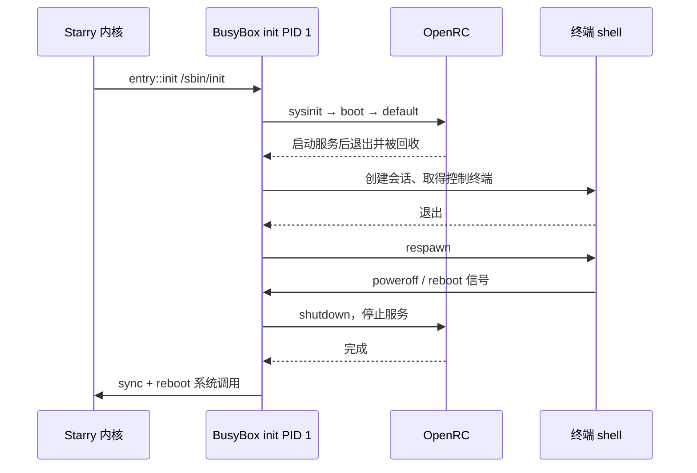

# OpenRC 启动与 PID 1 生命周期

## 1. 启动架构

Starry 的 Alpine 用户态采用 BusyBox init 作为根 PID 1，由 OpenRC 管理服务，职责划分遵循 [OpenRC 0.63 用户指南](https://github.com/OpenRC/openrc/blob/0.63/user-guide.md)。`DEFAULT_CMDLINE` 选择 `/sbin/init`，启动前检查 init、OpenRC、inittab、runlevel 链接和终端脚本，缺少文件时报告路径及恢复入口；`init_command_from_bootargs()` 保留 `init=` 与 `initarg=` 覆盖，NixOS 继续使用 `/init`。此改动涉及进程生命周期，合入前需要领域审查；本文件不代表已取得审查认可。

仅保留非 PID 1 的服务示例不能满足默认启动与关机要求。采用 Alpine 已有 BusyBox init/OpenRC 分工，复用镜像与进程边界，避免引入第二种 init 实现或 OpenRC 专用内核接口。

### 1.1 服务所有权

`entry::init()` 仅提供控制台文件描述符，不提前把控制终端绑定给 PID 1。inittab 的终端命令使用 BusyBox 的前导 `-` 约定，使新会话通过 `TIOCSCTTY` 取得控制终端；对应 [BusyBox 1.37.0](https://busybox.net/downloads/busybox-1.37.0.tar.bz2) 的 `init_exec()`。

`starryos/rootfs/etc/inittab` 依次运行 `sysinit`、`boot`、`default`，然后由 BusyBox 维护串口交互终端。`starry-runtime` 准备运行目录，`starry-autorun` 执行测试或图形场景。设备发现、根挂载与现有网络状态仍由原来的内核路径维护，不启动重复的 mdev、udev 或网络配置服务。

`inittab` 维护的启动与关机顺序中，OpenRC 调用完成后退出，BusyBox 持续承担 PID 1 的等待回收与终端维护职责。

终端退出只触发 respawn，不重复执行 runlevel 或测试 hook。最后一步由现有文件系统同步和平台电源接口完成，不经过根 init 的退出路径。

用户通过 `rc-service NAME start|stop|restart|status` 操作服务，通过 `rc-update add NAME default` 注册开机服务。普通 QEMU 默认丢弃磁盘写入；需要跨启动保存注册时，使用 `cargo xtask starry qemu --arch <arch> --rootfs-write-policy persist`。`rc.conf` 使用 prefix 环境禁用 Linux 硬件引导假设；这不是宣称 Starry 实现了全部 Alpine 系统服务。

### 1.2 镜像事务

Starry 的默认根文件系统取自 [`tgosimages` 的 `feat/unified-build-framework` 分支](https://github.com/rcore-os/tgosimages/tree/feat/unified-build-framework)生成的 v0.0.14 Alpine ext4 镜像。`starry::rootfs::ensure_rootfs_in_tmp_dir()` 在使用默认镜像注册表时读取固定提交 `7a658bb133507ecba3455e1b130d6d5c3fcbb662` 的 `registry/v0.0.14.toml`，按仓库已有的 SHA-256 下载与解包流程取得四架构镜像；自定义注册表必须提供相同版本。源码配方与发布镜像分别固定，不能因为分支继续更新而静默换包。其他操作系统的镜像注册表不受此选择影响。

`starry::openrc::prepare()` 先从镜像内 APK 数据库核对 BusyBox、OpenRC、openrc-user 及其依赖版本，缺失时明确失败，不在 Starry 镜像准备或客户机运行中执行 `apk add`。随后只通过 `rootfs::inject` 注入 Starry 专用的 `inittab`、`rc.conf`、服务、runlevel 链接、串口终端脚本和 BusyBox 电源命令链接。源镜像由 `tgosimages` 在构建阶段安装软件包；这与 Starry 的准备和启动不执行 APK 是两个不同的阶段。准备失败时丢弃候选镜像，成功后在管理镜像锁内替换镜像；用户指定的外部镜像不自动修改。

已有 `apps/starry/openrc` 示例改为安装并执行同一份服务回归脚本，不再在客户机联网安装或手工伪造 `softlevel`。旧路径只覆盖非 PID 1 服务管理，不能替代默认启动与根进程生命周期验证。

`/etc/starry-openrc-packages` 记录预装镜像的 APK 软件包数据库，`/etc/apk/repositories` 记录构建来源；`/etc/starry-openrc-assets` 标识项目配置版本。客户机启动不联网安装软件包。复现默认启动依赖发布归档及注册表中的 SHA-256，不依赖将来 Alpine 仓库能否解析出相同的依赖版本。

### 1.3 软件包来源

预装包来自 `tgosimages/scripts/rootfs/alpine.sh` 的 `ALPINE_DEFAULT_PACKAGES`，其中声明 `openrc`；其余列出的软件包由 Alpine v3.23 依赖解析或基础 minirootfs 提供。已逐一读取四架构 v0.0.14 发布镜像的实际 APK 数据库，以下版本一致，OpenRC 默认启动不缺软件包。构建镜像使用的仓库地址为 `https://mirrors.tuna.tsinghua.edu.cn/alpine/v3.23/main` 和 `community`；Starry 准备过程不访问这些仓库，`STARRY_APK_REGION` 仅对其他需要 APK 的测试或应用准备路径有意义。

| 架构 | BusyBox | OpenRC / openrc-user | 新增依赖 |
| --- | --- | --- | --- |
| x86_64 | 1.37.0-r30 | 0.63-r1 | bridge 1.5-r5；ifupdown-ng 0.12.1-r7；libcap2 2.78-r0 |
| aarch64 | 1.37.0-r30 | 0.63-r1 | bridge 1.5-r5；ifupdown-ng 0.12.1-r7；libcap2 2.78-r0 |
| riscv64 | 1.37.0-r30 | 0.63-r1 | bridge 1.5-r5；ifupdown-ng 0.12.1-r7；libcap2 2.78-r0 |
| loongarch64 | 1.37.0-r30 | 0.63-r1 | bridge 1.5-r5；ifupdown-ng 0.12.1-r7；libcap2 2.78-r0 |

安装 bridge 与 ifupdown-ng 是 APK 的依赖要求，不代表启用这些服务。镜像中的完整数据库还保留每个包的架构、校验值与文件清单；不把此简表当作二进制锁文件。

原镜像提供了 `/sbin/openrc`、`/sbin/openrc-run`、`/sbin/rc-service`、`/sbin/rc-update`、`/sbin/init` 与 runlevel 目录，但其 Alpine 通用 `inittab` 没有 Starry 的串口控制终端、运行目录服务和测试 hook；LoongArch64 配方还设置了旧式 `rcS`。这些是需要 Starry 覆盖的配置，不是需要通过 APK 增装的软件包。

## 2. 进程契约

`entry::init()` 已经通过 `PidReservation` 保证根用户进程的 PID 为 1。进程关系和僵尸状态继续分别由现有进程拓扑与 PID identity 管理，不创建 OpenRC 专用进程表。

### 2.1 信号与退出

以 [Linux v6.6 signal.c](https://github.com/torvalds/linux/blob/v6.6/kernel/signal.c) 的 `sig_task_ignored()`、`complete_signal()` 与 `get_signal()` 为依据，根 init 拒绝 SIGKILL、SIGSTOP，并忽略未注册处理器的普通信号；被屏蔽的可捕获信号保留 pending 语义。同步异常不能被 init 保护转成无限重试。

`ProcessSignalManager::protect_global_init()` 在线程发布前标记根 init，保护状态归进程所有，不随 `CLONE_SIGHAND` 的处理器表共享给子进程。进程定向、线程定向与 pidfd 信号都经过现有信号管理器；入队、快速致命判定和出队共同保持该规则。`allow_init_fault_exit()` 仅在同步异常路径持有处理器表锁时清除默认信号保护，原子标志不承担额外的数据发布职责。此实现不扩展子 PID 命名空间的信号策略。

以 [Linux v6.6 exit.c](https://github.com/torvalds/linux/blob/v6.6/kernel/exit.c) 的 `do_exit()` 为依据，根 init 最后线程退出属于系统致命错误；子 PID 命名空间 init 的退出继续终止其后代。启动线程只回收最初的调度线程，随后阻塞等待；它不能把主线程退出误判为整个 init 进程结束。剩余 init 线程仍可创建和回收子进程，最终线程死亡只由 `do_exit()` 的 `LastThreadExitOwner` 判定。`orphan_reaper_for()` 与既有等待队列承担孤儿收养和回收，不在 OpenRC 中补偿内核语义。

### 2.2 正常关机

BusyBox 接收关机或重启请求后执行 `inittab` 的 shutdown 动作。OpenRC 停止服务，用户态执行 sync 后调用 reboot 系统调用。测试成功应通过这一关机路径或专用测试 init 的显式电源调用终结，不能把根 PID 1 退出视为正常关机。

## 3. 验证与恢复

必须分别记录四架构的启动、服务和电源终态，构建成功不等于 OpenRC 可用。`test-suit/starryos/qemu/pid1` 使用专用 PID 1 测试根进程语义，`pid1-exit` 与 `pid1-exit-thread` 分别通过原始 `exit_group`、`exit` 验证根进程致命退出，`pid1-fault` 验证未处理同步缺页不会被 init 信号保护吞掉。相关命名空间回归继续通过 system 套件运行。

### 3.1 执行入口

使用 `cargo xtask starry rootfs --arch <arch>` 准备受管理镜像，使用 `cargo xtask starry test qemu --arch <arch> -c qemu/pid1` 验证根 PID 1。架构取 `x86_64`、`aarch64`、`riscv64`、`loongarch64`。运行结果与尚未完成的验证须单独记录，不能由本设计说明推断已经通过。

完整电源与持久化验收使用 `python3 scripts/test/starry_openrc_boot.py --arch <arch> --output <日志目录>`。该脚本使用私有镜像副本，经 `cargo xtask starry qemu` 启动两次，检查 QMP 的 `guest-shutdown`、`guest-reset` 与任务自然退出，并在电源关闭后重放 ext4 日志、读取服务停止钩子的磁盘记录，验证最终同步。脚本注入独立计数 hook，检查测试 autorun 和图形入口在终端退出、重新拉起后仍只运行一次；这不代表完成图形渲染测试。宿主需提供镜像准备已有依赖 `debugfs`，以及用于日志重放的 `e2fsck`。Python 3.10 需安装 `toml`，Python 3.11 以上使用标准库 `tomllib`。

### 3.2 恢复启动

通过平台已有启动参数传入 `init=/bin/sh` 进入恢复 shell；该 shell 是根 PID 1，退出会触发同样的致命退出规则。恢复 shell 没有 BusyBox init 的关机信号处理，修复完毕后执行 `sync; poweroff -f` 或 `sync; reboot -f`，直接请求最终电源操作。普通 OpenRC 启动仍使用不带 `-f` 的命令，以完整停止服务。自备镜像需自行提供 `/sbin/init` 与 OpenRC 配置，或显式指定其他 init；内核不静默退回旧启动脚本。

### 3.3 审查边界

PID 1 保护归 `ProcessSignalManager` 所有，处理器锁串行化保护状态与 disposition 变化；退出结论只由现有 `LastThreadExitOwner` 发布，不增加跨核轮询。信号热路径只增加常量标志判断，镜像准备的下载与提取只发生在宿主且通过内容标记缓存。此处没有硬件性能测量结论。

恢复旧启动方式应显式设置 `init=` 或恢复对应用户态配置；不能恢复“根 PID 1 退出即成功关机”的旧语义。未授权修改的自备镜像不注入配置。安装失败时保留原管理镜像，运行时失败保留明确日志；同步缺页与根最后线程死亡仍为致命错误。领域审查应重点核对处理器锁顺序、根与子 PID namespace 的所有权、主线程先退出后的资源保留，以及终端会话交接。

## 4. 系统调用兼容性对照

本表限定为本次变更的根 PID 1、信号保护、终端交接与关机行为，不声明整个系统调用的所有 flag、凭据组合或错误优先级已经符合 Linux。编号写为 `x86_64 / aarch64,riscv64,loongarch64`；后一项由 Linux v6.6 `asm-generic/unistd.h` 共同定义。`pid1` 等名称对应 `cargo xtask starry test qemu --arch <arch> -c qemu/<名称>`；实际完成的架构与日志单独记录。

| 系统调用/编号 | Linux 基准与稳定链接 | Linux 可观察语义 | StarryOS 入口与调用链 | 实现结论 | 测试与证据 |
| --- | --- | --- | --- | --- | --- |
| getppid 110 / 173 | [v6.6 sys.c](https://github.com/torvalds/linux/blob/v6.6/kernel/sys.c) | 根 init 无用户态父进程，返回 0 | `sys_getppid` → `Process::parent` → PID namespace 可见编号 | 正确 | `pid1` 检查返回 0；旧实现返回 ESRCH |
| kill 62 / 129，正 PID | [v6.6 signal.c](https://github.com/torvalds/linux/blob/v6.6/kernel/signal.c) | 根 init 忽略默认未捕获信号及 KILL；处理器与屏蔽 pending 保持有效 | `sys_kill` → 权限检查 → `send_signal_to_task` 或 `signal_user_process` → 线程/进程信号管理器 | 正确 | `pid1` 的 TERM、KILL、USR1、屏蔽 USR2；旧 TERM 路径导致 init 死亡 |
| kill 62 / 129，进程组 | [v6.6 signal.c](https://github.com/torvalds/linux/blob/v6.6/kernel/signal.c) | 进程组寻址不绕过根 init 默认信号保护 | `sys_kill` → `kill_process_group_checked` → `send_signal_to_process` → 进程信号管理器 | 正确 | `pid1` 的 `kill(0,SIGTERM)` |
| tkill 200 / 130 | [v6.6 signal.c](https://github.com/torvalds/linux/blob/v6.6/kernel/signal.c) | 线程寻址也不能杀死全局 init | `sys_tkill` → TID/权限检查 → `send_signal_to_task` → 线程信号管理器 | 正确 | `pid1` 的 `tkill(1,SIGKILL)` |
| tgkill 234 / 131 | [v6.6 signal.c](https://github.com/torvalds/linux/blob/v6.6/kernel/signal.c) | 线程组/线程匹配后，STOP 不停止全局 init；屏蔽普通信号可 pending | `sys_tgkill` → TGID/TID/权限检查 → `send_signal_to_task` → 线程信号管理器 | 正确 | `pid1` 的 STOP 与屏蔽 USR2 |
| rt_sigqueueinfo 129 / 138 | [v6.6 signal.c](https://github.com/torvalds/linux/blob/v6.6/kernel/signal.c) | 对自身排队的默认 TERM 不终止根 init | `sys_rt_sigqueueinfo` → `make_queue_signal_info` → `signal_user_process` → 进程信号管理器 | 正确 | `pid1` 使用自身 `SI_QUEUE`；不涵盖不同凭据发送者的权限语义 |
| rt_tgsigqueueinfo 297 / 240 | [v6.6 signal.c](https://github.com/torvalds/linux/blob/v6.6/kernel/signal.c) | 对自身线程排队的默认 TERM 不终止根 init | `sys_rt_tgsigqueueinfo` → `make_queue_signal_info` → `send_signal_to_task` → 线程信号管理器 | 正确 | `pid1` 使用自身 `SI_QUEUE`；不涵盖不同凭据发送者的权限语义 |
| pidfd_send_signal 424 / 424 | [v6.6 signal.c](https://github.com/torvalds/linux/blob/v6.6/kernel/signal.c) | pidfd、flags=0 不绕过根 init 保护 | `sys_pidfd_send_signal` → `PidFd`/权限检查 → `send_signal_to_process_data` → 进程信号管理器 | 正确 | `pid1` 的 pidfd TERM/KILL；不涵盖新于 v6.6 的非零 flag |
| rt_sigaction 13 / 134 | [v6.6 signal.c](https://github.com/torvalds/linux/blob/v6.6/kernel/signal.c) | root init 已安装的可捕获处理器照常执行 | `sys_rt_sigaction` → `ProcessSignalManager::set_action` → `prepare_signal` | 正确 | `pid1` 的 USR1、USR2、SIGCHLD 处理器 |
| rt_sigprocmask 14 / 135 | [v6.6 signal.c](https://github.com/torvalds/linux/blob/v6.6/kernel/signal.c) | 被阻塞信号保留，安装处理器再解除阻塞后投递 | `sys_rt_sigprocmask` → `ThreadSignalManager::set_blocked` → 信号出队 | 正确 | `pid1` 屏蔽/解除 USR2，并核对处理器观测值 |
| rt_sigpending 127 / 136 | [v6.6 signal.c](https://github.com/torvalds/linux/blob/v6.6/kernel/signal.c) | 可观察根 init 的被阻塞普通信号 | `sys_rt_sigpending` → `ThreadSignalManager::pending` | 正确 | `pid1` 验证 USR2 pending |
| rt_sigtimedwait 128 / 137 | [v6.6 signal.c](https://github.com/torvalds/linux/blob/v6.6/kernel/signal.c) | 根 init 可同步取出被阻塞的默认信号 | `sys_rt_sigtimedwait` → `dequeue_signal`/sigwait 状态 | 正确 | `pid1` 原始 syscall 返回 SIGUSR2 |
| exit 60 / 93 | [v6.6 exit.c](https://github.com/torvalds/linux/blob/v6.6/kernel/exit.c) | 根 init 主线程退出不终止存活同组线程；最后线程退出 panic | `sys_exit` → `do_exit(false)` → `ThreadExit::Last`；`entry::init` 仅回收初始调度线程 | 正确 | `pid1` 主线程退出后 fork/wait；`pid1-exit-thread` 检查 `0x00002500` |
| exit_group 231 / 94 | [v6.6 exit.c](https://github.com/torvalds/linux/blob/v6.6/kernel/exit.c) | 组退出先终止同组线程，根最后线程退出致命 | `sys_exit_group` → `do_exit(true)` → group exit → `LastThreadExitOwner` | 正确 | `pid1-exit` 含存活 peer，检查原始退出码 `0x00002500` |
| wait4 61 / 260 | [v6.6 exit.c](https://github.com/torvalds/linux/blob/v6.6/kernel/exit.c) | 收养后的孤儿属于 PID 1，可回收其退出状态；回收完毕 ECHILD | `sys_waitpid` → 进程拓扑/等待事件 → identity 僵尸回收 | 正确 | `pid1` 双重 fork、SIGCHLD、两个退出状态与最终 ECHILD |
| ioctl 16 / 29，TIOCSCTTY | [v6.6 tty_jobctrl.c](https://github.com/torvalds/linux/blob/v6.6/drivers/tty/tty_jobctrl.c) | 初始 console FD 不预占控制终端；会话首进程可取得终端 | `entry::init` 保留 FD → BusyBox `setsid`/`TIOCSCTTY` → tty 会话所有者 | 正确 | `openrc` 交互命令和退出后重新拉起；旧预绑定路径无可交互提示符 |
| waitid 247 / 95 | [v6.6 exit.c](https://github.com/torvalds/linux/blob/v6.6/kernel/exit.c) | 子命名空间内等待与 ptrace 停止状态不被根 PID 1 规则误拦截 | `sys_waitid` → `WaitCandidateScan` → `ptrace_wait_stop`；退出终态由 `do_exit` 完成 namespace 清理后发布 | 正确 | system 的 `test-ptrace-tracer-exit-clone` 使用 WNOWAIT 留下停止任务，namespace 清理完成后才通过 |
| sync 162 / 81 | [v6.6 sync.c](https://github.com/torvalds/linux/blob/v6.6/fs/sync.c) | 关机前把本轮根文件系统服务停止记录同步至磁盘 | `sys_sync` → 页缓存/根 filesystem sync → 块缓存 flush | 正确 | 电源脚本在自然关闭后重放日志并读取最终停止记录；不声明所有挂载类型覆盖 |
| reboot 169 / 142 | [v6.6 reboot.c](https://github.com/torvalds/linux/blob/v6.6/kernel/reboot.c) | root 的 POWER_OFF、RESTART 经服务停止与 sync 后完成电源操作 | BusyBox init → `sys_reboot` → `ax_runtime::hal::power` | 正确 | 电源脚本检查 QMP guest-shutdown、guest-reset 与自然进程退出 |

未修改的进程创建、SIGCHLD 发布与子 PID namespace 清理由既有 system 用例补充回归。同步缺页不是系统调用，单独由 `pid1-fault` 验证；表内结论不把该异常入口混入 `kill` 的用户态权限语义。

## 5. 回归证据

本轮实现以 `4beb1e8f68c183d99b0a44192fb1ede432253242` 为基线。先运行能区分旧行为的用例，再修复相应路径；阶段性中间实现的失败也保留，避免把最终绿色误当作旧实现必然失败的证据。

### 5.1 确定性失败

x86_64 的独立 QEMU 日志保留以下失败，正向用例和负向用例都有外层 `cargo xtask` 失败状态。负向用例中的“通过”指观测到指定致命错误，不是允许根 init 正常退出。

| 用例 | 错误实现的可观察结果 | 修复后的要求 |
| --- | --- | --- |
| `pid1` 身份 | `STARRY_PID1_FAILED: root init identity`；旧 `sys_getppid` 对无父进程返回错误 | PID=1、PPID=0 |
| `pid1` 默认 TERM | 未启用 init 保护的实现输出 `Attempted to kill init! exitcode=0x0000000f` | 继续执行并完成信号/收养/等待检查 |
| `pid1` 主线程先退出 | 中间实现输出 `Root init task returned unexpectedly: 0` | peer 在主线程退出后仍能 fork、wait 和关机 |
| `pid1-exit` | 旧实现直接执行 entry 关机，预期 panic 步骤未完成，任务退出失败 | 最后线程死亡输出 `exitcode=0x00002500` |
| `openrc` 终端 | 旧控制终端预绑定使 BusyBox 子会话无法取得交互提示符 | 能执行服务命令，并在退出 shell 后重新拉起 |

### 5.2 运行记录

定向用例日志命名为 `/tmp/starry-openrc-matrix-<arch>-<case>.log`；自然电源检查保存在 `/tmp/starry-openrc-power-<arch>/poweroff.log` 与 `reboot.log`。测试驱动失败时保留私有 `failed-rootfs.img`，不修改用户镜像。完整 system、标准库测试与最终 clippy 需要独立记录结果，不能从上述定向测试推断。

本轮已记录的原始失败日志为 `/tmp/starry-pid1-identity-red.log`、`/tmp/starry-pid1-signal-red.log`、`/tmp/starry-pid1-leader-red.log`、`/tmp/starry-pid1-exit-red.log` 和 `/tmp/starry-openrc-tty-red.log`。这些路径是本地复核材料，不是仓库携带的固定测试资产；换机器应通过上述用例与对应基线重新取得证据。

四架构的 `openrc`、`pid1`、`pid1-exit`、`pid1-exit-thread`、`pid1-fault` 共 20 个定向 QEMU 用例通过。四架构自然电源测试均完成两次启动，服务注册在第二次启动自动生效，QMP 分别报告 `guest-shutdown` 与 `guest-reset`；磁盘重放后分别读到 3、4 条完整停止记录。终端退出后重新拉起，测试 autorun 和图形 hook 每次启动各执行一次。

完整入口 `cargo xtask starry test qemu --arch <arch> -c qemu/system` 已在四架构通过，原始日志为 `/tmp/starry-openrc-system-<arch>.log`。下表是 runner 的终态统计；沿用套件原有架构与设备跳过项，例如非 AArch64 PMU、非 LoongArch 指令测试和不可用的 framebuffer，不代表这些跳过项取得了功能覆盖。

| 架构 | system 终态 | 附加组 | 最外层退出码 |
| --- | --- | --- | --- |
| x86_64 | 511 / 511，failed=0 | 无 | 0 |
| aarch64 | 485 / 485，failed=0 | system-perf 23 / 23，failed=0 | 0 |
| riscv64 | 508 / 508，failed=0 | 无 | 0 |
| loongarch64 | 508 / 508，failed=0 | 无 | 0 |

`starry_system_test_runner` 为每个子用例创建 PID 与挂载命名空间，并等待其 init 清理退出。`test-ptrace-tracer-exit-clone` 特意留下被跟踪停止的进程与线程，由 namespace init 退出路径清理；四架构均通过，补充证明根 init 致命退出检查没有误伤子命名空间生命周期。

旧应用入口 `cargo xtask starry app qemu -t openrc --arch x86_64` 实际运行通过，日志为 `/tmp/starry-openrc-app-x86_64.log`。原始 OpenRC 实现阶段的 `cargo xtask test --since HEAD^` 实选 24 个白名单软件包并全部通过，包含 `starry-signal`、`starry-kernel` 与 `axbuild`，日志为 `/tmp/starry-openrc-std-tests.log`。

原始实现的 `cargo xtask clippy --package starry-kernel --package starryos --package axbuild` 的 88/88 项检查通过，日志为 `/tmp/starry-openrc-clippy-final.log`；`starry-signal` 的同版实现已在前一轮四软件包 89/89 项检查中通过，日志为 `/tmp/starry-openrc-clippy-serial.log`。`cargo fmt`、Python 编译检查、启动脚本语法检查、20 份 QEMU 配置解析及最终 `git diff --check` 均通过。未执行实体板与完整图形渲染验证，未发布镜像；PR #2446 合入前的领域审查仍需独立完成。

### 5.3 预装镜像复核

2026 年 9 月 22 日切换到 `tgosimages` v0.0.14 发布的四架构 Alpine 镜像后，`cargo xtask starry rootfs --arch <arch>` 均完成 SHA-256 校验、预装软件包核对和 Starry 配置注入。`cargo xtask starry test qemu --arch <arch> -c qemu/openrc` 四架构均为 `result: 1/1 case(s) passed`，客户机实际输出 `/sbin/init`、BusyBox PID 1、`default` runlevel、服务启动/停止/重启、失败传播、终端重启和关机服务停止记录。原始日志分别位于 `/tmp/starry-openrc-prebuilt-rootfs-<arch>.log` 和 `/tmp/starry-openrc-prebuilt-qemu-<arch>.log`。

此前的完整 system 套件与自然电源脚本是在旧版受管理镜像上运行的，不能冒充 v0.0.14 的对应证据。镜像中 APK 数据库仅用于验证预装包；本轮的 `starry rootfs` 与 `qemu/openrc` 路径都没有调用目标架构 APK 安装。
