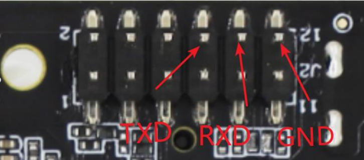
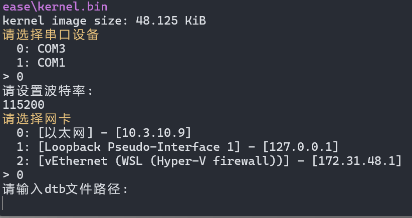
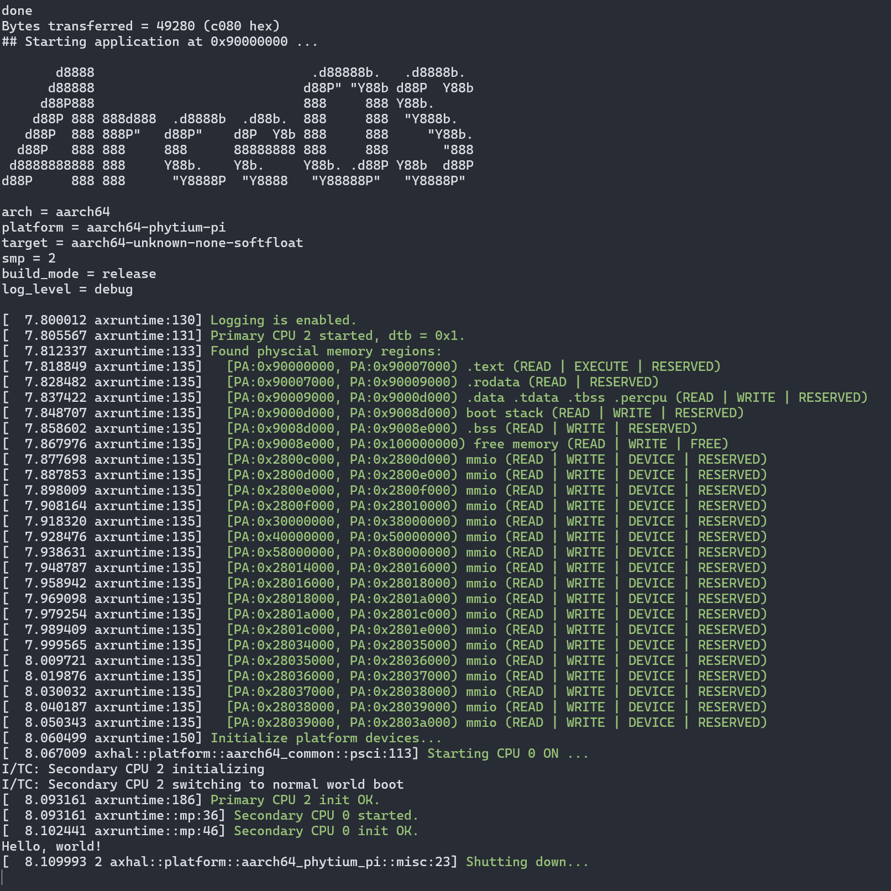

# How to run ArceOS on phytium pi

> Note: the in-tree static AArch64 Phytium Pi platform crate has been removed.
> The board flow below now requires an external custom platform package or an
> explicit platform config.

First, we need `ostool` to build and upload the image to the board. It also supports windows.

```bash
cargo install ostool
```

If use windows, you need to install `docker-desktop`.

We also need to connect the board to the computer with serial port, and connect netwire to the board. The host pc and the board should be in the same network.

The pins of a USB to serial adapter need to be connected to the debugging serial port of the development board using jumper wires, noting that the receive and transmit lines should cross-connect:

a. Connect the GND (ground) pin of the USB to TTL module to the GND (ground) pin of the development board (pin 12).

b. Connect the RX (receive) pin of the USB to TTL module to the TX (transmit) pin of the development board (pin 8).

c. Connect the TX (transmit) pin of the USB to TTL module to the RX (receive) pin of the development board (pin 10).



Then, we can run it easily.

```bash
# cd arceos main dir.
ostool run uboot
```



`dtb` path is `tools/phytium_pi/phytiumpi_firefly.dtb`

Then the cmdline will wait for you to put board power on or reset.

`Ctrl+C` to exit.

Modify config in `.project.toml` to select the external Phytium Pi platform.
For example, update the `shell` command that builds `examples/helloworld` so it
passes your custom platform package or platform config, and update the `elf`
path to the board-specific output produced by that build.

Then run `ostool run uboot` again. When see `等待 U-Boot 启动...` , put board power on or reset.

If everything goes well, you will see the following output:


