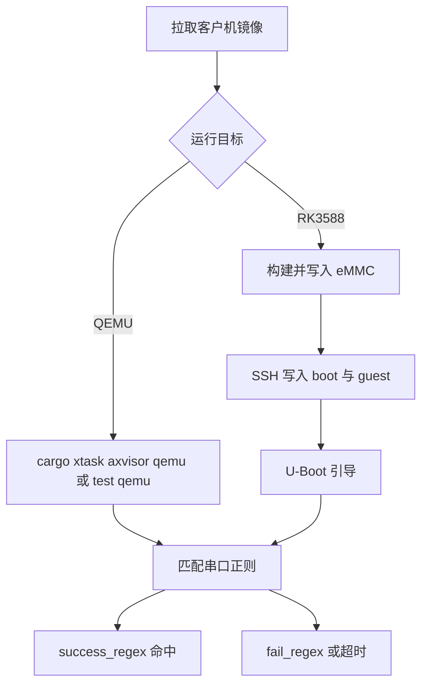

# AxVisor 任务交付操作指南

本指南说明如何在本仓库中启动 AxVisor 混合分区系统、执行 Task1/Task2/Task3 验收用例，以及如何在 RK3588 实板（Orange Pi 5 Plus）上部署。仓库根目录的统一入口是 `cargo xtask`；设计细节分别写在 `task1-realtime.md`、`task2-network.md` 和 `task3-ai-control.md`。读者按环境准备、QEMU 启动、用例执行、实板部署、结果判读的顺序即可独立复现。

## 1. 环境准备

首次运行需要主机工具链、QEMU 以及客户机镜像。`rust-toolchain.toml` 固定 nightly 版本，第一次执行 `cargo xtask` 会自动安装对应组件和交叉目标，不必手工 `rustup target add`。

### 1.1 主机依赖

主机至少需要能跑 `virt,virtualization=on` 的 `qemu-system-aarch64`，以及常规交叉编译器。向 RK3588 写 U-Boot 脚本时还需要 `mkimage`（`u-boot-tools`）。测试运行器按用例目录里的 `qemu-aarch64.toml` 拼装 QEMU 命令行，QEMU 8.0 以上较稳妥。

```bash
sudo apt install qemu-system-arm qemu-system-misc gcc-aarch64-linux-gnu u-boot-tools
qemu-system-aarch64 --version
```

安装完成后用版本命令确认模拟器可用。缺少 `mkimage` 只会挡住实板部署，不影响纯 QEMU 用例。

### 1.2 客户机镜像

多数 AxVisor 用例依赖预构建 Linux 内核、Alpine rootfs 以及 ArceOS/Zephyr 客户机镜像。`cargo xtask image pull` 把制品解压到运行器约定路径；`qemu-aarch64.toml` 里的 `${workspace}/tmp/axbuild/...` 引用的就是这批文件。

```bash
cargo xtask image pull qemu-aarch64 --extract-dir tmp/axbuild/images
```

镜像落在 `tmp/axbuild/images/`，rootfs 落在 `tmp/axbuild/rootfs/`。启动时报找不到 rootfs 时，先确认这一步已经执行，再检查 Task2/Task3 的 setup 脚本是否把测试程序注入过 rootfs。

## 2. QEMU 启动

AxVisor 有两种启动方式。`cargo xtask axvisor qemu` 进入交互串口，适合观察 banner、客户机内核日志和手工调试；`cargo xtask axvisor test qemu` 按用例构建、拉起 QEMU，并用 `success_regex` / `fail_regex` 自动判定，适合验收。退出交互式 QEMU 使用 `Ctrl-A X`。

下面的流程图标出从镜像准备到用例判定的主路径。QEMU 路径不经过 SSH 和 U-Boot；实板路径必须先把文件写入 eMMC 再重启。



判定完全依赖串口文本。`fail_regex` 默认包含 panic 类模式：一旦出现 `panic`，即使随后打印了成功标志，用例也会失败。

### 2.1 交互式启动

交互式启动使用板级配置 `os/axvisor/configs/board/qemu-aarch64.toml`，再用 `--vmconfigs` 指定客户机。`linux-smp2.toml` 把 2 个 vCPU 钉在 `phys_cpu_ids = [1, 2]`，pCPU 0 留给 AxVisor 宿主，对应 Task1 的分区拓扑。

```bash
cargo xtask axvisor qemu --arch aarch64 \
  --vmconfigs os/axvisor/configs/vms/qemu/aarch64/linux-smp2.toml
```

启动成功后串口先出现 AxVisor banner，再出现 Linux 内核日志。若只有宿主输出而没有客户机，检查 `kernel_path` 指向的镜像是否已由 `image pull` 放到 rootfs 的 `/guest/linux/`。

### 2.2 混合分区

Task1 目标拓扑是 Linux（2 vCPU）与 RT 客户机（1 vCPU，独占 pCPU 3）同时运行。`vcpu_priorities` 控制宿主 CFS nice：RT 域 `[-20]` 最高，Linux 域 `[10, 10]` 较低，由 `axvm` 在 `spawn_vcpu_task` 时应用到宿主任务。RT 镜像要先用脚本编成 flat binary。

```bash
os/axvisor/scripts/task1/build-arceos-rt-guest.sh
cargo xtask axvisor qemu --arch aarch64 \
  --vmconfigs os/axvisor/configs/vms/qemu/aarch64/linux-smp2.toml \
  --vmconfigs os/axvisor/configs/vms/qemu/aarch64/arceos-rt-smp1.toml
```

RT 客户机就绪后周期输出 `RT_LATENCY mode=guest ...`，结束时输出 `RT_LATENCY_PASS`。只看到 Linux 日志时，对照 `arceos-rt-smp1.toml` 的 `kernel_path` 检查镜像是否编到同一路径。

### 2.3 用例配置

每个用例是 `test-suit/axvisor/normal/<case>/` 或 `stress/<case>/` 下的目录，运行器按目录名发现。改用例或新增用例时只需要同时维护构建清单和 QEMU 清单。

构建清单 `build-aarch64-unknown-none-softfloat.toml` 指定 AxVisor `features`（如 `fs`、`sched-cfs`、`vsw-fault-inject`）、日志级别和 `vm_configs` 列表。QEMU 清单 `qemu-aarch64.toml` 指定模拟器参数、`success_regex` / `fail_regex`，以及可选的 `shell_init_cmd`。

`shell_init_cmd` 在匹配到 `shell_prefix` 后注入客户机。双 Guest 控制台复用时注入容易丢字，Task2 的 icpc 用例因此把命令写进 `-append` 的 `init=`，避免运行期往串口打字。

## 3. 测试执行

三个任务的 QEMU 用例都可以写成 `cargo xtask axvisor test qemu --arch aarch64 -c <case>`。Task2/Task3 还要先把客户机侧 C 程序注入 Alpine rootfs，因此优先跑 `scripts/` 下的一键脚本：它们会串联 setup 与 `xtask`。

### 3.1 实时性

Task1 验证混合分区下 RT 客户机的周期唤醒抖动。裸机基线跑 ArceOS 测试框架，虚拟化用例跑 AxVisor 测试框架，两者输出同格式 `RT_LATENCY` 行，便于对比 mean/P99/max。

```bash
cargo xtask arceos test qemu --arch aarch64 -g rust -c rt-latency
cargo xtask axvisor test qemu --arch aarch64 -c linux-smp2
cargo xtask axvisor test qemu --arch aarch64 -c arceos-rt-latency
./scripts/task1/run-stress-baseline-vs-opt-short.sh
```

stress 对比脚本把串口日志和报告写入 `plans/task1-reports/`。指标含义见 `task1-realtime.md`。`linux-smp2` 通过客户机 `nproc` 确认 2 个 vCPU，成功标志是 `linux-smp2 pass`。

### 3.2 客户机通信

Task2 的数据面是 `os/axvisor/src/virtio_net.rs` 里的 VirtIO-net 设备模型，加上 `virtualization/axvirtio-net/src/switch.rs` 的 L2 交换机。两个 Linux 客户机通过 UDP 9527 上的 icpc 协议通信，不经过宿主 tap。客户机 MAC 写在 VM 配置的 `[[devices.virtual]]` 段，`model = "virtio-net"`，`guest_mac` 必须是非零单播地址。

Guest A（`linux-net-a.toml`）地址 `10.0.9.2` / MAC `02:00:00:00:00:02`，Guest B（`linux-net-b.toml`）地址 `10.0.9.3` / MAC `02:00:00:00:00:03`。宿主用 NVMe 加载内核镜像，Guest A 从直通 virtio-blk（`/dev/vda`）启动，Guest B 从私有 initramfs 启动，避免抢同一块盘。

```bash
./scripts/task2/run-icpc-smoke.sh
./scripts/task2/run-icpc-bench.sh
./scripts/task2/run-icpc-acl-deny.sh
./scripts/task2/run-icpc-fault-inject.sh
./scripts/task2/run-vsw-dual-guest.sh
```

故障注入走真实转发入口。AxVisor 以 `vsw-fault-inject` feature 构建时，`main()` 调用 `axvirtio_net::switch::configure_fault_inject(2)`。交换机在 `switch_from_port()` 里对 icpc UDP 帧做确定性 hash 丢包（约 1/N），ARP 和非 icpc 流量放行。客户机重试逻辑在 `components/icpc/src/reliability.rs`。串口出现 `ICPC_RELIABILITY_* ok retries=N` 才能证明丢包真实发生过。

### 3.3 控制联动

Task3 在 Linux 客户机跑 MLP 慢环，通过 icpc 把增益下发给 RT 域 PID 快环。两个入口分别对应回路冒烟和固定 PID 对比。

```bash
./scripts/task3/run-task3-pid-loop.sh
./scripts/task3/run-task3-compare.sh
```

对比脚本把日志和 `task3-compare-<时间戳>.md` 写入 `plans/task3-reports/`。MLP 权重由 `scripts/task3/export_mlp_weights.py` 离线导出为 C 头文件。串口关键行是 `TASK3_COMPARE`。

## 4. RK3588 实板

实板是 Orange Pi 5 Plus（RK3588，eMMC 启动，调试串口 1500000 8N1）。部署模式是“板载 Linux 作跳板”：SSH 进 Ubuntu，把镜像和 `boot.scr` 写入 `/boot`，再重启由原厂 U-Boot 引导目标系统。故障恢复见 `os/StarryOS/doc/board-orangepi-5-plus-troubleshooting.md`。

板级 AxVisor 配置在 `os/axvisor/configs/board/orangepi-5-plus.toml`，客户机在 `os/axvisor/configs/vms/orangepi-5-plus/`。Linux 2 vCPU 钉在 MPIDR `0x100`/`0x200`，RT 域钉在 `0x700`，宿主占用 `0x000`。

### 4.1 串口准备

板子必须已经刷过 Orange Pi 官方 Ubuntu，这样才有可用的 U-Boot 和 SSH 跳板。缺网或缺串口会让后续步骤分别卡在部署或观察上。

默认账户是 `orangepi/orangepi`。主机需要与板子同网段，并能 `ssh orangepi@<board-ip>`。调试串口建议 `picocom -b 1500000 /dev/ttyUSB0`。CH340 在原生 Linux 上 1500000 波特率可能乱码，命令尽量短，必要时换 USB-TTL。

写入 `/boot` 后必须在板载 Linux 执行 `sync` 再重启。ext4 日志未落盘会导致重启后新文件消失。若实验后 Linux 卡在 initramfs fsck，按 troubleshooting 文档在 U-Boot 注入一次性 `fsckfix`。

### 4.2 AxVisor 部署

板级混合分区冒烟分三步：编 RT 客户机、把镜像拷到板上 `/guest/arceos/`、再用 `cargo xtask axvisor test board` 经 U-Boot 引导并匹配串口。`BOARD_IP` 非空时 `run-board-rt-smoke.sh` 会自动调用 `deploy-board-rt-guest.sh`。

```bash
os/axvisor/scripts/task1/build-arceos-rt-guest-board.sh
./scripts/task1/deploy-board-rt-guest.sh <board-ip>
cargo xtask axvisor test board --board orangepi-5-plus-linux \
  -c board-orangepi-5-plus-mixed-rt-smoke
```

也可以一条命令：`BOARD_IP=<board-ip> ./scripts/task1/run-board-rt-smoke.sh`。长采样 stress 是 `./scripts/task1/run-board-stress-baseline-vs-opt.sh`（18000 样本），适合在租约内的 self-hosted 板卡上跑。通过标准仍是串口 `RT_LATENCY_PASS` 且无 panic。

CI 里 `Board OrangePi 5 Plus · Linux guest` 只跑 `smoke`（验证板卡 SSH 与租约），不会自动执行 `board-orangepi-5-plus-mixed-rt-smoke`。Task1 混合分区冒烟需要先把 RT 客户机部署到板上，再显式指定用例：

```bash
BOARD_IP=<board-ip> ./scripts/task1/run-board-rt-smoke.sh
```

板上还需已有 Linux 客户机资产（`/guest/linux/orangepi-5-plus` 与 `/guest/linux/initramfs.cpio`），通常由板卡 golden rootfs 预装；缺 RT 镜像时 mixed-rt 会在串口等不到 `RT_LATENCY_PASS`。

### 4.3 StarryOS 部署

同一块板上跑原生 StarryOS 时走 `starryos.bash`。脚本构建后把 `starryos.bin`、dtb 和 `boot.scr` 写入板上 `/boot`，并备份原 Linux 脚本为 `boot.scr.linux.bak`。重启后 U-Boot 按脚本 `booti`。

```bash
cargo xtask starry defconfig orangepi-5-plus
cargo xtask starry build
BOARD=<board-ip> ./starryos.bash
BOARD=<board-ip> ./starryos.bash fit
```

`booti` 模式用 `starryos.bin` + dtb；`fit` 模式用官方 FIT + `bootm`，适合当前 U-Boot 没有网卡、无法 TFTP 的情况。串口出现 `STARRY_ORANGEPI_BOOT_OK` 和 `root@starry` 即成功。

恢复板载 Linux 时 SSH 已经不可用，必须在 U-Boot 中断自动启动，把 `/boot/boot.scr.linux.bak` 拷回 `boot.scr`，或按 troubleshooting 文档操作。

### 4.4 板上路径

板上有两个存储位置，混用是实板问题的常见根因。`/boot`（eMMC 第一分区）给 U-Boot 读，决定引导哪个系统；rootfs（第二分区）是板载 Linux 的 `/`，AxVisor 的客户机镜像放在这里。

| 板上路径 | 内容 | 写入方式 |
| --- | --- | --- |
| `/boot/boot.scr` | U-Boot 引导脚本 | `starryos.bash` 或 board 运行器 |
| `/boot/starryos.bin` 与 `starryos.dtb` | StarryOS 内核与设备树 | `starryos.bash` 的 booti 模式 |
| `/guest/arceos/orangepi-5-plus-rt-latency` | AxVisor RT 客户机镜像 | `deploy-board-rt-guest.sh` |
| `/boot/boot.scr.linux.bak` | 原厂 Linux 引导脚本备份 | 首次部署自动创建 |

任何一次向板上写文件之后、重启之前，都要在板载 Linux 执行 `sync`。StarryOS 启动后若报文件 `not found`，优先怀疑上次写入没有 `sync`，或文件写到了错误分区。

## 5. 结果判读

测试运行器只看串口正则。人工看日志时，先找各任务的成功标志，再对照 `fail_regex` 是否提前命中。权威正则永远以用例目录里的 `qemu-*.toml` / `board-*.toml` 为准。

### 5.1 成功标志

人工观察串口时可以用下表速查，但不要只凭记忆改判定条件。双 Guest 控制台会给每行加上 `[VM <id>] ` 前缀，Task2 的成功正则已经按这个前缀书写。

| 用例族 | 成功标志 |
| --- | --- |
| Task1 rt-latency | `RT_LATENCY_PASS`，前面有 `RT_LATENCY mode=... p99_jitter_ns=...` |
| linux-smp2 | `linux-smp2 pass`（`nproc` 为 2） |
| Task2 icpc | `[VM 1] icpc-smoke pass` / `ICPC_BENCH_SUMMARY` / `[VM 1] icpc-fault-inject pass` |
| Task3 | `TASK3_COMPARE` 指标行 |
| 板级 StarryOS | `STARRY_ORANGEPI_BOOT_OK` 与 `root@starry` |

`fail_regex` 命中会立即失败。故障注入用例还会把 `icpc-fault-inject fail` 和 `reliability: .* failed` 列为失败，避免“全丢包却被当成通过”。

### 5.2 常见故障

按出现频率处理下面几类问题。能在主机侧确认的，不要先去怀疑板卡硬件。

1. **找不到 rootfs 或内核镜像**：未执行 `cargo xtask image pull qemu-aarch64 --extract-dir tmp/axbuild/images`，或 Task2/Task3 未先跑 setup 脚本。
2. **icpc 超时且没有 `ICPC_*` 输出**：双客户机 MAC/`guest_mac` 不一致，或 Guest B 的 `peer-initramfs` 没有编进 rootfs。
3. **fault-inject 全丢或全不丢**：构建未打开 `vsw-fault-inject`，或丢包打在已删除的 `axdevice` 交换机上。当前实现必须走 `axvirtio_net::switch::configure_fault_inject`。
4. **实板重启后新文件消失**：写入后未 `sync`。
5. **Linux 卡在 initramfs fsck**：按 `board-orangepi-5-plus-troubleshooting.md` 注入 `fsckfix`。

需要你在板子上动手时，优先保证：SSH 能登录、串口 1500000 可读、`/boot/boot.scr.linux.bak` 存在。这三项齐了，才能安全切换 AxVisor 或 StarryOS。
