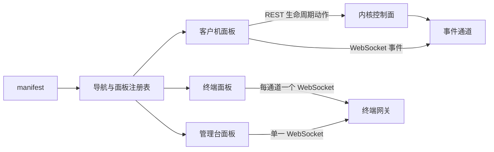

# AxVisor Web 控制台前端

本目录是 AxVisor 浏览器控制台的前端源码，也是它在仓库中的唯一事实来源。控制台按 local host 设计，不涉及鉴权和跨主机安全边界；内核侧只提供数据与控制接口，界面形态、导航结构和面板划分全部由前端决定。

## 1 定位与边界

控制台的目标是把内核已经具备的控制面能力（客户机登记表、配置池、生命周期动作、终端网关）暴露为一个可长期维护的网页界面，而不是再把实验性的单页 HTML 手工拼进内核源码。前端与内核之间只有 HTTP 与 WebSocket 两种通道，构建产物在编译期内嵌进 AxVisor 二进制，运行期不读宿主文件系统。

### 1.1 职责

前端负责以下四件事，且只负责这四件事：

- 读取内核的能力声明，据此生成导航，而不是在代码里写死“有哪些面板”。
- 把客户机登记表、配置池、生命周期动作渲染成可操作的表单与表格。
- 为每条终端通道维护一个 xterm 实例，并把它接到内核的终端网关上。
- 维护一个随事件通道更新的客户机视图，使界面不需要靠轮询猜测内核状态。

### 1.2 明确不做的事

以下内容不属于前端职责，出现在前端即为缺陷：

- 不保存密钥或票据。控制面没有鉴权，前端也不提供任何登录界面。
- 不访问内核之外的地址。所有请求路径都是相对路径，构建产物换一个部署位置仍然可用。
- 不在浏览器里重新实现生命周期规则。能否启动、停止、删除以内核返回的状态与错误码为准，前端只做按钮的可用性提示。
- 不与文件系统直通交互。控制台只发控制请求，不碰客户机文件系统。

## 2 与内核的接口

前端所需的一切都来自内核随构建一起声明的能力表：能力表既决定“要不要显示这个面板”，也决定“这个面板的数据从哪里取”。前端不再自己维护一份端点表，因此新增或改名一个动作只需要在内核侧改一处声明，前端跟随声明即可，不需要新增路径常量。

### 2.1 能力声明与导航

启动时前端请求能力声明，按返回的面板列表生成导航。契约中的 `proto` 是协议版本，`panels` 的每一项描述一个面板的 `kind`、标题、资源根、可用的动作摘要（`verbs`）以及该面板可以调用的每个动作（`links`）。下面的例子对应同时编译了控制面与终端网关的构建。

```json
{
  "proto": 1,
  "panels": [
    {
      "kind": "vms",
      "title": "虚拟机",
      "root": "/api/vms",
      "verbs": ["read", "write"],
      "links": [
        { "name": "list", "verb": "read", "method": "GET", "href": "/api/vms" },
        { "name": "detail", "verb": "read", "method": "GET", "href": "/api/vms/{id}" },
        { "name": "start", "verb": "write", "method": "POST", "href": "/api/vms/{id}/start" }
      ]
    }
  ]
}
```

`kind` 的取值集合是前端渲染器注册表的键集合的子集。若内核声明了一个前端还不认识的 `kind`，导航仍然显示它，面板区域降级为 JSON 视图；这样内核侧可以先于前端增加能力，而不会把整个界面打坏。

### 2.2 路径来自能力声明

动作链接是模板，`{id}`、`{endpoint}` 这类占位符由面板在调用时填值。前端把整张声明读成访问器（`src/capability/accessor.ts`），面板向访问器点名动作并拿到 URL，自己不拼路径。这样一来的硬约束是：面板与外壳里不出现请求路径字面量，路径只在声明里出现一次，前端与内核的路由表不会各自漂移。

唯一的例外是引导路径：客户端在读到声明之前必须先知道去哪里读，所以 `GET /api/manifest` 在前端是一个固定常量，与内核侧的 `MANIFEST_PATH`（`src/control/capability/mod.rs`）成对，静态检查会比对这两处。

动作缺失时的行为按“该构建是否本来就该有它”分两种。本该有却没有（前端点名了一个声明里没有的动作）是契约缺陷，访问器直接抛错，经面板错误边界显示成一张错误卡片，而不是发一个必然 404 的请求；本来就只存在于部分构建的动作（配置池与目录浏览只在带文件系统的构建里）用 `maybeUrl` 取，缺失时返回 `null`，面板据此渲染“这个构建没有配置池”。

完整路由表（路径、方法、处理器、动作名）由内核侧的能力表维护，见 `os/axvisor/src/control/capability/table.rs` 的模块文档；前端不复制这份清单。

### 2.3 配置池与客户机来源

配置池操作的返回结构承载了“哪些配置暂时不能启动”这一信息，前端把它显示为不可用条目而不是静默丢弃，因为绕过内核去猜测失败原因只会让用户拿到更差的提示。

客户机来源是目录而不是编译期内嵌表：内嵌表让“这台 hypervisor 能起哪些客户机”只能靠重新构建来改，而目录里的文件是运行期可读、可换、可在界面上点出来的。因此池会读多个目录（丢配置的目录优先，其次由构建配置追加），目录浏览让界面走到任意目录去取配置，存入配置池让界面把一段配置落成池文件。

### 2.4 终端与事件通道

终端与事件是两条独立的 WebSocket 通道，前者传字节流，后者传结构化状态变化。终端通道既承载客户机通道也承载管理台自身的通道，两者用同一套帧语义，因此前端只需要一个终端组件。



终端通道的帧语义是“二进制帧即输出，文本帧与二进制帧都可作为输入”。连接建立时内核先发一帧欢迎信息，前端把收到的所有帧都当作终端输出；因此前端不区分欢迎帧与后续输出，也不需要为首次输入做特殊处理。

事件通道在连接建立后先发一帧全量快照，随后只发增量帧。前端据此维护一份以客户机 id 为键的视图，并在收到增量帧时更新它。登记表本身仍以 `GET /api/vms` 为权威，事件通道只用于避免不必要的轮询和让界面动作及时反映到多个页面。

## 3 目录结构

源码按“外壳、面板、能力、接口、基础库”五层组织。外壳不知道任何面板的存在，面板之间互不引用，面板也不自己拼路径：三者只通过注册表、能力访问器和请求客户端连接，这样任何一个面板都可以单独删除而不影响其余部分。

### 3.1 外壳与面板的分工

下面各层的职责边界是判断一次改动该落在哪里的依据。

- `src/shell/` 是外壳：读取能力声明、生成导航、承载面板区域与标签页，并把该面板自己的动作访问器交给它。它不 import 任何面板实现，只从注册表按 `kind` 取组件。
- `src/panels/` 是面板：每个 `kind` 一个目录，目录内聚数据获取与渲染。面板之间不互相 import。
- `src/api/` 是接口层：请求客户端、事件通道、终端通道、契约类型。类型与错误文案集中在这里，避免各面板各写一份。
- `src/capability/` 是能力层：把内核声明的动作链接变成访问器（`accessor.ts`）并读取声明本身（`manifest.ts`）。它不含任何面板知识，因此可以被单元测试直接覆盖。
- `src/lib/` 与 `src/components/` 是基础库：状态到文案的映射、生命周期动作规则、终端组件与通用界面组件。

### 3.2 关键不变量

以下不变量在评审中作为硬性要求，破坏其中任何一条都应被要求修改：

- 外壳目录不出现任何面板 `kind` 的字面量。
- 面板不互相 import，共享逻辑下沉到 `lib/`。
- 请求路径不写在面板或外壳里：面板向能力访问器点名动作，路径只在内核侧的声明里出现一次，前端唯一的路径常量是引导路径，并由静态检查与内核侧同名常量比对。
- 动作缺失要分性质：本构建本该有的动作缺失时让错误经面板错误边界可见，而不是发一个必然 404 的请求；只存在于部分构建的动作用 `maybeUrl` 判断，缺失时渲染“这个构建没有这项能力”。
- 状态到可执行动作的判断只有一处实现，并由单元测试覆盖。
- 请求失败必须说清性质："没连上后端"（连接中断、后端已退出或正在重启）与 "HTTP 4xx/5xx" 是两回事，不得把浏览器的 `Failed to fetch` 直接摆给读者；列表读取失败时还要说明表里是最后一次成功读取的结果。
- 客户机来自可读目录，不来自编译期内嵌配置：界面必须能看到池读了哪些目录、每个条目来自哪个目录，并能浏览任意目录取配置。
- 客户机镜像一律来自客户机文件系统（`image_location = "fs"`，且只有这一种来源）：池里出现旧的内存形态配置要作为问题显式列出，并说明改法是把 `image_location` 改成 `"fs"` 且让 `kernel_path` 指向客户机根文件系统内的文件。
- 目录里不能用来自动变成客户机的文件必须显式列出原因；不得因为“看着不像配置”就悄悄跳过。
- 写入配置池只能写进池目录，文件名只能是普通 `*.toml`；写入前必须先校验 TOML。
- 终端通道按需占用：独占订阅的通道只在操作者打开它时才连接（进入面板最多自动打开一条空闲通道），并提供释放入口；不得把一个页面能看到的所有通道一次挂满，否则另一个页面永远连不上，而唯一出路是找到并关掉那个页面。占用提示要同时说清两种可能：本页另一个终端面板，或另一个浏览器页面。
- 抢输要自己换一条：两个页面可能读到同一份“空闲”快照并同时去连，只有输的那个会知道，而浏览器只报告一次无名的关闭。因此连接关闭后要重读通道表（`console` 面板的 `list` 动作），按新表判断是不是被别的会话拿走了：是则丢弃该通道并自动连下一条空闲的，不得停在抢输的那条上反复重试。
- 终端标签初始各自独立：一个标签就是一格，打开的通道各自成标签，不带任何并列。把标签拖到另一个标签上才融合成同屏分列，融合格里每格有「分离」把它拆回末尾的独立标签。布局变化只改渲染，不得改变本页占用的通道集合。
- 标签集合由通道表推导，不由界面自己记账：通道被释放或消失时要从所在组里剔除，空组随之消失；这一推导必须是纯函数并被单元测试覆盖，且要能在渲染期间反复调用而不自激重渲染。
- 只有当前活动组的通道会被连接：切到别的标签组不等于把两组的通道都挂上，抢输回退与释放入口在切换后仍然有效。
- 终端要处理裸 LF：宿主自己的文案都用 CRLF，但文件内容（`cat` 的输出、`vm show` 打印的配置）是纯 LF，终端必须把它当“回车并下移”，否则多行输出会逐行右移成阶梯。这属于渲染层的职责，不要要求每处输出自己去补回车。
- 每个面板都包在壳层的错误边界里：某个面板渲染失败时只降级为一张错误卡片，不得把外壳、导航和其他面板一起卸载。错误卡片必须按失败性质给建议：取不回分片或样式表（后端已退出、连接中断）与渲染期字段类型不符是两种不同的问题，不能都归咎于后端 JSON 与前端契约。
- 终端面板必须区分“通道已连上”和“客户机在运行”：WebSocket 握手成功只说明通道可用，客户机未运行时它仍要明确告知输入不会送达。
- 代码注释与标识符使用英文，界面文案使用中文。

## 4 构建与调试

前端构建独立于 Cargo：Cargo 只读取构建产物，不调用 npm。这样做的代价是构建二进制之前必须先生成产物，收益是内核构建过程不依赖网络与包管理器，也不会因为 npm 的解析行为变化而随机失败。

### 4.1 构建产物

生成产物使用下面两条命令，产物目录是 `dist/`。Cargo 在开启 `web-ui` 特性时把它整表内嵌进二进制；产物缺失或为空时，构建会以一条指明该命令的错误终止，而不是让二进制在没有界面的状态下静默构建成功。

```bash
cd os/axvisor/web-ui
npm ci
npm run build
```

`dist/` 与 `node_modules/` 都不入库。产物带内容哈希，内核以 `immutable` 缓存策略与精确的内容类型提供它们，因此同一次构建内文件不会被替换，路径也不会被复用。

### 4.2 本地联调

开发时用开发服务器直连目标内核，浏览器访问开发服务器端口即可，同源问题由代理解决。此时前端仍使用相对路径，代理只负责把 `/api` 与 `/ws` 转发到内核的监听地址。

```bash
cd os/axvisor/web-ui
npm run dev     # 5173 端口，/api 与 /ws 代理到 8080
```

改完后端契约时先跑类型检查和单元测试，它们不进内核、也不需要 QEMU：

```bash
npm run typecheck
npm test
```

## 5 测试与持续集成

界面是否真的被内核提供、契约是否与后端一致，不能靠前端自己的单元测试证明，必须有一次真实启动来验证。这条验证由 QEMU 用例完成，它既检查静态资源与响应头，也检查能力声明、终端通道和生命周期动作。

### 5.1 QEMU 用例

用例位于测试套件的 `qemu-web-ui` 目录，构建配置开启 `web-ui` 与 `browser-console`，探针在宿主机上通过端口转发访问运行中的 AxVisor，逐条断言页面外壳、哈希资源与响应头、未知路径的 404、能力声明的动作集合与引导路径，以及终端通道和事件帧。资源断言按产物引用递归抓取：入口页指向的资源、它导入的惰性面板分片、以及分片预加载表里列出的样式表都必须被服务，成功后探针还会打印整张资源表；如果抓取结果只剩入口脚本、或整张表里没有样式表，用例直接失败 —— 覆盖被静默削弱比失败更糟。用例同时会驱动一次真实的客户机启动与关闭，并在引擎启动之前就接上客户机终端通道，最后向客户机 shell 输入一条命令、要求它的求值结果出现在输出里：终端“能看不能打”这类只在真实 UART 往返中出现的问题，靠前端单元测试或队列级断言都证不出来。

只跑这一条用例：

```bash
cargo xtask axvisor test qemu --arch aarch64 --test-case web-ui
```

### 5.2 持续集成

持续集成在构建该用例之前准备 Node 环境并生成产物：若运行器上不存在 Node 24，就下载一份固定版本到临时目录并加入 `PATH`，随后执行 `npm ci` 与 `npm run build`。这样做的原因是自托管运行器不保证预装 npm，而把产物入库会让仓库里同时存在源码与可变产物两份事实来源。
