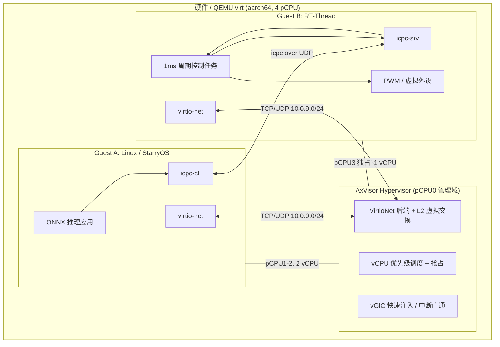
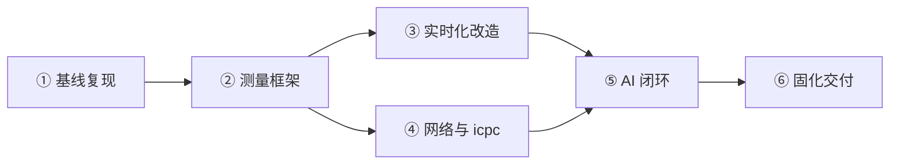

# 智能化工控中基于虚拟化的混合系统部署及联动实现——技术方案

> **对应赛题**：泉城实验室 2026 首届「揭榜挂帅」擂台赛 · 工控虚拟化方向榜题
> **赛题链接**：<https://opencamp.cn/qcl/camp/OpenRace2026/stage/1>
> **基线项目**：[tgoskits](https://github.com/rcore-os/tgoskits) `dev` 分支，核心组件 AxVisor
> **文档版本**：v2.0（2026-07-05 审查优化版）

---

## 零、赛题对应与基线差距分析

### 0.1 赛题任务与分值映射

| 赛题任务 | 分值 | 本方案主应答章节 |
|---|---|---|
| 任务一：AxVisor 实时性改造与验证 | 30 + 加分 | 第三章 3.1、第六章阶段二 |
| 任务二：客户机间 IP 网络通信 | 25 | 第三章 3.2、第六章阶段三 |
| 任务三：AI 模型与控制联动 | 25 | 第三章 3.3、第六章阶段四 |
| 工程完整性与文档 | 15 | 第六、七章 |
| 系统创新与扩展性 | 5 | 第四章 |
| 加分项（StarryOS / syscall / 多 RTOS·多板卡） | ≤10 | 2.2 备选路线、第六章阶段五 |

### 0.2 基线已有能力（dev 分支实测/源码核对）

| 能力 | 现状 | 仓库依据 |
|---|---|---|
| Type-1 Hypervisor 多客户机启动 | ✅ QEMU aarch64 已支持 ArceOS + Linux 双客户机（`--multi`） | `os/axvisor/scripts/quick-start.sh` |
| vCPU 物理 CPU 亲和绑定 | ✅ `phys_cpu_ids` / `phys_cpu_sets` 配置 + `vcpu_task.set_cpumask()` | `virtualization/axvmconfig`、`virtualization/axvm/src/runtime/vcpus.rs` |
| 多核 Linux 客户机（实板） | ✅ 如 ROC-RK3568-PC `linux-smp2.toml`（2 vCPU） | `os/axvisor/configs/vms/roc-rk3568-pc/` |
| RT-Thread Guest | ⚠️ 仅飞腾派等平台配置，**QEMU aarch64 尚无现成 RT-Thread 客户机配置** | `os/axvisor/configs/vms/phytiumpi/rtthread-smp1.toml` |
| Zephyr / NimbOS / FreeRTOS Guest | ✅ QEMU/板级均有模板配置 | `os/axvisor/configs/vms/qemu/aarch64/zephyr-smp1.toml` 等 |
| VirtIO MMIO 设备树节点 | ✅ Linux DTB 已预留 `virtio_mmio@*` 节点 | `os/axvisor/configs/vms/qemu/aarch64/linux-smp1.dts` |
| VirtioNet 客户机模拟设备 | ❌ `EmulatedDeviceType::VirtioNet` 已定义，**axdevice 工厂尚未实现** | `virtualization/test_crates/virtualization-tests/tests/axdevice.rs` |
| vsock / IVC / HyperCall | ✅ 具备，但榜单明确**不得作为主数据通道** | `net/ax-net`（vsock）、`virtualization/axvm/src/runtime/ivc.rs` |
| 统一测试入口 | ✅ `cargo xtask test axvisor` + `test-suit/axvisor/` | 仓库 CI 矩阵 |
| StarryOS 运行 Linux 用户态 | ✅ 基线已支持，可作 AI 客户机加分路径 | 赛题起始基线说明 |

### 0.3 关键攻关差距（本方案必须补齐）

1. **实时调度**：当前 vCPU 以 ArceOS 默认 RR 调度运行，无优先级抢占；需改造调度器并引入 vCPU 静态优先级属性。
2. **QEMU 混合部署**：需新建 `linux-smp2` + `rtthread-smp1`（或 Zephyr）双客户机组合配置与镜像构建流程。
3. **跨客户机 IP 数据面**：需实现 VirtioNet 模拟设备 + Hypervisor 内二层虚拟交换，**不能**依赖 vsock/IVC/宿主 tap 转发作为交付主通道。
4. **测量与验证体系**：需从零建立 RTOS 周期抖动/中断延迟测量框架及 `test-suit/axvisor/` 回归用例。
5. **AI 闭环应用**：icpc 协议库、RTOS 控制任务、ONNX 推理应用均为新增交付物。

> **设计原则**：充分利用已有 `phys_cpu_sets`、IVC 调试通道、Zephyr 裸机基线等基线能力；对未实现项给出分阶段、可验收的补齐路径，避免过度承诺。

---

## 一、项目背景与需求分析

### 1.1 榜单核心痛点与技术瓶颈

工业控制系统正在向智能化、网络化演进，同一套硬件平台上往往需要同时承载三类性质迥异的负载：

1. **硬实时控制任务**：伺服、PWM、电机等控制回路，要求微秒级抖动和确定的最坏情况响应时间（WCET/WCRT）；
2. **智能计算任务**：神经网络推理（视觉检测、参数寻优等），计算密集、吞吐优先、时延可容忍；
3. **通用管理任务**：组态、日志、上位机通信等，依赖 Linux 丰富的软件生态。

传统方案要么使用多块独立控制器（成本高、通信复杂），要么在单一 Linux 上叠加 PREEMPT_RT（实时性上限受限、隔离性弱）。基于 Type-1 Hypervisor 的混合关键性部署（Mixed-Criticality Deployment）是当前工控领域公认的演进方向，但现有开源虚拟化方案存在以下瓶颈：

- **实时性瓶颈**：Hypervisor 的 vCPU 调度、虚拟中断注入、虚拟定时器路径会引入不确定延迟，且缺少面向 RTOS 客户机的抢占与优先级机制；
- **通信瓶颈**：跨客户机通信多依赖厂商私有共享内存或 vsock/IVC 方案，缺少标准 IP 协议栈级、带可靠性语义的通信链路；
- **联动瓶颈**：AI 推理结果到实时控制回路之间缺少低延迟、可度量、可闭环的下发通路。

### 1.2 行业技术现状与存在问题

| 方案 | 代表 | 存在问题 |
|---|---|---|
| 商业工控 Hypervisor | ACRN、Jailhouse、PikeOS | 生态封闭或配置复杂，RISC-V 等国产架构支持弱 |
| Linux + PREEMPT_RT 单系统 | 各类工控机 | 实时上限约几十微秒级抖动，AI 与控制负载互相干扰，故障域不隔离 |
| 双硬件方案（MCU + SoC） | 传统 PLC + 工控机 | BOM 成本高，跨板通信延迟大，部署维护复杂 |
| 开源 Rust Hypervisor | AxVisor（本项目基线） | 已具备多客户机、vCPU 亲和、IVC/vsock，但**无实时抢占调度、无 Guest VirtioNet、无跨 VM IP 交换** |

### 1.3 核心目标与量化指标

基于 tgoskits `dev` 分支的 AxVisor，构建「Linux/Starry 客户机（AI 推理）+ RTOS 客户机（实时控制）」的智能控制演示平台，量化指标如下（全部对标榜单考核细则）：

| 编号 | 指标 | 目标值 | 对应榜单要求 |
|---|---|---|---|
| M1 | RTOS 客户机周期任务抖动（stress 压力下） | 相比改造前降低 ≥ 50%，并给出最坏情况数据 | 任务一 |
| M2 | 虚拟中断响应延迟（Guest 视角） | 空载/压力下给出平均值、P99、最大值；压力下最大延迟有界 | 任务一 |
| M3 | 与裸机 RTOS 基线的差距 | 同平台同负载下，虚拟化引入的额外延迟量化可复现 | 任务一 |
| M4 | 多核 Linux 客户机 | ≥ 2 vCPU 稳定启动，vCPU/pCPU 绑定、中断路由、内存布局有配置文件与文档 | 任务一 |
| M5 | 客户机间 IP 链路 | Linux/Starry ↔ RTOS 双向 TCP/UDP 通信，**非 vsock、非 IVC、非宿主转发数据面** | 任务二 |
| M6 | 应用层协议 | 含版本、类型、长度、序号/时间戳、校验字段；支持控制指令/状态回传/错误通知三类消息 | 任务二 |
| M7 | 通信可靠性 | 注入丢包/乱序/断连后自动恢复；成功率、超时率、请求-响应延迟、有效吞吐有测试数据 | 任务二 |
| M8 | AI 推理 | Linux/Starry 客户机内完成神经网络推理（ONNX Runtime / 轻量视觉模型） | 任务三 |
| M9 | 端到端闭环延迟 | AI 输入→推理→网络下发→RTOS 控制输出可测量；说明测量方法、误差来源、精度范围 | 任务三 |
| M10 | 控制效果对比 | 固定参数基线 vs AI 动态调参，≥ 2 项量化指标对比 | 任务三 |
| M11 | 工程交付 | 全部源码以无冲突 PR 合入 tgoskits `dev` 分支，Apache 2.0 许可，QEMU 一键复现 | 提交材料 |

---

## 二、总体技术方案与技术路线

### 2.1 整体设计思路与总体架构

总体思路：**「分域部署、能力下沉、通道标准化、闭环可度量」**。

- **分域部署**：AI/管理负载与实时控制负载分到两个客户机，物理 CPU、内存、中断按域静态划分，故障域和干扰域隔离；
- **能力下沉**：实时性保障（优先级调度、中断快速注入/直通、CPU 独占）下沉到 AxVisor 层，客户机无需感知；
- **通道标准化**：跨客户机通信统一走 IP 协议栈（VirtioNet + Hypervisor 内虚拟交换），应用层 icpc 协议承载可靠性语义；
- **闭环可度量**：AI→控制→状态回传全链路埋点时间戳，端到端延迟可量化、可复现。

#### 逻辑架构（4 pCPU 参考拓扑）



#### pCPU 资源划分（与配置一致）

| pCPU | 归属 | 职责 |
|---|---|---|
| pCPU0 | AxVisor 管理域 | Hypervisor 初始化、shell、维护任务、虚拟交换控制面 |
| pCPU1–2 | Linux/Starry 客户机 | 2 vCPU，AI 推理、网络协议栈、stress 压力源 |
| pCPU3 | RT-Thread 客户机 | 1 vCPU **独占**，硬实时控制，不接收无关 IPI/tick |

（icpc = Industrial Control Plane Communication，详见 3.2 节）

### 2.2 核心技术路线（主路线 + 备选路线）

| 环节 | 主路线 | 备选路线 |
|---|---|---|
| 平台 | QEMU aarch64 virt + GICv3（保证评审复现） | 香橙派 5 Plus / ROC-RK3568-PC 实板（加分项） |
| 演示组合 | Linux(2vCPU) + RT-Thread(1vCPU) 双客户机 | StarryOS 替代 Linux（+4 分）；Zephyr 作第二 RTOS 基线（+2 分） |
| 实时调度 | vCPU 静态优先级 + IPI 抢占；RTOS vCPU 独占 pCPU | **保底**：仅 pCPU 独占（不依赖抢占改造） |
| 中断路径 | vGIC list register 快速注入；条件允许时外设中断直通 | 仅优化注入路径，不做直通 |
| 客户机间网络 | AxVisor 实现 VirtioNet 模拟 + Hypervisor 内 L2 交换 | 开发期可用宿主 tap 桥调试，**不作为交付数据面** |
| 传输协议 | UDP + icpc 应用层可靠性（ACK/重传/去重/心跳） | TCP 长连接 + 分帧（若 RTOS 侧 TCP 更稳） |
| RTOS | RT-Thread（工控生态成熟） | Zephyr（QEMU 裸机基线已有配置）；NimbOS |
| AI 框架 | ONNX Runtime CPU + 轻量 MLP/1D-CNN | ncnn / YOLO-nano（视觉扩展场景） |
| 调试通道 | vsock / IVC / HyperCall | 仅调试与对比，设计文档明确边界 |

### 2.3 整体实现逻辑与技术流程



1. **基线复现**：QEMU aarch64 双客户机（Linux 2vCPU + RT-Thread 1vCPU）启动链路打通；
2. **测量先行**：RTOS 周期任务抖动 + 虚拟中断延迟测量框架，采集改造前基线；
3. **实时化改造**：调度 → 中断 → 定时器 → 锁与临界区，逐项回归；
4. **通信通道**：VirtioNet 模拟 + 虚拟交换 + icpc 协议库双端适配；
5. **AI 联动**：ONNX 推理 → icpc 下发 → RTOS 控制 → 状态回传闭环；
6. **工程固化**：`test-suit/axvisor/` 回归、文档、分批 PR 合入 `dev`。

### 2.4 通信机制边界说明（合规要求）

| 机制 | 用途 | 是否可作为主数据通道 |
|---|---|---|
| VirtioNet + IP 协议栈 | 跨客户机控制/状态数据传输 | ✅ **是（交付主通道）** |
| vsock | 调试、对比测试、开发期辅助 | ❌ 否 |
| IVC 共享内存 | HyperCall 侧车、开发调试 | ❌ 否 |
| 宿主 QEMU tap/user 桥 | 本地开发冒烟 | ❌ 否（不作为最终交付拓扑） |

---

## 三、关键技术与核心解决方案（重点）

### 3.1 针对任务一：AxVisor 实时性改造与验证（30 分）

#### 3.1.1 关键路径分析

RTOS 客户机一次「外部事件 → 控制输出」的虚拟化关键路径：

```
物理中断 → AxVisor trap → 中断识别/路由 → vGIC 虚拟中断注入
    → （vCPU 未运行）调度器唤醒/切换 → Guest IRQ handler → 控制计算 → 输出
```

不确定性来源：

| 路径段 | 不确定因素 | 改造策略 |
|---|---|---|
| vCPU 调度 | ArceOS RR 调度，无优先级抢占 | 静态优先级 + IPI 抢占；RTOS vCPU 最高优先级 |
| 中断注入 | 全局锁、LR 分配竞争 | 缩短临界区；实时域 per-vCPU 注入队列 |
| 虚拟定时器 | tick 陷入 Hypervisor | RTOS 侧 arch timer（CNTV）直访 |
| Hypervisor 后台 | 日志/shell 任务迁移到实时 pCPU | 维护任务绑定 pCPU0 管理域 |

#### 3.1.2 实质性改造点

| 改造项 | 方案 | 涉及组件 | 基线状态 |
|---|---|---|---|
| vCPU 优先级调度与抢占 | TOML 声明 `vcpu_priority`；高优先级 vCPU 就绪时 IPI 抢占 | `os/axvisor`、`virtualization/axvm`、`components/axtask` | ❌ 待实现 |
| vCPU/pCPU 独占绑定 | RTOS vCPU `phys_cpu_sets` pin 到 pCPU3，该核不跑其他 vCPU | `os/axvisor/configs/vms/`、`axvm/runtime/vcpus.rs` | ⚠️ 配置能力已有，独占策略待强化 |
| 中断注入优化 / 直通 | 精简 `arm_vgic` 注入路径；实时域外设 IRQ 直通 | `virtualization/arm_vgic`、`virtualization/arm_vcpu` | ⚠️ 注入已有，直通待实现 |
| 虚拟定时器优化 | RTOS 客户机 CNTV 直访，避免虚拟 tick 陷入 | `virtualization/arm_vcpu` | ❌ 待实现 |
| 锁与临界区治理 | 审计注入/调度路径自旋锁，改 IRQ-aware 锁或 per-CPU 数据 | AxVisor 核心热路径 | ❌ 待审计改造 |
| 后台任务隔离 | Hypervisor 日志/shell 绑定 pCPU0 | `os/axvisor/src/task.rs` 等 | ❌ 待实现 |

#### 3.1.3 多核 Linux 客户机部署说明

**目标配置文件**（新增）：

- `os/axvisor/configs/vms/qemu/aarch64/linux-smp2.toml` — Linux 2 vCPU
- `os/axvisor/configs/vms/qemu/aarch64/rtthread-smp1.toml` — RT-Thread 1 vCPU
- `os/axvisor/configs/board/qemu-aarch64-mixed.toml` — 双客户机板级组合（待新增）

**资源分配示例**：

| 资源 | Linux 客户机 | RT-Thread 客户机 |
|---|---|---|
| vCPU | 2（vCPU0–1） | 1（vCPU0） |
| pCPU 绑定 | pCPU1–2 | pCPU3（独占） |
| 内存 | GPA 0x8000_0000 起 1GiB（静态划分） | GPA 0x4000_0000 起 128MiB |
| 中断 | virtio 设备 IRQ → pCPU1–2 | 直通/timer IRQ → pCPU3 |
| 网络 | VirtioNet eth0, MAC 02:00:00:00:00:02, IP 10.0.9.2/24 | VirtioNet eth0, MAC 02:00:00:00:00:03, IP 10.0.9.3/24 |

#### 3.1.4 验证流程

**测量负载**：

- RTOS 内 1ms / 10ms 周期任务，记录唤醒抖动（latencies histogram）；
- 虚拟 GPIO / 软件注入中断，记录 IRQ 到 handler 首条指令延迟；
- 时间源：arch counter `CNTVCT_EL0`，纳秒级精度。

**场景矩阵**：

```
{改造前, 改造后} × {空载, Linux stress-ng(CPU/内存/中断)} × {AxVisor RTOS, 裸机 RTOS}
```

**裸机基线**：

- 主基线：同 QEMU `virt` 机器直接启动 RT-Thread；
- 辅基线：Zephyr（`zephyr-smp1.toml` 已有模板），用于多 RTOS 对比加分；
- 文档说明 QEMU 与实板（RK3588/RK3568）GIC/定时器差异及对数据的影响。

**数据要求**：每场景 ≥ 30 分钟；输出 mean / P99 / P999 / max 直方图；附测试命令、CPU 负载分布。

**可复现**：测试脚本与 success 正则纳入 `test-suit/axvisor/normal/qemu/`，通过 `cargo xtask test axvisor` 执行。

---

### 3.2 针对任务二：基于 IP 网络的客户机间通信（25 分）

#### 3.2.1 网络链路建立

**实现路径**（针对 VirtioNet 尚未实现的基线差距）：

1. 在 `virtualization/axdevice` 新增 `VirtioNet` 模拟设备（参考已有 `VirtioBlk` 模式及 `drivers/ax-driver/src/virtio/net.rs` 协议实现）；
2. 在 AxVisor 新增 `vsw`（virtual switch）模块：MAC 学习表 + 有界转发队列 + 可选 ACL；
3. 为每个客户机 DTB/emu_devices 注入独立 VirtioNet MMIO 区域；
4. Linux 侧使用内核 `virtio_net` 驱动；RT-Thread 侧使用 `virtio-net` + lwIP。

**网络拓扑**：

```
Guest A (10.0.9.2)                Guest B (10.0.9.3)
  virtio-net eth0                    virtio-net eth0
        \                              /
         \   AxVisor L2 Virtual Switch /
          \__________  vsw  __________/
                    (无宿主参与数据面)
```

**访问控制验证点**：vsw 按源/目的 MAC + UDP 端口白名单过滤，拒绝非 icpc 端口流量，满足「网络隔离与访问控制」评分项。

#### 3.2.2 应用层协议 icpc

运行在 UDP 之上（主路线）。固定头 24 字节 + 变长 payload：

```
 0                   1                   2                   3
 0 1 2 3 4 5 6 7 8 9 0 1 2 3 4 5 6 7 8 9 0 1 2 3 4 5 6 7 8 9 0 1
+-+-+-+-+-+-+-+-+-+-+-+-+-+-+-+-+-+-+-+-+-+-+-+-+-+-+-+-+-+-+-+-+
| ver  | type  | flags | rsvd  |          seq (u32)            |
+-+-+-+-+-+-+-+-+-+-+-+-+-+-+-+-+-+-+-+-+-+-+-+-+-+-+-+-+-+-+-+-+
|                        timestamp_ns (u64)                     |
+-+-+-+-+-+-+-+-+-+-+-+-+-+-+-+-+-+-+-+-+-+-+-+-+-+-+-+-+-+-+-+-+
|                        timestamp_ns (cont.)                   |
+-+-+-+-+-+-+-+-+-+-+-+-+-+-+-+-+-+-+-+-+-+-+-+-+-+-+-+-+-+-+-+-+
| payload_len   |   err_code    |          crc32 (u32)          |
+-+-+-+-+-+-+-+-+-+-+-+-+-+-+-+-+-+-+-+-+-+-+-+-+-+-+-+-+-+-+-+-+
|                          payload ...                          |
+-+-+-+-+-+-+-+-+-+-+-+-+-+-+-+-+-+-+-+-+-+-+-+-+-+-+-+-+-+-+-+-+
```

| 字段 | 类型 | 说明 |
|---|---|---|
| ver | u8 | 协议版本，当前 = 1 |
| type | u8 | 消息类型（见下表） |
| flags | u8 | ACK 请求、分片等标志位 |
| seq | u32 | 单调递增序号，用于去重/重传 |
| timestamp_ns | u64 | 发送时刻（CNTVCT 或 CLOCK_MONOTONIC） |
| payload_len | u16 | 载荷字节数 |
| err_code | u16 | 错误码（`ERROR_NOTIFY` 时有效） |
| crc32 | u32 | 覆盖 header（crc 字段置 0）+ payload |

**消息类型**：

| type | 名称 | 方向 | 用途 |
|---|---|---|---|
| 0x01 | CTRL_CMD | Linux → RTOS | 控制参数/策略下发 |
| 0x02 | STATE_REPORT | RTOS → Linux | 状态、误差、执行结果回传 |
| 0x03 | ERROR_NOTIFY | 双向 | 异常通知 |
| 0x04 | ACK | 双向 | 确认 |
| 0x05 | HEARTBEAT | 双向 | 保活 |

**代码组织**（计划新增）：

```
components/icpc/          # Rust no_std 协议核心
apps/icpc-cli/            # Linux/Starry 客户端
apps/icpc-bench/          # 自动化压测
# RT-Thread 侧通过 C 绑定或 Rust 组件引入 icpc
```

#### 3.2.3 可靠性机制

| 机制 | 实现 |
|---|---|
| 确认与重传 | 停等或滑动窗口 ACK；超时指数退避（初始 50ms，上限 2s） |
| 去重与乱序 | seq 去重表 + 有限乱序缓存（窗口 32） |
| 连接保活 | HEARTBEAT 周期 1s；连续 3 次无响应判定失联 |
| 异常恢复 | 失联后自动重绑 UDP socket / 重建会话状态机 |
| 故障注入 | vsw 可配置丢包率、乱序、额外延迟，用于 CI 回归 |

**统计指标**：请求成功率、应用层错误数、超时次数、恢复时间、RTT 分布（P50/P99/max）、有效应用吞吐（msg/s）。

#### 3.2.4 自动化测试

- `icpc-bench` 支持固定速率 / 爬坡模式压测，输出 CSV；
- `test-suit/axvisor/normal/qemu/icpc-smoke.toml` — 双向通信冒烟；
- `test-suit/axvisor/stress/icpc-fault-inject.toml` — 故障注入回归。

---

### 3.3 针对任务三：AI 模型与控制联动（25 分）

#### 3.3.1 演示场景设计

选择**「温控 / 转速 PID 参数自整定」**场景（RTOS 内仿真一阶惯性 + 阶跃扰动）：

| 环节 | 执行位置 | 说明 |
|---|---|---|
| 快环（1ms） | RT-Thread | PID 控制任务驱动 PWM（QEMU 日志波形 / 实板 LED） |
| 慢环（100ms–1s） | Linux/Starry | ONNX 推理根据状态窗口输出 PID 增益修正量 |
| 下发 | icpc CTRL_CMD | AI 输出 → RTOS 更新 Kp/Ki/Kd |
| 回传 | icpc STATE_REPORT | 当前输出、误差、超调量 → Linux 侧记录 |

**双环架构**使 AI 推理延迟不阻塞硬实时控制回路，符合工控「快环 + 慢环」实践。

#### 3.3.2 模型选型与部署

| 项目 | 说明 |
|---|---|
| 主模型 | 3 层 MLP 或 1D-CNN，输入 32 步状态窗口（误差、输出、扰动），输出 3 维 ΔKp/ΔKi/ΔKd |
| 框架 | ONNX Runtime（CPU EP），QEMU 下单次推理目标 < 10ms |
| 训练 | PyTorch 离线训练 + 导出 ONNX；脚本与模型随仓库交付 |
| 备选 | YOLO-nano 视觉检测 → 设定值生成（实板摄像头场景） |

#### 3.3.3 端到端延迟测量

| 方法 | 说明 | 用途 |
|---|---|---|
| 方法一（主） | Linux 在 CTRL_CMD 打 T1，RTOS 回 STATE_REPORT 带 T1，单向延迟 ≈ (T2−T1)/2 | 不依赖跨机时钟同步 |
| 方法二（辅） | 两客户机共享物理 CNTVCT（AxVisor 保证 CNTVOFF 一致），协议 timestamp 分段归因 | 推理 / 网络 / 控制各段耗时 |
| 方法三（可选） | PTP 或 NTP 粗同步后比较协议时间戳 | 辅助验证 |

**误差说明**：采样点位置、vCPU 调度扰动、counter 读取指令开销；预期单向延迟测量精度 ±5μs（QEMU）/ ±2μs（实板）。

#### 3.3.4 控制效果对比

固定参数手动控制 vs AI 动态调参，对比 ≥ 3 项：

1. 阶跃响应稳定时间（settling time，进入 ±2% 带时间）；
2. 稳态 RMSE；
3. 扰动恢复时间 / 超调量；
4. （视觉扩展）检测准确率与响应延迟。

---

### 3.4 评分细则全覆盖对照表

| 榜单细则 | 分值 | 本方案对应 | 验收证据 |
|---|---|---|---|
| 实时化目标与关键路径分析 | 4 | §3.1.1 | 设计文档 + 路径表格 |
| 调度/抢占/定时器/中断/锁实质改造 | 8 | §3.1.2 | PR diff + 改造说明 |
| 多核 Linux 客户机配置合理 | 4 | §3.1.3 | `linux-smp2.toml` + 启动日志 |
| 改造前后数据 + 最坏情况改善 | 5 | §3.1.4, M1 | 基准测试报告 |
| 空载与 stress 对比 | 4 | §3.1.4 | stress-ng 场景数据 |
| 裸机 RTOS 基线对比可复现 | 5 | §3.1.4 | 裸机配置 + 同负载数据 |
| IP 链路建立且配置清楚 | 4 | §3.2.1 | 拓扑图 + IP/MAC 表 |
| 应用层协议字段完整 | 5 | §3.2.2 | icpc 协议规范 |
| 三类业务消息可用 | 5 | §3.2.2 | 联调日志 + 抓包 |
| 可靠性/超时/重连/异常恢复 | 4 | §3.2.3 | 故障注入测试数据 |
| 自动化测试数据充分 | 4 | §3.2.4 | `icpc-bench` CSV + CI |
| 网络隔离与访问控制 | 3 | §3.2.1 | ACL 拒绝非授权端口验证 |
| 客户机内神经网络推理 | 4 | §3.3.2 | ONNX 推理日志 |
| 模型输出经任务二协议下发 | 5 | §3.3.1 | icpc CTRL_CMD 抓包 |
| RTOS 可观察控制动作 | 5 | §3.3.1 | PWM 波形 / 日志 |
| 状态回传完整闭环 | 4 | §3.3.1 | STATE_REPORT 时序图 |
| 端到端延迟测量 | 3 | §3.3.3 | 延迟报告 |
| 固定参数 vs AI ≥2 项对比 | 4 | §3.3.4 | 对比曲线图 |
| 工程完整性与文档 | 15 | 第六、七章 | 全套提交材料 |
| 创新与扩展性 | 5 | 第四章 | 创新点说明 |

---

## 四、项目创新点

1. **Rust Hypervisor 实时化改造范式**：在 AxVisor 上实现「优先级抢占 + CPU 独占分区 + 中断快速注入」三位一体机制，通过 TOML 声明实时域属性，填补开源 Rust Hypervisor 实时能力空白；
2. **Hypervisor 内生虚拟交换**：VirtioNet 后端与 L2 交换内置于 AxVisor，数据面不经宿主，天然支持 MAC/端口 ACL；
3. **测量先行的可复现验证体系**：改造前建立统一测量框架，优化项同一框架回归，全部固化 `cargo xtask test`；
4. **全国产开源栈工控样板**：tgoskits + AxVisor + StarryOS + RT-Thread 全链路，AI 与硬实时单板共存；
5. **icpc 轻量可靠控制协议**：`no_std` Rust 核心，Linux/Starry/RTOS 三端复用，控制语义与可靠性一体化。

---

## 五、关键难点及风险应对措施

### 5.1 技术难点与攻克方案

| 难点 | 风险 | 攻克方案 | 保底交付 |
|---|---|---|---|
| VirtioNet 模拟 + vsw 从零实现 | 任务二工期长 | 参考 `ax-driver/virtio/net.rs` 协议；分阶段：loopback 冒烟 → 双 Guest 互通 | 先交付 UDP 单向 + 双向 |
| vCPU 抢占改造牵动 ArceOS 调度器 | 宿主不稳定 | 小步重构 + 每步 `cargo xtask test` | **pCPU 独占**不依赖抢占 |
| RT-Thread QEMU 客户机缺失 | 无法演示闭环 | 基于 phytiumpi 配置移植；同步准备 Zephyr 备选 | Zephyr 作 RTOS 客户机 |
| GICv2/v3 实板差异 | 直通不可用 | QEMU GICv3 先通；抽象直通配置层 | 快速注入路径 |
| 跨客户机时钟同步 | 延迟归因困难 | 主用 RTT/2；辅用 CNTVCT | RTT 测量即可满足榜单 |
| AI 无 NPU 推理慢 | 闭环延迟大 | 轻量 MLP <10ms；慢环/快环解耦 | 调参周期 500ms 仍可演示 |

### 5.2 进度风险与保障

- **并行开发**：阶段二（实时化）与阶段三（网络）从 T0+5 周起并行；
- **里程碑退出判据**：每阶段末必须产出可独立演示的最小版本（见第六章）；
- **两周集成回归**：避免最终集成爆炸。

### 5.3 质量与合规

- 全部 PR 走 tgoskits CI（clippy、fmt、QEMU 矩阵）；
- 新增代码 Apache 2.0；第三方模型/数据集核查许可证；
- 调度/中断改造配 deterministic 回归测试，防止性能回退。

---

## 六、实施步骤与进度安排

总周期 **16 周**（T0 = 立项日）：

| 阶段 | 时间 | 工作内容 | 退出判据 | 计划 PR 批次 |
|---|---|---|---|---|
| 一、基线复现 | T0 ~ +2 周 | 双客户机启动；测量框架；改造前基线 | 基线报告 v1；`rt-latency` 测试；`linux-smp2` 配置 | 见 `os/axvisor/doc/task1-realtime.md` |
| 二、实时化改造 | +2 ~ +7 周 | 独占 → 抢占 → vGIC → 定时器 → 锁治理 | 对比数据；裸机基线 | PR#1：`axvisor` 调度/中断 |
| 三、通信通道 | +5 ~ +10 周 | VirtioNet + vsw；icpc；可靠性测试 | 双向通信；icpc-bench 数据 | PR#2：`axdevice` + `icpc` |
| 四、AI 联动 | +9 ~ +13 周 | 被控对象；ONNX；闭环；效果对比 | 完整演示；延迟报告 | PR#3：`apps/` AI + RTOS 控制 |
| 五、固化交付 | +13 ~ +16 周 | 长稳测试；加分项；文档视频 | 全部材料齐备 | PR#4：文档 + test-suit |

### 6.1 代码交付映射

| 交付物 | 目标路径 |
|---|---|
| vCPU 调度/抢占 | `os/axvisor/`、`virtualization/axvm/`、`components/axtask/` |
| VirtioNet 模拟 | `virtualization/axdevice/` |
| 虚拟交换 vsw | `os/axvisor/src/vsw/`（新增） |
| icpc 协议库 | `components/icpc/`（新增） |
| 双客户机配置 | `os/axvisor/configs/vms/qemu/aarch64/` |
| 测量与通信测试 | `test-suit/axvisor/` |
| AI 应用与模型 | `apps/icpc-cli/`、`apps/ai-pid-tuner/`（新增） |

### 6.2 一键复现命令（目标态）

```bash
# 环境：tgoskits 容器或 CI 对齐工具链
cargo xtask axvisor defconfig qemu-aarch64-mixed
cargo xtask axvisor rootfs --arch aarch64        # 准备 Linux/Starry rootfs
cargo xtask axvisor qemu --arch aarch64 --multi   # 启动 Linux + RT-Thread 双客户机

# 回归测试
cargo xtask test axvisor --group normal
cargo xtask test axvisor --case icpc-smoke
```

---

## 七、技术指标与验收标准

### 7.1 量化技术指标

见 §1.3 M1–M11 及 §3.4 对照表。

### 7.2 功能 / 性能 / 稳定性

| 维度 | 验收标准 |
|---|---|
| 功能 | 双客户机稳定共存 ≥ 30min；三类 icpc 消息可用；AI 闭环可演示；故障注入后自动恢复 |
| 性能 | 抖动/中断延迟/icpc RTT/端到端延迟均有 mean+P99+max 数据 |
| 稳定性 | stress 下实时指标劣化不超过基线阈值 20%；无 panic/OOM |

### 7.3 最终交付物

1. **设计文档**：架构、VM 配置、icpc 规范、隔离设计、AI 部署说明；
2. **测试文档**：启动验证、通信可靠性、实时性基准（含裸机对比）、端到端延迟、控制效果对比；
3. **源码**：全部 PR 无冲突合入 `dev`；
4. **复现说明**：`cargo xtask` 构建/启动/测试流程；
5. **演示视频**：约 5 分钟，展示双终端、数据流、AI 控制联动。

---

## 八、现有技术基础与保障条件

### 8.1 技术积累

- 长期参与 tgoskits / ArceOS / StarryOS 生态，熟悉 AxVisor 模块（`axvm`、`arm_vcpu`、`arm_vgic`、`axaddrspace`、`axdevice`）及 `cargo xtask` 流程；
- **嵌入式与通信**：ESP32 固件开发、Web 通信协议（TCP/UDP/WebSocket/MQTT）设计与可靠性机制实践经验，可直接迁移至 icpc 协议工程；
- **瑞芯微平台**：香橙派 5 Plus（RK3588）、ROC-RK3568-PC 板级 Bring-up 经验，支撑实板演示与 QEMU/实板差异分析；
- **StarryOS 实验**：已完成用户态应用联调，具备 StarryOS 作 AI 客户机的切换评估能力；
- **Rust 开源协作**：向 GitHub 7k+ Star 项目 code2prompt 贡献 PR 并合入主分支，具备规范 PR 交付能力；
- 熟悉 `test-suit/`、QEMU 测试矩阵、clippy/fmt 门禁，可按 `dev` 分支标准持续交付。

### 8.2 软硬件支撑

| 类别 | 配置 |
|---|---|
| 开发环境 | Linux + Rust nightly + QEMU 10.2.1（与 CI 一致） |
| 仿真平台 | QEMU aarch64 virt, 4 vCPU, GICv3 |
| 硬件平台 | 香橙派 5 Plus、ROC-RK3568-PC、ESP32（协议原型） |
| 测试基础设施 | `cargo xtask test`、tgoskits 远程板级测试服务 |

### 8.3 协作方式

按四条线推进：**Hypervisor 实时化 / 网络与协议 / RTOS 与控制 / AI 与测评**；与 AxVisor、StarryOS、RT-Thread 社区保持技术沟通渠道。

---

## 九、项目预期成果与效益

### 9.1 技术成果

- AxVisor 实时化增强（vCPU 优先级抢占、pCPU 独占、中断快速注入/直通、定时器直访）合入 `dev`；
- VirtioNet 模拟 + Hypervisor 虚拟交换 + icpc 协议库（`no_std`，三端复用）；
- 混合关键系统实时性测评方法与 `test-suit/axvisor/` 测试套件；
- 技术报告：虚拟化实时性改造实践、端到端延迟测量方法。

### 9.2 产品 / 样机成果

- QEMU 一键复现的「AI + 实时控制」混合部署演示系统；
- （加分项）香橙派 5 Plus 实板智能工控演示样机；
- （加分项）StarryOS 替代 Linux 的全 Rust 栈版本及 syscall 补全 PR。

### 9.3 经济、产业与社会效益

- **降本**：单板承载 AI + 实时控制 + 管理，替代多控制器方案；
- **国产化**：Rust Hypervisor + 国产 RTOS/OS 全链路开源样板；
- **产业赋能**：Apache 2.0 回馈 tgoskits 社区，可扩展至机器人、能源、轨交等场景。

---

## 附录 A：审查优化说明（v2.0）

本次审查相对 v1.0 的主要优化：

| 优化项 | 说明 |
|---|---|
| 新增 §0 基线差距分析 | 对照仓库源码如实标注已有/缺失能力，避免过度承诺 |
| 修正 pCPU 拓扑 | 统一为 pCPU0 管理域 + pCPU1–2 Linux + pCPU3 RTOS 独占 |
| 修正配置路径 | `os/axvisor/configs/vms/...`（原稿路径不完整） |
| 明确 VirtioNet 待实现 | 基于 `axdevice` 测试确认工厂未注册，补充实现路径 |
| 明确 RT-Thread QEMU 缺口 | 仅 phytiumpi 有配置，需新建 QEMU 客户机配置 |
| 新增通信机制合规表 | 区分 vsock/IVC/宿主桥与交付主通道边界 |
| 修正 icpc 协议头格式 | 修正 u64 时间戳字段对齐 |
| 新增 mermaid 架构/流程图 | 提升可读性 |
| 评分细则增加验收证据列 | 便于自检与答辩 |
| 新增代码交付映射与复现命令 | 工程可落地性增强 |
| 个性化 §8.1 技术积累 | 结合申报人嵌入式/瑞芯微/StarryOS/开源贡献背景 |
