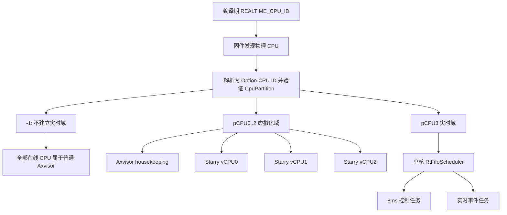
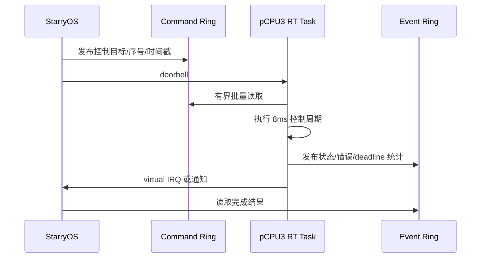

# 智能化工控中基于虚拟化的混合系统部署及联动实现技术方案

## 1. 项目概述

### 1.1 项目背景

本项目面向“智能化工控中基于虚拟化的混合系统部署及联动实现”这一赛题场景，核心是在同一硬件或仿真平台上同时承载智能侧客户机与隔离实时 CPU 上的控制任务，并通过 Axvisor 的 AMP 隔离方案实现资源隔离、稳定通信和联动控制。与传统将控制、智能和业务分散到多套设备的部署方式相比，该方案更强调在统一底座上完成系统整合，既要保证通用负载可运行，也要保证实时控制具备确定性，还要让 AI 推理真正进入控制闭环。

从赛题要求看，本次攻关不是单点功能开发，而是围绕三个相互衔接的任务展开：任务一解决实时性与隔离问题，任务二解决客户机间通信与协议问题，任务三在前两项能力基础上完成 AI 与控制联动的应用展示。因此，本方案不把三个任务写成并列功能，而是将其组织为“底座、链路、应用”三层递进关系。

### 1.2 赛题三项任务理解

任务一提供 Axvisor 自身的实时运行保障，包括实时 CPU 预留、智能侧 vCPU 与实时侧 CPU 隔离、中断与定时器路径处理、板级设备访问和调频归因优化，目标是让 Axvisor 在 AI guest、I/O 和实时控制任务并存时仍保持可接受的时延和稳定性。

任务二负责把智能侧与实时侧连接起来，建立可演进的控制通信链路，并在其上形成应用层协议、可靠性机制和自动化测试方法，使控制指令、状态回传和异常处理都有明确的消息语义。

任务三把前两项能力组合成实际应用，令智能侧客户机完成 AI 推理后，把结果送达 Axvisor 实时侧控制路径，由预留实时 CPU 上的控制任务执行动作并回传状态，形成可观测、可测量、可复现的闭环。

这种分工的意义在于，任务一和任务二属于基础能力建设，任务三属于能力落地应用。如果没有任务一，系统无法稳定运行，联动闭环的时延和抖动也无法满足验收要求；如果没有任务二，智能侧与控制侧之间缺少标准化、可验证的数据通道；如果没有任务三，前两项工作只能停留在底层实现，无法体现赛题要求的联动价值。

### 1.3 总体目标与验收口径

项目总体目标是构建一套面向工控场景的虚拟化混合系统方案，使 Linux/StarryOS 智能侧客户机与 Axvisor 预留实时 CPU 上的控制任务能够在同一平台上稳定协同工作，并完成 AI 驱动控制的端到端展示。对应验收口径包括：

- 系统能启动、能部署、能在多客户机环境下稳定运行。
- 客户机之间能可靠通信，通信行为可通过协议和测试数据复现。
- AI 推理到控制执行的链路可闭环，端到端时延可测。
- 源码、配置、PR、测试记录和文档齐备，能够支撑复现和评审。

### 1.4 三任务关系说明

三项任务之间的关系可以概括为“底座、链路、应用”三层结构。任务一是 Axvisor 实时性与隔离底座，优化虚拟化运行时自身在 AMP 场景下的关键路径；任务二是通信链路，提供跨执行域的数据交换和协议封装；任务三是应用层闭环，在前两者基础上实现 AI 与控制的联动演示。

从整体方案看，任务一和任务二分别形成系统底座和通信链路，任务三在二者之上形成端到端应用闭环。这样既保留每个任务的独立技术边界，也形成从底层能力到上层应用的递进关系。

## 2. 总体架构设计


### 2.1 系统分层架构

系统整体划分为四层：硬件与仿真平台层、Axvisor 虚拟化与 AMP 隔离层、智能侧客户机与实时侧控制层、AI 联动应用层。

硬件与仿真平台层提供 QEMU 或开发板运行环境，包含 CPU、内存、定时器、中断控制器、网络设备、块设备以及可选 NPU/AI 加速资源。该层既用于本地快速复现，也用于板级验证。

Axvisor 虚拟化与 AMP 隔离层负责智能侧 VM 生命周期管理、vCPU 管理、地址空间隔离、虚拟设备管理、中断与定时器路径处理，并为实时控制预留独立 CPU。该层是任务一的主要承载位置，也是任务二和任务三能够运行在同一平台上的基础。

智能侧客户机与实时侧控制层包含 StarryOS/Linux 智能侧 guest 和 Axvisor 实时侧控制路径。智能侧客户机承载视觉或语音感知、模型推理、协议客户端和状态上报逻辑；实时侧控制路径运行在预留 CPU 上，承载 8ms 控制闭环、状态采集、动作执行和超时降级逻辑，不再额外启动一个控制侧 guest OS。

AI 联动应用层负责把推理结果转换为控制语义，并通过任务二提供的控制通道发送到实时侧。实时侧执行后返回状态、时间戳和异常码，形成端到端闭环。

```text
AI 联动应用层
  ├─ 智能侧：图像/传感输入 -> AI 推理 -> 控制指令生成
  └─ 控制侧：指令解析 -> 控制执行 -> 状态回传

智能侧客户机与实时侧控制层
  ├─ Linux/StarryOS 智能侧客户机
  └─ Axvisor 预留实时 CPU 上的 RT 控制任务

Axvisor 虚拟化与 AMP 隔离层
  ├─ 智能侧 VM/vCPU/地址空间/虚拟设备/中断与定时器
  └─ 实时 CPU 预留、板级外设访问、资源分配与共享测试入口

硬件与仿真平台层
  ├─ QEMU 多架构验证
  └─ 开发板/NPU/网络/块设备等外设资源
```

### 2.2 客户机角色划分

智能侧客户机负责计算密集型或系统服务型任务，典型职责包括输入数据采集、AI 模型加载、推理结果生成、控制策略封装、运行日志记录和异常上报。该客户机允许运行较完整的软件栈，重点强调功能完备性和模型运行能力。

实时侧控制路径负责实时性要求更高的控制任务，典型职责包括接收智能侧指令、执行控制动作、采集控制状态、返回执行结果和处理超时降级。该路径运行在隔离出的 CPU 上，由 Axvisor 直接承载实时任务，强调确定性、低抖动和可隔离运行，不依赖控制侧 guest OS 调度。

Axvisor 作为统一底座，负责把智能侧 guest 与实时侧 CPU 放在同一平台上协同运行，并通过资源配置、中断路径控制、实时 CPU 预留和设备访问边界降低相互干扰。

### 2.3 数据流与控制流

端到端链路从智能侧输入开始，经 AI 推理得到识别结果或决策结果，再由协议模块转换为控制消息。控制消息通过 RT mailbox、console 原型或后续结构化控制通道发送到 Axvisor 实时侧。实时侧控制任务执行控制动作，并将执行状态、错误码和时间戳返回智能侧。智能侧根据回传结果记录闭环状态，也可以在失败、超时或置信度不足时触发降级策略。

```text
输入数据
  -> 智能侧客户机 AI 推理
  -> 应用层协议封装
  -> 控制通道
  -> Axvisor 实时侧接收
  -> 控制执行
  -> 状态回传
  -> 智能侧闭环记录与策略调整
```

### 2.4 三任务依赖关系

任务一是所有任务的运行基础，直接决定 Axvisor 能否在智能侧 guest 与实时侧任务并存时保持稳定，资源能否隔离，关键路径能否保持低抖动。任务二依赖任务一提供的隔离运行环境打通通信链路。任务三依赖任务一和任务二，只有当 Axvisor 实时路径稳定且通信协议可靠后，AI 推理结果才可以进入控制闭环。

因此，验收顺序也应保持一致：先验证虚拟化底座和隔离能力，再验证客户机通信链路，最后验证 AI 联动应用闭环。

## 3. 任务一：Axvisor 实时性与隔离基础设计

### 3.1 任务目标

任务一的目标是为同一硬件上的智能侧 guest 和实时控制任务建立可解释、可验证的隔离底座。智能侧需要运行 StarryOS、Python、NPU 推理、文件系统和网络协议等通用负载；控制侧则需要稳定执行双轮足机器人的 8ms 平衡闭环。两类负载的实时性要求不同，不能简单把控制任务放进普通 guest 中，再依赖 vCPU 调度、虚拟中断和普通宿主任务共同竞争 CPU 时间。

本方案以 4 个物理核心为基准，将 `pCPU0..2` 划为虚拟化域，固定承载 Axvisor 普通运行时和 StarryOS 的 3 个 vCPU；将 `pCPU3` 划为实时域，直接运行 Axvisor/ArceOS 宿主中的实时任务。实时任务不经过 guest world switch，也不与 vCPU 共享 run queue。该形态属于单一 Axvisor 镜像内的静态 CPU 分区式 AMP：CPU 和调度域被隔离，但实时任务仍与 Axvisor 共享宿主地址空间，因此第一阶段提供的是调度与资源所有权隔离，而不是双镜像 AMP 的故障隔离。

任务一的成功标准不是“创建一个高优先级任务”，而是同时满足以下条件：

- StarryOS 看到 3 个 vCPU，且对应 vCPU task 只能运行在 `pCPU0..2`。
- 实时任务只能运行在 `pCPU3`，不会迁移到虚拟化域。
- 普通 Axvisor worker、虚拟设备后端、文件系统、网络和控制台任务不能进入 `pCPU3`。
- 非实时外部 IRQ 不路由到 `pCPU3`；该核只处理本地实时 timer、实时设备 IRQ 和明确允许的 doorbell/IPI。
- 在 StarryOS CPU、网络和存储压力下，实时周期任务仍能报告可复现的最大唤醒时延、执行抖动和 deadline miss 数。
- 编译期将实时核 ID 配置为 `-1` 时不建立实时域，也不运行实时任务；现有 Axvisor 的 CPU、VM、IRQ 和测试行为保持不变。

### 3.2 验证 bare、guest 与 AMP 方案实时性差异

任务一先对比 `bare RTOS`、`RTOS guest` 和 `Axvisor AMP` 三种路径。`bare RTOS` 表示 QEMU 直接运行 FreeRTOS，是没有虚拟化隔离时的性能基线；`RTOS guest` 表示 FreeRTOS 作为 Axvisor guest 运行，能够获得 VM 隔离，但调度、中断和抢占仍经过 vCPU、虚拟中断和 hypervisor 返回链路；`Axvisor AMP` 则把高频实时控制从 guest 中移出，在 Axvisor 侧保留实时执行资源，只让智能侧 guest 通过低频命令影响控制目标。


从 QEMU noload 数据看，RTOS guest 相对直接 RTOS 仍保留约 93.9% 到 99.9% 的基线效率，说明 Axvisor guest 方案本身具备可接受的基础开销。但这也说明调度、中断和抢占路径仍处在虚拟化链路中；对于双轮足 8ms 平衡闭环，这部分抖动会直接进入控制周期预算。QEMU 下 Axvisor AMP 路径的任务切换、抢占、中断和信号量平均耗时处于 2.859us 到 5.263us 区间，验证了把控制路径从 guest 中拆出来的可行性。


真机 RK3588 上，Axvisor AMP 路径进一步体现出实时控制优势：任务切换平均 `1066 ns`，抢占平均 `1023 ns`，中断平均 `654 ns`，信号量 shuffle 平均 `1022 ns`，1ms tick jitter 为 `4084 ns`。`4084 ns` 只占 8ms 控制周期约 `0.0511%`，为 EKF/LQR 控制计算、MPU6050 读取、Lingkong 电机 UART 事务和安全降级逻辑留下主要时间预算。

基于上述验证，任务一选择 AMP 而不是“控制侧 RTOS guest”作为第一阶段实时控制方案。保持现状的 RTOS guest 方案虽然隔离边界更清楚，但控制周期仍经过 vCPU 调度、VM exit/entry 和虚拟中断；完全独立的裸机 RT 镜像具有更强故障隔离，却需要重新设计固件启动、内存划分、中断控制器所有权和跨镜像通信。静态 CPU 分区式 AMP 能复用现有 `axtask`、AxVM vCPU affinity 和 IRQ framework，以较小改动先形成可测量闭环。

[#2160](https://github.com/rcore-os/tgoskits/pull/2160) 已建立 Axvisor 实时 CPU 所有权和 secondary CPU 启动分流的设计基础，但其独立 RT runtime 路线明确不初始化普通 `ax_task`。本方案以 [#2161](https://github.com/rcore-os/tgoskits/pull/2161) 的 RT FIFO 为调度基础，因此集成时不能直接让 `pCPU3` 跳入无调度器的静态 park/executor 路径，而应为 `pCPU3` 保留一个受限的单核 `axtask` 调度域。#2160 的 CPU 所有权、VM placement 校验和资源排除原则继续复用；RT CPU 是否初始化 `axtask` 则由本方案重新明确。

### 3.3 ArceOS 实时性能力缺口

AMP 方案确定后，还需要检查预留 CPU 上的 ArceOS/实时任务能力是否足够。当前 ArceOS 默认 FIFO 调度器适合作为普通协作式 ready queue，但它只按入队顺序选择任务，不表达“高优先级任务优先运行”的实时语义。即使任务结构中已有 `sched_priority` 字段，默认 FIFO 也不会读取这个字段；高优先级任务如果后入队，仍可能排在先入队的低优先级任务之后。

另一个问题是锁等待路径没有真正使用优先级。sleepable mutex 原有实现只记录 `owner_id` 和 wait queue，高优先级任务等待低优先级 owner 持有的 mutex 时，不会把优先级捐赠给 owner。如果此时中优先级任务持续运行，就会出现典型优先级反转：高优先级控制任务被低优先级持锁者间接阻塞，而低优先级持锁者又被中优先级任务抢占，导致 mutex 无法及时释放。

这些缺口说明 mailbox 只能作为智能侧到实时侧的命令通道，不能替代调度器和同步原语的实时语义。完整实时路径需要同时满足三个条件：ready queue 按有效优先级选择任务；timer tick 能在更高优先级任务 ready 时请求重调度；mutex 争用时能让 owner 临时继承 waiter 的优先级。

单核 RT FIFO 也不能单独完成 AMP 隔离。当前普通任务默认可以使用完整 CPU mask，vCPU affinity 只约束 vCPU task，自身不会排除控制台、块设备、网络、VM 管理和其他后台任务。若这些任务仍能进入 `pCPU3`，或者普通设备 IRQ 仍路由到该核，即使实时任务优先级最高，也会受到硬中断、共享锁、内存分配和 cache/memory bus 争用影响。因此任务一必须把 CPU、任务、IRQ、内存和通信所有权作为一个整体设计。

### 3.4 方案比较与架构选择

| 方案 | 实时路径 | 优点 | 主要代价 | 结论 |
| --- | --- | --- | --- | --- |
| StarryOS/RTOS guest | 控制任务运行在 vCPU 中 | VM 隔离清楚，软件栈完整 | 经过 vCPU 调度、虚拟中断和 VM exit/entry | 保留为对照基线 |
| 全部物理核使用普通 SMP 调度 | RT task 与 vCPU/host task 共享 CPU 集 | 改动最少 | 无法给出可解释的最坏时延边界 | 不采用 |
| 静态 CPU 分区 + 单核 RT FIFO | `pCPU0..2` 运行 vCPU，`pCPU3` 运行宿主 RT task | 复用现有调度、绑核和 IRQ 能力，易形成最小闭环 | 与 Axvisor 共享地址空间和部分硬件资源 | 第一阶段采用 |
| 独立 RT runtime/静态 executor | `pCPU3` 不初始化 `axtask` | 热路径更小，隔离更强 | 无法直接复用 #2161/#2162，需独立 timer、executor 和同步模型 | 后续演进方案 |
| 独立裸机 RT 镜像 | 固件分别启动 Axvisor 与 RTOS | 故障和内存隔离最强 | 启动、内存、IRQ、设备和通信所有权改造最大 | 严格硬实时阶段评估 |

第一阶段采用“静态 CPU 分区 + 单核 RT FIFO”。它并不承诺完整的多核全局实时调度：实时调度域只有编译期指定的一个物理核，因此无需跨 CPU RT push/pull、远程优先级抢占或 RT task 迁移。`pCPU0..2` 上的 vCPU 和 housekeeping task 仍是普通任务，不能通过提高优先级进入实时域。实时任务调用方不直接构造或保存 CPU mask，而是通过专用创建函数进入已经确定的 realtime domain。

### 3.5 CPU 分区、启动和调度设计

CPU 分区必须是系统唯一事实源，不能由 VM 配置、调度器、IRQ 和设备模块分别硬编码“最后一个核”。实时核由编译期配置指定，例如生成的构建配置项 `REALTIME_CPU_ID`：非负值表示物理逻辑 CPU ID，`-1` 表示禁用实时域。负数哨兵只允许存在于构建配置解析边界；进入 Rust 运行时后必须立即转换成 `Option<CpuId>`，不能让 `-1` 继续以裸整数参与 mask、索引或 IRQ affinity 计算。

建议在 Axvisor/runtime 边界定义经过验证的分区对象：

```rust
pub struct CpuPartition {
    virtualization: AxCpuMask,
    realtime_cpu: Option<CpuId>,
}
```

4 核 AMP 配置示例为：

```text
REALTIME_CPU_ID = 3

online_cpu_mask         = 0b1111
realtime_cpu            = Some(pCPU3)
realtime_cpu_mask       = 0b1000  # 由 CPU ID 统一派生
virtualization_cpu_mask = 0b0111  # online mask 扣除实时核后统一派生

Starry vCPU0 -> 0b0001
Starry vCPU1 -> 0b0010
Starry vCPU2 -> 0b0100
RT task      -> spawn_realtime(...) 自动选择 pCPU3
```

禁用配置为：

```text
REALTIME_CPU_ID = -1

realtime_cpu            = None
realtime_cpu_mask       = 0b0000
virtualization_cpu_mask = online_cpu_mask
spawn_realtime(...)     = Err(RealtimeDisabled)
```

构建脚本负责解析整数并生成常量，SMP 初始化阶段再用平台实际拓扑验证该 ID。启用实时域时，ID 必须位于 online CPU 集、不能超过构建期 CPU capacity，且第一阶段不能选择 BSP；禁用时必须恰好为 `-1`，其他负数均视为配置错误。非法配置应在启动 VM 或创建实时任务前失败，不能静默裁剪、改选最后一个核或回退到完整 CPU mask。验证成功后，由 `CpuPartition` 统一派生 virtualization mask、realtime mask、VM 可用 CPU 集和 IRQ affinity，其他模块不得再次解释原始整数配置。



所有 secondary CPU 先完成 per-CPU area、trap vector、local interrupt controller 和 CPU-local timer 所需的最小初始化，再读取已经验证的 CPU ownership。普通 CPU 完成现有 Axvisor SMP、IPI、block runtime 和普通 scheduler 初始化；指定的实时 CPU 只建立受限 RT run queue、RT timer 和通信端点，不发布为普通任务可选 CPU。`REALTIME_CPU_ID=-1` 时不创建 RT run queue 或 RT worker，所有 online CPU 都沿用普通初始化路径。普通 runtime 的 ready 计数、IPI readiness、block hctx 扩展和 `available_parallelism()` 必须使用 virtualization domain，而不是未经分区的物理 CPU 总数。

AxVM 已支持通过 `phys_cpu_sets` 给 vCPU task 设置 CPU mask。启用示例中的 CPU3 实时域时，VM 配置把 3 个 vCPU 分别固定到 `0b0001`、`0b0010` 和 `0b0100`，并在 `build_axvm_config()` 或等价的 placement 校验边界拒绝任何包含派生 realtime mask 的 vCPU 配置。`REALTIME_CPU_ID=-1` 时不施加实时域排除，VM placement 继续按现有在线 CPU 集校验。

普通 Axvisor task 的默认 mask 必须取自 virtualization domain。实时任务只能通过类似以下专用入口创建：

```rust
pub fn spawn_realtime(
    task: TaskInner,
    priority: RtTaskPriority,
) -> Result<AxTaskRef, SpawnRealtimeError>;
```

该函数从已经验证的 `CpuPartition` 读取唯一 realtime CPU，在任务第一次进入任何 run queue 前原子地完成单核 affinity、RT priority 和任务类别初始化，然后直接加入对应 RT run queue。调用方不接收 CPU ID 或 `AxCpuMask` 参数，也不需要知道实时核是哪一个。实时域未启用时返回 `SpawnRealtimeError::RealtimeDisabled`；配置与运行时拓扑不一致时在 SMP 初始化阶段已经失败，不能在创建任务时临时换核。普通 `spawn`/`spawn_task` 也不得通过后续 `set_cpumask()` 迁移到 realtime CPU。

### 3.6 RT FIFO、优先级继承与实时任务约束

针对 ArceOS 调度缺口，[#2161](https://github.com/rcore-os/tgoskits/pull/2161) 在 `components/axsched/src/rt_fifo.rs` 中新增 `RtFifoScheduler`。它通过 `RtPriority::rt_priority()` 获取任务有效优先级，并用 `(Reverse(priority), enqueue_order)` 维护 ready queue。这样高优先级任务总是先于低优先级任务被选中，同优先级任务仍保持 FIFO 入队顺序，符合实时 FIFO 的基本语义。

`sched-rt-fifo` 通过 feature 接入 `axtask` 和 `ax-std`。当前实现限定在 `SMP=1`；本方案通过单核 realtime domain 保持这一约束，而不是把它解释为整个 Axvisor 只能使用一个 CPU。集成实现需要让 scheduler 选择成为 run queue/domain 属性，或者提供等价的受限 RT run queue，避免强迫 `pCPU0..2` 的普通任务也承担 RT FIFO 语义。若第一阶段为了缩小改动暂时让所有 run queue 使用同一 scheduler，则必须用 CPU partition 阻止 RT task 和普通 task 跨域，并把“按 domain 选择 scheduler”记录为后续收敛项。

针对 mutex 优先级反转，[#2162](https://github.com/rcore-os/tgoskits/pull/2162) 在 #2161 的 RT FIFO 基础上为 `axtask` mutex 路径加入 priority inheritance。它区分基础优先级和捐赠优先级，使高优先级 waiter 阻塞时可以临时提升低优先级 owner 的 effective priority；owner unlock 后再清理或重算 donation，并通过 ready queue 重排让调度器观察到新的有效优先级。

实时任务热路径还必须满足以下约束：

- 启动阶段预分配 stack、队列、消息和统计区，进入周期循环后不调用全局 allocator。
- 不访问文件系统，不执行同步串口打印，不调用 VM manager 或普通虚拟设备后端。
- 不获取可能由 virtualization domain 持有的 sleepable lock；确需共享 mutex 时必须纳入 #2162 的 donation 链和锁顺序验证。
- 不暴露 RT task 的 CPU mask 选择，不支持跨核迁移；实时任务创建入口自动使用编译期指定并经 SMP 初始化验证的唯一实时核。
- 周期、deadline 和优先级使用类型化配置，优先级范围在入队前验证，不能把任意 `isize` 直接作为长期外部配置契约。

### 3.7 IRQ、内存和设备所有权

CPU 隔离只有与 IRQ 和设备隔离同时成立时才有实时意义。`pCPU3` 只允许接收 RT local timer、RT-owned device IRQ 和 host/RT doorbell；网卡、块设备、控制台、guest 虚拟设备后端和其他普通外部 IRQ 必须固定在 virtualization mask。IRQ affinity 通过 IRQ framework 的类型化 `IrqAffinity` 设置，不能在设备或 Axvisor 代码中用固定 GIC/PLIC/APIC 数字推导路由。

RT-owned device 必须具有唯一 owner：普通设备 probe 不得同时绑定其 MMIO range 和 IRQ，启动失败时也不能静默退回普通 host driver。第一阶段可以只验证模拟 IRQ 或 local timer；真实 MPU6050、UART 或电机控制设备接入应作为独立阶段，补充设备 reset、enable、teardown 和错误恢复语义。

RT stack、mailbox ring、统计区和控制状态应从启动时预留的固定内存池分配。共享 cache line 需要对齐，发布命令和结果使用 Release/Acquire；纯计数器只有在不承担同步语义时才可使用 Relaxed。静态绑核不能隔离 LLC、DRAM controller、interconnect、固件中断和电源管理，因此板卡测试前只能承诺软件调度与 IRQ 隔离，不能直接宣称严格硬实时。

### 3.8 智能侧与实时侧通信

StarryOS 与实时任务之间使用两条有界单向通道：`Starry -> RT command ring` 和 `RT -> Starry event ring`。每条通道采用单生产者、单消费者模型，具有固定容量、消息边界、序号、长度和状态字段；共享 ring 是数据事实源，doorbell 只表示“可能有新数据”。



队列满、消息非法、序号跳变和对端未就绪必须产生明确结果或 drop/error 统计，不能无限自旋或静默覆盖。RT 侧不得在通知路径分配或等待普通 sleepable lock。优先复用 AxVM 已有 IVC/SPSC 协议与生命周期；只有其消息边界、映射或通知语义无法满足实时路径时，才新增窄的 RT mailbox capability，避免维护两套重复 ring 状态机。

### 3.9 实施阶段与回滚边界

| 阶段 | 交付内容 | 可观察验收 | 回滚方式 |
| --- | --- | --- | --- |
| 1 | 合入并修复 #2161 的 RT FIFO、测试发现和 CI 执行链 | scheduler 单元测试及单核 QEMU case 实际执行 | 关闭 `sched-rt-fifo` |
| 2 | 增加编译期 `REALTIME_CPU_ID`、`CpuPartition`、SMP 拓扑验证和 vCPU placement 拒绝逻辑 | `3` 派生 CPU3 实时域；`-1` 保持全部 CPU 为普通域 | 配置为 `-1` |
| 3 | 增加 `spawn_realtime()` 并建立指定核的受限 RT run queue，排除普通 task、IPI readiness 和 block hctx | 调用方无需 mask；RT 心跳只出现在指定核，VM/shell 正常 | 配置为 `-1` 后不创建 realtime domain |
| 4 | 完成 IRQ affinity、RT timer、预分配内存和统计 | 非 RT IRQ 不进入指定实时核，timer/deadline 统计递增 | 禁用 RT IRQ route 和 executor |
| 5 | 接入 command/event ring 与 doorbell | host/guest 能双向交换有序消息，满队列可观察 | 禁用 mailbox feature |
| 6 | 合入 #2162 或等价 PI mutex，并接入真实控制任务/设备 | 优先级反转回归通过，8ms 控制闭环运行 | 回退到无共享 mutex 的静态控制路径 |

每个阶段都必须保持默认配置可构建、可运行，不允许先合入闲置公共 API 或返回假成功的占位路径。改变 secondary CPU 启动顺序、CPU ownership、IRQ route 或推荐调试方法时，同步更新 `arch-platform-porting` 技能或其引用文档。

### 3.10 验证矩阵与实时性口径

| 风险或功能声明 | 验证层级 | 必须观察的结果 |
| --- | --- | --- |
| 编译期实时核配置正确 | 构建/单元测试 | `-1` 转换为 `None`；有效 ID 派生唯一 mask；其他负数、越界、离线或 BSP ID 被拒绝 |
| 实时任务创建边界 | `axtask` 单元/集成测试 | `spawn_realtime()` 自动绑到指定核；禁用时返回 `RealtimeDisabled`；调用方无法传入 mask |
| RT FIFO 语义 | `axsched` 单元测试 | 高优先级先运行、同优先级 FIFO、仅更高优先级触发 RT 抢占 |
| 4 核启动分流 | Axvisor QEMU SMP4 | virtualization CPU host ready，指定 CPU RT ready，无 readiness 死等；`-1` 时 4 核均走普通路径 |
| Starry vCPU 隔离 | Axvisor + StarryOS SMP3 | vCPU task 从未在指定实时核执行 |
| housekeeping 隔离 | QEMU instrumentation/板卡统计 | 普通 task、block hctx、console worker 从未进入指定实时核 |
| IRQ 隔离 | QEMU 模拟 IRQ/板卡 | 非 RT IRQ 计数在指定实时核始终为零 |
| 通信正确性 | IVC/mailbox 集成测试 | 顺序、边界、满队列、重启和超时行为确定 |
| PI mutex | 确定性三任务回归 | 中优先级任务不能长期间接阻塞高优先级 waiter |
| 8ms 控制闭环 | RK3588 压力测试 | 报告最大 wake-up latency、最大 jitter、WCET 和 deadline miss，而非只报平均值 |

实时性结果必须记录硬件型号、CPU 频率策略、测试时长、样本数、StarryOS 压力负载、IRQ 配置和统计方法。平均值只能说明常见开销，不能替代最大值、分位数和 deadline miss。建议至少分别测试空载、guest CPU 压力、网络压力、存储压力和组合压力，并以 bare RTOS、RTOS guest 和 AMP 三条路径使用同一测量定义进行对照。

| PR | 解决的问题 | 关键机制 | 验证重点 |
| --- | --- | --- | --- |
| [#2160](https://github.com/rcore-os/tgoskits/pull/2160) | Axvisor 层缺少 CPU 所有权边界 | CPU owner、secondary 分流、VM placement 与资源排除设计 | 本方案复用其分区原则，但 RT CPU 保留受限 `axtask` 调度域 |
| [#2161](https://github.com/rcore-os/tgoskits/pull/2161) | 默认 FIFO 不支持 RT 优先级 | `RtFifoScheduler` 按有效优先级和 FIFO 顺序选任务 | 高优先级先运行、同优先级 FIFO、tick 抢占判定 |
| [#2162](https://github.com/rcore-os/tgoskits/pull/2162) | mutex 未使用优先级，存在优先级反转 | base/donated/effective priority，owner donation，ready queue 重排 | 高优先级 waiter 不被中优先级任务长期间接阻塞 |

三项改动并非无需适配即可直接叠加：#2160 当前独立 RT executor 方向与 #2161/#2162 的 `axtask` 依赖存在架构差异。本方案选择以 #2161 为第一阶段调度基础，复用 #2160 的 CPU 所有权和隔离原则，将 realtime CPU 改造成受限单核 `axtask` domain，再接入 #2162 的有效优先级和 donation。这样才能形成“CPU 分区、RT 调度、锁等待、IRQ 隔离和有界通信”一致的完整链路，并支撑任务三中双轮足机器人 8ms 平衡闭环。

### 3.11 PR #2175 交付映射与复现入口

本阶段实现已汇总到上游 PR [#2175](https://github.com/rcore-os/tgoskits/pull/2175)，基线为 `rcore-os/tgoskits` 的 `dev` 分支。PR 的实现内容与任务一的关系如下：

| 交付内容 | 代码/配置位置 | 验收意义 |
| --- | --- | --- |
| 编译期实时核选择 | `scripts/axbuild/src/axvisor/build/`、各 `build-*.toml` 的 `realtime_cpu_id` | 不依赖环境变量，`-1` 可关闭实时域 |
| 实时任务 API 与 RT FIFO | `os/arceos/modules/axtask`、`components/axsched/src/rt_fifo.rs` | 创建任务时自动绑定实时核，不暴露 CPU mask |
| AArch64 Starry AMP | `test-suit/axvisor/normal/qemu-amp/starry-host-amp/` | 验证 Starry guest 与 host RT 同时启动 |
| RK3588 板级入口 | `test-suit/axvisor/normal/board-orangepi-5-plus/starry-host-amp/` | 提供 OrangePi 5 Plus 的构建和运行配方 |
| guest 设备与 DMA 边界 | `virtualization/axvm`、`os/axvisor/configs/vms/qemu/aarch64/starry-smp1.toml` | 保留 FDT 控制台、隔离 GIC、保证 NVMe DMA |

QEMU 联合验证命令：

```bash
cargo xtask starry build --config test-suit/axvisor/guest-build/starry-aarch64-amp.toml --smp 1
cargo xtask axvisor test qemu --arch aarch64 -g normal -c qemu-amp/starry-host-amp
```

RK3588/OrangePi 5 Plus 运行入口：

```bash
cargo xtask axvisor build --arch aarch64 \
  --config test-suit/axvisor/normal/board-orangepi-5-plus/starry-host-amp/build-aarch64-unknown-none-softfloat.toml
cargo xtask axvisor test board --board orangepi-5-plus-starry-host-amp
```

板级命令需要 OrangePi-5-Plus 板卡租约及现有 Linux rootfs/guest 资源；QEMU 输出仅作为软件隔离和启动契约证据，不能替代 RK3588 实测的最大延迟、抖动和 deadline miss 数据。

### 3.11 当前实现与 AArch64 QEMU 证据

已实现版本的构建入口是 `test-suit/axvisor/guest-build/starry-aarch64-amp.toml`，其中通过 `realtime_cpu_id = 3` 在编译期选择实时核；配置为 `-1` 时不创建实时域。Starry 联合用例使用 `qemu-system-aarch64` 的 `cortex-a72` 和 `aarch64-unknown-none-softfloat` 目标，guest FDT 保留 `/chosen`、`/aliases`，GICD/GICR 采用 partial passthrough，并对模拟 MMIO 自动打孔。NVMe DMA 使用 `MAP_RESERVED` 恒等映射的 guest RAM，避免 `MAP_ALLOC` 仅有 CPU 映射的问题。

实时任务通过 `spawn_realtime(...)` 创建，入口内部完成 affinity、优先级和首次入队前的任务元数据初始化；调用方不传 CPU ID 或 mask。benchmark 输出统计后保持驻留，专用核不会因任务退出而落回普通调度路径。

联合用例实际输出：

```text
STARRY_AMP_GUEST_READY
AMP_RT_RESULT source=host samples=1000 period_us=1000 p50_us=0 p99_us=0 max_us=14 missed=0
```

复现命令：

```bash
cargo xtask starry build --config test-suit/axvisor/guest-build/starry-aarch64-amp.toml --smp 1
cargo xtask axvisor test qemu --arch aarch64 -g normal -c qemu-amp/starry-host-amp
```

该结果只证明 QEMU 下的启动、placement、调度与 DMA 契约；真实板卡仍需补测设备 IRQ 归属、缓存/内存总线竞争、电源管理中断和长时间 deadline miss。

RK3588/OrangePi 5 Plus 的运行构建已补充到
`test-suit/axvisor/normal/board-orangepi-5-plus/starry-host-amp/`。该配置在
编译期固定 `realtime_cpu_id = 3`，启用 Rockchip SDHCI/MMC 驱动并复用现有
Starry SMP1 VM。板卡运行使用 `cargo xtask axvisor test board
--board orangepi-5-plus-starry-host-amp`，需要先取得 OrangePi-5-Plus 板卡租约并按
板卡指南准备 Linux rootfs 和 guest 资源；在实板完成压力测试前，不把 QEMU 的
`AMP_RT_RESULT` 数值当作 RK3588 的实时性结论。

## 4. 任务二：客户机通信与协议设计

### 4.1 目标、范围与八项变更的依赖关系

任务二的目标是在同一 Axvisor 实例承载的 StarryOS/Linux 智能侧客户机与 ArceOS/RTOS 控制侧客户机之间，建立一条可启动、可寻址、可观测、可恢复的双向 IPv4/TCP 通信链路，并在链路之上提供控制指令、状态回传、心跳和错误通知的应用层语义。业务数据只经过标准网卡、Ethernet、IPv4 和 TCP；共享内存、HyperCall、裸 MMIO 和 vsock 不进入业务数据路径。

本任务不是孤立新增一个 socket 示例，而是由 8 项已提交变更逐层组成：

| 层次 | PR/提交 | 设计职责 | 对后续层的保证 |
| --- | --- | --- | --- |
| 启动与设备前置 | [#1926](https://github.com/rcore-os/tgoskits/pull/1926) | 保留 guest FDT 中 PSCI 信息 | 两个 guest 能按预期启动，vCPU/定时器基础路径不被破坏 |
| 虚拟设备前置 | [#1935](https://github.com/rcore-os/tgoskits/pull/1935) | 提供 VirtIO-MMIO 设备核心 | 客户机镜像和虚拟设备拥有稳定的 MMIO 接入基础 |
| 二层网络前置 | [#1927](https://github.com/rcore-os/tgoskits/pull/1927) | 双 guest VirtIO-net、MAC 和进程内 L2 switch | 两个客户机拥有隔离的网卡端点和可交换的二层帧路径 |
| IP 传输 | [#2155](https://github.com/rcore-os/tgoskits/pull/2155) | StarryOS/ArceOS QEMU VM、VirtIO-net 和拓扑配置 | 应用程序可以使用 `10.0.42.0/24` 私有子网进行 TCP 通信 |
| 应用协议 | [#2156](https://github.com/rcore-os/tgoskits/pull/2156) | GIPC 固定头帧、两端程序和编解码 | 控制、状态、错误和心跳具有稳定的线协议 |
| 可靠性 | [#2157](https://github.com/rcore-os/tgoskits/pull/2157) | TCP 分帧、超时、重连、序列窗口和恢复 | 字节流断连或重复请求不会被静默当作成功 |
| 验证 | [#2158](https://github.com/rcore-os/tgoskits/pull/2158) | QEMU 启动、rootfs 注入、日志和指标聚合 | 链路行为可由脚本复现并以非零退出码传递失败 |
| 启动补齐与观测 | [#2159](https://github.com/rcore-os/tgoskits/pull/2159) | StarryOS 网卡初始化、多请求和错误/恢复指标 | 文档地址成为实际启动配置，长运行结果可量化比较 |

八项变更的共同边界是任务二通信底座：它们不实现具体 AI 模型、不规定某种摄像头或 NPU 驱动，也不把控制动作绑定到某个板卡外设；任务三只需把推理结果编码到已有 payload，并使用本章定义的请求/响应流程。

#### 4.1.1 成功标准

任务二以可观察的端到端结果而不是单一模块编译成功作为完成标准：两个 guest 必须分别获得固定 MAC 和 IPv4 地址；StarryOS 必须能向 ArceOS TCP 4242 发送完整 GIPC CONTROL；ArceOS 必须完成 framing、CRC 和 sequence 校验并返回同序列 STATUS；断连后客户端必须按有限预算重新建连；运行结束必须给出请求数、成功数、应用错误、传输失败、重连、恢复、延迟和有效载荷吞吐。任一层失败都必须通过 `GIPC_*_ERROR`、`GIPC_STARRY_TIMEOUT` 或进程非零状态显式传播。

#### 4.1.2 设计选择与替代方案

| 方案 | 是否作为主通道 | 选择理由或排除原因 |
| --- | --- | --- |
| VirtIO-net + Axvisor 内部 L2 switch + TCP | 是 | 两端均经过标准 IP 协议栈；拓扑封闭、地址固定、无宿主网络依赖；TCP 适合控制指令和状态响应 |
| UDP/IP | 否，协议保留扩展能力 | 可降低连接开销，但必须在应用层实现 ACK、超时重传、乱序和重复包处理；当前需求优先采用 TCP 简化主路径 |
| TAP/bridge/NAT | 非默认变体 | 便于接入宿主或外部设备，但引入主机网络配置、路由、防火墙和环境差异，不适合作为默认可复现路径 |
| 物理网口 | 板级扩展 | 接近真实部署，但会引入网卡驱动、线缆、交换机和现场网络策略，不作为 QEMU 基线 |
| vsock | 仅辅助候选 | 不计入主要 IP 网络通道，不能替代网卡、路由和 TCP/IP 验收 |
| 共享内存/HyperCall/裸 MMIO | 禁止作为业务通道 | 不经过 IP 协议栈，无法满足赛题对网络拓扑、路由、端口和传输可靠性的要求 |

协议 crate 刻意保持 `no_std` 和传输无关：它只拥有线格式、CRC、序列窗口和纯状态机，不访问 socket、guest memory、MMIO 或 hypervisor 服务。StarryOS C 程序与 ArceOS Rust 程序分别承担 OS glue，使线协议可以被独立测试，也避免把 Linux/POSIX API 依赖引入可复用协议层。


### 4.2 部署拓扑、地址规划与设备所有权

默认验收拓扑采用 Axvisor 进程内二层交换，不连接宿主桥、TAP、NAT 或物理上联。Axvisor 为每个 VM 创建一个 VirtIO-net MMIO 端点，并将端点注册到同一个内部交换机；交换机只在两个已注册端口之间转发 Ethernet 帧。每个端点的 MAC 地址在 VM TOML 中固定，避免 DHCP 或随机地址导致测试不可复现。

| 角色 | VM | 网卡 | MAC | IPv4/前缀 | 业务职责 |
| --- | --- | --- | --- | --- | --- |
| 智能侧 | StarryOS/Linux | `virtnet0` / `eth0` | `52:54:00:42:00:01` | `10.0.42.1/24` | 发起 CONTROL、HEARTBEAT，接收 STATUS/ERROR，汇总指标 |
| 控制侧 | ArceOS/RTOS | `virtnet0` / `eth0` | `52:54:00:42:00:02` | `10.0.42.2/24` | 监听 TCP 4242，校验请求，返回 STATUS/ERROR |
| 交换侧 | Axvisor | 内部 L2 switch | 不向 guest 暴露独立 IP | 二层转发 | 维护端口注册、帧转发和 guest 唤醒 |

StarryOS 启动时由 `/usr/bin/gipc-network-init.sh` 完成 `eth0` 配置：检查 `ip` 工具和接口存在，执行 `ip link set eth0 up`，配置 `10.0.42.1/24`，并尝试确保 `10.0.42.0/24` 直连路由存在。脚本在地址复核成功后打印 `GIPC_STARRY_NET_READY`，再由 autostart 启动客户端。当前脚本会容忍显式 `ip route add` 失败，因为内核通常在添加 /24 地址时自动生成直连路由；因此完整验收仍需保存 `ip route show dev eth0` 结果，不能只用 READY 标志替代路由证据。ArceOS 服务端发现 `eth0` 后调用 `ax_net::set_interface_ipv4(..., 10.0.42.2, 24)`，再绑定 `0.0.0.0:4242`。在当前仅有一个私网接口的 VM 中，实际可达面仍限定于该隔离子网，但代码本身不是“仅绑定 10.0.42.2”的 L3 白名单。

设备所有权保持在 Axvisor：VM 配置决定设备模型、MMIO 区域、IRQ 和 guest MAC；VirtIO-net 驱动负责队列和 DMA；交换机负责二层转发；guest 应用只拥有自己的 socket、协议会话和业务状态。块设备可以承载 rootfs 或镜像，但不承载 GIPC 业务数据。

#### 4.2.1 VM 资源与启动配置

| 配置项 | StarryOS VM | ArceOS VM |
| --- | --- | --- |
| VM ID | 1 | 2 |
| VM 名称 | `starry-virtio-net-peer` | `arceos-guest-ip-server` |
| vCPU | 1 个，绑定物理 CPU 1 | 1 个，绑定物理 CPU 2 |
| guest 内存 | `0x8000_0000` 起，大小 `0x4000_0000`（1 GiB） | `0x8000_0000` 起，大小 `0x2000_0000`（512 MiB） |
| 内核入口/加载地址 | `0x8020_0000` | `0x8020_0000` |
| DTB 加载地址 | `0x8000_0000` | `0x8000_0000` |
| 虚拟设备 | `virtnet0`, model=`virtio-net` | `virtnet0`, model=`virtio-net` |
| passthrough | 空 | 空 |

Axvisor host 使用 AArch64 `cortex-a72`、GICv3、4 vCPU 和 4 GiB QEMU 内存；board 配置同时列出两个 VM TOML。两个 guest vCPU 绑定不同物理 CPU，既避免配置冲突，也使通信延迟不会由同一 pCPU 上的串行调度人为造成。

#### 4.2.2 二层交换决策

内部 `VirtualSwitch` 维护 `SwitchPortId → port` 和 `MAC → SwitchPortId` 两个索引。端口注册会拒绝重复 ID 和重复 MAC；guest 发出的 Ethernet 源 MAC 必须与端口注册 MAC 一致，否则以 `SourceMacViolation` 丢弃并计数。已知单播只转发到目标端口；广播/组播复制给除源端口以外的活动端口，以支持 ARP；小于 14 字节的帧、已注销 generation 和未知上行单播分别计入独立 drop counter。

端口标识包含 VM ID、generation 和 device index，VM 重启后旧 generation 的端口不会冒充新实例；注册句柄和 active gate 负责让残留 `Arc` 安全失效。当前 Axvisor glue 虽能得到 switch 的 uplink 意图，但默认 GIPC 配置没有 host uplink worker、`-netdev`、TAP 或 bridge，因此主测试路径是完全位于 Axvisor 进程内的二层广播域。

### 4.3 网络启动时序与数据路径

启动时序必须先建立底层能力，再打开业务端口，避免客户端把“进程启动”误报为“网络可用”：

1. Axvisor 读取 board/QEMU/VM 配置，创建两个 VM、vCPU、地址空间、VirtIO-net MMIO 节点和内部交换机端口。
2. StarryOS guest 启动，完成 VirtIO-net 设备发现和 `eth0` 创建。
3. ArceOS guest 启动；应用进入 `main` 时先打印 `GIPC_RTOS_READY`，随后发现并配置 `eth0 = 10.0.42.2/24`，绑定成功后再打印 `GIPC_RTOS_LISTEN ip=10.0.42.2 port=4242`。前一个标志只表示应用入口已执行，后一个标志才证明网络和 listener 已就绪。
4. StarryOS profile 执行 autostart 和网络初始化脚本，打印 `GIPC_STARRY_NET_READY interface=eth0 address=10.0.42.1/24 peer=10.0.42.2`。两个 guest 并发启动，RTOS LISTEN 与 Starry NET READY 的相对先后不应作为协议正确性的前提。
5. StarryOS 客户端建立 TCP 连接，发送 CONTROL 或 HEARTBEAT；只有收到合法 STATUS/ERROR 后才记录一次应用层响应。
6. QEMU/测试运行器收集双方串口和客户端日志，`verify_metrics.py` 验证成功标志和正延迟/吞吐，`aggregate_metrics.py` 计算整体统计。

数据路径为：StarryOS socket → StarryOS TCP/IP → `eth0` VirtIO TX queue → Axvisor VirtIO-net backend → 内部 L2 switch → ArceOS VirtIO RX queue → ArceOS TCP/IP → TCP listener。响应沿相反方向返回。任何共享内存、HyperCall 或裸 MMIO 访问只属于设备实现或控制面，不属于业务 payload 路径。

#### 4.3.1 Host 构建与 rootfs 准备

`run-qemu-aarch64-starry-rtos-gipc.sh` 以 `ROOTFS_IMAGE` 为必需输入，并完成以下准备：

1. 从 `LLVM_OBJCOPY` 或 Rust sysroot 定位 `llvm-objcopy`；缺失时立即退出。
2. 使用 `cargo xtask arceos build -p arceos-guest-ip-server -c apps/arceos/build-aarch64-guest-ip-server.toml` 构建控制侧 ELF。
3. strip ELF 并转为可由 VM 配置装载的 raw binary。
4. 若未提供 `GIPC_STARRY_CLIENT_BIN`，使用宿主 C 编译器构建 `linux-client.c`。
5. 默认 `GIPC_INJECT_CLIENT=1`，通过 `debugfs` 向 rootfs 注入 `/usr/bin/gipc-starry-client`、`/usr/bin/gipc-network-init.sh` 和 `/etc/profile.d/99-gipc.sh`。设置 `GIPC_INJECT_CLIENT=0` 可使用预置镜像，避免重复修改 rootfs。
6. 调用 `cargo xtask axvisor qemu`，同时传入 board、QEMU 和 rootfs 配置。QEMU 总体运行门限为 180 秒。

#### 4.3.2 首包的 ARP、TCP 和 GIPC 路径

第一个 CONTROL 并不是直接从应用跳到对端 socket，而是依次经过以下协议和设备动作：

1. StarryOS 根据 `/24` 前缀判定 `10.0.42.2` 为直连邻居；邻居缓存为空时发送广播 ARP request。
2. Axvisor switch 将广播复制到除源以外的活动端口；ArceOS 回复单播 ARP response，switch 按固定目标 MAC 精确投递。
3. StarryOS 发起 TCP SYN，完成 SYN/SYN-ACK/ACK；客户端随后产生 40 字节 CONTROL（32 字节头 + 8 字节 payload）。
4. TCP/IP 栈把字节流封装为 IPv4/Ethernet 帧并提交 VirtIO TX descriptor chain。设备后端通过作用域 DMA 访问 descriptor，移除 `virtio_net_hdr` 后将 Ethernet frame 交给 switch。
5. switch 校验源 MAC、查找目标端口并将帧放入有界 ingress；目标端口通知 ArceOS vCPU。设备先把帧和 used ring 写回 guest，再触发 edge IRQ，保证 guest 观察中断时数据已可见。
6. ArceOS TCP 栈重组字节流；服务端先 `read_exact(32)`，校验固定头并获得 `payload_len`，再精确读取 payload 和验证 CRC。
7. 服务端生成同序列 STATUS，沿反向 VirtIO-net/IPv4/TCP 路径返回。客户端完成整帧校验后才计算成功 RTT。

最大 GIPC frame 为 `32 + 1200 = 1232` 字节；加上典型 20 字节 IPv4 头和 20 字节 TCP 头后为 1272 字节，低于常用 1500 字节 Ethernet MTU，因此最大应用帧在无额外 TCP option 的典型路径中不需要 IPv4 分片。当前 VirtIO-net profile 不依赖多队列、GSO、TSO 或 checksum offload。

#### 4.3.3 日志状态的精确定义

| 标志 | 精确含义 | 能否单独证明业务成功 |
| --- | --- | --- |
| `GIPC_RTOS_READY` | ArceOS 应用进入 `main` | 否，可能尚未配置 IP 或 bind |
| `GIPC_RTOS_LISTEN` | `eth0` 配置完成且 TCP bind 成功 | 否，只证明服务端 ready |
| `GIPC_RTOS_CONNECTED` | accept 到一个 TCP peer | 否，尚未证明 GIPC 帧合法 |
| `GIPC_RTOS_RECOVERABLE_ERROR` | 当前连接发生 EOF、解析或 I/O 错误，服务返回 accept | 否；故障注入中允许，正常基线应调查 |
| `GIPC_STARRY_NET_READY` | StarryOS 已发现接口并确认静态地址 | 否，未证明对端可达 |
| `GIPC_STARRY_STATUS` | 客户端收到同序列、magic/version/CRC 合法的 STATUS | 是，证明一次请求响应闭环 |
| `GIPC_STARRY_ERROR` | 收到 ERROR 或响应协议校验失败 | 否，作为失败证据 |
| `GIPC_STARRY_TIMEOUT` | 一个请求耗尽三次 attempt | 否，作为不可恢复失败证据 |
| `GIPC_STARRY_METRIC` | 一次 client process 的汇总 | 需结合字段判定 |

### 4.4 GIPC 应用层帧与消息语义

GIPC 使用固定 32 字节大端序头部加不超过 1200 字节 payload 的 framing，解决 TCP 字节流的粘包、拆包和边界恢复问题。头部布局如下：


| 偏移 | 长度 | 字段 | 语义与校验 |
| ---: | ---: | --- | --- |
| 0 | 4 | `magic` | 固定 `0x47495043`（`GIPC`），拒绝错误协议流 |
| 4 | 1 | `version` | 当前版本 `1`；未知版本由解码器 fail-closed 拒绝，错误码体系预留 `UnsupportedVersion` |
| 5 | 1 | `message_type` | `Hello=1`、`Control=2`、`Status=3`、`Error=4`、`Heartbeat=5`、`Ack=6` |
| 6 | 2 | `flags` | `ACK_REQUIRED` 等控制标志，按大端序编码 |
| 8 | 2 | `header_len` | 必须为 32，避免错误版本改变字段解释 |
| 10 | 2 | `payload_len` | 必须不超过 1200，读取完整帧前先做边界检查 |
| 12 | 4 | `sequence` | 请求/响应关联、重复检测和乱序判断 |
| 16 | 8 | `timestamp_ns` | 单调时钟时间戳，用于 RTT 和阶段耗时统计 |
| 24 | 2 | `error_code` | `None`、`UnsupportedVersion`、`InvalidLength`、`ChecksumMismatch`、`InvalidSequence`、`InvalidPayload`、`UnsupportedMessage`、`Busy` |
| 26 | 4 | `checksum` | CRC32；计算时将 checksum 字段置零 |
| 30 | 2 | 保留 | 当前置零，为后续兼容留出空间 |

消息处理规则如下：

- `HELLO`：服务端返回同序列、同 payload 的 STATUS，可用于会话建立或能力扩展；当前客户端主流程不主动发送。
- `CONTROL`：智能侧发起控制请求，当前 payload 精确为 8 字节 `00 00 00 01 00 00 00 00`。代码只规定长度必须为 8，尚未公开定义逐字段业务 schema；服务端把 payload 原样放入 STATUS，用于验证控制请求/状态响应链路，不应写成已经接入真实执行器。
- `STATUS`：控制侧返回原请求序列号和 payload；当前 `timestamp_ns=0`、`flags=0`、`error_code=None`。TCP profile 用合法 STATUS 作为应用交付确认，不发送独立 ACK。
- `ERROR`：只对可安全关联 sequence 的语义错误显式返回；当前包括 `InvalidSequence`、`InvalidPayload` 和 `UnsupportedMessage`。结构或 CRC 错误会终止当前连接并记录 recoverable error，而不是构造 ERROR。
- `HEARTBEAT`：服务端返回同序列、同 payload STATUS；具备线协议语义，但当前 C 客户端主流程只发送 CONTROL。
- `ACK`：协议保留类型；服务端当前接收后不响应，`IS_ACK` 和 `ReliableSession::acknowledge` 未接入 TCP 主路径。

#### 4.4.1 编码流水线

Rust `encode_frame` 不信任调用者提供的派生字段：它按常量重写 magic、version、header length，根据实际 payload 重写 payload length，并先把 checksum 清零。编码顺序为“规范化 header → 写入 32 字节头 → 复制 payload → 对完整帧计算 CRC32 → 回填 checksum”。CRC 使用反射式 CRC-32/IEEE：初值 `0xffff_ffff`，多项式 `0xedb8_8320`，结果按位取反；头部保留字节也在覆盖范围内。

C 客户端不直接序列化 C struct，避免 ABI padding 和对齐差异；它通过固定偏移和 `htons`/`htonl` 写网络序字段，64 位时间戳拆成两个 32 位网络序值。这使 C/Rust 两端不依赖相同编译器布局。

#### 4.4.2 分层解码流水线

服务端先固定读取 32 字节，再由 `decode_header` 验证 magic、version、message type、header length、payload bound 和 error code。只有固定头可信后才按 `payload_len` 读取载荷；`decode_frame` 再检查截断、尾随字节和 CRC。随后才执行 sequence 分类和消息分派。最大栈缓冲区固定为 `32 + 1200 = 1232` 字节，不根据不可信长度动态分配。

客户端响应校验集与 Rust decoder 不完全对称：它验证 payload 上限、magic、version、同 sequence 和 CRC，并只接受 STATUS 或显式处理 ERROR；当前未单独拒绝未知 flags、非零 reserved、错误的 response `header_len` 或未知 error code。因此技术边界应表述为“客户端当前 profile 校验集”，而不是宣称两端执行完全相同的全字段解析。

#### 4.4.3 本地解析错误与线上错误码

| 类别 | 典型成员 | 当前处理方式 |
| --- | --- | --- |
| `FrameError`：本地构造/解析失败 | `OutputTooSmall`、`TruncatedHeader`、`InvalidMagic`、`UnsupportedVersion`、`InvalidHeaderLength`、`PayloadTooLarge`、`UnknownMessageType`、`UnknownErrorCode`、`ChecksumMismatch` | 服务端结束当前连接，外层记录 `GIPC_RTOS_RECOVERABLE_ERROR` 并继续 accept |
| `ErrorCode`：可信帧内可传递错误 | `InvalidSequence=4`、`InvalidPayload=5`、`UnsupportedMessage=6` | 返回同 sequence、空 payload、带 CRC 的 ERROR；客户端记录 code/seq 并计入应用错误 |
| 预留错误码 | `UnsupportedVersion=1`、`InvalidLength=2`、`ChecksumMismatch=3`、`Busy=7` | 线格式编号稳定，但当前结构/完整性解析路径不会发送这些 ERROR |

当 header 或 sequence 尚未可信时，服务端不尝试回复可能错误关联的 ERROR，而采用 fail-closed 断连。这一区分防止文档把“错误码枚举存在”误写成“所有解码错误都已在线返回”。

### 4.5 TCP 可靠性、状态机与异常恢复

TCP 只保证有序字节流，不保证应用请求已经被处理，因此实现仍需维护应用层状态：


| 状态/事件 | StarryOS 客户端行为 | ArceOS 服务端行为 |
| --- | --- | --- |
| 建连 | 最多尝试 3 次，socket 读写超时为 1 秒 | `accept` 新连接并建立会话 |
| 发送 | 为每个进程内请求分配递增 `sequence`，完整写入 32-byte header + payload | `read_header` 后按 `payload_len` 精确读取完整帧 |
| 正常响应 | 校验 magic/version/type/sequence/CRC，记录 STATUS 和 RTT | 返回同序列、同 payload STATUS |
| ERROR | 读取 `error_code`，计入 `errors`，拒绝伪造成功 | 对非法 payload、序列或消息类型返回 ERROR |
| 读写超时/断连 | 关闭当前 socket，增加 timeout，重新 connect 并重发未完成请求 | 记录 recoverable error，关闭当前会话并继续 accept |
| 重复 sequence | 客户端只接受当前请求的匹配响应 | 同一连接内分类 `Duplicate`；CONTROL 返回同序列、同 payload STATUS，不进入 `New` 分派 |
| 旧/乱序 sequence | 计入协议错误 | 分类 `OutOfOrder`，返回 `InvalidSequence` |
| 重试预算耗尽 | 输出 `GIPC_STARRY_TIMEOUT` 并返回非零 | 由上层日志记录会话失败，不静默降级到非 IP 通道 |

每个请求的最大总尝试次数为 3（首次 + 最多 2 次后续尝试）；重连不是成功本身，只有收到匹配的 STATUS 才计入 `success`。同一进程的序列号从 1 递增，但客户端当前每个请求成功或失败后都会关闭 socket，下一个请求建立新连接。由于 ArceOS 服务端也按 TCP 连接创建 `ReliableSession`，sequence 窗口只在单连接内有效，不能宣称跨连接 exactly-once。非幂等控制动作必须在未来业务层增加持久 request ID、执行结果缓存或动作幂等约束。

#### 4.5.1 客户端状态机

客户端参数 `<peer-ip> [request-count]` 中请求数范围为 1..1000。每个请求执行 `PREPARE → CONNECT → SEND → READ_HEADER → READ_PAYLOAD → VALIDATE`：

- `write_full` 循环处理短写；`read_full` 循环处理短读，EOF 映射为 `ECONNRESET`。
- 每次 attempt 新建 socket，并设置 `SO_SNDTIMEO`/`SO_RCVTIMEO` 为 1 秒。
- connect、send、header read、payload read 或 payload 超限进入 `CLOSE → RETRY`；三次耗尽为 `TIMED_OUT`。
- magic、version、sequence 或 CRC 错误、ERROR 帧和非 STATUS 类型属于协议/应用错误，立即结束该请求，不重试。这与 README 中“protocol failure 也重试”的宽泛描述不同，技术方案以实际代码为准。
- 成功尝试从编码前的 `CLOCK_MONOTONIC` 时间开始计时，到完整 STATUS 校验结束；先前失败 attempt 的等待时间不计入成功 RTT。

#### 4.5.2 服务端状态机

ArceOS 使用单线程 `accept` 循环。每个连接新建 session，循环读取完整帧、执行 sequence 分类和消息分派。EOF、解码或写入失败使 `serve_connection` 返回，外层打印 recoverable error 后继续 accept，因此单个连接异常不会终止整个服务。

`RetryPolicy(1000 ms, 3)` 虽被放入 server session，但 TCP 服务端当前只调用 `observe`，不调用 `begin`、`acknowledge` 或 `poll_retry`；它不构成服务端 I/O deadline。`ReliableSession` 库中的 `max_retries` 表示首次发送后的重传次数，而 C 客户端的 3 是总 attempt 数，两者是独立状态机，不能混为一谈。

#### 4.5.3 序列窗口与回绕

| 输入 sequence | 分类 | 状态变化 |
| --- | --- | --- |
| 连接内首个值 | `New` | 记录为 `last_received`，不要求必须从 1 开始 |
| 等于 `last_received` | `Duplicate` | 不推进窗口 |
| `sequence.wrapping_sub(last) < 2^31` 且不相等 | `New` | 推进窗口，允许 u32 自然回绕和半序空间内向前跳号 |
| 其他值 | `OutOfOrder` | 不推进窗口，返回 `InvalidSequence` |

该算法不是严格的 `last + 1` 连续窗口；它允许向前跳号，适合请求关联和陈旧包识别，但不检测“缺失的中间序列”。

#### 4.5.4 故障与恢复矩阵

| 故障 | 检测点 | 恢复动作 | 验收证据 |
| --- | --- | --- | --- |
| 首次连接被对端关闭 | client header read EOF | 关闭 socket，下一 attempt 新建连接并重发同 sequence | 确定性测试断言 `attempts=2 timeouts=1 reconnects=1 recovery=1` |
| TCP 短读/短写 | `read_full`/`write_full` | 循环补齐，未完成前不解析帧 | 最终 STATUS 或 I/O 失败 |
| 服务端连接 EOF/坏帧 | `read_exact`/decoder | 结束当前连接，外层继续 accept | `GIPC_RTOS_RECOVERABLE_ERROR`，随后可再次 CONNECTED |
| CONTROL 长度不是 8 | server dispatch | ERROR `InvalidPayload`，保持连接 | 客户端 `GIPC_STARRY_ERROR code=5` |
| 旧 sequence | server observe | ERROR `InvalidSequence`，保持连接 | error code 4 |
| response CRC/type/sequence 错误 | client validate | `errors++`，该请求失败且不重试 | `GIPC_STARRY_ERROR code=protocol` |
| 三次传输 attempt 均失败 | client retry budget | 输出 TIMEOUT，总进程最终非零 | `GIPC_STARRY_TIMEOUT seq=... attempts=3` |

服务端 accepted stream 当前没有独立 receive/send/idle deadline，且逐连接串行服务；对端连接后长期不发送完整头可能占用服务循环。这是当前 profile 的可用性边界，不应写成已实现“服务端半连接超时回收”。

### 4.6 安全边界、故障模型与访问控制

默认拓扑通过“不连接宿主网络”缩小攻击面：没有默认网关、NAT、宿主 bridge 或 uplink worker。ArceOS 实际 bind `0.0.0.0:4242`，在当前只有私网接口的 VM 中实际暴露面仍是封闭二层域，但代码没有 guest firewall、peer IP allowlist 或只绑定 `10.0.42.2` 的 L3 控制。配置固定对端 MAC/IP，运行日志打印接口、地址、peer 和端口；后续板级或桥接变体必须单独记录二层边界、路由、NAT 和防火墙规则，不能沿用默认隔离结论。

协议解码在执行控制动作前完成 magic、version、header_len、payload_len、message_type、error_code、sequence 和 CRC 校验；超过最大 payload、未知类型、非法错误码或校验失败均不得进入控制状态机。错误路径必须产生 ERROR 或明确的断连/错误日志，验证脚本以非零返回传播失败。

故障模型覆盖：接口不存在、地址配置失败、服务端尚未监听、TCP 建连失败、半帧/粘包、CRC 损坏、版本不兼容、非法 payload、重复请求、乱序请求、读写超时和服务端重启。共享内存、HyperCall、裸 MMIO 和 vsock 不得作为这些故障的隐式 fallback。

#### 4.6.1 信任边界与已实现控制

| 边界 | 已实现机制 | 安全/健壮性作用 |
| --- | --- | --- |
| guest 应用 | 只使用 POSIX/ax_std TCP socket；协议 crate 不访问 socket、MMIO 或 guest memory | 防止应用绕过 IP 主通道 |
| VM 设备 | 两个 VM `passthrough=[]`，各自只获得独立 `virtnet0`、MMIO/IRQ 和作用域 DMA grant | 限制设备和内存访问范围 |
| switch 注册 | port ID 与 MAC 均要求唯一，RAII 注销，generation active gate | 阻止重复配置和旧 VM 端口残留 |
| Ethernet ingress | 源 MAC 必须等于端口注册 MAC；小帧、inactive generation 丢弃 | 二层 anti-spoof 和畸形帧隔离 |
| 转发 | 已知单播只给目标；未知单播不向本地端口泛洪；广播/组播只给其他 active port | 减少横向暴露，同时保留 ARP |
| 协议输入 | 固定 1232 B 缓冲上限、结构校验、CRC、sequence 分类、CONTROL 长度 8 | 不按不可信长度无界分配，错误不进入控制分派 |

switch 的 `source_mac_violation`、`undersize_drop`、`inactive_generation_drop`、`duplicate_mac_rejected` 和 `unknown_unicast_drop` 使用 Relaxed 原子统计；这些计数只用于观测，不参与同步或改变转发决策。anti-spoof 只校验 Ethernet 源 MAC，不验证 IPv4 源地址。

#### 4.6.2 错误处置分级

| 错误级别 | 示例 | 响应策略 |
| --- | --- | --- |
| 可关联语义错误 | 旧 sequence、CONTROL 长度错误、把 STATUS/ERROR 作为请求 | 返回同 sequence ERROR，分别使用 `InvalidSequence`、`InvalidPayload`、`UnsupportedMessage` |
| 结构/完整性错误 | header 不足、magic/version/type/header length/error code 非法、payload 截断、CRC mismatch | 不信任 sequence，关闭当前连接；服务端记录 recoverable error 并继续 accept |
| 网络启动错误 | Starry 缺少 `ip`、`eth0` 或地址复核失败；ArceOS 缺 `eth0`、地址配置或 bind 失败 | 输出 NET_ERROR/RTOS_ERROR，阻止业务流程继续 |
| 客户端传输错误 | connect/send/read/EOF/payload 读取失败 | 计入“超时或传输尝试失败”，按 3 次总预算重试；耗尽后 TIMEOUT |
| 业务响应错误 | ERROR、非 STATUS、响应 magic/version/sequence/CRC 错误 | 计入 application error，当前请求立即失败 |

#### 4.6.3 非安全属性与上线边界

当前方案没有 TLS、消息签名、身份认证、密钥协商、L3/L4 ACL、连接速率限制或服务端 idle timeout。CRC32 只检测偶发损坏，不提供机密性、来源认证或抗恶意篡改。CONTROL 当前只校验 8 字节长度，没有逐字段授权规则。默认威胁模型是“Axvisor 正确隔离、只有两个受控 VM 端口、无外部 uplink”。

如果未来启用 TAP/bridge/NAT/物理网口，必须把下列策略作为新部署的显式前置条件：默认拒绝；仅允许源 `10.0.42.1` 到目的 TCP 4242；限制 bridge/TAP 和 guest 对宿主管理面的访问；在 bridge family 防止外部伪造两个 guest MAC；记录 stateful response 规则和 drop counter；跨不可信网络时增加认证加密。多租户扩展还需使用独立 switch/VLAN/ACL，因为广播和组播会复制到所有 active port。

可用性方面，当前单线程服务端可能被“连接后不发送完整 32 字节头”的 peer 长期占用；客户端 1 秒 socket deadline 也不等同于显式非阻塞 connect deadline。这些限制应在真实外联或多租户部署前通过服务端 read/write/idle deadline、并发连接上限和 rate limit 补齐。

### 4.7 可观测性、指标定义与验收证据

客户端输出 `GIPC_STARRY_STATUS` 和 `GIPC_STARRY_METRIC`，聚合器输出 `GIPC_AGGREGATE`。指标定义如下：


| 指标 | 计算方式 | 用途 |
| --- | --- | --- |
| `requests` / `success` | 请求总数 / 收到合法 STATUS 的请求数 | 基础计数 |
| client `success_rate` | `1[success == requests]`，值为 0 或 1 | 进程级“是否全部成功”布尔标志，不是小数比例 |
| aggregate `success_rate` | `Σsuccess / Σrequests`，输出 6 位小数 | 多样本的真实请求成功比例 |
| 应用层错误 | ERROR 帧、CRC/版本/类型/序列校验失败计数 | 区分业务拒绝和协议异常 |
| `timeouts` | connect、write、header read、payload 超限/读取失败的 attempt 次数 | 实际口径是“超时或传输尝试失败”，并非每次都经历 deadline |
| `attempts` | 每次创建 socket 并尝试 connect 均累加 | 衡量请求的传输成本 |
| `reconnects` | 同一逻辑请求中 attempt>0 且 connect 成功的次数 | 正常请求之间主动重新连接不计入 |
| client `recovery` | `1[success>0 ∧ reconnects>0]` | 进程级恢复布尔标志，不是恢复率 |
| aggregate `recoveries` | 日志中 `recovery=1` 的 sample 数 | 成功恢复运行次数，不是恢复请求百分比 |
| `rtt_ns` | 成功 attempt 从发送前到完整 STATUS 校验后的平均值 | 不包含此前失败 attempt 的耗时 |
| `rtt_p50_ns/p95_ns` | 对每条 metric 的 run 级平均 RTT 排序后取 `floor((M-1)q)` | 当前是 run 平均值的经验分位点，不是每请求原始分位点 |
| `throughput_bps` | 对每个成功响应计算 `payload_len×10^9/RTT` 后求平均 | 字段名沿用 bps，但代码未乘 8，实际量纲是有效响应 payload B/s |

聚合器对各 run 的 `errors`、`timeouts`、`reconnects` 和 `recovery` 求和；只要总成功数等于总请求数且应用错误为零，即使存在已经恢复的 timeout/reconnect，仍返回成功。这使故障注入结果能够保留恢复事件，而不是把“发生过故障”和“最终未恢复”混为一谈。

#### 4.7.1 自动门禁的实际判据

| 层次 | 工具/配置 | 当前判据 |
| --- | --- | --- |
| QEMU 在线门禁 | `qemu-aarch64-starry-rtos-gipc.toml` | 180 秒；success regex 要求 `RTOS_READY → STARRY_STATUS → STARRY_METRIC`；fail regex 捕获 panic、RTOS_ERROR、STARRY_TIMEOUT |
| 单日志验证 | `verify_metrics.py` | 必须有 STATUS/METRIC；不得有 STARRY_TIMEOUT、RTOS_ERROR、STARRY_ERROR；首个 metric 必须 `requests==success` 且 RTT/吞吐>0 |
| 多日志聚合 | `aggregate_metrics.py` | 必须找到 metric；输出成功率、错误、超时、重连、恢复、P50/P95 和平均吞吐；全部请求成功且 errors=0 才返回 0 |

`GIPC_AGGREGATE` 是保存 guest log 后由 host 脚本生成的离线产物，不是 guest 原生日志，也不在当前 QEMU success regex 中。在线 regex 尚未直接要求 `GIPC_STARRY_NET_READY`、`GIPC_RTOS_LISTEN`、`GIPC_STARRY_ERROR` 或 `GIPC_RTOS_RECOVERABLE_ERROR`；正式交付采用比自动 regex 更强的检查清单：地址和 listen marker 必须存在，所有 sequence 对应，`requests=success`、`errors=0`、RTT/吞吐为正，正常基线不出现 recoverable error；故障注入若出现 recoverable error，随后必须重新 CONNECTED、收到 STATUS 且 `recovery=1`。

#### 4.7.2 分层验证矩阵

| 验证层 | 命令或用例 | 主要覆盖 | 不替代的证据 |
| --- | --- | --- | --- |
| 协议单元 | `cargo test -p guest-ip-protocol` | round-trip、CRC 损坏、尾随字节、retry budget、duplicate/out-of-order | 不启动 socket、VirtIO-net 或 guest |
| 静态质量 | protocol/server check+Clippy、C `-Wall -Wextra -Werror`、Python compile、fmt/diff-check | 两端构建、类型和脚本语法 | 不证明实际包路径 |
| 确定性恢复 | `test_linux_client.py` | mock peer 第一次 accept 后立即关闭，第二次返回合法 STATUS；断言 attempts=2/timeouts=1 | 只证明 host C client 恢复，不替代双 guest 性能 |
| 双 guest 端到端 | `run-qemu-aarch64-starry-rtos-gipc.sh` | Axvisor、两个 VM、VirtIO-net、ARP/TCP、GIPC 请求响应和日志链 | 性能数值应从归档日志读取，不编造固定 P50/P95 |
| 离线强验收 | `verify_metrics.py guest.log` + `aggregate_metrics.py guest.log` | marker、错误、成功率、RTT 和吞吐统计 | 依赖输入日志采样范围 |

建议归档以下结构化日志模板，尖括号字段由实际运行填充：

```text
GIPC_RTOS_READY
GIPC_RTOS_LISTEN ip=10.0.42.2 port=4242
GIPC_STARRY_NET_READY interface=eth0 address=10.0.42.1/24 peer=10.0.42.2
GIPC_RTOS_CONNECTED peer=10.0.42.1:<ephemeral-port>
GIPC_STARRY_STATUS seq=1 payload=8 attempts=<A> timeouts=<T>
GIPC_STARRY_METRIC requests=<N> success=<S> success_rate=<0|1> errors=<E> timeouts=<T> attempts=<A> reconnects=<R> recovery=<0|1> rtt_ns=<mean> throughput_bps=<mean-effective-B/s>
GIPC_METRICS_OK
GIPC_AGGREGATE requests=<N> success=<S> success_rate=<ratio> app_errors=<E> timeouts=<T> reconnects=<R> recoveries=<runs> rtt_p50_ns=<P50> rtt_p95_ns=<P95> throughput_avg_bps=<B/s>
```

## 5. 任务三：AI 联动控制应用设计


### 5.1 任务目标

任务三目标是在任务一和任务二基础上构建完整应用闭环，证明 StarryOS 智能侧完成 RK3588 语音识别后，能够把识别结果转换为受限控制指令，并通过 Axvisor 实时侧任务驱动双轮足机器人动作。该任务不是单纯跑通一个模型，而是把模型应用生态、推理性能、应用启动和实时控制闭环放在同一条链路中验证。

任务三的工作内容分为三条主线：

| 工作方向 | 目标 | 关键内容 | 输出证据 |
| --- | --- | --- | --- |
| 模型应用生态适配 | 让 StarryOS 智能侧具备运行 RK3588 语音识别模型的应用环境 | SenseVoice/RKNN runtime 接入，fbank、LFR、CMVN、CTC 解码链路对齐，样例 wav 输入和命令词映射 | `control_voice.wav`、推理日志、转写结果 |
| 模型性能优化 | 缩小 StarryOS guest 与原生 Linux 的推理和 NPU 提交差距 | guest vCPU 绑定 A76 大核、板级日志降噪、card1 ioctl 聚合计时、readahead 窗口扩大、RK3588 governor 归因修复 | `sensevoice-perf.svg`、串口 `[perf]` 日志、`test-plan.md` 性能表 |
| 应用启动优化 | 缩短从 Axvisor 启动、guest 加载到语音应用可执行的等待时间 | SD/rootfs/模型加载路径梳理，guest autostart，样例输入放置，模型冷读瓶颈定位 | `minicom_output.jpg`、启动串口日志、模型加载计时 |

本项目的实物演示场景为双轮足机器人：右侧 StarryOS 智能侧适配 RK3588 的语音识别模型应用生态，识别成功后将中文语音转换为 `forward`、`back`、`left`、`right`、`stop` 等有限指令；指令再进入 Axvisor 预留 CPU 上的实时任务，由实时控制闭环执行轮足平衡与电机控制。交付目录中的三份素材用于支撑该场景的展示证据：

| 素材 | 文件 | 证明内容 |
| --- | --- | --- |
| 语音输入 | [control_voice.wav](assets/control_voice.wav) | 智能侧语音识别输入样例，用于触发前进、后退、转向或停止等控制语义 |
| 演示视频 | [video.mp4](assets/video.mp4) | 系统部署到双轮足机器人后的端到端动作展示 |
| 启动串口截图 | [minicom_output.jpg](assets/minicom_output.jpg) | 开发板启动 Axvisor/客户机/实时任务时的串口输出证据 |

### 5.2 任务三技术架构

任务三采用“StarryOS 智能侧 + Axvisor 实时侧”的 AMP 应用架构。StarryOS 侧负责模型应用生态和语音识别，Axvisor 侧负责接收受控命令并在预留实时 CPU 上执行 8ms 控制任务。两侧之间不传递任意脚本或不受限控制量，而是传递有限命令 token，降低智能侧误识别、卡死或应用异常对实时侧的影响。

```text
control_voice.wav
  -> StarryOS SenseVoice RKNN 推理
  -> 中文短语识别与命令词映射
  -> @@RT command console marker
  -> Axvisor guest console observer
  -> RT mailbox command
  -> 8ms wheel balance loop
  -> IMU + motors
  -> 双轮足机器人动作
```

这条架构把任务三的工作边界拆清楚：StarryOS 负责“模型能跑、跑得快、应用能启动”；Axvisor 实时侧负责“命令能被实时任务接收、控制周期稳定、动作可验证”。console 原型与任务二的结构化 GIPC CONTROL 消息共享同一类控制语义，模型生态、性能优化和实时控制闭环保持解耦。

代码模块关系如下：


### 5.3 模型应用生态适配

模型应用生态适配的核心是让 StarryOS guest 具备承载 RK3588 语音识别应用的必要运行环境，而不是只在宿主 Linux 上证明模型可用。本项目在开发板阶段选型 **SenseVoice 语音识别**作为智能侧模型，落地链路为：

```text
Axvisor (EL2, SD 卡加载 guest)
  -> StarryOS guest (passthrough, vCPU 绑定 A76 大核)
     -> /dev/dri/card1 (rknpu DRM 重实现)
        -> librknnrt (C API) -> RK3588 NPU (fp16-scaled 模型)
           -> CPU 侧 CTC 解码
```

适配工作包括输入音频格式、特征前处理、NPU runtime 调用和后处理命令映射四个层面。`sensevoice_rknn_npu.py` 以 16 kHz 单声道 wav 为输入，完成 fbank80、LFR、CMVN 等前处理后调用 RKNN runtime，在 RK3588 NPU 上执行 SenseVoice encoder，并将中文短语映射到有限控制命令集合。固定命令集合包括前进、后退、左转、右转和停止，避免智能侧直接注入任意速度、偏航角速度或电机电流。

StarryOS 侧应用代码可以按以下职责拆分理解：

| 模块或阶段 | 关键职责 | 设计要点 |
| --- | --- | --- |
| rootfs 预构建 | 准备 Python、numpy、librknnrt、模型、tokens、样例 wav | 模型和 runtime 进入 guest rootfs，避免演示时依赖外部网络 |
| 音频前处理 | wav 读取、fbank80、LFR、CMVN | 与上游 SenseVoice/RKNN 实现做数值对齐，降低模型输入偏差 |
| RKNN 调用 | `rknn_init`、tensor attr 查询、输入设置、`rknn_run`、输出读取 | 适配 librknnrt 2.x 结构体布局、fixed-shape 输出和 StarryOS rknpu 行为 |
| CTC 解码 | 根据 tokens 表做 greedy decode | 把模型输出还原为中文短语，验证语义与原生 Linux 一致 |
| 命令映射 | 中文短语映射为 `forward/back/left/right/stop` | 限定动作集合，避免智能侧直接控制连续速度或电机量 |
| console 标记 | 输出 `@@RT <token>` | 与普通串口日志共存，Axvisor 只消费受控前缀 |

正确性方法是把推理路径与社区上游运行时（happyme531/SenseVoiceSmall-RKNN2 及模型作者的 rkvoice-stream）逐项对齐：tensor 查询枚举、输入构造（4 个提示帧 + LFR 语音帧）、kaldi 兼容 fbank 前端、CMVN 符号、输出布局与 CTC 解码；前端在宿主机用 kaldi-native-fbank 数值对拍（fbank 偏差 ≤ 3e-4，LFR+CMVN 后 ≤ 4e-5）。板上 zh/en 参考 wav 转写通过（fp16 精度边缘，漏 1-2 字），推理语义与原生 Linux 一致。

关联 PR/提交如下：

| PR/提交 | 对应工作 | 说明 |
| --- | --- | --- |
| [`672793b95`](https://github.com/rcore-os/tgoskits/commit/672793b9572855a3bd7b795c1151c8490aad4542) | StarryOS QEMU SenseVoice 应用 | 增加 CPU 版 SenseVoice ASR 应用、模型资产、glibc runtime 和 zh/en 样例测试，为模型生态适配提供可复现基线 |
| [`a1444c0ee`](https://github.com/rcore-os/tgoskits/commit/a1444c0ee68496d1db27e35a1557277667ba711c) | Axvisor + StarryOS E2E 用例 | 将 StarryOS SenseVoice 应用放入 Axvisor QEMU guest 中端到端运行，验证 hypervisor 层不破坏应用路径 |
| [`7d292062c`](https://github.com/rcore-os/tgoskits/commit/7d292062c9a17c6318c3f294e59252a1f217f81d) | RK3588 NPU 板级应用骨架 | 增加 `sensevoice-rknn` 板级应用、RKNN runtime 调用、fbank/LFR/CMVN/CTC 和 host frontend 数值检查 |
| [`54ad820b3`](https://github.com/rcore-os/tgoskits/commit/54ad820b3f5484d8f4f46586c6136f9c9c5ed06c) | Axvisor + StarryOS + NPU 板级链路 | 打通 OrangePi 5 Plus 上 Axvisor、StarryOS guest、RK3588 NPU passthrough 和 librknnrt 的实际运行路径 |

### 5.4 模型性能优化

智能侧推理最初与原生 Linux 差距明显（单条推理 2.96s vs 1.04s，模型加载 41.2s vs 0.65s）。通过在 card1 ioctl 层增加聚合计时仪表，逐项定位并收敛：

| 优化项 | 问题 | 实测效果（板级，标注日志档与调频状态） |
| --- | --- | --- |
| guest vCPU 绑定大核 | guest 运行在 A55 小核（实发约 1175 MHz） | Info 档：模型加载 41.2s→27.1s，推理 2.96s→2.60s |
| 板级日志降噪 | 每 ioctl 的 info 行 + submit 结构体 dump 约 100KB/轮串口流量 | Error 档：推理 2.60s→1.72s，rknn_init 1.22s→0.66s，加载 26.30s（冷读 25.41s，19.2 MB/s） |
| 调频 governor 拓扑归因修复 | SMP=1 guest 的 busy 恒记到 A55 簇，实际运行的大核被降到 408 MHz | Error 档＋动态调频：推理 1.72s→1.46s，rknn_init 0.66s→0.50s；冷读 29.82s（16.4 MB/s，突发 I/O 间隙降档所致） |
| readahead 窗口 1 MiB | 32 页窗口下 490 MB 模型读发起约 3800 个请求，间隙损失 22% 总线带宽 | 请求与 IDMAC 链上限对齐，作为模型冷读优化项记录 |

性能优化过程按“定位瓶颈 -> 缩小影响路径 -> 记录可复核数据”的方式组织：

| 问题定位 | 代码改动 | 影响路径 | 验证数据 |
| --- | --- | --- | --- |
| guest 运行在 A55 小核，NPU submit 之外的 Python/CTC 路径慢 | VM 配置绑定 A76 大核 | CPU 前后处理、runtime 初始化、CTC 解码 | 推理 2.96s 降至 2.60s |
| 串口 info 日志和 submit dump 干扰每轮 ioctl | 降低板级日志默认档位，保留聚合 `[perf]` | NPU ioctl 提交、串口输出、调度扰动 | 推理 2.60s 降至 1.72s |
| governor 将 SMP=1 guest busy 归因到 A55 簇 | 按 FDT `/cpus` SCMI clock id 归因 | CPU 频率选择、动态调频稳定性 | 动态调频组推理 1.46s |
| 模型冷读请求碎片化，SD 总线利用率低 | readahead 窗口扩大到 1 MiB | rootfs 文件缓存、SD 冷读、模型加载 | 作为冷读路径优化边界记录 |
| NPU 是否仍是瓶颈不清晰 | card1 ioctl 聚合计时 | submit/ioctl 与模型整体耗时拆分 | NPU submit 7.78ms/次，接近原生约 7.5ms |

收敛后 NPU 提交路径达原生水平（7.78 ms/次 vs 原生约 7.5 ms）；剩余模型加载差距由 SD HighSpeed 总线上限决定（冷读实测 16.4～19.2 MB/s，为 24.75 MB/s 总线极限的 66%～78%）。UHS-I（SDR104/DDR50）使能依赖 1.8 V 电压轨与协议状态机能力，可作为模型冷读瓶颈的扩展优化边界。

优化前后与原生 Linux 的对比图如下，三配置串口原始数据见 `test-plan.md` §5.3：


关联 PR/提交如下：

| PR/提交 | 对应工作 | 说明 |
| --- | --- | --- |
| [#2166](https://github.com/rcore-os/tgoskits/pull/2166) | RK3588 guest 性能收敛 | 覆盖 guest A76 绑核、日志降噪、card1 ioctl 聚合计时、readahead 扩大等性能优化，形成 `sensevoice-perf.svg` 和 `test-plan.md` 中的实测数据 |
| [#2165](https://github.com/rcore-os/tgoskits/pull/2165) | RK3588 governor 拓扑归因修复 | 修复 SMP=1 guest busy 归因到错误 CPU 簇的问题，使实际运行大核不再被错误降频，是动态调频组推理 1.46s 的前置优化 |
| [`54ad820b3`](https://github.com/rcore-os/tgoskits/commit/54ad820b3f5484d8f4f46586c6136f9c9c5ed06c) | 板级 NPU 执行路径 | 在 OrangePi 5 Plus 上跑到 `rknn_init/run/outputs`，为性能计时和差距定位提供实际板级路径 |

### 5.5 应用启动优化

应用启动优化关注从 Axvisor 上电启动到 StarryOS 语音识别应用可执行的整段路径。任务三不是只看推理函数耗时，还要看开发板上是否能稳定加载 guest、挂载 rootfs、找到模型文件、初始化 RKNN runtime，并在演示输入到达前完成准备。

当前启动路径中，Axvisor 从 SD 卡加载 StarryOS guest，guest 内部启动语音识别应用并读取模型文件。模型加载时间受 rootfs、SD 冷读、文件缓存和 runtime 初始化共同影响，因此文档中把模型加载、`rknn_init` 和单条推理分开记录。启动串口截图 [minicom_output.jpg](assets/minicom_output.jpg) 用于证明系统已经进入板级运行环境，演示视频 [video.mp4](assets/video.mp4) 用于证明语音命令能够驱动机器人动作。

启动路径按以下链路拆分：

```text
Axvisor board config
  -> StarryOS guest kernel / VM config
  -> rootfs overlay 注入 SenseVoice runtime、模型和样例
  -> guest 启动并进入 autostart
  -> 初始化 Python/RKNN runtime
  -> 冷读模型并完成 rknn_init
  -> 等待或执行 control_voice.wav
```

应用启动优化的价值在于减少人工步骤和不可复现因素。guest kernel 构建期嵌入减少了手工 debugfs 注入；overlay 注入修复保证模型资产在 guest 内可见；下载 fallback 和断点续传降低了模型、runtime、样例音频准备阶段对单一网络源的依赖。

关联 PR/提交如下：

| PR/提交 | 对应工作 | 说明 |
| --- | --- | --- |
| [`58cb3b197`](https://github.com/rcore-os/tgoskits/commit/58cb3b197eaf3f9eb00977939fbb05d39ad35acf) | Axvisor guest 自动加载与失败快返 | 将 StarryOS guest kernel 改为构建期嵌入，减少手工 rootfs 注入步骤，并在 guest 卡死时快速失败 |
| [`2b92958ff`](https://github.com/rcore-os/tgoskits/commit/2b92958ff8254381eca63a6ab692ef18ed58cd18) | rootfs overlay 注入修复 | 修复 debugfs 绝对路径注入导致文件不可见的问题，使 SenseVoice rootfs 资产可被 guest 稳定解析 |
| [`e325b5aa2`](https://github.com/rcore-os/tgoskits/commit/e325b5aa2e7234088135b85cc039b572c88883f5) / [`b0022043f`](https://github.com/rcore-os/tgoskits/commit/b0022043f5ec18e3de6c8616c42d1c31e27ef19a) | 资产下载稳定性 | 为 SenseVoice 模型、runtime 和样例音频下载增加镜像 fallback、断点续传和重试，降低复现环境网络波动对应用启动的影响 |

### 5.6 双轮足机器人实物闭环

双轮足机器人同时具备倒立摆平衡、差速转向和腿部高度调节特征。与只控制轮式小车不同，轮足平台需要持续估计机体倾角、角速度、前向速度和偏航角速度，并在一个固定周期内完成传感器读取、状态估计、控制律计算和电机输出。如果控制周期抖动过大，机器人会表现为前后摆动、转向迟滞，严重时会失稳倒地。

`rt-robot` 分支中已经形成过该实物链路的原型实现，关键路径包括：

| 环节 | 原型代码锚点 | 作用 |
| --- | --- | --- |
| 语音识别 | `sensevoice_rknn_npu.py` | 在 StarryOS 侧通过 RK3588 NPU 运行 SenseVoice，识别中文语音命令 |
| 命令标记 | `@@RT <token>` console 行 | 将识别结果转换为 `forward`、`back`、`left`、`right`、`stop` 等固定 token |
| Host 侧监听 | `os/axvisor/src/wheel/console.rs` | 监听 guest console 输出，解析 `@@RT` 命令，不改变原始串口流 |
| RT mailbox | `os/axvisor/src/wheel/command.rs` | 把命令编码为单字节消息，发送到实时控制侧 |
| 控制执行 | `os/axvisor/src/wheel/hardware.rs` | 在 RT 任务中读取 IMU/电机状态，计算扭矩并写入 UART 电机协议 |
| 控制算法 | `os/axvisor/src/wheel/controller.rs`、`control.rs`、`ekf.rs`、`model.rs` | 组织 EKF 状态估计、动力学预测、LQR 扭矩控制和舵机腿部几何 |

Axvisor 实时侧代码按“命令接收、目标更新、硬件访问、控制计算、输出保护”分层，避免把 AI 推理或复杂字符串处理带入 8ms 周期：

| 层次 | 代码锚点 | 实时性设计 |
| --- | --- | --- |
| 命令接收 | `wheel/console.rs` | 只在 guest console mux 处识别 `@@RT` 前缀，不阻塞实时控制循环 |
| 命令缓存 | `wheel/command.rs` | mailbox 保存最新有限 token，实时侧周期性拉取 |
| 目标生成 | `BalanceTarget` / 控制目标映射 | 将离散命令转为限幅速度和偏航角速度 |
| 硬件访问 | `wheel/hardware.rs` | I2C/UART 访问集中封装，便于统计单周期外设耗时 |
| 控制算法 | `ekf.rs`、`model.rs`、`controller.rs`、`control.rs` | EKF/LQR 保持确定性计算，不依赖智能侧执行进度 |
| 安全降级 | command watchdog / torque limit / deadline miss | 命令超时回到 `stop`，输出限幅并记录周期异常 |

实物链路使用 console 标记作为概念验证通道：StarryOS 内的 Python 程序在识别到语音后输出 `@@RT forward` 等行，Axvisor 在 guest console mux 处观察输出并转发给实时侧。该方式避免在演示阶段额外引入 virtio 控制通道，便于快速验证“AI 推理结果进入实时控制闭环”。正式工程化时，仍可复用任务二的 GIPC/IP 协议，把 `@@RT` 命令替换为结构化 CONTROL 消息。

### 5.7 AI 模型选型原则

模型选型遵循轻量、可部署、可复现和结果可解释原则。对于视觉感知类场景，可选择 YOLO 系列轻量模型或已有板级 NPU 示例进行验证；对于非视觉场景，也可使用分类、检测或规则增强模型。模型不追求复杂度最大，而是强调推理结果能够稳定转换为控制语义。

双轮足机器人演示采用语音识别作为 AI 输入，原因是语音命令可以直接映射为有限动作集合，便于演示“AI 识别结果进入实时控制闭环”，同时不会把不稳定的连续控制量交给智能侧模型生成。

### 5.8 模型部署方式

智能侧客户机负责模型文件、推理运行时和输入数据管理。QEMU 阶段可以使用离线样例输入验证链路；开发板阶段可以结合实际摄像头、NPU 或预置输入源进行演示。仓库中 `drivers/npu/` 和 `test-suit/starryos/normal/board-orangepi-5-plus/npu-yolov8/` 可作为 NPU/YOLO 板级验证材料的组织参考。

在机器人实物演示中，智能侧部署在 Orange Pi 5 Plus 上，使用 RK3588 NPU 运行语音模型；控制侧实时路径位于 Axvisor/RT 任务中，直接访问 I2C5、UART3、UART6 和 UART7 等板级外设。启动串口截图 [minicom_output.jpg](assets/minicom_output.jpg) 用于证明系统已经进入板级运行环境，演示视频 [video.mp4](assets/video.mp4) 用于证明语音命令能够驱动机器人动作。

### 5.9 推理输出到控制执行的链路

推理输出先转换为控制侧可理解的动作。例如视觉检测结果可转换为 `STOP`、`MOVE`、`WARN`、`ADJUST` 等控制动作，并附带置信度、目标类别和输入帧编号。智能侧将这些字段封装为任务二定义的协议消息，发送给控制侧。控制侧解析后执行动作，并返回执行状态。

轮足机器人场景中，动作集合被进一步收敛为有限且限幅的运动目标：

| 语音语义 | RT 命令 | 控制目标 |
| --- | --- | --- |
| 前进 | `forward` | 前向速度设为约 `0.3 m/s`，偏航角速度为 0 |
| 后退 | `back` | 前向速度设为约 `-0.3 m/s`，偏航角速度为 0 |
| 左转 | `left` | 偏航角速度设为约 `0.6 rad/s` |
| 右转 | `right` | 偏航角速度设为约 `-0.6 rad/s` |
| 停止 | `stop` | 前向速度和偏航角速度清零 |

实时侧还保留命令 watchdog。方向性命令只在有限窗口内保持，超过保持时间后自动回到 `stop`，避免智能侧卡死、通信丢失或语音未继续输入时机器人持续运动。

完整链路如下：

```text
样例输入/摄像头输入
  -> 智能侧模型推理
  -> 置信度与类别过滤
  -> 控制动作生成
  -> 协议消息发送
  -> 控制侧动作执行
  -> 状态与时间戳回传
  -> 智能侧日志记录
```

### 5.10 轮足实时控制算法

双轮足控制闭环的核心是“状态估计 + LQR 平衡控制 + 运动目标限幅 + 电机协议输出”。`rt-robot` 分支中的控制器以硬件验证过的 ESP32 WBR 控制工程为基础移植，保留确定性的控制数学和协议辅助，去掉 Wi-Fi、阻塞日志和不确定的串口解析路径。

实时控制任务以 8ms 为基础周期，对应 `ESP32_CONTROL_PERIOD_NANOS = 8_000_000`。每个周期内执行以下步骤：


1. 从 RT mailbox 拉取最新语音命令，并转换为 `BalanceTarget`。
2. 通过 I2C5 读取 MPU6050 加速度计和陀螺仪数据。
3. 使用上一周期电机命令和当前 IMU/电机速度反馈运行 EKF，估计 `theta`、`theta_dot`、`velocity`、`yaw_rate`。
4. 根据当前腿部高度计算机体质心、惯量和站立平衡角，形成动力学预测模型。
5. 对不同高度下的 LQR 增益表进行插值，计算左右轮所需扭矩。
6. 对速度、偏航角速度和扭矩做限幅，再转换为 Lingkong 电机 `0xA1` 扭矩控制帧。
7. 通过 UART6/UART3 分别发送右/左轮电机命令，通过 UART7 设置髋部舵机角度。
8. 如果周期超时，记录 deadline miss，并让下一周期从当前时间重新对齐。

控制状态向量和目标向量如下：

| 项目 | 字段 | 含义 |
| --- | --- | --- |
| 估计状态 | `theta` | 机体俯仰角 |
| 估计状态 | `theta_dot` | 俯仰角速度 |
| 估计状态 | `velocity` | 机器人前向速度 |
| 估计状态 | `yaw_rate` | 偏航角速度 |
| 控制目标 | `height` | 轮足腿部目标高度，约束在 `0.07m` 到 `0.20m` |
| 控制目标 | `velocity` | 语音命令映射出的前向速度，限幅在 `±1.0 m/s` |
| 控制目标 | `yaw_rate` | 语音命令映射出的偏航角速度，限幅在 `±1.0 rad/s` |
| 输出约束 | `MAX_TORQUE` | 单轮扭矩限幅，约 `0.75 Nm` |

该算法对实时性的要求来自平衡控制本身，而不是通信协议。语音识别可能需要数百毫秒，属于上层决策输入；一旦命令到达实时侧，机器人保持平衡仍依赖 8ms 闭环持续运行。若智能侧 AI 推理、文件系统、网络或日志负载抢占 Axvisor 预留实时 CPU，或使虚拟化底座在 I/O、调频和中断路径上产生过大抖动，会直接放大控制周期抖动。因此任务一中的 Axvisor 实时 CPU 预留、板级 I/O 路径、调频归因、RT FIFO 调度和 mutex 优先级继承，是让该实物演示稳定运行的必要底座。

### 5.11 状态回传与闭环逻辑

闭环逻辑为每条控制指令建立明确结果。智能侧记录指令序列号、推理时间、发送时间、控制侧接收时间、执行完成时间和响应接收时间。控制侧记录接收序列号、动作类型、执行结果、错误码和当前状态。

通过这些时间戳可以计算模型推理耗时、通信耗时、控制执行耗时和端到端闭环耗时。空载、通信负载、AI 负载和压力负载下的闭环表现共同构成应用层验证结果。

机器人实物演示还应额外记录控制侧周期指标，包括本周期 IMU 读取耗时、控制计算耗时、左右电机 UART 事务耗时、deadline miss 次数和超时纳秒数。对于 8ms 闭环，验收关注点不是 AI 推理是否每 8ms 输出一次，而是控制侧在 AI 负载存在时仍能以 8ms 周期持续执行，并在命令超时后安全降级为停止。

### 5.12 前两项任务对任务三的支撑关系

任务一为任务三提供稳定的 Axvisor AMP 运行环境和实时侧保障，使 AI 推理负载不会直接破坏控制任务；任务二为任务三提供可复现的跨执行域通信协议，使推理结果能够可靠转换为控制动作；任务三则反过来验证任务一和任务二是否真正可用于工控联动场景。

双轮足机器人把这种关系具体化：StarryOS 侧的 SenseVoice/RKNN 推理证明智能侧能力；Axvisor/RT 侧的 8ms 平衡控制证明控制侧实时能力；console/RT mailbox 原型和任务二 GIPC/IP 方案共同说明控制语义可以从智能侧进入控制侧。最终演示视频、语音样例和串口启动截图应作为任务三的交付证据归档，而任务一、任务二的 PR 和测试记录用于解释该演示为什么能够稳定复现。

## 6. 复现与部署说明

### 6.1 构建环境

基础环境参考仓库 `README_CN.md` 和快速上手文档。基础验证入口包括：

```bash
cargo xtask arceos qemu --package ax-helloworld --arch aarch64
cargo xtask starry qemu --arch aarch64
cargo xtask axvisor test qemu --target aarch64
```

### 6.2 Axvisor QEMU 验证路径

Axvisor 场景使用仓库已有测试入口进行基础验证：

```bash
cargo xtask axvisor test qemu --target aarch64
cargo xtask axvisor test qemu --target x86_64
```

手工启动指定 VM 配置时，Axvisor 开发指南中的 Guest 镜像、rootfs 和 `cargo axvisor qemu` 流程作为运行路径。

### 6.3 StarryOS 与客户机能力验证

StarryOS 可用于智能侧客户机能力验证，尤其是 Linux 兼容、网络、脚本和压力负载场景：

```bash
cargo xtask starry test qemu --target aarch64
cargo xtask starry test qemu --target aarch64 --stress
```

## 7. 测试验收关系

测试验收按三任务递进组织：先验收底座，再验收链路，最后验收应用闭环。详细测试项见 [test-plan.md](test-plan.md)。

## 8. 结语

本方案将“Axvisor 实时性与隔离”“控制通信”“AI 联动应用”统一到同一条技术链路中。任务一解决 Axvisor 在 AMP 混合系统中能否稳定运行，任务二解决智能侧与实时侧之间能否可靠交换控制语义，任务三证明前两项能力能够支撑实际 AI 控制闭环。该组织方式既保留每项任务的独立验收证据，也能体现项目整体技术价值。
