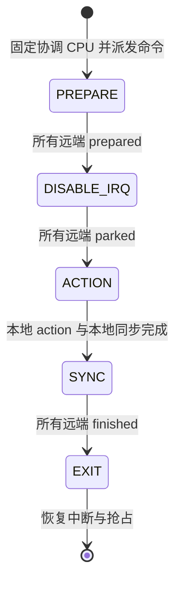

# Starry syscall 测试迁移记录

## 1. 迁移边界

本文件记录已合入的迁移批次；2026-09-11 新一轮从 `origin/dev e8c2e66466682528d64e4b8102d5940333beaabb` 继续逐项审计 Starry 用户态可见语义测试。`migration.csv` 保存原程序、处理状态、LTP 映射、覆盖损失和验证记录；状态为“待审计”的行不代表允许删除。目录扫描只建立候选清单，最终范围由测试断言决定，硬件验证和性能基准保留。

### 1.1 上游基准

LTP 固定为 `20260529`，提交为 `3a64d78f58bdceba93ed321e91215fb969a047ed`。实际运行集合由 `test-suit/starryos/qemu/system/ltp-syscalls/cases.txt` 控制，候选集合不能替代执行证据。Linux 语义以 `v7.1`、提交 `8cd9520d35a6c38db6567e97dd93b1f11f185dc6` 为基准。

### 1.2 提交与证据

每个原程序单独提交，提交主题记录在 `migration.csv` 中，可用 `git log --fixed-strings --grep='<主题>'` 定位提交。完整替代、部分替代后清理、无等效项清理必须分别记录；删除未承接的断言是本轮明确接受的覆盖收缩，不能称为等效覆盖。已提交修复保留原有红绿证据。候选 LTP 执行出错时记录输入、失败结果、体系结构和日志，保留原测试并暂缓该项，不通过隐藏 `TCONF`、放宽完成门槛或增加超时接入。2026-09-11 本轮按用户停止条件在首个可修复普通缺陷 `linkat` 处暂停新候选探索，集中完成根因修复与此前累计验证。

上一轮 PR #2322 范围冻结为 13 项（9 项部分替代、4 项无等效清理）；其余候选保留现状，IPv6 不接入。本轮新增范围仅为 `bug-linkat-flags-symlink` 的 `linkat01` 部分替代及其必要的绝对目标路径修复，完成后停止新增迁移。

上一轮 PR #2322 已合入。后续从最新 dev 继续的替换、失败暂缓与验证记录见 [`NEXT.md`](NEXT.md)；本文件的 13 项冻结范围是上一轮交付记录。

## 2. 逐项语义

每项记录以固定源码中的断言为依据。LTP 包装器保持退出状态、失败标记和最少通过项检查；`minimum-passes.txt` 的阈值来自源码，不能从绿色日志反推。

### 2.1 CPU 亲和性读取

`affinity-bug-proc-status-affinity` 的 `test_proc_status_affinity` 原来检查四核默认掩码、绑定 CPU1 后的读取结果，以及 procfs 和 sysfs 的表示。替代用例 [sched_getaffinity01.c](https://github.com/linux-test-project/ltp/blob/3a64d78f58bdceba93ed321e91215fb969a047ed/testcases/kernel/syscalls/sched_getaffinity/sched_getaffinity01.c) 检查非空且不超出系统 CPU 数的掩码，以及坏地址 `EFAULT`、零长度 `EINVAL`、不存在进程 `ESRCH`，源码要求四项 `TPASS`。

这个用例不覆盖 `/proc/self/status` 中 `Cpus_allowed`、`Cpus_allowed_list` 的精确字符串、`/proc/cpuinfo` 的 processor 数量，以及 sysfs online、possible、present 的范围。也不能独自证明设置 CPU1 后的读取结果；原程序已清理，这些断言不再由该项迁移保留。

### 2.2 验证状态

本文件与 `migration.csv` 随每项迁移更新。未完成四架构运行的项目不能标为验证通过，未完成的迁移也不计入交付数量。定向入口为 `cargo xtask starry test qemu --arch <arch> -c qemu/system/ltp-syscalls`；最终还需四架构完整 `qemu/system` 及受影响用例验证。

### 2.8 linkat 路径与 flags

`bug-linkat-flags-symlink` 部分替换为固定 LTP [linkat01.c](https://github.com/linux-test-project/ltp/blob/3a64d78f58bdceba93ed321e91215fb969a047ed/testcases/kernel/syscalls/linkat/linkat01.c)，共 22 个源码规定的完成断言。它承接相对/绝对源与目标路径、目录描述符边界、跨设备链接、目录链接和非法 flags；不承接原测试的 symlink 本体与 `AT_SYMLINK_FOLLOW` 目标内容、坏用户指针优先级、`EEXIST`，也不承接需要 ext2 的 [linkat02.c](https://github.com/linux-test-project/ltp/blob/3a64d78f58bdceba93ed321e91215fb969a047ed/testcases/kernel/syscalls/linkat/linkat02.c) 错误组合。`linkat02` 在当前镜像中因缺少 `mkfs.ext2` 返回 `TCONF`，未接入累计集合。

固定 Linux v7.1 的 [`filename_linkat()`](https://github.com/torvalds/linux/blob/8cd9520d35a6c38db6567e97dd93b1f11f185dc6/fs/namei.c#L5808-L5883) 通过 `filename_create()` 解析目标路径，绝对目标路径忽略 `newdfd`。Starry 的入口为 `sys_linkat`，源路径经 `resolve_at`，目标路径经 `with_fs`、`FsContext::resolve_nonexistent` 后调用 `Location::link`；修复把绝对目标路径的 `new_dirfd` 归一为 `AT_FDCWD`。同一 LTP 用例提供确定性红绿证据：x86_64 修复前累计 `total=90 passed=88 failed=2`，第 11、15 项分别得到 `ENOTDIR`、`EBADF`；修复后四架构 `linkat01` 均 22/22 `TPASS`，累计 `ltp-syscalls` 分别为 x86_64 `89/89`、aarch64 `87/87`、riscv64 `87/87`、loongarch64 `87/87`，外层 QEMU 均为 `PASS`。完整 `qemu/system` 分别为 x86_64 `515/515`、aarch64 `513/513`、riscv64 `513/513`、loongarch64 `513/513`，外层均为 `PASS`。

首项迁移发现 loongarch64 的 `--capture-failures` 吞掉成功 LTP 用例的原始输出。四架构 QEMU 虽然都返回成功，`generate-common.sh` 却确定性返回 1，报告 `the four-architecture LTP intersection is empty`。`starry_system_test_runner.c` 现在在捕获模式下也回放 LTP 成功输出，使完成数量可以被离线复核；原生 C 用例的输出策略不变。修复后 loongarch64 QEMU 通过，同一生成命令返回 0，`cmp` 确认结果与实际 manifest 完全一致，未丢掉任何预期用例。完整日志保存在实施机器 `/tmp/starry-ltp-migration-evidence/01-affinity-*.log`；loongarch64 使用 `01-affinity-loongarch64-green.log`。

### 2.3 CPU 亲和性迁移

`affinity-bug-sched-affinity-migrate` 的 `bug-sched-affinity-migrate` 原来让父进程把正在 CPU0 运行的子进程迁到 CPU1，通过管道握手和 `/proc/self/stat` 的 processor 字段观察完成。固定上游 [getcpu01.c](https://github.com/linux-test-project/ltp/blob/3a64d78f58bdceba93ed321e91215fb969a047ed/testcases/kernel/syscalls/getcpu/getcpu01.c) 将当前任务绑定到掩码中的最高 CPU，再检查 `getcpu` 返回的 CPU 与 NUMA node。这是当前任务迁移的部分替代，不能证明父进程修改子进程亲和性的完成语义，也不保留 procfs 字段和握手断言。

原程序现已清理，四架构 `getcpu01` 各输出一项 `TPASS`（CPU3/node0），最外层 QEMU 返回成功，共同集生成结果恰好包含该用例。日志为实施机器 `/tmp/starry-ltp-migration-evidence/02-getcpu-<arch>.log`。

本项定向验证期间只把 `getcpu01` 放入临时执行 manifest，通过后恢复累计清单并加入该用例。四架构日志必须各自包含完整 LTP 阶段、`TPASS`、逐程序成功和最外层成功；最终完整集合仍需单独验证。该步骤不根据失败结果缩减迁移范围。

### 2.4 闹钟取整

`bugfix-alarm-syscall` 的原测试把剩余约 1.25 秒时返回 2 当成正确行为，内核 `sys_alarm` 也对所有非零小数秒向上取整。[Linux v7.1 alarm_setitimer](https://github.com/torvalds/linux/blob/8cd9520d35a6c38db6567e97dd93b1f11f185dc6/kernel/time/itimer.c#L296) 的规则是：不足一秒但尚未到期时返回 1；其余时间在小数部分达到半秒时进位。因此 1.25 秒应返回 1。

原 C 测试在宿主 Linux `6.8.0-138-generic` 上失败，纠正这项断言后通过；同一纠正测试在未修复 Starry x86_64 上返回 1，日志包含 `round one-second fractional remainder below half a second down`。另外把实际取整算法提取为私有 `alarm_remaining_seconds`，用不读取时钟的边界表验证零、最小非零值、半秒两侧与整秒，避免用调度及时性代替取整算法的确定性证据。旧算法在 `1s + 1ns` 输入下确定性失败（实际2、期望1），完整 `cargo xtask test` 仅 starry-kernel 失败。修复为半秒进位后，同一边界测试与完整57软件包标准库测试均通过；纠正后的同一 x86_64 系统回归也通过。`cargo xtask clippy --package starry-kernel` 的101项检查全部通过。证据文件为实施机器 `/tmp/starry-ltp-migration-evidence/03-alarm-{std-red-full,std-green-full,starry-red,starry-green}.log`。

上游替代用例 `alarm02`、`alarm05`、`alarm06` 分别验证设置与取消返回值、替换和信号交付、取消后不交付信号，源码完成数量分别为 6、3、2。它们不验证兄弟线程共享计时器、创建线程退出后的交付或 `setitimer` 的小数秒互操作；原C测试已清理，这些系统级断言不再由本项保留。四架构三个LTP用例分别完成6、3、2项TPASS，定向QEMU及共同集生成通过；纯取整算法回归保留在内核单元测试。

CI补充发现：七提交版本的x86_64用户态完整套件通过，但随后裸机`axtest_kernel`编译因alarm宿主单元测试的未使用导入失败。该纯算法测试现在明确`not(axtest)`，不把普通`#[test]`编入自定义裸机测试入口；同一`cargo xtask ktest qemu -p starry-kernel --arch x86_64`入口已通过170项，0失败、0跳过。该修正归入alarm迁移提交。

### 2.5 目录描述符锁

`bug-advisory-lock-dir` 的独特行为全部依赖 `O_RDONLY | O_DIRECTORY` 描述符：flock共享/排他锁及释放、不同OFD间读锁可见、写记录锁返回EBADF。固定LTP的flock/fcntl家族未建立目录描述符场景，`flock01`只在普通O_RDWR文件上检查操作成功，不能承担这一回归。按本轮无等效项清理规则移除原程序及CMake，未新增LTP项，也不再宣称这些目录断言被覆盖。静态确认没有遗留运行入口。

### 2.6 chroot 路径边界

`bug-chroot-parent-escape` 原来从jail目录、jail内的tmpfs挂载点和该挂载根进行多级`..`解析，验证父祖目录secret不可见、符号链接不能逃逸及`rmdir("..")`返回EBUSY。LTP `chroot02` 只验证新根内的文件仍可stat，其余chroot01/03/04主要检查权限和错误码，没有这些路径边界断言。本项按无等效规则清理，未增加LTP用例；这些安全边界失去本项回归保护，不宣称已有普通chroot测试等效。IPv6项仍待语义修复，本项与其无依赖，独立提交。

### 2.7 COW 共享计数

`bug-cow-refcount-overflow` 先预触只读页，再保持300个子进程同时存活并共享该页，验证fork不会因窄引用计数溢出返回EFAULT，最后回收全部子进程。LTP `fork07` 是100子进程共享文件偏移，`hugefork01` 只有一次COW fork，均不覆盖超过255个同时共享者的边界。本项按无等效规则清理，未新增LTP用例；原窄引用计数溢出的确定性保护不再由此程序提供。

### 2.8 删除中的目录游标

`bug-dir-cookie-unlink-rmdir` 使用80字节getdents64缓冲区，读取一批后删除该批条目，继续同一目录游标直至EOF并要求rmdir成功；另覆盖64项跨目录rename后删除，均在tmpfs与rootfs执行。LTP getdents01/readdir01静态枚举以及getdents02/readdir21已删除目录FD错误检查都不覆盖这种读删交错。本项按无等效规则移除，目录cookie稳定性、rename后cookie唯一性和最终目录为空的断言不再由此程序提供。

### 2.9 旧 epoll 入口

`bug-epoll-compat-entrypoints` 包含旧epoll_create成功/非法size、raw旧epoll_wait就绪结果、自身epoll_ctl拒绝。固定LTP epoll_create01/02各有raw和libc两个变体，只有x86_64具有这里使用的旧raw入口，因此单独放入`cases-x86_64.txt`；共同候选epoll_ctl02与epoll_wait01分别覆盖九项错误和三种读写就绪组合。后者使用libc入口，不宣称替代原raw epoll_wait直接调用断言。

CMake读取`CMAKE_C_COMPILER_TARGET`的架构前缀，将可选的`cases-<arch>.txt`与共同清单合并并去重。配置回归先确认旧实现不生成epoll_create01 wrapper，再确认新实现仅在x86_64生成；其他三架构不会生成这些入口。实际x86_64运行发现`epoll_ctl02`将目录FD加入epoll时意外成功（应为EPERM），该用例失败而其他三个候选通过。修复在FileLike增加`supports_epoll`能力查询，Directory明确返回false，EntryKey在ADD/MOD/DEL路径创建前拒绝此类对象；目录自身的同步poll结果不变。修复后四架构LTP运行全部通过，epoll_ctl02完成9项、epoll_wait01完成3项，x86_64额外两个create用例各完成4项；共同集生成及每架构实际用例集合检查通过。`cargo xtask test --since origin/dev`通过，定向clippy共92项全部通过，x86_64裸机axtest共170项全部通过。原程序及CMake已清理；四架构日志保存于实施机器`/tmp/starry-ltp-migration-evidence/08-epoll-<arch>-green.log`。

### 2.10 epoll 嵌套拓扑

`bugfix-bug-epoll-topology` 原来检查四条嵌套边成功、第五条返回`ELOOP`、间接环路拒绝、重复FD边精确删除以及并发反向加边恰有一次成功。固定LTP [epoll_ctl04.c](https://github.com/linux-test-project/ltp/blob/3a64d78f58bdceba93ed321e91215fb969a047ed/testcases/kernel/syscalls/epoll_ctl/epoll_ctl04.c) 先建立五个epoll实例组成的四条嵌套边及末端pipe，再拒绝更深嵌套；[epoll_ctl05.c](https://github.com/linux-test-project/ltp/blob/3a64d78f58bdceba93ed321e91215fb969a047ed/testcases/kernel/syscalls/epoll_ctl/epoll_ctl05.c) 检查闭合环路返回`ELOOP`。两个用例各要求一项TPASS，沿用wrapper默认完成门槛。

这是部分替代：上游深度用例接受`EINVAL`或`ELOOP`，不能保留原来的精确errno断言；上游也不覆盖dup别名边的逐条删除和并发反向加边。原程序及CMake已清理，这三类断言明确不再由本项提供。四架构累计LTP全部通过，新增两个用例实际均返回`ELOOP`；x86_64执行64个LTP程序，其他架构各62个，实际集合与配置逐项一致，生成共同集与`cases.txt`逐字相同。日志为实施机器`/tmp/starry-ltp-migration-evidence/09-topology-<arch>.log`。本项未发现新的实现缺陷，没有增加内核改动。

### 2.11 epoll 用户输出缓冲区

`bug-epoll-wait-user-buffer-race` 原来覆盖阻塞后munmap输出缓冲区返回`EFAULT`、跨页部分复制后返回已完成事件数并重排队失败事件、过大maxevents返回`EINVAL`、没有就绪事件时拒绝内核地址和溢出范围。固定LTP [epoll_wait03.c](https://github.com/linux-test-project/ltp/blob/3a64d78f58bdceba93ed321e91215fb969a047ed/testcases/kernel/syscalls/epoll_wait/epoll_wait03.c) 只部分承接不可写输出缓冲区的`EFAULT`，并增加坏FD、非epoll FD、负数与零maxevents检查，共五项TPASS。

原程序及CMake已清理。未承接的是阻塞期间解除映射、部分复制计数与ONESHOT事件重排队、`INT_MAX`数量上限、无就绪事件时的非法/溢出用户范围；静态只读映射不能证明这些竞态和边界。四架构定向LTP均完成五项，实际执行集合和共同集核对通过，无新增实现缺陷。证据保存于实施机器`/tmp/starry-ltp-migration-evidence/10-11-epoll-wait-<arch>.log`，同一轮同时验证下一项独立提交的候选。

从实际四架构根文件系统提取musl后反汇编`epoll_wait`与`epoll_pwait`：前者转发后者，后者使用x86_64编号281、其他架构编号22；x86_64仅在`ENOSYS`时回退232。Starry已实现281，因此这些LTP结果验证`epoll_pwait`路径，不能补回第八项清理的raw旧入口断言。反汇编证据为`/tmp/starry-ltp-migration-evidence/epoll-libc-<arch>.asm`。

### 2.12 EPOLLET 第二段数据

`bug-epollet-second-chunk` 原来在TCP回环连接上检查空闲时不产生幻事件，并重复32轮“写A、等待、读尽、写B、等待、读尽”。固定LTP [epoll_wait06.c](https://github.com/linux-test-project/ltp/blob/3a64d78f58bdceba93ed321e91215fb969a047ed/testcases/kernel/syscalls/epoll_wait/epoll_wait06.c) 以非阻塞pipe验证写满后的IN事件、半读后不重复产生边缘事件、读空后的OUT事件，并检查FD、事件位与满/空时`EAGAIN`，共九项TPASS。

这里只部分承接EPOLLET下的数据就绪事件；半读后不重复通知是LTP增加的检查。pipe不能证明TCP已连接套接字的OUT就绪不导致IN幻事件，也没有保留读尽后第二次写入重新交付IN及32轮重复检查；这些覆盖损失随原程序和CMake清理明确记录。四架构均完成九项TPASS，执行集合和共同集核对通过，未发现新缺陷。验证复用上一项记录的同一轮四架构日志，测试替换与完成门槛保持独立提交。

### 2.13 ext4 目录操作

`bug-ext4-dir-ops` 的替代项是`rmdir01/02`、`rename03/04/05/07`和`readdir01`，处理为部分替代并修复。rmdir两项在tmpfs验证空目录删除和九种错误；rename与readdir必须实际完成ext4阶段，并继续执行上游发现的其他文件系统。原程序的ext4 rmdir后置状态、失败后兄弟及内容完整性、rename后父目录引用、重建旧名字、pip升级序列、32/80字节读删交错和HTree长目录SEEK_END/回卷断言未被完整承接。`getdents01`包含当前musl及部分架构不可用的变体，不能隐藏其TCONF后宣称替代getdents64。

本项先用`rmdir02`证明挂载点和`.`错误返回ENOTEMPTY，再分别修复为EBUSY和EINVAL；并恢复loop来源的ext4挂载、消除ext4根引用环、修复传输游标以及LTP文件系统漏跑门禁。后续暴露的退出cwd滞留和unshare上下文未登记问题，由`ltp-isolation-exit-fs`确定性复现：旧实现分别在等待子进程退出后错误EBUSY，以及活跃私有cwd仍存在时错误允许卸载。其调度与进程交接控制没有完整等效LTP用例，作为此次新增缺陷的配套回归保留在LTP分组的native阶段，不计入上游LTP数量，也不冒充原程序的完整替代。

### 2.14 faccessat2 参数与访问权限

`bug-faccessat2-validation` 的等效范围按固定源码确定：[faccessat201.c](https://github.com/linux-test-project/ltp/blob/3a64d78f58bdceba93ed321e91215fb969a047ed/testcases/kernel/syscalls/faccessat2/faccessat201.c) 覆盖普通、AT_EACCESS及不跟随符号链接的R_OK成功；[faccessat202.c](https://github.com/linux-test-project/ltp/blob/3a64d78f58bdceba93ed321e91215fb969a047ed/testcases/kernel/syscalls/faccessat2/faccessat202.c) 覆盖坏指针、mode/flags为-1、坏dirfd、非目录dirfd及降权后目录搜索拒绝，分别要求7、6项TPASS。另接入[access04.c](https://github.com/linux-test-project/ltp/blob/3a64d78f58bdceba93ed321e91215fb969a047ed/testcases/kernel/syscalls/access/access04.c)，对root与nobody各检查6个errno，要求12项TPASS。

这仍是部分替代：不承接原普通文件F_OK及R_OK/W_OK组合成功、0x8及有效/非法mode组合、0x80000000 flag及AT_EMPTY_PATH非法flag组合、普通FD空路径成功与非法mode、悬空链接跟随ENOENT/不跟随成功、legacy faccessat忽略第四寄存器。新增native回归中的cwd空路径与符号链接搜索不是这些输入的等效替代，不能据此抹去覆盖损失。

本项发现的目录搜索、真实凭据、DAC capability、共享只读及空路径缺陷与修复见第5节。四架构累计集合均已通过，x86_64为76个LTP与2个native，其余架构为74个LTP与2个native；实际集合、无重复、五个ext4阶段数量及共同集逐字比较均通过。58包标准库测试及VFS三项、ax-fs-ng六项、starry-kernel九十二项clippy全部通过。

## 3. 系统调用兼容性对照

结论仅针对本轮明确检查的路径，不表示整个系统调用在所有输入下都兼容。移除 procfs 或 sysfs 的特定断言后，LTP 的绿色结果不能证明那些文件的表示仍然正确。

| 系统调用/编号 | Linux 基准与稳定链接 | Linux 可观察语义 | StarryOS 入口与调用链 | 实现结论 | 测试与证据 |
| --- | --- | --- | --- | --- | --- |
| sched_getaffinity / x86_64:204；aarch64、riscv64、loongarch64:123 | [Linux v7.1 syscalls.c](https://github.com/torvalds/linux/blob/8cd9520d35a6c38db6567e97dd93b1f11f185dc6/kernel/sched/syscalls.c#L1278) | 本轮覆盖非空且不超过配置 CPU 数的掩码；坏地址 EFAULT、零长度 EINVAL、不存在进程 ESRCH | `sys_sched_getaffinity` → `scheduler_thread_id` / `scheduler_task` → 当前 PID namespace 的 `PidView` → ax-task `thread_affinity` 读取线程的 affinity → `vm_write_slice` | 正确 | `sched_getaffinity01`：四架构各四项 TPASS，LTP 阶段均成功，共同集生成与逐字比较成功；结论限本行四项行为 |
| sched_setaffinity / x86_64:203；aarch64、riscv64、loongarch64:122 | [Linux v7.1 syscalls.c](https://github.com/torvalds/linux/blob/8cd9520d35a6c38db6567e97dd93b1f11f185dc6/kernel/sched/syscalls.c#L1197) | 设置当前或指定线程的 CPU 亲和性；权限检查、用户掩码与允许 CPU 交集影响结果 | `sys_sched_setaffinity` → `check_sched_permission` → `vm_load` → ax-task `set_current_thread_affinity` 或 `set_thread_affinity_and_wait` | 无法确认 | `getcpu01` 四架构证明当前任务绑定CPU3后在CPU3执行；远程任务路径及错误门禁未由该用例验证，不宣称完整兼容 |
| getcpu / x86_64:309；aarch64、riscv64、loongarch64:168 | [Linux v7.1 sys.c](https://github.com/torvalds/linux/blob/8cd9520d35a6c38db6567e97dd93b1f11f185dc6/kernel/sys.c#L2918) | 返回当前运行CPU及其NUMA节点；本轮验证绑定后CPU与单节点结果 | `sys_getcpu` → HAL `this_cpu_id` → `VmMutPtr::vm_write` 写入CPU与node 0 | 正确 | `getcpu01` 四架构各1项TPASS；结论限非空有效输出指针及当前单NUMA节点场景 |
| alarm / x86_64:37 | [Linux v7.1 itimer.c](https://github.com/torvalds/linux/blob/8cd9520d35a6c38db6567e97dd93b1f11f185dc6/kernel/time/itimer.c#L296) | 替换进程ITIMER_REAL并返回旧剩余秒数：非零不足一秒保底1，其余以半秒为进位阈值 | `sys_alarm` → `ProcessData::set_interval_timer` → 锁内 `ProcessTimerManager::set_itimer` → `SetITimerOutcome::apply` 发布进程AlarmTarget → `alarm_remaining_seconds` | 正确 | 新边界单元测试先红后绿；同一纠正C回归宿主通过、Starry先红后绿；LTP alarm02/05/06四架构通过；其余架构由libc通过setitimer实现alarm，不宣称存在raw alarm入口 |
| getitimer / x86_64:36；aarch64、riscv64、loongarch64:102 | [Linux v7.1 itimer.c](https://github.com/torvalds/linux/blob/8cd9520d35a6c38db6567e97dd93b1f11f185dc6/kernel/time/itimer.c) | 读取进程间隔计时器的间隔与剩余时间 | `sys_getitimer` → `ProcessData::get_interval_timer` → 进程accounting.interval_timers锁 → `get_itimer` → `write_itimerval` | 无法确认 | 纠正后的原x86_64回归验证ITIMER_REAL与alarm状态；LTP alarm家族未直接承接全部读取断言 |
| setitimer / x86_64:38；aarch64、riscv64、loongarch64:103 | [Linux v7.1 itimer.c](https://github.com/torvalds/linux/blob/8cd9520d35a6c38db6567e97dd93b1f11f185dc6/kernel/time/itimer.c#L351) | 替换进程间隔计时器并可选返回旧状态；ITIMER_REAL与alarm共享 | `sys_setitimer` → 读取与转换itimerval → `ProcessData::set_interval_timer` → `SetITimerOutcome::apply` → 可选`write_itimerval` | 无法确认 | 纠正C回归在x86_64验证小数秒设置与alarm交互；其他参数及错误顺序不属于该项已验证结论 |
| flock / x86_64:73；aarch64、riscv64、loongarch64:32 | [Linux v7.1 locks.c](https://github.com/torvalds/linux/blob/8cd9520d35a6c38db6567e97dd93b1f11f185dc6/fs/locks.c#L2214) | 目录FD允许共享/排他锁；排他flock不要求O_WRONLY | `sys_flock` → `flock_op` → `lockable` / Directory `inode_key` → FLOCK_LOCKS及按inode等待队列 | 无法确认 | 原目录FD回归已清理，未新增等效LTP运行证据 |
| fcntl(F_OFD_SETLK目录路径) / x86_64:72；aarch64、riscv64、loongarch64:25 | [Linux v7.1 locks.c](https://github.com/torvalds/linux/blob/8cd9520d35a6c38db6567e97dd93b1f11f185dc6/fs/locks.c#L2371) | 只读目录允许OFD读记录锁 | `sys_fcntl` → `dispatch_fcntl` → `fcntl_setlk` → `lockable`、`fd_supports_kind`、OFD所有者与FCNTL_LOCKS | 无法确认 | 原目录FD回归已清理，未新增等效LTP运行证据 |
| fcntl(F_OFD_GETLK目录路径) / x86_64:72；aarch64、riscv64、loongarch64:25 | [Linux v7.1 locks.c](https://github.com/torvalds/linux/blob/8cd9520d35a6c38db6567e97dd93b1f11f185dc6/fs/locks.c#L2371) | 另一独立OFD可观察目录上的读锁冲突 | `sys_fcntl` → `dispatch_fcntl` → `fcntl_getlk` → `lockable`、OFD所有者、`find_conflict`与写回flock字段 | 无法确认 | 原目录FD回归已清理，未新增等效LTP运行证据 |
| fcntl(F_SETLK目录路径) / x86_64:72；aarch64、riscv64、loongarch64:25 | [Linux v7.1 locks.c](https://github.com/torvalds/linux/blob/8cd9520d35a6c38db6567e97dd93b1f11f185dc6/fs/locks.c#L2371) | 只读目录写记录锁返回EBADF | `sys_fcntl` → `dispatch_fcntl` → `fcntl_setlk` → `lockable` → `fd_supports_kind`检查写访问模式 | 无法确认 | 原目录FD回归已清理，未新增等效LTP运行证据 |
| chroot / x86_64:161；aarch64、riscv64、loongarch64:51 | [Linux v7.1 open.c](https://github.com/torvalds/linux/blob/8cd9520d35a6c38db6567e97dd93b1f11f185dc6/fs/open.c#L588) | 新root约束后续路径解析，包含挂载与父目录边界 | `sys_chroot` → 当前FsContext锁 → `resolve`、`FsContext::new` → proc_data root/cwd更新；后续路径由FsContext解析 | 无法确认 | 专门路径逃逸回归已清理；LTP chroot01-04未承接上述边界，无新增运行证据 |
| fork / x86_64:57 | [Linux v7.1 fork.c](https://github.com/torvalds/linux/blob/8cd9520d35a6c38db6567e97dd93b1f11f185dc6/kernel/fork.c#L2802) | 复制进程并维护共享页生命周期；本项原风险为大量同时存活的COW共享者 | `sys_fork` → `sys_clone` → `CloneArgs::do_clone` → 地址空间复制与进程发布 | 无法确认 | 300子进程COW引用计数回归已清理；普通LTP fork不证明该边界 |
| clone(fork的libc后端) / aarch64、riscv64、loongarch64:220 | [Linux v7.1 fork.c](https://github.com/torvalds/linux/blob/8cd9520d35a6c38db6567e97dd93b1f11f185dc6/kernel/fork.c) | 不带CLONE_VM的进程复制维护共享页生命周期 | `sys_clone` → `CloneArgs::do_clone` → 地址空间复制与进程发布 | 无法确认 | 清理原libc fork程序；该三架构无raw fork入口，未新增300共享者回归 |
| getdents64(删除交错) / x86_64:217；aarch64、riscv64、loongarch64:61 | [Linux v7.1 readdir.c](https://github.com/torvalds/linux/blob/8cd9520d35a6c38db6567e97dd93b1f11f185dc6/fs/readdir.c) | 目录条目删除及rename后继续同一遍历游标，不因计数型offset跳过仍存活条目 | `sys_getdents64` → Directory迭代游标 → 文件系统目录cookie → DirBuffer写回 | 无法确认 | 原读删交错回归已清理，未增加静态枚举LTP来冒充等效 |
| epoll_create / x86_64:213 | [Linux v7.1 eventpoll.c](https://github.com/torvalds/linux/blob/8cd9520d35a6c38db6567e97dd93b1f11f185dc6/fs/eventpoll.c) | 正size返回有效epoll FD；非正size返回EINVAL | `sys_epoll_create` → size校验 → `sys_epoll_create1(0)` → `Epoll::new`及FD表 | 正确 | x86_64 epoll_create01/02 raw与libc变体各4项TPASS；其他架构不存在此raw入口 |
| epoll_ctl(目录ADD) / x86_64:233；aarch64、riscv64、loongarch64:21 | [Linux v7.1 eventpoll.c](https://github.com/torvalds/linux/blob/8cd9520d35a6c38db6567e97dd93b1f11f185dc6/fs/eventpoll.c#L2256) | 目标目录没有poll操作，拒绝注册并返回EPERM | `sys_epoll_ctl` → `Epoll::add` → `EntryKey::new` → Directory `supports_epoll=false`，未发布interest | 正确 | LTP epoll_ctl02 x86_64先失败后通过，四架构各9项TPASS；结论限这些输入 |
| epoll_ctl(目录MOD) / x86_64:233；aarch64、riscv64、loongarch64:21 | [Linux v7.1 eventpoll.c](https://github.com/torvalds/linux/blob/8cd9520d35a6c38db6567e97dd93b1f11f185dc6/fs/eventpoll.c#L2256) | 目录目标在interest查找前返回EPERM | `sys_epoll_ctl` → `Epoll::modify` → `EntryKey::new`能力检查 | 无法确认 | 修改路径也使用该能力检查；epoll_ctl02目录用例只覆盖ADD，未声称其他路径已实测 |
| epoll_ctl(目录DEL) / x86_64:233；aarch64、riscv64、loongarch64:21 | [Linux v7.1 eventpoll.c](https://github.com/torvalds/linux/blob/8cd9520d35a6c38db6567e97dd93b1f11f185dc6/fs/eventpoll.c#L2256) | 目录目标在interest查找前返回EPERM | `sys_epoll_ctl` → `Epoll::delete` → `EntryKey::new`能力检查 | 无法确认 | 删除路径也使用该能力检查；epoll_ctl02目录用例只覆盖ADD，未声称其他路径已实测 |
| epoll_wait / x86_64:232 | [Linux v7.1 eventpoll.c](https://github.com/torvalds/linux/blob/8cd9520d35a6c38db6567e97dd93b1f11f185dc6/fs/eventpoll.c) | 返回就绪事件数量、事件位与user data | `sys_epoll_wait` → `sys_epoll_pwait` → `do_epoll_wait` → Epoll `poll_events_with`与用户写回 | 无法确认 | epoll_wait01使用libc；不能仅凭该结果宣称原直接SYS_epoll_wait断言被保留 |
| epoll_pwait / x86_64:281；aarch64、riscv64、loongarch64:22 | [Linux v7.1 eventpoll.c](https://github.com/torvalds/linux/blob/8cd9520d35a6c38db6567e97dd93b1f11f185dc6/fs/eventpoll.c) | libc epoll_wait后端的读/写/组合就绪语义；此处不涉及非空sigmask | `sys_epoll_pwait` → `do_epoll_wait` → `with_blocked_signals`、`poll_io`、Epoll事件消费和写回 | 正确 | epoll_wait01四架构各3项TPASS；实际musl反汇编确认使用epoll_pwait，结论限本行空sigmask就绪场景 |
| epoll_ctl(嵌套深度与环路ADD) / x86_64:233；aarch64、riscv64、loongarch64:21 | [Linux v7.1 eventpoll.c](https://github.com/torvalds/linux/blob/8cd9520d35a6c38db6567e97dd93b1f11f185dc6/fs/eventpoll.c#L2069) | 最多四条嵌套边；超深或闭环拒绝且不发布新边 | `sys_epoll_ctl` → `Epoll::add_interest` → 全局拓扑锁 → `prepare_nested_link`双向深度扫描 → 成功后提交interest及双向边 | 正确 | epoll_ctl04/05四架构各1项TPASS，实际返回ELOOP；上游04允许EINVAL，未来精确errno回归保护较原程序弱 |
| epoll_ctl(dup别名边DEL) / x86_64:233；aarch64、riscv64、loongarch64:21 | [Linux v7.1 eventpoll.c](https://github.com/torvalds/linux/blob/8cd9520d35a6c38db6567e97dd93b1f11f185dc6/fs/eventpoll.c#L2069) | 删除指定FD边，其他别名边仍阻止反向闭环；全部删除后允许反向边 | `sys_epoll_ctl` → `Epoll::delete` → `remove_interest_locked` → `detach_nested_link`按edge id删除双向边 | 无法确认 | 原dup别名边删除回归已清理，LTP04/05未承接该生命周期 |
| epoll_ctl(并发反向ADD) / x86_64:233；aarch64、riscv64、loongarch64:21 | [Linux v7.1 eventpoll.c](https://github.com/torvalds/linux/blob/8cd9520d35a6c38db6567e97dd93b1f11f185dc6/fs/eventpoll.c#L2069) | 并发建立相反边时必须拒绝其中一条，避免共同形成环路 | `sys_epoll_ctl` → `Epoll::add_interest` → 全局拓扑锁覆盖校验与提交 | 无法确认 | 原屏障并发回归已清理，LTP04/05只验证串行图操作 |
| epoll_pwait(静态错误输入) / x86_64:281；aarch64、riscv64、loongarch64:22 | [Linux v7.1 eventpoll.c](https://github.com/torvalds/linux/blob/8cd9520d35a6c38db6567e97dd93b1f11f185dc6/fs/eventpoll.c) | 坏FD为EBADF，非epoll FD及非正maxevents为EINVAL，就绪事件写入只读页为EFAULT | `sys_epoll_pwait` → `do_epoll_wait`参数/FD检查 → `poll_events_with` → `write_epoll_event`逐事件用户写回 | 正确 | epoll_wait03四架构各5项TPASS，实际libc后端已反汇编确认 |
| epoll_pwait(解除映射、部分复制与极限范围) / x86_64:281；aarch64、riscv64、loongarch64:22 | [Linux v7.1 eventpoll.c](https://github.com/torvalds/linux/blob/8cd9520d35a6c38db6567e97dd93b1f11f185dc6/fs/eventpoll.c) | 等待后复制重新检查映射；部分完成优先返回数量，未交付事件保留；超大数量和溢出用户范围被拒绝 | `do_epoll_wait` → `check_epoll_events_access` → `poll_events_with`逐事件消费与复制失败恢复 | 无法确认 | 原专门回归已清理，静态只读页LTP没有承接上述断言 |
| epoll_ctl(管道EPOLLET注册) / x86_64:233；aarch64、riscv64、loongarch64:21 | [Linux v7.1 eventpoll.c](https://github.com/torvalds/linux/blob/8cd9520d35a6c38db6567e97dd93b1f11f185dc6/fs/eventpoll.c) | 为读/写pipe端登记带用户FD数据的边缘触发兴趣 | `sys_epoll_ctl` → `EpollFlags::EDGE_TRIGGER` → `Epoll::add_interest` → `TriggerMode::Edge`及PollRegistrar | 正确 | epoll_wait06四架构验证已登记读写端实际边缘通知 |
| epoll_pwait(管道EPOLLET消费) / x86_64:281；aarch64、riscv64、loongarch64:22 | [Linux v7.1 eventpoll.c](https://github.com/torvalds/linux/blob/8cd9520d35a6c38db6567e97dd93b1f11f185dc6/fs/eventpoll.c) | 交付IN后半读不重复通知；完全读空后交付OUT，返回对应FD与事件位 | `do_epoll_wait` → `poll_events_with` → `EpollInterest::consume`匹配就绪与触发模式 → 用户事件写回 | 正确 | epoll_wait06四架构各9项TPASS；实际musl后端已确认 |
| epoll_pwait(TCP EPOLLET重复数据交付) / x86_64:281；aarch64、riscv64、loongarch64:22 | [Linux v7.1 eventpoll.c](https://github.com/torvalds/linux/blob/8cd9520d35a6c38db6567e97dd93b1f11f185dc6/fs/eventpoll.c) | 无匹配就绪时不返回幻事件；TCP读尽后新数据再次触发IN | `do_epoll_wait` → Epoll兴趣队列及Socket Pollable注册/通知 → 事件消费与写回 | 无法确认 | 原TCP空闲与32轮两段数据回归已清理，pipe LTP未承接TCP专有路径 |
| mount(ext4 loop来源) / x86_64:165；aarch64、riscv64、loongarch64:40 | [Linux v7.1 fs/namespace.c](https://github.com/torvalds/linux/blob/8cd9520d35a6c38db6567e97dd93b1f11f185dc6/fs/namespace.c) | 本轮flags=0的loop镜像挂载成功，后端引用持续到最终文件系统使用者释放 | sys_mount → mount_ext4 → LoopMountLease → new_filesystem_from_file → FileImageDevice → Ext4Filesystem | 正确 | 七项LTP中五项实际完成ext4阶段；ext4漏跑门禁及挂载EIO先红后绿 |
| umount2(普通卸载) / x86_64:166；aarch64、riscv64、loongarch64:39 | [Linux v7.1 fs/namespace.c](https://github.com/torvalds/linux/blob/8cd9520d35a6c38db6567e97dd93b1f11f185dc6/fs/namespace.c) | 活跃cwd阻止卸载；等待子进程退出后不得因已退役task仍持有cwd而返回EBUSY | sys_umount2 → is_mount_busy → FS_REGISTRY及FD表 → commit_unmount；do_exit提前释放FS_CONTEXT | 正确 | exit_fs_context.c的普通及unshare场景确定性先红后绿；LTP卸载不再依赖EBUSY重试 |
| umount2(缓存写回范围) / x86_64:166；aarch64、riscv64、loongarch64:39 | [Linux v7.1 fs/super.c](https://github.com/torvalds/linux/blob/8cd9520d35a6c38db6567e97dd93b1f11f185dc6/fs/super.c) | 卸载目标文件系统只同步其缓存，不因无关文件系统映射忙而失败 | sys_umount2 → sync_filesystem_cached_files → 缓存backing的FilesystemOps身份过滤 → 目标flush | 无法确认 | 确定性缓存端点回归先红后绿，且保留目标自身ResourceBusy；真实system成功，但尚无系统级确定性跨FS忙交错证据 |
| umount2(MNT_DETACH) / x86_64:166；aarch64、riscv64、loongarch64:39 | [Linux v7.1 fs/namespace.c](https://github.com/torvalds/linux/blob/8cd9520d35a6c38db6567e97dd93b1f11f185dc6/fs/namespace.c) | 延迟卸载摘除挂载树后，已有打开文件继续拥有文件系统及来源 | sys_umount2 → detach_mount → Mountpoint共享Ext4MountLease → retire_filesystem_cache及目录缓存清理 → FileImageDevice释放LoopMountLease | 正确 | 四架构native回归：两个bind别名依次detach后打开文件仍可读写；最后close释放loop并写回脏页，重新挂载读回相同数据；同一释放回归先红后绿 |
| rmdir / x86_64:84 | [Linux v7.1 fs/namei.c](https://github.com/torvalds/linux/blob/8cd9520d35a6c38db6567e97dd93b1f11f185dc6/fs/namei.c) | 空目录删除；非空ENOTEMPTY、挂载点EBUSY、最终点组件EINVAL | sys_rmdir → sys_unlinkat(AT_REMOVEDIR) → FsContext::remove_dir → Location::unlink | 正确 | rmdir01及rmdir02全部10项断言；02错误码回归先红后绿 |
| unlinkat(AT_REMOVEDIR) / aarch64、riscv64、loongarch64:35 | [Linux v7.1 fs/namei.c](https://github.com/torvalds/linux/blob/8cd9520d35a6c38db6567e97dd93b1f11f185dc6/fs/namei.c) | rmdir的libc后端，保持目录删除及九种错误条件 | sys_unlinkat → with_fs → FsContext::remove_dir → Location::unlink | 正确 | 三架构rmdir01/02各10项TPASS；已核验镜像musl实际调用35 |
| unlinkat(AT_REMOVEDIR) / x86_64:263 | [Linux v7.1 fs/namei.c](https://github.com/torvalds/linux/blob/8cd9520d35a6c38db6567e97dd93b1f11f185dc6/fs/namei.c) | 与rmdir共享目录删除语义 | sys_unlinkat → with_fs → FsContext::remove_dir | 无法确认 | x86_64本轮由libc调用raw rmdir，未把内部复用当成此编号的直接运行证据 |
| rename / x86_64:82 | [Linux v7.1 fs/namei.c](https://github.com/torvalds/linux/blob/8cd9520d35a6c38db6567e97dd93b1f11f185dc6/fs/namei.c) | 文件及空目录替换保持inode身份；非空目录目标及类型不匹配报错 | sys_rename → sys_renameat2(flags=0) → resolve_parent → Location::rename_with_options | 正确 | rename03/04/05/07在ext4及tmpfs各完成11项断言；已核验musl入口 |
| renameat / aarch64:38 | [Linux v7.1 fs/namei.c](https://github.com/torvalds/linux/blob/8cd9520d35a6c38db6567e97dd93b1f11f185dc6/fs/namei.c) | libc rename后端，两个目录FD均为AT_FDCWD | sys_renameat → sys_renameat2(flags=0) → Location::rename_with_options | 正确 | 同组LTP在ext4及tmpfs通过；镜像musl调用38 |
| renameat2(flags=0) / riscv64、loongarch64:276 | [Linux v7.1 fs/namei.c](https://github.com/torvalds/linux/blob/8cd9520d35a6c38db6567e97dd93b1f11f185dc6/fs/namei.c) | libc rename后端，不附加特殊renameat2 flag | sys_renameat2 → resolve_parent → Location::rename_with_options(REPLACE) | 正确 | 同组LTP在ext4及tmpfs通过；镜像musl调用276 |
| getdents64(静态枚举) / x86_64:217；aarch64、riscv64、loongarch64:61 | [Linux v7.1 fs/readdir.c](https://github.com/torvalds/linux/blob/8cd9520d35a6c38db6567e97dd93b1f11f185dc6/fs/readdir.c) | 枚举目录中的固定条目集合 | sys_getdents64 → Directory目录游标 → ext4/tmpfs目录节点 | 正确 | readdir01在两个文件系统各核对10个前缀条目；不含原读删交错及HTree SEEK_END断言 |
| open(普通loop设备) / x86_64:2 | [Linux v7.1 fs/open.c](https://github.com/torvalds/linux/blob/8cd9520d35a6c38db6567e97dd93b1f11f185dc6/fs/open.c) | 打开文件描述持有设备使用引用，最后关闭才释放 | sys_open → sys_openat → add_to_fd → LoopDevice::open；File::drop配对close | 正确 | LTP设备发现、绑定、mkfs、挂载和清理实际执行并重复复用loop0；结论限普通打开配对 |
| openat(普通loop设备) / aarch64、riscv64、loongarch64:56 | [Linux v7.1 fs/open.c](https://github.com/torvalds/linux/blob/8cd9520d35a6c38db6567e97dd93b1f11f185dc6/fs/open.c) | 普通块设备打开也需要使用引用，不仅O_EXCL路径 | sys_openat → add_to_fd → LoopDevice::open；File::drop配对close | 正确 | 同一LTP设备生命周期在三架构实际执行 |
| open(O_PATH设备) / x86_64:2 | [Linux v7.1 fs/namei.c](https://github.com/torvalds/linux/blob/8cd9520d35a6c38db6567e97dd93b1f11f185dc6/fs/namei.c) | 仅取得loop路径句柄，其关闭不能释放普通打开者的设备引用 | sys_open → add_to_fd的O_PATH提前返回 → File::drop跳过设备close | 正确 | x86_64 native回归在AUTOCLEAR绑定上打开/关闭O_PATH，随后GET_STATUS64仍成功；结论不含ptmx创建语义 |
| openat(O_PATH设备) / x86_64:257 | [Linux v7.1 fs/namei.c](https://github.com/torvalds/linux/blob/8cd9520d35a6c38db6567e97dd93b1f11f185dc6/fs/namei.c) | 仅取得loop路径句柄，其关闭不能释放普通打开者的设备引用 | sys_openat → add_to_fd的O_PATH提前返回 → File::drop跳过设备close | 无法确认 | 本轮x86_64 libc open调用旧open入口，未把内部复用当成257编号的直接证据 |
| openat(O_PATH设备) / aarch64、riscv64、loongarch64:56 | [Linux v7.1 fs/namei.c](https://github.com/torvalds/linux/blob/8cd9520d35a6c38db6567e97dd93b1f11f185dc6/fs/namei.c) | 仅取得loop路径句柄，其关闭不能释放普通打开者的设备引用 | sys_openat → add_to_fd的O_PATH提前返回 → File::drop跳过设备close | 正确 | 三架构同一native回归通过；已核验musl open使用openat后端；结论不含ptmx创建语义 |
| close(loop设备) / x86_64:3；aarch64、riscv64、loongarch64:57 | [Linux v7.1 fs/open.c](https://github.com/torvalds/linux/blob/8cd9520d35a6c38db6567e97dd93b1f11f185dc6/fs/open.c) | 最后一个打开文件描述释放设备引用；AUTOCLEAR在最终使用者离开时解绑 | sys_close → release_locks_on_close → File::drop → LoopDevice::close → 锁外释放LoopBinding | 正确 | 连续五项LTP均重新取得loop0并成功格式化、挂载、卸载和解绑 |
| ioctl(LOOP_SET_FD) / x86_64:16；aarch64、riscv64、loongarch64:29 | [Linux v7.1 drivers/block/loop.c](https://github.com/torvalds/linux/blob/8cd9520d35a6c38db6567e97dd93b1f11f185dc6/drivers/block/loop.c) | 空闲loop绑定后端文件，已有绑定不能被替换 | sys_ioctl → Device::ioctl_for_task → LoopDevice::bind → 单锁发布LoopBinding | 正确 | LTP tst_attach_device实际绑定；结论限成功绑定及随后I/O |
| ioctl(LOOP_SET_STATUS) / x86_64:16；aarch64、riscv64、loongarch64:29 | [Linux v7.1 drivers/block/loop.c](https://github.com/torvalds/linux/blob/8cd9520d35a6c38db6567e97dd93b1f11f185dc6/drivers/block/loop.c) | 已绑定设备更新旧ABI的文件名与flags | sys_ioctl → LoopDevice::ioctl → state.binding_mut，名称和flags在同一锁内发布 | 无法确认 | LTP tst_attach_device实际设置状态；其他offset和flag语义不在本行验证范围 |
| ioctl(LOOP_CLR_FD) / x86_64:16；aarch64、riscv64、loongarch64:29 | [Linux v7.1 drivers/block/loop.c](https://github.com/torvalds/linux/blob/8cd9520d35a6c38db6567e97dd93b1f11f185dc6/drivers/block/loop.c) | 挂载仍使用设备时延迟解绑，不能重绑；最后设备引用释放后变为空闲 | sys_ioctl → LoopDevice::ioctl设置AUTOCLEAR/rundown → 最后close释放binding | 正确 | 四架构native回归在挂载及detached打开文件存活时核对GET_STATUS64成功、SET_FD返回EBUSY，最终关闭后GET_STATUS64返回ENXIO |
| ioctl(LOOP_GET_STATUS) / x86_64:16；aarch64、riscv64、loongarch64:29 | [Linux v7.1 drivers/block/loop.c](https://github.com/torvalds/linux/blob/8cd9520d35a6c38db6567e97dd93b1f11f185dc6/drivers/block/loop.c) | 空闲设备ENXIO，已绑定状态从一致快照读取 | sys_ioctl → LoopDevice::get_info → state.binding → write_loop_info | 正确 | LTP每项以旧GET_STATUS识别可复用loop0；结论限空闲ENXIO和普通绑定流程 |
| ioctl(LOOP_CONFIGURE) / x86_64:16；aarch64、riscv64、loongarch64:29 | [Linux v7.1 drivers/block/loop.c](https://github.com/torvalds/linux/blob/8cd9520d35a6c38db6567e97dd93b1f11f185dc6/drivers/block/loop.c) | 文件后端、名称和flags应一次发布 | sys_ioctl → LoopDevice::bind发布LoopBinding | 无法确认 | 本轮LTP使用SET_FD及旧SET_STATUS，不把该路径标为已验证 |
| ioctl(LOOP_GET_STATUS64) / x86_64:16；aarch64、riscv64、loongarch64:29 | [Linux v7.1 drivers/block/loop.c](https://github.com/torvalds/linux/blob/8cd9520d35a6c38db6567e97dd93b1f11f185dc6/drivers/block/loop.c) | 已绑定设备返回AUTOCLEAR状态；空闲设备返回ENXIO | sys_ioctl → LoopDevice::get_info64 → write_loop_info64 | 正确 | 四架构native回归核对绑定状态、AUTOCLEAR及最后关闭后的ENXIO；未承诺offset、size限制或加密字段 |
| ioctl(LOOP_SET_STATUS64) / x86_64:16；aarch64、riscv64、loongarch64:29 | [Linux v7.1 drivers/block/loop.c](https://github.com/torvalds/linux/blob/8cd9520d35a6c38db6567e97dd93b1f11f185dc6/drivers/block/loop.c) | 设置AUTOCLEAR后，最终关闭释放绑定 | sys_ioctl → LoopDevice::ioctl → state.binding_mut | 正确 | 四架构native回归设置该flag，并在关闭/重新挂载过程中核对实际释放；其他可设置及只读flag组合未验证 |
| exit_group(单线程进程) / x86_64:231；aarch64、riscv64、loongarch64:94 | [Linux v7.1 kernel/exit.c](https://github.com/torvalds/linux/blob/8cd9520d35a6c38db6567e97dd93b1f11f185dc6/kernel/exit.c) | 文件系统owner在zombie可见及父进程通知前释放 | sys_exit_group → do_exit → FS_CONTEXT.take并锁外drop → publish_zombie及父进程唤醒 | 正确 | 更高FIFO优先级父进程wait后立即卸载，普通/私有FS上下文两场景先红后绿 |
| exit(线程退出) / x86_64:60；aarch64、riscv64、loongarch64:93 | [Linux v7.1 kernel/exit.c](https://github.com/torvalds/linux/blob/8cd9520d35a6c38db6567e97dd93b1f11f185dc6/kernel/exit.c) | 退出线程释放自身FS引用，活跃CLONE_FS共享者继续拥有上下文 | sys_exit → do_exit(group_exit=false) → 当前scope的FS_CONTEXT.take | 无法确认 | 本轮辅助回归使用libc _exit的exit_group路径，未把它当成共享线程exit直接证据 |
| wait4 / x86_64:61；aarch64、riscv64、loongarch64:260 | [Linux v7.1 kernel/exit.c](https://github.com/torvalds/linux/blob/8cd9520d35a6c38db6567e97dd93b1f11f185dc6/kernel/exit.c) | 正常等待返回不得早于子进程自身FS资源释放 | sys_wait4 → zombie状态消费；do_exit在publish_zombie前释放FS_CONTEXT | 正确 | 已核验四架构waitpid的musl后端；确定性回归在wait后执行一次umount2 |
| unshare(CLONE_FS) / x86_64:272；aarch64、riscv64、loongarch64:97 | [Linux v7.1 kernel/fork.c](https://github.com/torvalds/linux/blob/8cd9520d35a6c38db6567e97dd93b1f11f185dc6/kernel/fork.c) | 独立FS上下文继续承担活跃cwd阻止卸载的语义 | sys_unshare → PreparedUnshare::prepare → FsContext::into_shared登记 → commit替换scope，旧owner锁外释放 | 正确 | 私有cwd活跃时旧实现错误允许卸载；同一确定性回归先红后绿 |
| unshare(CLONE_NEWNS) / x86_64:272；aarch64、riscv64、loongarch64:97 | [Linux v7.1 kernel/fork.c](https://github.com/torvalds/linux/blob/8cd9520d35a6c38db6567e97dd93b1f11f185dc6/kernel/fork.c) | 挂载命名空间替换仍登记其FS上下文 | sys_unshare → PreparedUnshare → into_shared → commit | 无法确认 | LTP隔离运行经过该路径；尚未单独覆盖该flag的全部挂载边界及错误顺序 |
| setns(挂载命名空间) / x86_64:308；aarch64、riscv64、loongarch64:268 | [Linux v7.1 kernel/nsproxy.c](https://github.com/torvalds/linux/blob/8cd9520d35a6c38db6567e97dd93b1f11f185dc6/kernel/nsproxy.c) | 目标已无FS上下文时不能继续借用其挂载状态 | sys_setns → 远程FS_CONTEXT快照 → None返回NoSuchProcess；PreparedUnshare发布替换 | 无法确认 | 所有调用者已迁移Option状态；未新增该竞态的直接系统证据 |
| mount(MS_BIND) / x86_64:165；aarch64、riscv64、loongarch64:40 | [Linux v7.1 fs/namespace.c](https://github.com/torvalds/linux/blob/8cd9520d35a6c38db6567e97dd93b1f11f185dc6/fs/namespace.c) | bind别名保留同一文件系统；摘除另一个挂载不使别名失效 | sys_mount → Location::bind_mount → Mountpoint::bind → Ext4Filesystem::mount_lease共享租约 | 正确 | 四架构native回归在原挂载detach后从bind别名读回原数据，并继续验证最后文件释放 |
| pread64 / x86_64:17；aarch64、riscv64、loongarch64:67 | [Linux v7.1 fs/read_write.c](https://github.com/torvalds/linux/blob/8cd9520d35a6c38db6567e97dd93b1f11f185dc6/fs/read_write.c) | 挂载detach后已有文件仍能按偏移读回数据，返回实际读取长度 | sys_pread64 → File::read_at → FileBackend/CachedFile → 持有Location及挂载租约 | 正确 | 四架构native回归核对6字节返回值及内容；重新挂载核对最终写回内容；镜像musl入口已反汇编核实 |
| pwrite64 / x86_64:18；aarch64、riscv64、loongarch64:68 | [Linux v7.1 fs/read_write.c](https://github.com/torvalds/linux/blob/8cd9520d35a6c38db6567e97dd93b1f11f185dc6/fs/read_write.c) | 挂载detach后已有文件仍能按偏移写入；最终卸载不能丢失脏页 | sys_pwrite64 → File::write_at → CachedFile；最后Ext4MountLease写回再释放来源 | 正确 | 四架构native回归分别在解绑和detach后写入6字节，并在最后close前留下未fsync的修改，重新挂载读回 |
| fsync / x86_64:74；aarch64、riscv64、loongarch64:82 | [Linux v7.1 fs/sync.c](https://github.com/torvalds/linux/blob/8cd9520d35a6c38db6567e97dd93b1f11f185dc6/fs/sync.c) | detached文件仍可把内容同步到持有的来源设备 | sys_fsync → File::sync → FileBackend::sync → CachedFileShared::sync → ext4及FileImageDevice::flush | 正确 | 四架构native回归在detach后调用fsync成功并核对内容；不涵盖设备故障时的错误传播；musl入口已核验 |
| openat(procfs远程挂载信息) / x86_64:257；aarch64、riscv64、loongarch64:56 | [Linux v7.1 fs/proc_namespace.c](https://github.com/torvalds/linux/blob/8cd9520d35a6c38db6567e97dd93b1f11f185dc6/fs/proc_namespace.c) | 退出任务已释放fs上下文时，不能继续借用其旧挂载树 | sys_openat → procfs远程FS_CONTEXT快照 → None返回NotFound | 无法确认 | 已迁移Option所有权调用者；本轮没有为目标退出与procfs读取竞态增加直接系统回归 |

| faccessat2(参数与普通路径) / x86_64、aarch64、riscv64、loongarch64:439 | [Linux v7.1 fs/open.c](https://github.com/torvalds/linux/blob/8cd9520d35a6c38db6567e97dd93b1f11f185dc6/fs/open.c) | 非法mode/flags拒绝；绝对路径忽略dirfd，非目录dirfd拒绝 | sys_faccessat2 → 位校验 → resolve_at_checked → FsContext | 正确 | faccessat201七项及202六项，四架构完成；不包含原测试列出的具体非法位组合 |
| faccessat2(真实身份) / x86_64、aarch64、riscv64、loongarch64:439 | [Linux v7.1 fs/open.c](https://github.com/torvalds/linux/blob/8cd9520d35a6c38db6567e97dd93b1f11f185dc6/fs/open.c) | 无AT_EACCESS时以真实UID及对应capability判断路径与目标；本行限初始用户命名空间、fsuid随euid变化的UID场景 | sys_faccessat2 → Cred::for_real_id_access → checked路径 → check_dac_access | 正确 | native验证ruid=0/euid=nobody及ruid=nobody/euid=0两向区别 |
| faccessat2(AT_EACCESS) / x86_64、aarch64、riscv64、loongarch64:439 | [Linux v7.1 fs/open.c](https://github.com/torvalds/linux/blob/8cd9520d35a6c38db6567e97dd93b1f11f185dc6/fs/open.c) | 使用当前文件系统凭据及有效capability；本行限初始用户命名空间、fsuid随euid变化的UID场景，路径与目标使用同一快照 | sys_faccessat2 → 当前Cred快照 → resolve_at_checked → check_dac_access | 正确 | LTP202降权目录搜索先红后绿；native两向身份区别 |
| faccessat2(目录搜索) / x86_64、aarch64、riscv64、loongarch64:439 | [Linux v7.1 fs/open.c](https://github.com/torvalds/linux/blob/8cd9520d35a6c38db6567e97dd93b1f11f185dc6/fs/open.c) | 每个经过的目录需要搜索权限；尾部点及符号链接目标不因归一化被忽略 | sys_faccessat2 → FsContext::resolve_using → lookup/try_resolve_symlink_using → finish_checked_path | 正确 | native逐项检查点、斜杠、父目录、缺失子项及符号链接；纯结尾斜杠不额外要求X_OK |
| faccessat2(只读文件系统W_OK) / x86_64、aarch64、riscv64、loongarch64:439 | [Linux v7.1 fs/open.c](https://github.com/torvalds/linux/blob/8cd9520d35a6c38db6567e97dd93b1f11f185dc6/fs/open.c) | 共享只读文件系统的普通inode先于DAC返回EROFS | sys_faccessat2 → Mountpoint::is_filesystem_readonly → check_dac_access | 正确 | native两个命名空间在RW/RO/RW三个阶段观察相同共享状态 |
| faccessat2(只读bind W_OK) / x86_64、aarch64、riscv64、loongarch64:439 | [Linux v7.1 fs/open.c](https://github.com/torvalds/linux/blob/8cd9520d35a6c38db6567e97dd93b1f11f185dc6/fs/open.c) | 仅挂载只读时先检查DAC，允许DAC后才返回EROFS | sys_faccessat2 → check_dac_access → Location::is_readonly | 正确 | native0755目录返回EACCES、0777文件返回EROFS，与共享只读阶段区分 |
| faccessat2(MS_NOEXEC X_OK) / x86_64、aarch64、riscv64、loongarch64:439 | [Linux v7.1 fs/open.c](https://github.com/torvalds/linux/blob/8cd9520d35a6c38db6567e97dd93b1f11f185dc6/fs/open.c) | 同一普通文件经noexec挂载访问时返回EACCES | sys_faccessat2 → regular类型及Mountpoint::mount_flags | 正确 | 13-noexec-x86_64-red.log三个阶段失败；四架构累计同一回归通过 |
| faccessat2(AT_EMPTY_PATH与AT_FDCWD) / x86_64、aarch64、riscv64、loongarch64:439 | [Linux v7.1 fs/open.c](https://github.com/torvalds/linux/blob/8cd9520d35a6c38db6567e97dd93b1f11f185dc6/fs/open.c) | 空路径直接引用cwd，F_OK不额外要求cwd搜索权限 | sys_faccessat2 → resolve_at_with_search → with_fs → FsContext::current_dir | 正确 | 13-empty-cwd-x86_64-red.log中EBADF；四架构native同一空cwd检查通过 |
| access / x86_64:21 | [Linux v7.1 fs/open.c](https://github.com/torvalds/linux/blob/8cd9520d35a6c38db6567e97dd93b1f11f185dc6/fs/open.c) | 错误路径errno及root/nobody只读W_OK拒绝 | sys_access → sys_faccessat2(flags=0) → checked解析与共享只读状态 | 正确 | access04十二项，musl实际使用21；结论限该错误矩阵 |
| faccessat / aarch64、riscv64、loongarch64:48 | [Linux v7.1 fs/open.c](https://github.com/torvalds/linux/blob/8cd9520d35a6c38db6567e97dd93b1f11f185dc6/fs/open.c) | 错误路径errno及root/nobody只读W_OK拒绝 | syscall dispatch → sys_faccessat2(flags=0) | 正确 | access04十二项；已反汇编核验三架构libc access后端 |
| faccessat / x86_64:269 | [Linux v7.1 fs/open.c](https://github.com/torvalds/linux/blob/8cd9520d35a6c38db6567e97dd93b1f11f185dc6/fs/open.c) | 使用真实身份；第四寄存器不构成flags | syscall dispatch → sys_faccessat2(flags=0) | 无法确认 | 本项没有269入口的直接运行，原第四寄存器断言已明确清理 |
| faccessat2(GID及setfsuid独立身份) / x86_64、aarch64、riscv64、loongarch64:439 | [Linux v7.1 fs/open.c](https://github.com/torvalds/linux/blob/8cd9520d35a6c38db6567e97dd93b1f11f185dc6/fs/open.c) | 真实GID与当前fsgid分离时仍正确选择身份，AT_EACCESS使用独立fsuid | Cred::for_real_id_access或当前Cred快照 → check_dac_access | 无法确认 | 所有者快照及GID算法有std回归；本项native未改变真实/有效GID或独立setfsuid |
| faccessat2(DAC capability边界) / x86_64、aarch64、riscv64、loongarch64:439 | [Linux v7.1 fs/namei.c](https://github.com/torvalds/linux/blob/8cd9520d35a6c38db6567e97dd93b1f11f185dc6/fs/namei.c) | DAC旁路由有效capability决定，目录X_OK不要求执行位；普通文件X_OK要求至少一位 | check_dac_access → Cred::has_cap/has_cap_dac_override | 无法确认 | 三项纯算法回归先红后绿；未用raw capset/securebits系统回归覆盖所有capability组合 |
| newfstatat / x86_64:262；aarch64、riscv64:79(空cwd) | [Linux v7.1 fs/stat.c](https://github.com/torvalds/linux/blob/8cd9520d35a6c38db6567e97dd93b1f11f185dc6/fs/stat.c) | AT_EMPTY_PATH与AT_FDCWD获取当前目录元数据 | sys_fstatat → resolve_at → 当前FsContext cwd | 正确 | 同一native空cwd元数据调用；musl反汇编确认实际入口 |
| statx / loongarch64:291(空cwd) | [Linux v7.1 fs/stat.c](https://github.com/torvalds/linux/blob/8cd9520d35a6c38db6567e97dd93b1f11f185dc6/fs/stat.c) | AT_EMPTY_PATH与AT_FDCWD获取当前目录元数据 | sys_statx → resolve_at → 当前FsContext cwd | 正确 | 同一native空cwd元数据调用；musl反汇编确认实际入口 |
| newfstatat(空cwd) / loongarch64:79 | [Linux v7.1 fs/stat.c](https://github.com/torvalds/linux/blob/8cd9520d35a6c38db6567e97dd93b1f11f185dc6/fs/stat.c) | AT_EMPTY_PATH与AT_FDCWD获取当前目录元数据 | sys_fstatat → resolve_at → 当前FsContext cwd | 无法确认 | 本架构musl fstatat使用statx/291；未直接运行79入口 |
| statx(空cwd) / x86_64:332；aarch64、riscv64:291 | [Linux v7.1 fs/stat.c](https://github.com/torvalds/linux/blob/8cd9520d35a6c38db6567e97dd93b1f11f185dc6/fs/stat.c) | AT_EMPTY_PATH与AT_FDCWD获取当前目录元数据 | sys_statx → resolve_at → 当前FsContext cwd | 无法确认 | 共享路径已修改，但这三个架构的native fstatat没有使用statx |
| fstat(普通FD) / x86_64:5；aarch64、riscv64、loongarch64:80 | [Linux v7.1 fs/stat.c](https://github.com/torvalds/linux/blob/8cd9520d35a6c38db6567e97dd93b1f11f185dc6/fs/stat.c) | 负FD不能解释为cwd；O_PATH仍可取得元数据 | sys_fstat → resolve_fd → get_file_like及Location | 无法确认 | libc fstat负FD检查在用户态完成，不作为内核负FD证据；LTP其他普通FD元数据流程继续通过 |
| fchmod(负FD) / x86_64:91；aarch64、riscv64、loongarch64:52 | [Linux v7.1 fs/open.c](https://github.com/torvalds/linux/blob/8cd9520d35a6c38db6567e97dd93b1f11f185dc6/fs/open.c) | AT_FDCWD在普通FD入口返回EBADF | sys_fchmod → 负FD门禁 → sys_fchmodat | 正确 | native raw syscall；13-fd-boundary-x86_64-red.log先失败，四架构累计通过 |
| fchown(负FD) / x86_64:93；aarch64、riscv64、loongarch64:55 | [Linux v7.1 fs/open.c](https://github.com/torvalds/linux/blob/8cd9520d35a6c38db6567e97dd93b1f11f185dc6/fs/open.c) | AT_FDCWD在普通FD入口返回EBADF | sys_fchown → 负FD门禁 → sys_fchownat | 正确 | native raw syscall；13-fd-boundary-x86_64-red.log先失败，四架构累计通过 |
| utimensat(NULL与AT_FDCWD) / x86_64:280；aarch64、riscv64、loongarch64:88 | [Linux v7.1 fs/utimes.c](https://github.com/torvalds/linux/blob/8cd9520d35a6c38db6567e97dd93b1f11f185dc6/fs/utimes.c) | 未指定AT_EMPTY_PATH时NULL路径返回EFAULT | sys_utimensat → 时间参数检查 → NULL/cwd门禁 | 正确 | native raw syscall，先EACCES红后EFAULT绿；不含其他flags/坏times的错误顺序 |
| mount(MS_REMOUNT共享状态) / x86_64:165；aarch64、riscv64、loongarch64:40 | [Linux v7.1 fs/namespace.c](https://github.com/torvalds/linux/blob/8cd9520d35a6c38db6567e97dd93b1f11f185dc6/fs/namespace.c) | tmpfs非bind remount的只读状态在所有bind及命名空间副本间共享 | sys_mount → Mountpoint::set_filesystem_readonly → FilesystemMountState | 正确 | native管道屏障，另一挂载命名空间逐阶段核对权限与报告；范围为无在途写者的tmpfs |
| mount(MS_REMOUNT与MS_BIND) / x86_64:165；aarch64、riscv64、loongarch64:40 | [Linux v7.1 fs/namespace.c](https://github.com/torvalds/linux/blob/8cd9520d35a6c38db6567e97dd93b1f11f185dc6/fs/namespace.c) | bind remount只改变该挂载属性 | sys_mount → Mountpoint::set_readonly/set_mount_flags | 正确 | native别名RO/noexec，原挂载及共享SB仍RW；命名空间复制保留局部属性 |
| mount(后端重新配置) / x86_64:165；aarch64、riscv64、loongarch64:40 | [Linux v7.1 fs/namespace.c](https://github.com/torvalds/linux/blob/8cd9520d35a6c38db6567e97dd93b1f11f185dc6/fs/namespace.c) | 后端重新配置成功后才能改变可观察状态，不能把VFS标志视为设备能力 | sys_mount → VFS共享标志；本项没有增加ext4后端reconfigure接口 | 无法确认 | tmpfs状态测试不能证明ext4 RO→RW、活动写者或设备只读重配置；保留此证据缺口 |
| unshare(CLONE_NEWNS共享SB) / x86_64:272；aarch64、riscv64、loongarch64:97 | [Linux v7.1 fs/namespace.c](https://github.com/torvalds/linux/blob/8cd9520d35a6c38db6567e97dd93b1f11f185dc6/fs/namespace.c) | 复制挂载对象的局部属性，继续共享同一文件系统状态 | sys_unshare → FsContext/namespace复制 → Mountpoint::clone_shallow → 共享Arc状态 | 正确 | native子进程复制后观察父进程改变SB状态，并保持自身局部挂载属性 |
| mount_setattr(只读属性) / x86_64、aarch64、riscv64、loongarch64:442 | [Linux v7.1 fs/namespace.c](https://github.com/torvalds/linux/blob/8cd9520d35a6c38db6567e97dd93b1f11f185dc6/fs/namespace.c) | 只修改目标挂载属性，不复制或清除文件系统只读状态 | sys_mount_setattr → apply_mount_attributes → Mountpoint::set_readonly | 无法确认 | 局部setter保持原调用；本项未增加该入口的直接共享SB回归 |
| statfs(ST_RDONLY) / x86_64:137；aarch64、riscv64、loongarch64:43 | [Linux v7.1 fs/statfs.c](https://github.com/torvalds/linux/blob/8cd9520d35a6c38db6567e97dd93b1f11f185dc6/fs/statfs.c) | 报告挂载或共享文件系统任一只读限制 | sys_statfs → statfs_mount_flags → Location::is_readonly | 正确 | native逐阶段核对两个路径ST_RDONLY；四架构musl实际入口已确认 |
| fstatfs(ST_RDONLY) / x86_64:138；aarch64、riscv64、loongarch64:44 | [Linux v7.1 fs/statfs.c](https://github.com/torvalds/linux/blob/8cd9520d35a6c38db6567e97dd93b1f11f185dc6/fs/statfs.c) | 描述符报告其路径上的有效只读状态 | sys_fstatfs → statfs_mount_flags → Location::is_readonly | 无法确认 | 共享报告函数已改变，但native使用statfs，不作为fstatfs直接证据 |
| read(proc mountinfo) / x86_64:0；aarch64、riscv64、loongarch64:63 | [Linux v7.1 fs/proc_namespace.c](https://github.com/torvalds/linux/blob/8cd9520d35a6c38db6567e97dd93b1f11f185dc6/fs/proc_namespace.c) | 分别报告局部挂载ro/rw及共享文件系统ro/rw | sys_read → proc SimpleFile → render_mountinfo → 当前命名空间Mountpoint/共享状态 | 正确 | native子进程在三个屏障阶段重新读取并逐路径核对文本 |
| read(proc mounts) / x86_64:0；aarch64、riscv64、loongarch64:63 | [Linux v7.1 fs/proc_namespace.c](https://github.com/torvalds/linux/blob/8cd9520d35a6c38db6567e97dd93b1f11f185dc6/fs/proc_namespace.c) | 报告局部或文件系统任一只读限制形成的有效ro/rw | sys_read → proc SimpleFile → render_mounts → 当前命名空间Mountpoint/共享状态 | 正确 | native子进程在三个屏障阶段重新读取并逐路径核对文本 |
| open(共享只读观察) / x86_64:2 | [Linux v7.1 fs/open.c](https://github.com/torvalds/linux/blob/8cd9520d35a6c38db6567e97dd93b1f11f185dc6/fs/open.c) | 已有写入门禁应观察当前路径共享文件系统的只读限制；本行不承诺其他错误顺序 | sys_open → sys_openat → OpenOptions::open → Location::is_readonly | 无法确认 | 改变来自共同状态所有者；本项权限探测不是该写入入口在共享SB切换下的直接证据 |
| openat(共享只读观察) / x86_64:257；aarch64、riscv64、loongarch64:56 | [Linux v7.1 fs/open.c](https://github.com/torvalds/linux/blob/8cd9520d35a6c38db6567e97dd93b1f11f185dc6/fs/open.c) | 已有写入门禁应观察当前路径共享文件系统的只读限制；本行不承诺其他错误顺序 | sys_openat → OpenOptions::open → Location::is_readonly | 无法确认 | 改变来自共同状态所有者；本项权限探测不是该写入入口在共享SB切换下的直接证据 |
| openat2(共享只读观察) / x86_64:437；aarch64、riscv64、loongarch64:437 | [Linux v7.1 fs/open.c](https://github.com/torvalds/linux/blob/8cd9520d35a6c38db6567e97dd93b1f11f185dc6/fs/open.c) | 已有写入门禁应观察当前路径共享文件系统的只读限制；本行不承诺其他错误顺序 | sys_openat2 → OpenOptions::open → Location::is_readonly | 无法确认 | 改变来自共同状态所有者；本项权限探测不是该写入入口在共享SB切换下的直接证据 |
| write(共享只读观察) / x86_64:1；aarch64、riscv64、loongarch64:64 | [Linux v7.1 fs/read_write.c](https://github.com/torvalds/linux/blob/8cd9520d35a6c38db6567e97dd93b1f11f185dc6/fs/read_write.c) | 已有写入门禁应观察当前路径共享文件系统的只读限制；本行不承诺其他错误顺序 | sys_write → File::write → FileHandle::access → Location::is_readonly | 无法确认 | 改变来自共同状态所有者；本项权限探测不是该写入入口在共享SB切换下的直接证据 |
| writev(共享只读观察) / x86_64:20；aarch64、riscv64、loongarch64:66 | [Linux v7.1 fs/read_write.c](https://github.com/torvalds/linux/blob/8cd9520d35a6c38db6567e97dd93b1f11f185dc6/fs/read_write.c) | 已有写入门禁应观察当前路径共享文件系统的只读限制；本行不承诺其他错误顺序 | sys_writev → File::write → FileHandle::access → Location::is_readonly | 无法确认 | 改变来自共同状态所有者；本项权限探测不是该写入入口在共享SB切换下的直接证据 |
| pwrite64(共享只读观察) / x86_64:18；aarch64、riscv64、loongarch64:68 | [Linux v7.1 fs/read_write.c](https://github.com/torvalds/linux/blob/8cd9520d35a6c38db6567e97dd93b1f11f185dc6/fs/read_write.c) | 已有写入门禁应观察当前路径共享文件系统的只读限制；本行不承诺其他错误顺序 | sys_pwrite64 → FileHandle::write_at/access → Location::is_readonly | 无法确认 | 改变来自共同状态所有者；本项权限探测不是该写入入口在共享SB切换下的直接证据 |
| pwritev(共享只读观察) / x86_64:296；aarch64、riscv64、loongarch64:70 | [Linux v7.1 fs/read_write.c](https://github.com/torvalds/linux/blob/8cd9520d35a6c38db6567e97dd93b1f11f185dc6/fs/read_write.c) | 已有写入门禁应观察当前路径共享文件系统的只读限制；本行不承诺其他错误顺序 | sys_pwritev → FileHandle::write_at/access → Location::is_readonly | 无法确认 | 改变来自共同状态所有者；本项权限探测不是该写入入口在共享SB切换下的直接证据 |
| pwritev2(共享只读观察) / x86_64:328；aarch64、riscv64、loongarch64:287 | [Linux v7.1 fs/read_write.c](https://github.com/torvalds/linux/blob/8cd9520d35a6c38db6567e97dd93b1f11f185dc6/fs/read_write.c) | 已有写入门禁应观察当前路径共享文件系统的只读限制；本行不承诺其他错误顺序 | sys_pwritev2 → FileHandle::write_at/access → Location::is_readonly | 无法确认 | 改变来自共同状态所有者；本项权限探测不是该写入入口在共享SB切换下的直接证据 |
| truncate(共享只读观察) / x86_64:76；aarch64、riscv64、loongarch64:45 | [Linux v7.1 fs/open.c](https://github.com/torvalds/linux/blob/8cd9520d35a6c38db6567e97dd93b1f11f185dc6/fs/open.c) | 已有写入门禁应观察当前路径共享文件系统的只读限制；本行不承诺其他错误顺序 | sys_truncate → FileHandle::access(WRITE)/set_len → Location::is_readonly | 无法确认 | 改变来自共同状态所有者；本项权限探测不是该写入入口在共享SB切换下的直接证据 |
| ftruncate(共享只读观察) / x86_64:77；aarch64、riscv64、loongarch64:46 | [Linux v7.1 fs/open.c](https://github.com/torvalds/linux/blob/8cd9520d35a6c38db6567e97dd93b1f11f185dc6/fs/open.c) | 已有写入门禁应观察当前路径共享文件系统的只读限制；本行不承诺其他错误顺序 | sys_ftruncate → FileHandle::access(WRITE)/set_len → Location::is_readonly | 无法确认 | 改变来自共同状态所有者；本项权限探测不是该写入入口在共享SB切换下的直接证据 |
| fallocate(共享只读观察) / x86_64:285；aarch64、riscv64、loongarch64:47 | [Linux v7.1 fs/open.c](https://github.com/torvalds/linux/blob/8cd9520d35a6c38db6567e97dd93b1f11f185dc6/fs/open.c) | 已有写入门禁应观察当前路径共享文件系统的只读限制；本行不承诺其他错误顺序 | sys_fallocate → FileHandle::access(WRITE) → Location::is_readonly | 无法确认 | 改变来自共同状态所有者；本项权限探测不是该写入入口在共享SB切换下的直接证据 |
| chmod(共享只读观察) / x86_64:90 | [Linux v7.1 fs/open.c](https://github.com/torvalds/linux/blob/8cd9520d35a6c38db6567e97dd93b1f11f185dc6/fs/open.c) | 已有写入门禁应观察当前路径共享文件系统的只读限制；本行不承诺其他错误顺序 | sys_chmod → sys_fchmodat → Location::update_metadata → Location::is_readonly | 无法确认 | 改变来自共同状态所有者；本项权限探测不是该写入入口在共享SB切换下的直接证据 |
| fchmod(共享只读观察) / x86_64:91；aarch64、riscv64、loongarch64:52 | [Linux v7.1 fs/open.c](https://github.com/torvalds/linux/blob/8cd9520d35a6c38db6567e97dd93b1f11f185dc6/fs/open.c) | 已有写入门禁应观察当前路径共享文件系统的只读限制；本行不承诺其他错误顺序 | sys_fchmod → sys_fchmodat → Location::update_metadata → Location::is_readonly | 无法确认 | 改变来自共同状态所有者；本项权限探测不是该写入入口在共享SB切换下的直接证据 |
| fchmodat(共享只读观察) / x86_64:268；aarch64、riscv64、loongarch64:53 | [Linux v7.1 fs/open.c](https://github.com/torvalds/linux/blob/8cd9520d35a6c38db6567e97dd93b1f11f185dc6/fs/open.c) | 已有写入门禁应观察当前路径共享文件系统的只读限制；本行不承诺其他错误顺序 | sys_fchmodat → Location::update_metadata → Location::is_readonly | 无法确认 | 改变来自共同状态所有者；本项权限探测不是该写入入口在共享SB切换下的直接证据 |
| fchmodat2(共享只读观察) / x86_64:452；aarch64、riscv64、loongarch64:452 | [Linux v7.1 fs/open.c](https://github.com/torvalds/linux/blob/8cd9520d35a6c38db6567e97dd93b1f11f185dc6/fs/open.c) | 已有写入门禁应观察当前路径共享文件系统的只读限制；本行不承诺其他错误顺序 | syscall dispatch → sys_fchmodat → Location::update_metadata → Location::is_readonly | 无法确认 | 改变来自共同状态所有者；本项权限探测不是该写入入口在共享SB切换下的直接证据 |
| chown(共享只读观察) / x86_64:92 | [Linux v7.1 fs/open.c](https://github.com/torvalds/linux/blob/8cd9520d35a6c38db6567e97dd93b1f11f185dc6/fs/open.c) | 已有写入门禁应观察当前路径共享文件系统的只读限制；本行不承诺其他错误顺序 | sys_chown → sys_fchownat → Location::update_metadata → Location::is_readonly | 无法确认 | 改变来自共同状态所有者；本项权限探测不是该写入入口在共享SB切换下的直接证据 |
| lchown(共享只读观察) / x86_64:94 | [Linux v7.1 fs/open.c](https://github.com/torvalds/linux/blob/8cd9520d35a6c38db6567e97dd93b1f11f185dc6/fs/open.c) | 已有写入门禁应观察当前路径共享文件系统的只读限制；本行不承诺其他错误顺序 | sys_lchown → sys_fchownat → Location::update_metadata → Location::is_readonly | 无法确认 | 改变来自共同状态所有者；本项权限探测不是该写入入口在共享SB切换下的直接证据 |
| fchown(共享只读观察) / x86_64:93；aarch64、riscv64、loongarch64:55 | [Linux v7.1 fs/open.c](https://github.com/torvalds/linux/blob/8cd9520d35a6c38db6567e97dd93b1f11f185dc6/fs/open.c) | 已有写入门禁应观察当前路径共享文件系统的只读限制；本行不承诺其他错误顺序 | sys_fchown → sys_fchownat → Location::update_metadata → Location::is_readonly | 无法确认 | 改变来自共同状态所有者；本项权限探测不是该写入入口在共享SB切换下的直接证据 |
| fchownat(共享只读观察) / x86_64:260；aarch64、riscv64、loongarch64:54 | [Linux v7.1 fs/open.c](https://github.com/torvalds/linux/blob/8cd9520d35a6c38db6567e97dd93b1f11f185dc6/fs/open.c) | 已有写入门禁应观察当前路径共享文件系统的只读限制；本行不承诺其他错误顺序 | sys_fchownat → Location::update_metadata → Location::is_readonly | 无法确认 | 改变来自共同状态所有者；本项权限探测不是该写入入口在共享SB切换下的直接证据 |
| utime(共享只读观察) / x86_64:132 | [Linux v7.1 fs/utimes.c](https://github.com/torvalds/linux/blob/8cd9520d35a6c38db6567e97dd93b1f11f185dc6/fs/utimes.c) | 已有写入门禁应观察当前路径共享文件系统的只读限制；本行不承诺其他错误顺序 | sys_utime → update_times → Location::update_metadata → Location::is_readonly | 无法确认 | 改变来自共同状态所有者；本项权限探测不是该写入入口在共享SB切换下的直接证据 |
| utimes(共享只读观察) / x86_64:235 | [Linux v7.1 fs/utimes.c](https://github.com/torvalds/linux/blob/8cd9520d35a6c38db6567e97dd93b1f11f185dc6/fs/utimes.c) | 已有写入门禁应观察当前路径共享文件系统的只读限制；本行不承诺其他错误顺序 | sys_utimes → update_times → Location::update_metadata → Location::is_readonly | 无法确认 | 改变来自共同状态所有者；本项权限探测不是该写入入口在共享SB切换下的直接证据 |
| utimensat(共享只读观察) / x86_64:280；aarch64、riscv64、loongarch64:88 | [Linux v7.1 fs/utimes.c](https://github.com/torvalds/linux/blob/8cd9520d35a6c38db6567e97dd93b1f11f185dc6/fs/utimes.c) | 已有写入门禁应观察当前路径共享文件系统的只读限制；本行不承诺其他错误顺序 | sys_utimensat → Location::update_metadata → Location::is_readonly | 无法确认 | 改变来自共同状态所有者；本项权限探测不是该写入入口在共享SB切换下的直接证据 |
| setxattr(共享只读观察) / x86_64:188；aarch64、riscv64、loongarch64:5 | [Linux v7.1 fs/xattr.c](https://github.com/torvalds/linux/blob/8cd9520d35a6c38db6567e97dd93b1f11f185dc6/fs/xattr.c) | 已有写入门禁应观察当前路径共享文件系统的只读限制；本行不承诺其他错误顺序 | sys_setxattr → resolve_path → Location::set_xattr → Location::is_readonly | 无法确认 | 改变来自共同状态所有者；本项权限探测不是该写入入口在共享SB切换下的直接证据 |
| lsetxattr(共享只读观察) / x86_64:189；aarch64、riscv64、loongarch64:6 | [Linux v7.1 fs/xattr.c](https://github.com/torvalds/linux/blob/8cd9520d35a6c38db6567e97dd93b1f11f185dc6/fs/xattr.c) | 已有写入门禁应观察当前路径共享文件系统的只读限制；本行不承诺其他错误顺序 | sys_lsetxattr → resolve_path(nofollow) → Location::set_xattr → Location::is_readonly | 无法确认 | 改变来自共同状态所有者；本项权限探测不是该写入入口在共享SB切换下的直接证据 |
| fsetxattr(共享只读观察) / x86_64:190；aarch64、riscv64、loongarch64:7 | [Linux v7.1 fs/xattr.c](https://github.com/torvalds/linux/blob/8cd9520d35a6c38db6567e97dd93b1f11f185dc6/fs/xattr.c) | 已有写入门禁应观察当前路径共享文件系统的只读限制；本行不承诺其他错误顺序 | sys_fsetxattr → resolve_fd → Location::set_xattr → Location::is_readonly | 无法确认 | 改变来自共同状态所有者；本项权限探测不是该写入入口在共享SB切换下的直接证据 |
| removexattr(共享只读观察) / x86_64:197；aarch64、riscv64、loongarch64:14 | [Linux v7.1 fs/xattr.c](https://github.com/torvalds/linux/blob/8cd9520d35a6c38db6567e97dd93b1f11f185dc6/fs/xattr.c) | 已有写入门禁应观察当前路径共享文件系统的只读限制；本行不承诺其他错误顺序 | sys_removexattr → resolve_path → Location::remove_xattr → Location::is_readonly | 无法确认 | 改变来自共同状态所有者；本项权限探测不是该写入入口在共享SB切换下的直接证据 |
| lremovexattr(共享只读观察) / x86_64:198；aarch64、riscv64、loongarch64:15 | [Linux v7.1 fs/xattr.c](https://github.com/torvalds/linux/blob/8cd9520d35a6c38db6567e97dd93b1f11f185dc6/fs/xattr.c) | 已有写入门禁应观察当前路径共享文件系统的只读限制；本行不承诺其他错误顺序 | sys_lremovexattr → resolve_path(nofollow) → Location::remove_xattr → Location::is_readonly | 无法确认 | 改变来自共同状态所有者；本项权限探测不是该写入入口在共享SB切换下的直接证据 |
| fremovexattr(共享只读观察) / x86_64:199；aarch64、riscv64、loongarch64:16 | [Linux v7.1 fs/xattr.c](https://github.com/torvalds/linux/blob/8cd9520d35a6c38db6567e97dd93b1f11f185dc6/fs/xattr.c) | 已有写入门禁应观察当前路径共享文件系统的只读限制；本行不承诺其他错误顺序 | sys_fremovexattr → resolve_fd → Location::remove_xattr → Location::is_readonly | 无法确认 | 改变来自共同状态所有者；本项权限探测不是该写入入口在共享SB切换下的直接证据 |
| linkat(AT_EMPTY_PATH当前目录) / x86_64:265；aarch64、riscv64、loongarch64:37 | [Linux v7.1 fs/namei.c](https://github.com/torvalds/linux/blob/8cd9520d35a6c38db6567e97dd93b1f11f185dc6/fs/namei.c) | 空路径与AT_FDCWD引用当前目录，后续类型及权限仍由各入口决定 | sys_linkat → resolve_at → FsContext::current_dir | 无法确认 | 已复核共享解析调用，未把faccessat2/fstatat运行证据外推到本入口 |
| linkat(普通路径与绝对目标) / x86_64:265；aarch64、riscv64、loongarch64:37 | [Linux v7.1 filename_linkat](https://github.com/torvalds/linux/blob/8cd9520d35a6c38db6567e97dd93b1f11f185dc6/fs/namei.c#L5808-L5883) | flags 先校验；源路径按 `AT_SYMLINK_FOLLOW` 决定末级链接；绝对目标路径忽略 `newdfd`；目录链接返回 EPERM | sys_linkat → resolve_at → with_fs → FsContext::resolve_nonexistent → Location::link | 部分正确 | linkat01 22 项；x86_64 修复前第11/15项红、修复后22/22 TPASS；symlink、EEXIST、linkat02 ext2错误组合未覆盖 |
| fchownat(AT_EMPTY_PATH当前目录) / x86_64:260；aarch64、riscv64、loongarch64:54 | [Linux v7.1 fs/namei.c](https://github.com/torvalds/linux/blob/8cd9520d35a6c38db6567e97dd93b1f11f185dc6/fs/namei.c) | 空路径与AT_FDCWD引用当前目录，后续类型及权限仍由各入口决定 | sys_fchownat → resolve_at → FsContext::current_dir | 无法确认 | 已复核共享解析调用，未把faccessat2/fstatat运行证据外推到本入口 |
| fchmodat2(AT_EMPTY_PATH当前目录) / x86_64:452；aarch64、riscv64、loongarch64:452 | [Linux v7.1 fs/namei.c](https://github.com/torvalds/linux/blob/8cd9520d35a6c38db6567e97dd93b1f11f185dc6/fs/namei.c) | 空路径与AT_FDCWD引用当前目录，后续类型及权限仍由各入口决定 | sys_fchmodat → resolve_at → FsContext::current_dir | 无法确认 | 已复核共享解析调用，未把faccessat2/fstatat运行证据外推到本入口 |
| name_to_handle_at(AT_EMPTY_PATH当前目录) / x86_64:303；aarch64、riscv64、loongarch64:264 | [Linux v7.1 fs/namei.c](https://github.com/torvalds/linux/blob/8cd9520d35a6c38db6567e97dd93b1f11f185dc6/fs/namei.c) | 空路径与AT_FDCWD引用当前目录，后续类型及权限仍由各入口决定 | sys_name_to_handle_at → resolve_at → FsContext::current_dir | 无法确认 | 已复核共享解析调用，未把faccessat2/fstatat运行证据外推到本入口 |
| execveat(AT_EMPTY_PATH当前目录) / x86_64:322；aarch64、riscv64、loongarch64:281 | [Linux v7.1 fs/namei.c](https://github.com/torvalds/linux/blob/8cd9520d35a6c38db6567e97dd93b1f11f185dc6/fs/namei.c) | 空路径与AT_FDCWD引用当前目录，后续类型及权限仍由各入口决定 | sys_execveat → resolve_at → FsContext::current_dir | 无法确认 | 已复核共享解析调用，未把faccessat2/fstatat运行证据外推到本入口 |
| mkdir(共享只读观察) / x86_64:83 | [Linux v7.1 fs/namei.c](https://github.com/torvalds/linux/blob/8cd9520d35a6c38db6567e97dd93b1f11f185dc6/fs/namei.c) | 目录变更门禁应观察路径所属文件系统的共享只读限制 | sys_mkdir → FsContext/Location::create → Location::is_readonly | 无法确认 | 已有普通目录LTP继续运行；未单独证明此入口在跨命名空间SB切换下的错误顺序 |
| mkdirat(共享只读观察) / x86_64:258；aarch64、riscv64、loongarch64:34 | [Linux v7.1 fs/namei.c](https://github.com/torvalds/linux/blob/8cd9520d35a6c38db6567e97dd93b1f11f185dc6/fs/namei.c) | 目录变更门禁应观察路径所属文件系统的共享只读限制 | sys_mkdirat → FsContext/Location::create → Location::is_readonly | 无法确认 | 已有普通目录LTP继续运行；未单独证明此入口在跨命名空间SB切换下的错误顺序 |
| mknod(共享只读观察) / x86_64:133 | [Linux v7.1 fs/namei.c](https://github.com/torvalds/linux/blob/8cd9520d35a6c38db6567e97dd93b1f11f185dc6/fs/namei.c) | 目录变更门禁应观察路径所属文件系统的共享只读限制 | sys_mknod → FsContext/Location::create → Location::is_readonly | 无法确认 | 已有普通目录LTP继续运行；未单独证明此入口在跨命名空间SB切换下的错误顺序 |
| mknodat(共享只读观察) / x86_64:259；aarch64、riscv64、loongarch64:33 | [Linux v7.1 fs/namei.c](https://github.com/torvalds/linux/blob/8cd9520d35a6c38db6567e97dd93b1f11f185dc6/fs/namei.c) | 目录变更门禁应观察路径所属文件系统的共享只读限制 | sys_mknodat → FsContext/Location::create → Location::is_readonly | 无法确认 | 已有普通目录LTP继续运行；未单独证明此入口在跨命名空间SB切换下的错误顺序 |
| symlink(共享只读观察) / x86_64:88 | [Linux v7.1 fs/namei.c](https://github.com/torvalds/linux/blob/8cd9520d35a6c38db6567e97dd93b1f11f185dc6/fs/namei.c) | 目录变更门禁应观察路径所属文件系统的共享只读限制 | sys_symlink → FsContext/Location::create_symlink → Location::is_readonly | 无法确认 | 已有普通目录LTP继续运行；未单独证明此入口在跨命名空间SB切换下的错误顺序 |
| symlinkat(共享只读观察) / x86_64:266；aarch64、riscv64、loongarch64:36 | [Linux v7.1 fs/namei.c](https://github.com/torvalds/linux/blob/8cd9520d35a6c38db6567e97dd93b1f11f185dc6/fs/namei.c) | 目录变更门禁应观察路径所属文件系统的共享只读限制 | sys_symlinkat → FsContext/Location::create_symlink → Location::is_readonly | 无法确认 | 已有普通目录LTP继续运行；未单独证明此入口在跨命名空间SB切换下的错误顺序 |
| link(共享只读观察) / x86_64:86 | [Linux v7.1 fs/namei.c](https://github.com/torvalds/linux/blob/8cd9520d35a6c38db6567e97dd93b1f11f185dc6/fs/namei.c) | 目录变更门禁应观察路径所属文件系统的共享只读限制 | sys_link → FsContext/Location::link → Location::is_readonly | 无法确认 | 已有普通目录LTP继续运行；未单独证明此入口在跨命名空间SB切换下的错误顺序 |
| linkat(共享只读观察) / x86_64:265；aarch64、riscv64、loongarch64:37 | [Linux v7.1 fs/namei.c](https://github.com/torvalds/linux/blob/8cd9520d35a6c38db6567e97dd93b1f11f185dc6/fs/namei.c) | 目录变更门禁应观察路径所属文件系统的共享只读限制 | sys_linkat → FsContext/Location::link → Location::is_readonly | 无法确认 | 已有普通目录LTP继续运行；未单独证明此入口在跨命名空间SB切换下的错误顺序 |
| rename(共享只读观察) / x86_64:82 | [Linux v7.1 fs/namei.c](https://github.com/torvalds/linux/blob/8cd9520d35a6c38db6567e97dd93b1f11f185dc6/fs/namei.c) | 目录变更门禁应观察路径所属文件系统的共享只读限制 | sys_rename → FsContext/Location::rename → Location::is_readonly | 无法确认 | 已有普通目录LTP继续运行；未单独证明此入口在跨命名空间SB切换下的错误顺序 |
| renameat(共享只读观察) / x86_64:264；aarch64:38 | [Linux v7.1 fs/namei.c](https://github.com/torvalds/linux/blob/8cd9520d35a6c38db6567e97dd93b1f11f185dc6/fs/namei.c) | 目录变更门禁应观察路径所属文件系统的共享只读限制 | sys_renameat → FsContext/Location::rename → Location::is_readonly | 无法确认 | 已有普通目录LTP继续运行；未单独证明此入口在跨命名空间SB切换下的错误顺序 |
| renameat2(共享只读观察) / x86_64:316；aarch64、riscv64、loongarch64:276 | [Linux v7.1 fs/namei.c](https://github.com/torvalds/linux/blob/8cd9520d35a6c38db6567e97dd93b1f11f185dc6/fs/namei.c) | 目录变更门禁应观察路径所属文件系统的共享只读限制 | sys_renameat2 → FsContext/Location::rename_with_options → Location::is_readonly | 无法确认 | 已有普通目录LTP继续运行；未单独证明此入口在跨命名空间SB切换下的错误顺序 |
| unlink(共享只读观察) / x86_64:87 | [Linux v7.1 fs/namei.c](https://github.com/torvalds/linux/blob/8cd9520d35a6c38db6567e97dd93b1f11f185dc6/fs/namei.c) | 目录变更门禁应观察路径所属文件系统的共享只读限制 | sys_unlink → FsContext/Location::unlink → Location::is_readonly | 无法确认 | 已有普通目录LTP继续运行；未单独证明此入口在跨命名空间SB切换下的错误顺序 |
| unlinkat(共享只读观察) / x86_64:263；aarch64、riscv64、loongarch64:35 | [Linux v7.1 fs/namei.c](https://github.com/torvalds/linux/blob/8cd9520d35a6c38db6567e97dd93b1f11f185dc6/fs/namei.c) | 目录变更门禁应观察路径所属文件系统的共享只读限制 | sys_unlinkat → FsContext/Location::unlink → Location::is_readonly | 无法确认 | 已有普通目录LTP继续运行；未单独证明此入口在跨命名空间SB切换下的错误顺序 |
| rmdir(共享只读观察) / x86_64:84 | [Linux v7.1 fs/namei.c](https://github.com/torvalds/linux/blob/8cd9520d35a6c38db6567e97dd93b1f11f185dc6/fs/namei.c) | 目录变更门禁应观察路径所属文件系统的共享只读限制 | sys_rmdir → FsContext/Location::unlink → Location::is_readonly | 无法确认 | 已有普通目录LTP继续运行；未单独证明此入口在跨命名空间SB切换下的错误顺序 |
| sendfile(共享只读输出) / x86_64:40；aarch64、riscv64、loongarch64:71 | [Linux v7.1 fs/read_write.c](https://github.com/torvalds/linux/blob/8cd9520d35a6c38db6567e97dd93b1f11f185dc6/fs/read_write.c) | 写入普通文件的输出路径受共享只读限制 | sys_sendfile → 输出FileHandle写入/access → Location::is_readonly | 无法确认 | 输入/输出与部分传输语义需各入口直接回归，不由access04外推 |
| splice(共享只读输出) / x86_64:275；aarch64、riscv64、loongarch64:76 | [Linux v7.1 fs/read_write.c](https://github.com/torvalds/linux/blob/8cd9520d35a6c38db6567e97dd93b1f11f185dc6/fs/read_write.c) | 写入普通文件的输出路径受共享只读限制 | sys_splice → 输出FileHandle写入/access → Location::is_readonly | 无法确认 | 输入/输出与部分传输语义需各入口直接回归，不由access04外推 |
| copy_file_range(共享只读输出) / x86_64:326；aarch64、riscv64、loongarch64:285 | [Linux v7.1 fs/read_write.c](https://github.com/torvalds/linux/blob/8cd9520d35a6c38db6567e97dd93b1f11f185dc6/fs/read_write.c) | 写入普通文件的输出路径受共享只读限制 | sys_copy_file_range → 输出FileHandle写入/access → Location::is_readonly | 无法确认 | 输入/输出与部分传输语义需各入口直接回归，不由access04外推 |
| close(共享只读元数据) / x86_64:3；aarch64、riscv64、loongarch64:57 | [Linux v7.1 fs/open.c](https://github.com/torvalds/linux/blob/8cd9520d35a6c38db6567e97dd93b1f11f185dc6/fs/open.c) | 只读文件系统不能在最终关闭时产生延迟元数据写入 | sys_close → FileHandle所有者释放 → needs_metadata_update_on_drop → Location::is_readonly | 无法确认 | 本项只改变已有关闭门禁的共享状态来源，未增加RO切换与延迟时间戳的直接系统回归 |

## 4. 文件系统挂载修复设计

本节对应第十二项ext4目录测试迁移中发现的挂载缺口，已完成本项四架构定向验证和静态检查。恢复涉及文件系统与设备生命周期，合入前需要文件系统及块I/O维护者审查；本PR不自动合并。

### 4.1 I/O边界

LTP用`mount("/dev/zero", ..., "ext4", ...)`探测支持范围，而当前`mount_ext4`恒返回`ENODEV`，使目录候选只在tmpfs执行。继续保留停用后端无法承接原ext4测试；仅改变探测errno同样不能建立真实挂载。历史全镜像缓存和同步`IQueue::poll_request`依赖已经删除的块接口，也不能恢复。

选择在ax-fs-ng内部用现有`FsBlockDevice`适配有所有权的`FileBackend`，通过一个文件来源构造入口交给Starry的loop挂载使用。`FsBlockDevice`保持内部接口，物理设备的`BlockDeviceHandle`及IRQ完成路径保持原有所有者。文件适配器按需调用`read_at`、`write_at`、`sync`，不复制整幅镜像，不建立软件IRQ或第二个块运行时；底层物理I/O继续经过文件系统现有块运行时。块范围用受检算术验证，短I/O和同步错误必须传播。

Starry设备边界需要转发长度和同步能力，默认行为与原`Device::len`、`Device::sync`一致，loop实现提供真实容量和后端同步。挂载入口验证块设备类型及绑定状态，在FsContext锁外构造文件系统，最后发布挂载；失败时由源租约自动释放打开计数。现有从native handle构造文件系统的调用者保持既有接口。

### 4.2 生命周期

文件适配器同时拥有后端与源设备打开租约，租约必须持续到文件系统最后引用释放。`Mountpoint::set_lifetime_guard`只保护attached状态，lazy detach会提前释放，故不能承载该租约。loop的绑定、打开计数、flags与延迟清理状态应由同一锁保护；`LOOP_CLR_FD`遇到其他使用者时延迟清理，最终关闭后释放绑定，禁止在挂载仍使用设备时重绑到其他文件。实际文件I/O在释放该状态锁后执行。

ext4当前强持有root DirEntry，root Inode又强持有Ext4Filesystem，形成循环。需要让文件系统保存弱root引用，由实际目录/文件消费者保持文件系统存活；最后引用释放时停止MMP工作、完成首次必要的卸载并释放后端。析构不能加入对不确定MMP CLEAN写入的重试，也不能在MMP工作线程自己持有最后引用时自我join。生命周期回归先证明旧引用环不释放后端，再证明修复后最后root引用释放后端；四架构LTP必须实际报告ext4执行与完整断言，并验证loop设备能够重复使用。

这项改动没有镜像格式迁移。代码可整体回退，但测试中写入的文件系统数据仍由正常flush/unmount保证；验证仅使用QEMU快照。性能目标是避免全镜像常驻缓存，复用现有文件缓存并按需I/O，不引入轮询、额外重试或超时扩张。

### 4.3 实际执行门禁

固定LTP的`all_filesystems`会自动排除缺少mkfs的文件系统，并且仅执行tmpfs后仍可返回0。迁移必须由`filesystem-passes.txt`按`=== Testing on <fs> ===`阶段核验源代码定义的TPASS数量，不能只检查总数。共享prebuild安装e2fsprogs，CMake安装真实mkfs可执行文件，使运行依赖扫描同步其动态库；wrapper补齐sbin路径。新增门禁已在缺少ext4执行的x86_64输出上确定性失败。

### 4.4 传输游标缺陷

接通实际ext4格式化后，`readdir01`稳定在挂载时返回EIO。诊断发现`FileBackend::Direct::read_at`请求1024字节却累计返回314571776字节：`ax-io::IoBufMutExt::read_from`的切片特化没有推进目的切片，重复覆盖同一缓冲区直至镜像EOF。同族`IoBufExt::write_to`也没有推进源切片。新增组件回归先验证旧实现的部分读取、连续读取、部分写入和零进展状态失败；修复需在特化实现中推进实际完成的字节数，不能在ext4适配层绕过。另一个同族问题是`BorrowedCursor::read_from`返回累计written而非本次增量，连续两次2字节读取错误返回2、4；独立回归在旧实现失败、修复后通过。`tests/std.rs`原来把不推进切片的错误行为写成预期，本项同步改成源耗尽/目的填满断言。三个新回归及57包`cargo xtask test`已通过；x86_64同一LTP七项通过，五项同时完成ext4和tmpfs且每项均复用`/dev/loop0`。同一七项在另外三个架构也已通过，实际ext4阶段及完成数量均核对成功。

### 4.5 退出与上下文登记

Linux v7.1 `kernel/exit.c::do_exit`在退出通知前调用`exit_fs`。Starry旧实现把`FS_CONTEXT`留在已退出线程的资源scope中，运行时回收前仍被`FS_REGISTRY`视为cwd所有者；LTP上游卸载重试会掩盖这个窗口。新增回归把父子固定在CPU0，父进程使用更高FIFO优先级，在`waitpid`返回后立即执行一次`umount2`，确定性报告EBUSY。第二个场景先`unshare(CLONE_FS)`，证明未登记的新上下文会导致活跃cwd错误地不阻止卸载。

`FS_CONTEXT`现在显式保存`Option<Arc<Mutex<FsContext>>>`，None表示该任务已释放文件系统资源。`do_exit`在关闭描述符后、发布zombie前取出这一owner，在scope临界区外释放。其他CLONE_FS共享者持有自己的Arc，不会被退出线程重置cwd或根目录。`FsContext::into_shared`统一登记初始、fork私有及unshare替换上下文；procfs和setns的远程读取显式处理已释放状态。unshare安装新scope值后把旧文件表和旧FsContext带出临界区再释放，避免最终文件系统卸载在关抢占上下文进行。

该公共类型变更的全部工作区直接调用者已更新，`current_fs_context()`对仍活跃任务保持原有返回类型；退出后调用该当前任务入口属于内部生命周期错误。新回归两种场景在x86_64已先红后绿，四架构均通过；七项新增LTP也在四架构通过，未再触发上游EBUSY卸载重试。累计71个共同LTP用例、x86_64两个旧入口及native辅助程序已在四架构通过；57软件包标准库测试、ax-io两项、ax-fs-ng六项及starry-kernel九十二项静态检查也已通过。后续4.6节的新挂载缓存修复另需重验受影响范围。

### 4.6 最后挂载引用与页缓存

新增loop生命周期回归在x86_64确定性失败：`LOOP_CLR_FD`和lazy detach后已打开文件仍可使用，但关闭最后文件后`LOOP_GET_STATUS64`仍成功。全局`CachedFileRegistry`强持有缓存，缓存的后端inode又持有ext4；单独消除根目录引用环不能释放这条持有链。

`FilesystemOps::mount_lease`提供独立于缓存inode的挂载所有权。每个`Mountpoint`在构造时取得它，bind和命名空间副本也走同一构造路径；字段排在目录引用之后，使最后挂载的dentry先释放。ext4在自身的睡眠锁内发布一个弱`Ext4MountLease`，所有挂载及由`Location`持有的打开文件共享该租约。最后租约析构在同一锁下排除新一代发布；若新一代已经发布，则把缓存交给新所有者。

`retire_filesystem_cache`从现有inode弱索引收集该文件系统的缓存，在回收表锁外写回。成功后发布`retired`状态再移除全局强引用，使并发prune不能把旧缓存恢复到表中；失败的脏缓存保留给现有全局同步路径并记录错误。仍被外部目录对象保存的干净缓存如果重新打开，会重新登记。未开启全局VFS的配置也先写回再清目录缓存，写回失败则保留目录的脏缓存所有权。卸载计划的内部提交改为借用计划，detach把目标持有到拓扑锁释放之后，避免最后租约在拓扑临界区执行I/O。目录缓存还存在父目录缓存子条目、子条目强引用父目录的环；最后租约在写回后调用`DirNode::clear_cached_entries`递归解除该环，不删除磁盘条目。仍有别名挂载或打开文件时不会触发。该公开入口沿用原内部`forget`的缓存清理实现，全部调用者同步更名。本轮其他文件系统使用默认空租约，设备IRQ和物理块运行时不承担这一所有权。同一x86_64生命周期回归现已通过；补充bind别名与最后关闭前不fsync的写入，重新挂载读回数据也通过。证据为实施机器`/tmp/starry-ltp-migration-evidence/12-loop-lifetime-x86_64-{red,green2}.log`和`12-loop-alias-dirty-x86_64.log`。并发prune回归已先红后绿，57软件包标准库测试通过；四架构累计集合均通过，逐程序集合及五个ext4阶段完成数量已核对。最新日志为`12-retire-prune-std-{red,green}.log`和`12-mount-final-<arch>.log`；受影响VFS三项、ax-fs-ng六项及starry-kernel九十二项clippy全部通过；补齐无全局VFS配置的同一路径后，再次完整57软件包标准库测试通过。最终全套system及最新dev重验另按2.2节执行。

本项累计运行日志为实施机器`/tmp/starry-ltp-migration-evidence/12-mount-final-<arch>.log`；共同集生成与清单逐字比较一致，x86_64执行74个程序，另外三个架构各72个程序，均含一个独立native辅助程序。最终标准库测试日志为`12-precommit-std.log`，静态检查日志为`12-mount-clippy-<package>.log`。

### 4.7 最新基线重验

本项提交后重基到`origin/dev`的`fb0e2a20d7`，包含普通卸载的受影响拓扑校验以及板卡iperf2迁移。十二项提交的`git range-diff`均为内容相同，没有冲突，也没有改写锁文件。重基后四架构累计LTP集合、58软件包标准库测试、x86_64内核174项测试，以及VFS三项、ax-fs-ng六项和starry-kernel九十二项clippy全部通过。日志为实施机器`/tmp/starry-ltp-migration-evidence/12-rebase-*.log`；逐程序集合和ext4完成数量复核通过。此前十一提交版本的CI曾因共享iperf3服务繁忙失败。十二提交版本`c49e2335fb`的CI运行`34241871712`已完成success；后续提交仍需取得各自最新推送的CI终态。

### 4.8 卸载写回范围

十三项版本`cc0ff68e07`的CI运行`34255649369`在loongarch64完整system中报告`test-per-ns-mounts`卸载私有tmpfs返回EBUSY，其他Starry矩阵随之取消。同一用例单独运行及一次本地完整system均通过，所以不把偶然通过当作根因解决。

核验发现`sys_umount2`先调用全局`sync_all_cached_files`，它会同步所有文件系统的缓存；其他文件的WritebackProtect映射端点返回Busy时会错误阻止本次卸载。Linux v7.1 `fs/super.c::generic_shutdown_super`调用目标superblock的`fs/sync.c::sync_filesystem`，不是同步所有文件系统。新增确定性回归让一个无关文件系统的映射端点始终返回Busy，再同步目标文件系统，旧全局实现必然返回ResourceBusy；日志为`13-unmount-scope-std-red.log`。

`sync_filesystem_cached_files`复用现有缓存登记表和不可变backing的文件系统身份，只对目标所有者写回，保持目标自身错误传播；全局sync仍调用原全局入口。没有新增登记表、重试、错误吞并或超时。回归同时确认无关端点没有被调用、目标端点的ResourceBusy仍保留，修复后及完整58包std通过，日志为`13-unmount-scope-std-green.log`。CI中具体EBUSY来源缺少现场分支记录，因此这是确定性复现并修复的相关范围缺陷，不能宣称已从CI日志直接证明唯一根因；仍需同一完整套件和新推送CI终态确认。 修复后的loongarch64完整system已完成509个程序，全部通过；另外三个架构累计LTP均通过，四架构实际LTP集合和五项ext4阶段数量符合清单，生成共同集逐字一致。ax-fs-ng六项及starry-kernel九十二项clippy全部通过。日志为`13-unmount-scope-full-loongarch64.log`、`13-unmount-scope-<arch>.log`及`13-unmount-scope-clippy-<package>.log`。

## 5. 访问权限迁移设计

第十三项选用`faccessat201/202`，并以`access04`补证共享实现的只读错误。本项已完成当前基线的本地验证，计入逐项完成数量；全轮迁移仍在实施。最新基线已在x86_64证明：降权后的无搜索权限目录被错误穿越；只读挂载上的写权限检查对root错误成功，对nobody错误返回EACCES而非EROFS。日志为实施机器`/tmp/starry-ltp-migration-evidence/13-permissions-x86_64-red.log`。本项涉及权限与共享挂载状态，合入前需要领域审查。

### 5.1 凭据与路径

Linux v7.1 `fs/open.c::access_override_creds`以真实UID/GID构造flags=0的访问凭据，并按`SECBIT_NO_SETUID_FIXUP`决定有效capability集合；`AT_EACCESS`使用当前文件系统凭据。选择在`Cred`所有者中产生不可变的真实身份快照，路径遍历和最终inode检查使用同一个快照，不临时修改当前线程身份。DAC依据owner/group/other和有效DAC capability，不能仅凭uid为0旁路。

复用`FsContext`现有lookup和符号链接递归，添加显式携带搜索权限检查的入口。旧入口保留原调用方式；访问检查经同一遍历器，在每次进入下一目录组件前检查已解析目录。最后的点组件和符号链接目标也必须检查，不能因路径组件归一化而漏掉；纯结尾斜杠要求目录类型，但不能无条件追加目录搜索权限。`resolve_at`的绝对路径、dirfd、空路径和非文件描述符分支共用一个实现，不复制路径解析器。

已检查开放PR [#2267](https://github.com/rcore-os/tgoskits/pull/2267) 的`45ccacd42f5723719b56ed3616df905437dce4fc`：其范围是既有文件open权限，在open前再次解析路径，并保留原uid0旁路算法；它不包含本项的目录搜索、真实身份或只读范围修复，不作为本项依赖，也不复制其未合入实现。

### 5.2 只读状态

Linux `fs/namei.c::sb_permission`在DAC之前拒绝只读文件系统上的普通文件、目录和符号链接写权限；`do_faccessat`在DAC之后才检查单个只读挂载。把所有只读标志都提前检查，会使只读bind挂载错误覆盖EACCES；只在最后检查又不能满足`access04`。

在现有`Filesystem`实例内保存共享的VFS只读状态，普通挂载、bind别名和命名空间副本引用同一份状态；单个`Mountpoint`的只读属性继续独立。普通MS_REMOUNT更新共享状态，MS_REMOUNT与MS_BIND组合只更新单个挂载。有效写保护由两者共同决定，statfs、mounts和mountinfo从实际所有者派生，mountinfo分别展示挂载与文件系统选项。该状态不新建全局登记表，不改变镜像格式；底层文件系统的设备及重新配置能力仍需按其实际支持范围处理。

新增状态每个文件系统只分配一次，热路径读取原子标志，不在权限检查中添加文件系统锁。先完成参数和目标校验再发布，失败不得改动原状态；权限探测本身不修改文件或身份。代码及测试可随本项提交回退，无持久数据迁移。除了所选LTP的确定性红绿，还需覆盖共享文件系统与单个bind只读属性的区别，并执行四架构累计集合、标准库测试及定向clippy。未覆盖的ACL、嵌套用户命名空间、idmapped mount、LSM或后端重新配置语义不能标为已验证。

### 5.3 空路径与描述符边界

`AT_EMPTY_PATH`与`AT_FDCWD`组合应直接取得当前cwd，不要求搜索该目录。新增回归在没有搜索权限的cwd中验证`.`和`./`拒绝、空路径成功；前两项已经正确，旧共享解析器却把AT_FDCWD当成FD表索引，使`faccessat2`及`fstatat`返回EBADF。同一x86_64回归日志为`13-empty-cwd-x86_64-red.log`，非零退出已传播到xtask。

`resolve_at_with_search`现在在空路径的AT_FDCWD分支取得FsContext拥有的cwd引用。原来的普通FD解析提取为`resolve_fd`，继续支持O_PATH并拒绝负FD；`sys_fstat`、FD xattr、execve的描述符路径和clone3的cgroup描述符使用这一明确入口，不能借用AT_FDCWD语义。其余`*at`调用者沿用共同解析器，因此空路径变化也作用于statx、linkat、元数据及xattrat入口；没有直接回归的入口仍需在兼容性表中标注证据缺口。

### 5.4 实际入口与配套回归

镜像musl反汇编保存在`13-libc-access-stat-<arch>.asm`。`access04`在x86_64使用access/21，在其余三架构使用faccessat/48；两项faccessat2由固定LTP包装直接调用439。native的空cwd fstatat在x86_64使用262，在aarch64/riscv64使用79，在loongarch64使用statx/291。libc fstat预先拒绝负fd，其EBADF断言不能单独证明内核fstat入口；fchmod、fchown、utimensat边界使用raw syscall。

空路径接通后复核全部描述符调用者，发现fchmod与fchown原来借用`*at`处理器，使AT_FDCWD分别返回EPERM和错误成功；utimensat的NULL路径被无条件视为空路径，返回EACCES而非EFAULT。`13-fd-boundary-x86_64-red.log`确定性证明三项失败。fchmod/fchown现在先拒绝负FD，utimensat仅为普通FD的NULL路径启用空路径逻辑；AT_FDCWD的NULL路径没有显式AT_EMPTY_PATH时返回EFAULT。

noexec配套回归使用同一0777文件的普通挂载和只读/noexec bind别名，在另一个挂载命名空间中核对普通路径X_OK成功、别名EACCES。暂时移除noexec门禁后，`13-noexec-x86_64-red.log`三个阶段均错误成功；门禁恢复后纳入四架构累计验证。宿主Linux完整配套程序因sudo需要密码未运行，不计为已取得的Linux运行证据。

### 5.5 本项验证

在`dev fb0e2a20d7`基线上，`13-final-<arch>.log`四份累计日志逐程序集合完全符合清单：x86_64为78个程序，其余各76个，包括每架构两个native。三项新增LTP分别完成7、6、12条；全部文件系统阶段契约、无重复以及`generate-common.sh`结果与实际cases.txt逐字比较通过。`13-final-std.log`为58包全部通过；`13-clippy-<package>.log`记录VFS三项、ax-fs-ng六项、starry-kernel九十二项全部通过。`cargo fmt`及对全部修改Rust文件的仓库配置rustfmt检查通过。

本项提交前已取得最新dev的`4d784aed24`，其中ax-task接口重组涉及loop锁命名和多个Starry调用者；随后已按5.6节完成重基和受影响范围重验，旧基线记录作为先前证据保留。

### 5.6 ax-task 接口重基验证

十三项提交已重基到`dev 4d784aed24`。唯一冲突为loop旧`PiMutex`命名与新统一`Mutex`接口，采用上游命名并保留`LoopState`单锁所有权；其他十二项range-diff内容相同。没有手工合并Cargo.lock，也没有增加兼容别名。

`13-rebase-<arch>.log`四架构累计集合全部通过，实际程序数量仍为78/76/76/76；逐程序集合、重复检查、五项ext4阶段与共同集逐字比较通过。`13-rebase-std.log`为58包通过，`13-rebase-ktest-x86_64.log`为174通过、0失败、0跳过；`13-rebase-clippy-<package>.log`为VFS三项、ax-fs-ng六项、starry-kernel九十二项全部通过。分支所有修改Rust文件的rustfmt检查通过。当前推送的CI仍需取得自己的终态；本地通过不代表全轮迁移或最终完整system已经完成。

## 6. 暂缓项

暂缓记录保留已发现的问题，不把未接入的候选视为通过。恢复处理前应重新核对对应版本及失败条件。

### 6.1 IPv6 端点

`bug-af-inet6-v4mapped`保留原程序。固定LTP的`bind04/05`只有普通IPv6通信部分覆盖，`connect02`还要求`IPV6_ADDRFORM`，`in6_01`主要验证结构和宏；尚未完成候选实际运行。原测试把V6ONLY写1读0、bind(::1)后返回mapped IPv4当成正确结果，与Linux基准冲突。新增独立诊断在Linux宿主通过，在Starry x86_64失败，证据为`/tmp/starry-ltp-migration-evidence/14-ipv6-transfer-baseline-x86_64.log`；这不是LTP失败日志。

### 6.2 待修复边界

诊断暴露V6ONLY getter硬编码、绑定后选项仍可修改、mapped连接未拒绝及原生地址转换问题。smoltcp 0.13.1的UDP wildcard尚无逐socket地址族约束，未决定依赖扩展方案。按新规则停止本项修复；未提交改动和诊断源码保存在实施机器`/tmp/starry-ltp-migration-evidence/14-ipv6-deferred`，已从当前工作树撤出。既有13项提交保持不变。

### 6.3 范围冻结前的候选试跑

x86_64试跑日志`15-green-first-probe-x86_64.log`实际执行8个程序，6通过、2失败：`fallocate04`在SEEK_HOLE返回EINVAL后TBROK；`fchmodat2_01`在O_PATH目录的AT_EMPTY_PATH返回EBADF后TBROK。两项原测试均保留，不修复。`fchmodat2_02`与`getcwd01`仅取得单架构通过，未完成四架构验证，也未迁移。候选继续登记在`probe-cases.txt`，正式`cases.txt`恢复原74个共同用例；本 PR 不再推进这些候选。

## 7. 停机同步

CI 运行 `34263755768` 的 aarch64 内核测试在 `stop_machine::tests::runs_action_and_sync_on_each_cpu` 中挂起，300 秒后超时。用户态套件此前已经通过。本节记录本次定位、Linux RT 对照和实际修复；CI 日志没有 CPU 调用栈，不能仅凭超时证明唯一根因。

### 7.1 协调线程的位置

`stop_machine` 选定当前 CPU 后，只向其他 CPU 的 `CpuStopper` 发送命令。协调线程负责执行 `action`，然后发布允许远端继续执行的阶段。旧实现通过 `WaitQueue` 等待远端到齐，协调线程可能在睡眠后迁移到一个已由 stopper 占用的 CPU。该 stopper 禁止抢占并等待协调线程推进，两者因此可能相互等待。

本地原实现的 175 项 aarch64 内核测试曾全部通过，不能据此排除竞争。随后在目标 CPU 选择完成、命令发布之前检查真实调度上下文，原实现确定性触发 `stop-machine coordinator can sleep after selecting the excluded CPU`。修复使用 `PreemptGuard` 覆盖 CPU 选择、派发和整个停机协议，消除这段可睡眠、可迁移窗口。

### 7.2 Linux RT 基准

对照源码为本机 `~/linux-src` 的 Linux v7.1，固定提交 `8cd9520d35a6c38db6567e97dd93b1f11f185dc6`。PREEMPT_RT 下，普通 `spinlock_t` 映射到可睡眠的 rt_mutex；stopper 命令队列明确使用 `raw_spinlock_t`，并在批量排队期间禁止抢占。不能只因名称包含 spinlock，就认为某把锁可以用于停机阶段。

| Linux 固定源码 | 关键行为 | Starry 对应边界 |
| --- | --- | --- |
| [spinlock_types.h](https://github.com/torvalds/linux/blob/8cd9520d35a6c38db6567e97dd93b1f11f185dc6/include/linux/spinlock_types.h)、[spinlock_rt.h](https://github.com/torvalds/linux/blob/8cd9520d35a6c38db6567e97dd93b1f11f185dc6/include/linux/spinlock_rt.h) | RT 普通 spinlock 可以睡眠，raw 锁保持不可睡眠 | `CpuStopper.command` 使用 `IrqMutex`，其底层 `SpinLock::lock_irqsave` 是原子自旋锁 |
| [cpu_stop_queue_work](https://github.com/torvalds/linux/blob/8cd9520d35a6c38db6567e97dd93b1f11f185dc6/kernel/stop_machine.c#L91) | raw IRQ 锁内登记命令，锁外唤醒 stopper | `CpuStopper::submit` 先释放命令槽锁，再调用 `ready.notify_one` |
| [queue_stop_cpus_work](https://github.com/torvalds/linux/blob/8cd9520d35a6c38db6567e97dd93b1f11f185dc6/kernel/stop_machine.c#L392) | 整个批次禁止抢占，避免派发者被 stopper 抢占后无法唤醒剩余 CPU | 协调线程先完成分配，再以抢占守卫覆盖所有 `submit` |
| [multi_cpu_stop](https://github.com/torvalds/linux/blob/8cd9520d35a6c38db6567e97dd93b1f11f185dc6/kernel/stop_machine.c#L196) | 所有参与者先到齐，再关中断；阶段确认后执行，全部完成后退出 | `prepared`、`parked`、`finished` 分别确认准备、关中断和同步完成 |
| [cpu_stopper_thread](https://github.com/torvalds/linux/blob/8cd9520d35a6c38db6567e97dd93b1f11f185dc6/kernel/stop_machine.c#L486)、[stop_task.c](https://github.com/torvalds/linux/blob/8cd9520d35a6c38db6567e97dd93b1f11f185dc6/kernel/sched/stop_task.c) | stopper 使用最高调度类，不迁移，回调期间禁止睡眠 | 初始化时使用 `kernel_stop` 策略和单 CPU affinity，回调持有 `PreemptGuard` |

Starry 没有把普通 Linux 入口原样搬入。现有接口允许协调线程执行借用的 `FnOnce` 并返回结果，因此保留协调线程作为固定 CPU 的本地参与者，避免引入跨线程传递借用闭包的 unsafe 所有权。Linux 的 [stop_machine_from_inactive_cpu](https://github.com/torvalds/linux/blob/8cd9520d35a6c38db6567e97dd93b1f11f185dc6/kernel/stop_machine.c#L680)也采用本地参与、自旋等待的形式；这只是协议形式的参照，不代表 Starry 实现了该入口的 CPU 热插拔契约。

### 7.3 阶段与所有权

`STOP_MACHINE_LOCK` 仍是可睡眠的外层串行锁。状态对象和 CPU 列表容量在取得抢占守卫之前分配。随后协调线程和远端 stopper 按下图推进；准备阶段保留中断响应，避免部分 CPU 过早关中断。

`ACTION` 是协调线程的本地步骤，不是单独的共享状态值。各远端以 Release 更新计数，协调线程以 Acquire 观察；协调线程以 Release 发布阶段，远端以 Acquire 读取。远端在 `SYNC` 完成自己的指令状态同步后，仍等待 `EXIT`，不会提前恢复普通执行。`ready` 等待队列只负责唤醒空闲 stopper，不再承担停机阶段的进度等待。

状态对象由协调线程和各命令的 `Arc` 共同持有。命令槽只保存已发布的单次工作；外层锁禁止重叠操作。抢占守卫在状态分配之后创建，因此先恢复抢占，再销毁协调线程的分配并释放外层锁。回调仍须遵守不睡眠、不触发缺页、只取得 IRQ 安全锁的原有契约。本次不增加公共 Rust API，也不改变在线 CPU 集合的管理方式。

调用链为 `kprobe` 或 `dyn_debug` 的文本修改，经 `mm::patch_kernel_text` 进入 `stop_machine`。内核地址空间锁在停止后的 action 内取得，不能跨越此前可睡眠的串行化与分配步骤。

### 7.4 验证证据

日志保存在实施机器 `/tmp/starry-ltp-migration-evidence/`。修复前后的比较使用项目入口 `cargo xtask ktest qemu -p starry-kernel --arch aarch64`，没有延长超时或增加重试。

| 日志 | 已取得的结果 |
| --- | --- |
| `16-stop-machine-aarch64-baseline.log` | 原实现偶然通过 175 项，不作为排除竞争的证据 |
| `16-stop-machine-context-red.log` | 原实现确定性触发协调线程仍允许睡眠的断言，入口非零退出 |
| `16-stop-machine-context-green.log` | 固定协调线程后，同一检查及 175 项内核测试通过 |
| `16-stop-machine-rt-aarch64.log` | 补齐 Linux RT 阶段顺序后，175 项内核测试通过 |

`cargo xtask clippy --package starry-kernel` 的四架构92项组合已通过，日志为 `16-stop-machine-clippy-final.log`。`cargo xtask test` 的58个软件包全部通过，日志为 `16-stop-machine-std-final.log`。随后无冲突重基到 `dev bfd64c640a`；停机同步源码与已验证版本一致。重基后的 aarch64 内核175项及最新59包标准库测试通过，日志为 `17-rebase-aarch64.log`、`17-rebase-std.log`。最终推送对应的 CI 和完整系统复验仍需完成，不以这些局部结果宣称全绿。

推送前再次同步 `dev 34f9043485` 的重复测试清理，仍无冲突，停机同步实现与上述验证版本一致。上游删除了部分旧测试，最终数量以此基线的实际日志为准。

## 8. wait 中断与重启

CI 运行 `34302005386` 的 riscv64 任务在 `epoll_create1_02` 失败。两个 epoll 错误参数断言都输出 TPASS，随后 LTP 驱动的 `SAFE_WAITPID` 返回 EINTR，导致 TBROK。固定 LTP 的 `lib/tst_test.c::heartbeat` 使用 SIGUSR1 通知父进程，父进程通过 `signal()` 安装心跳处理函数。失败记录位于实施机器 `18-ci-riscv64-failure.log`；不通过重试 waitpid 或移除该 LTP 用例处理。根据固定源码的两个错误参数场景，补充 `epoll_create1_02 2` 完成数量契约，仍要求驱动正常退出。

### 8.1 Linux 的重启决定

Linux v7.1 的 [`__do_wait` 与 `do_wait`](https://github.com/torvalds/linux/blob/8cd9520d35a6c38db6567e97dd93b1f11f185dc6/kernel/exit.c#L1703)使用内部 ERESTARTSYS 表示阻塞等待被中断。它与直接暴露给用户的 EINTR 不同：安装不带 SA_RESTART 的用户处理函数时转成 EINTR，没有用户处理函数时仍可重启。riscv64 的 [`arch_do_signal_or_restart`](https://github.com/torvalds/linux/blob/8cd9520d35a6c38db6567e97dd93b1f11f185dc6/arch/riscv/kernel/signal.c#L499)在取得信号前准备重启，再根据实际处理函数决定是否撤销；[aarch64](https://github.com/torvalds/linux/blob/8cd9520d35a6c38db6567e97dd93b1f11f185dc6/arch/arm64/kernel/signal.c#L1626)、[x86_64](https://github.com/torvalds/linux/blob/8cd9520d35a6c38db6567e97dd93b1f11f185dc6/arch/x86/kernel/signal.c#L333)和[loongarch64](https://github.com/torvalds/linux/blob/8cd9520d35a6c38db6567e97dd93b1f11f185dc6/arch/loongarch/kernel/signal.c#L1017)也保留无处理函数时的重启分支。

Starry 旧路径只在处理函数带 SA_RESTART 时回退指令地址，且任意 `HandledInKernel` 结果都会清空重启信息。停止后恢复等仅由内核处理的信号因此可能把 wait 的内部中断泄漏为 EINTR。此外，等待路径检查 `Thread.interrupted` 的通知代际，而返回用户态的工作判定没有包含该代际；信号已被消费时，通知仍需被核对和确认。

### 8.2 状态所有者

`handle_syscall` 为 wait4、waitid 的 `StarryError::Interrupted` 标记 `RestartableInterruption`，不从任意数值 EINTR 推断重启。`SyscallRestartInfo` 保存原参数、系统调用号和继续执行地址；`restore_context` 只调整仍停在原返回地址、仍持有 EINTR 的上下文，避免重复回退或覆盖被重定向的指令地址。x86_64 同时恢复与返回值共用寄存器的系统调用号，其他架构保留独立系统调用号寄存器。工作区已检索全部构造与调用者，元数据仅由用户任务入口构造。

对于已标记的 wait 家族，`HandlerInstalled` 消费本次重启决定，`HandledInKernel` 保留决定；扫描结束且没有用户处理函数时，只对已标记的 wait 家族恢复上下文。`Thread::has_user_return_work` 同时检查尚未确认的中断代际，继续沿原有“扫描前快照、扫描后确认”协议处理，不能因为信号队列已空就跳过确认。seccomp 指定的 EINTR 和 `InterruptedNoRestart` 不参与此无处理函数重启。其他带超时的调用可能需要保存绝对截止时间的 restart-block 状态，本次不扩展该框架，也不把这些调用纳入新增的无处理函数直接重启分支；既有处理函数重启分类保持不变，不能据此宣称已完整实现所有重启类别。

### 8.3 确定性回归

现有 `test-signal-interrupt-eintr` 增加 wait4、waitid 的停止与恢复场景，保留原有 SA_RESTART、无 SA_RESTART 及默认 SIGCONT 场景。控制者、FIFO 80 的等待者和 FIFO 70 的子进程运行于同一 CPU。等待者阻塞后，子进程发送 SIGSTOP，再阻塞于释放管道；控制者通过 WUNTRACED 确认停止后发送 SIGCONT。高优先级等待者先恢复，控制者随后才能释放子进程，因此子进程退出不能抢先掩盖错误的 EINTR。两个场景均只执行一次被验证的 wait，不依靠睡眠或重复信号制造交错。

原实现运行 `19-wait-family-riscv64-red.log` 时，mode 4 的 wait4 与 mode 5 的 waitid 均返回 `-1/EINTR`，最外层入口失败。修复将无处理函数重启范围限定为 wait 家族；最终七场景回归已在四个架构通过。停止/恢复回归证明无处理函数分支存在缺陷，但不代表 CI 中发生过 SIGSTOP；CI 对具体信号交错没有足够日志，应由修复后的原 LTP 集合与最终 CI 继续验证。

另一个独立场景先以未屏蔽的 SIGUSR1 调用 raw `rt_sigtimedwait`。低优先级子进程发送信号后，等待者先同步消费该信号，再调用 wait4，此时子进程仍未退出。仅恢复旧的 `Thread::has_user_return_work`、保留其他 wait 修复时，`19-consumed-wake-riscv64-red.log` 的 mode 6 确定性返回 `-1/EINTR`；这将通知确认缺陷与停止恢复缺陷分开验证。恢复完整修复后，七种 wait 场景在四个架构全部通过。日志为 `20-final-wait-riscv64.log`、`20-final-wait-x86_64.log`、`21-final-wait-aarch64.log`、`21-final-wait-loongarch64.log`。riscv64 的 `syscall-test-seccomp` 与 `syscall-test-sa-restart` 也通过，分别确认显式 EINTR 不被重启及既有处理函数策略。riscv64 累计 LTP 的 74 个上游用例与两个 native 回归通过，原 `epoll_create1_02` 的两项断言及驱动退出均通过（`21-final-ltp.log`）。`cargo xtask clippy --package starry-kernel` 的 92 项检查与 `cargo xtask test` 的 59 个软件包通过，日志分别为 `21-final-clippy.log`、`21-final-std.log`。最终提交的四架构完整系统验证与 CI 仍须完成，不将历史运行视为最终全绿。

该场景与发送链路对应：`ProcessSignalManager::send_signal` 先入队并发布提示，`publish_process_signal` 随后才调用 `task.interrupt`。消费可以发生在两者之间，通知本身不能证明仍有信号可安装处理函数。Linux [`do_sigtimedwait`](https://github.com/torvalds/linux/blob/8cd9520d35a6c38db6567e97dd93b1f11f185dc6/kernel/signal.c#L3747)同样在返回用户态前同步取出等待信号，因此后续 wait 不应因已消费的通知返回 EINTR。

### 8.4 兼容性对照

本表只讨论此次重启和通知确认路径，不外推为完整信号、ptrace 或 restart-block 兼容性。运行中的检查不得计为通过。

| 系统调用/编号 | Linux 基准与稳定链接 | Linux 可观察语义 | StarryOS 入口与调用链 | 实现结论 | 测试与证据 |
| --- | --- | --- | --- | --- | --- |
| wait4 / x86_64:61；aarch64、riscv64、loongarch64:260 | [Linux v7.1 do_wait](https://github.com/torvalds/linux/blob/8cd9520d35a6c38db6567e97dd93b1f11f185dc6/kernel/exit.c#L1711) | 阻塞等待经过无用户处理函数的停止/恢复后继续等待；有处理函数时依 SA_RESTART 决定 | sys_waitpid → block_on_user → handle_syscall 重启标记 → 当前线程用户返回扫描 → restore_context | 正确 | riscv64 原版 mode 4 确定性失败，修复后四架构七场景通过；结论仅限表述的等待语义 |
| waitid / x86_64:247；aarch64、riscv64、loongarch64:95 | [Linux v7.1 do_wait](https://github.com/torvalds/linux/blob/8cd9520d35a6c38db6567e97dd93b1f11f185dc6/kernel/exit.c#L1711) | 同样使用 ERESTARTSYS；成功后报告 CLD_EXITED、目标 PID 与退出状态 | sys_waitid → block_on_user → wait 家族重启标记 → 当前线程用户返回扫描 → restore_context | 正确 | riscv64 原版 mode 5 确定性失败，修复后四架构通过，验证完整退出 siginfo |
| rt_sigreturn / x86_64:15；aarch64、riscv64、loongarch64:139 | [Linux v7.1 riscv64 signal.c](https://github.com/torvalds/linux/blob/8cd9520d35a6c38db6567e97dd93b1f11f185dc6/arch/riscv/kernel/signal.c#L310) | SA_RESTART 处理函数返回后恢复被重启 wait 的上下文 | check_signals_with_outcome → 信号帧保存已调整上下文 → sys_rt_sigreturn → 用户任务入口 | 正确 | 既有 mode 2 在四架构通过；仅证明该 wait 的 SA_RESTART 返回，不推定嵌套/ptrace 兼容性 |
| rt_sigtimedwait / x86_64:128；aarch64、riscv64、loongarch64:137 | [Linux v7.1 do_sigtimedwait](https://github.com/torvalds/linux/blob/8cd9520d35a6c38db6567e97dd93b1f11f185dc6/kernel/signal.c#L3747) | 同步消费 SIGUSR1 后不调用其用户处理函数，残留通知不打断下一次 wait4 | sys_rt_sigtimedwait → 信号队列消费 → Thread::has_user_return_work → 中断代际确认 | 正确 | 仅旧返回判定下 mode 6 确定性失败，完整修复在四架构通过；仅限同步消费与随后 wait 的通知确认 |
