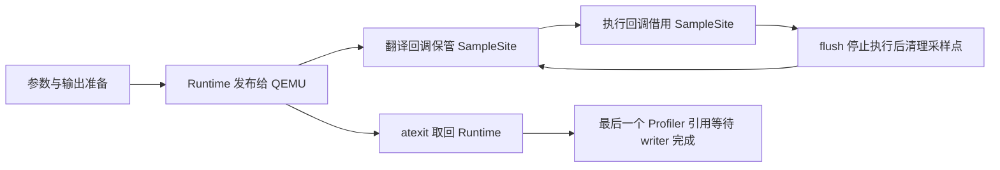

# qperf 的 QEMU API v7 适配

qperf 使用 `src/qemu/ffi.rs` 中的最小绑定连接 QEMU 11.1.1。插件只服务现有采样流程，
不维护通用 QEMU Rust SDK，也不保留 API v4、v5 或 v6 的构建分支。

## 1. ABI 边界

绑定以 QEMU 的 [v11.1.1 头文件](https://github.com/qemu/qemu/blob/v11.1.1/include/plugins/qemu-plugin.h)
和 [插件实现](https://github.com/qemu/qemu/blob/v11.1.1/plugins/api.c) 为依据。
此前的 `qemu-plugin 10.1.0-v2` 不支持该 ABI；上游仅有 v6 的提交同样不能加载到要求 v7 的 QEMU。

### 1.1 版本与布局

`PLUGIN_VERSION` 导出 `qemu_plugin_version = 7`。版本不是兼容开关：`Info`、
`RegisterDescriptor` 及所有回调声明必须同时符合 v7。寄存器描述符包含尾部的
`is_readonly`；漏掉它会使遍历数组时使用错误步长。读取寄存器返回 `bool`，不是旧版的字节数。

QEMU 把寄存器编号及只读位编码进不透明句柄，零也是有效值。`reg::init()` 复制名称，
借用句柄并释放 QEMU 返回的 `GArray`，不解引用句柄，也不把它当作宿主内存分配。

### 1.2 外部内存

`ByteArray` 独占 GLib 分配的可扩容缓冲区。寄存器和客户机虚拟内存读取成功后，
先检查长度再复制到 Rust 切片；失败和成功路径都由析构释放缓冲区。不向 QEMU 传入
由 Rust 栈数组伪装的可扩容 `GByteArray`，也不直接解引用客户机地址。

## 2. 回调生命周期

`Runtime` 是插件实例的唯一状态所有者。QEMU 的
[回调实现](https://github.com/qemu/qemu/blob/v11.1.1/plugins/core.c)
规定 flush 在停止执行后发生，atexit 在执行结束后发生；资源回收依赖这些保证，
而不只是依赖 Rust 的引用计数。

### 2.1 初始化与执行

`qemu_plugin_install()` 先解析参数、检查目标并创建 `Profiler`，全部可失败准备完成后
才发布装箱的 `Runtime`。初始化错误返回非零值；Rust 恐慌不跨越 C ABI。
各 vCPU 的初始化回调枚举寄存器，线程局部的 `REGISTERS` 再按 vCPU 编号区分句柄，
兼顾多线程 TCG 和一个线程执行多个 vCPU 的情况。退出回调移除对应项。

`on_translate()` 只在 QEMU 保证有效的翻译回调期间读取 TB 和指令指针。
采样点保存 `Arc<Profiler>` 和 PC，不保留 TB 或指令指针。`on_execute()` 只借用
采样点；FP 模式注册 `R_REGS`，leaf 模式注册 `NO_REGS`。采样时间锁和统计计数
仍由 `Profiler` 管理，写线程不会读取 vCPU 寄存器或客户机内存。

### 2.2 回收与退出

`Runtime::sites` 保存稳定分配的采样点，即使容器扩容也不会改变 `userdata` 地址。
`on_flush()` 在 QEMU 停止所有旧翻译块执行后释放它们。`on_exit()` 取回唯一的
`Box<Runtime>`；最后一个 `Profiler` 引用释放时，通过 `Shutdown` 消息等待写线程
排空样本并完成统计输出。没有后台任务在退出后继续使用 QEMU 提供的内存。

其所有权转移过程为：

## 3. 验证与迁移

`.github/ci/checks/workspace.toml` 的 `test-qperf` 在项目容器中构建本地插件和分析器。
不通过改动外部 harness kit 或放宽 QEMU 版本检查实现迁移。

### 3.1 回归责任

`tests/qemu_load.py` 直接让 QEMU 加载插件并通过 QMP 退出，保护实际 ABI 和错误传播；
旧 v5 插件必然因最低 API v7 要求失败。`tests/reg.rs` 保护描述符布局。
`tests/qemu_sample.py` 在真实 QEMU 中执行双线程 C 工作负载，验证四种采样组合、
有效样本、零丢失和零采样失败，并要求 FP 栈恢复工作负载的调用者。
小型 TCG 缓存同时增加翻译块回收压力，但不将它当作性能基准。

### 3.2 用户流程

`cargo xtask starry perf` 还需要在 x86_64、riscv64 和 loongarch64 完成实际内核剖析，
验证停止标记、原始数据、非空 folded 栈及报告。LoongArch 的 UEFI 镜像必须通过
OVMF 和 `BOOTLOONGARCH64.EFI` 启动，不能传给直接内核加载器。
原始样本仍为格式 v3，分析器和报告后处理的输入不变。

回滚绑定到旧 API 会恢复旧 QEMU 的构建要求，不能继续宣称支持 11.1.1。
本次不涉及持久数据迁移；macOS 动态符号解析保留构建支持，运行验证以 Linux 宿主为准。
新增 FFI 和回调回收代码需要领域审查后才能合入，运行通过不能替代安全性审查。
