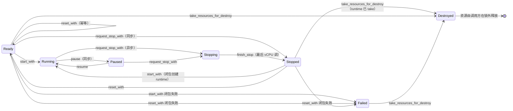
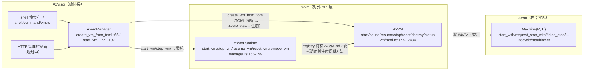

# axvm VM 生命周期实现者视图：内部状态图、Runtime 双维度与锁语义

实现者视角的内部细节文档，配套 [`lifecycle.md`](lifecycle.md)（API 使用指南，面向调用公共 API 的
VMM/控制面）。本文档回答四类实现问题：**状态到底带着什么资源跑**（§1 双维度）、**Machine 的完整
内部转换图**（§2）、**runtime 何时创建/回收/被取走**（§3 runtime 生命周期）、**哪些状态在锁内
不可观测**（§4）；并附**逐条对照源码的转换规则表**（§5）与**外部接口文件对照**（§6）。源码定位
以符号名和相对路径为准；开发分支持续前进，文中行号仅用于辅助定位，不能代替对当前实现的核对。

> **定位：** 本文档的读者是修改 `src/lifecycle/`、`src/runtime/`、`src/vm/` 的开发者与上层 VMM
> 中需要深入状态内部（而非只消费 `VmStatus` 投影）的实现者。只消费公共 API 的控制面开发者读
> [lifecycle.md](lifecycle.md) 即可。

## 1. Machine 状态与 Runtime 双维度

`Machine<R, H>` 的状态不仅编码"生命周期阶段"，还携带**两组资源**，两组资源**独立变化**（不总是同步翻转——典型例子：`take_stopped_runtime` 单独取走 runtime 而 resources 保留）：

- **R（生命周期资源，`AxVMResources`）**：vCPU 列表、设备集合、中断结构、客户机地址空间。
  `Ready`/`Running`/`Paused` 时始终为 `Some`；进入 `Stopped`/`Stopping` 后为 `Option`（因为
  teardown 路径要能丢弃）；`Failed` 亦持 `Option`——失败的重建把资源集留在状态里，由后续
  `destroy()` 在锁外回收（§3.3）；`Destroyed` 后随状态一起被丢弃。
- **H（runtime 资源，`Arc<VmRuntimeHandle>`）**：只在运行态存活。结构定义于
  `src/vm/mod.rs`，关键字段：
  - `wait_queue`：vCPU park/唤醒队列。**pause 不主动 park vCPU**：vCPU 在下一次 VM-exit
    观察到 `suspending()` 后自行 `wait_for(!suspending)` 入队（vcpus.rs:637-645）；resume 时
    runtime 的 `notify_all` 才唤醒；`notification_generation` 同时封住“检查后、入睡前”发布事件的
    lost-wakeup 窗口；
  - `vcpu_threads`：`Mutex<VcpuThreadRegistry>`，分开保存 `active` 与 `retired` vCPU thread；后者
    暂存不能由自身 join 的退出 thread，交给后续 CPU_ON 或 VM 清理路径回收；
  - `irq_dispatcher`：`VcpuIrqDispatcher`，是 runtime 中唯一的 vCPU 中断缓冲。每个 vCPU 队列绑定
    当前 thread id 形成的 owner generation，同时持有逻辑 pending 队列与 `kick_pending` 物理
    doorbell 边；vCPU drain 逻辑队列时即确认该边，entry 前的 IRQ 关闭区负责封住新的发布竞态
    （生命周期见 §3.2）；
  - `running_halting_vcpu_count`：`AtomicUsize`，正在退出的 vCPU 计数（`finish_stop` 依赖它）。

### 1.1 各状态携带的资源（`src/lifecycle/machine.rs:6-42`）

| `Machine` 变体 | `VmStatus` | resources (R) | runtime (H) | 说明 |
|------|-----------|---------------|-------------|------|
| `Ready(R)` | `Ready` | `Some` | 无 | 已创建未启动 |
| `Running { resources, runtime }` | `Running` | `Some` | `Some` | 运行中 |
| `Pausing { resources, runtime }` | `Pausing` | `Some` | `Some` | **不可达的预留变体**：无任何转换函数构造它（machine.rs:12-15）；`status()` 仍显式映射 `VmStatus::Pausing`（machine.rs:49），见 §4 |
| `Paused { resources, runtime }` | `Paused` | `Some` | `Some` | 暂停中 |
| `Stopping { resources, runtime, reason }` | `Stopping` | `Option` | `Option` | 异步停止中；类型级 `Option` 与 `Stopped` 对称（供 teardown 移动），当前构造点恒 `Some`（machine.rs:311-315） |
| `Stopped { resources, runtime, reason }` | `Stopped` | `Option` | `Option` | **两个字段独立变化，见 §1.2** |
| `Destroying` | `Destroying` | 无 | 无 | `take_resources_for_destroy` 的入口占位（machine.rs:515）；每个分支随即改写为 `Destroyed` 或还原原状态，锁释放后不可观测（§4） |
| `Destroyed` | `Destroyed` | 无 | 无 | 终态 |
| `Failed(String, Option<R>)` | `Failed` | `Option` | 无 | resources 仅在失败时保留：`Ready`/`Running`/`Paused`/`Stopped` 的失败转换都会把它存进状态（`start_with`/`stop_with` 的闭包失败分支，machine.rs:128/:225）。锁内不可取，只能经 `take_resources_for_destroy` 交给锁外回收（§3.3）；`resources()`/`resources_mut()` 对它一律返回 `None`，因此失败的 VM 无法 prepare/start |
| `Switching` | `Failed` | 无 | 无 | 转换入口占位（§4） |

### 1.2 `Stopped` 的双维度是"拒绝还是允许 destroy"的根源

`Stopped` 的两个 `Option` **不是同步翻转的**，因此 `Stopped` 状态能细分为三种实际形态：

1. **正常 stop 之后**：`resources: Some, runtime: Some` —— runtime 还活着（vCPU task 等）。
   此时 `take_resources_for_destroy` **拒绝**（machine.rs:565-580），必须先 `take_stopped_runtime`
   （machine.rs:393）把 runtime 取走。
2. **`take_stopped_runtime` 之后**（vm 层 destroy/reset 内部）：`runtime: None`，resources 仍在。
   此时 `take_resources_for_destroy` 接受（machine.rs:581-588）。
3. **teardown 丢弃 resources 后**（类型级预留形态）：`resources: None`。**当前无任何构造点会
   造出此形态**（所有 `Stopped` 构造都填 `Some`，machine.rs:291/:362）。若真出现：
   `take_resources_for_destroy` 仍接受（machine.rs:581-588 的 `Stopped{runtime:None, ..}` 分支
   返回 `Ok(None)`），`reset_with`/`start_with` 走 `other` 兜底 → `InvalidTransition`
   （machine.rs:490/:166）。
   此形态是类型系统允许的**防御性分支**：实现者可假设正常路径下 `Stopped.resources` 恒为 `Some`，
   但 `take_resources_for_destroy` 的 match 不做此假设。

这就是"`Stopped` ≠ runtime 不存在"的底层来源（API 使用指南 §2 对 `Stopped` 的定义只承诺"所有
vCPU 已退出、VM 资源仍保留"，不承诺 runtime 已回收）：**是否可 destroy 由 `Stopped` 的 runtime
维度决定，不由状态字符串决定**。同理，`start()` 从 `Stopped` 重启时，
vm 层先 `take_stopped_runtime`（vm/mod.rs:1774）把旧 runtime 清掉，再调 `start_with`
（否则 `Stopped{runtime: Some}` 会被判 `InvalidTransition`，machine.rs:150-165）。

两个访问器细节：`Machine::runtime()` 对 `Stopped` **一律返回 `None`**（machine.rs:86-94）——运行时
字段虽可能为 `Some`，只能经 `take_stopped_runtime()`（machine.rs:393-398）取走，不能经 `runtime()`
读取。`take_stopped_runtime()` 只在 `Stopped` 有效，`runtime.take()` 后置 `None`，第二次调用返回
`None`（幂等）；vm 层调用点：`stop_and_join_runtime` 尾部（vm/mod.rs:1974-1976，取走后
`join_all_vcpu_tasks`）与 start-from-Stopped（vm/mod.rs:1774-1776）。**调用者应检查返回值**：第二次
调用返回 `None` 是正常幂等行为，不应视为错误（勿 `let h = take_stopped_runtime().unwrap()`）。
**take 先于 join 的原因**：vCPU task 在入口处已 clone runtime handle（vcpus.rs:480-483），后续只经该
clone 访问 runtime、不再引用 machine 字段——先 take 不影响它们的访问，且立即满足
`take_resources_for_destroy` 的 `Stopped{runtime:None}` 前置；join 仅等 task 函数返回（锁外）。

### 1.3 为什么"`Running` 不保证 vCPU 已执行"也是双维度问题

`Running` 的语义是"runtime 已创建、vCPU task 已入队（vm/mod.rs:1801 的
`add_vcpu_task`）"，**不是"guest 已执行"**。在协作式调度下，`start()` 返回时
vCPU task 可能还没被调度器选中跑过（§3 展开）。这与 `Stopped` 类似：**状态字段反映的是
状态机与 runtime 的所有权，而不是执行面的即时事实**。API 使用指南把它概括为"`Running` 表示
启动请求已完成，但不保证 guest 已执行第一条指令"（lifecycle.md §2）。

## 2. 内部状态机转换图（`Machine<R, H>` 视角）

与外部状态图（lifecycle.md §3）同态，但标注的是内部转换方法与 vm 层操作。**外部只观测 `VmStatus`
投影**（`Machine::status()`，machine.rs:45-58），本节是投影背后的实现；外部视角的合并简写
（`start()` 一步、`reset()` 一步）对应的分解见本图。

> 幂等自环（`Stopped → Stopped`、`Stopping → Stopping`、`Destroyed → Destroyed`）见 §5 转换表；
> 预留态 `Pausing`（无任何转换写入）与转换入口占位态 `Switching` 见 §4；`Stopped` 的 runtime
> 维度（`Some`/`None`）见 §1。图中 `Stopped → Ready: reset_with` 与 `Ready → Ready: reset_with`
> 是 machine 层真实转换；但 `reset()` 的对外契约是 `→ Running`（lifecycle.md §4），vm 层在
> `Ready` 后继续 `prepare → start`，`Ready` 只是不可观测的中间态（§3.4）。
> **`start_with` 的闭包提交 runtime `H`**（`VmRuntimeHandle::new()` 在 vm/mod.rs:1784，闭包在
> :1823-1826），但它只接受
> `Stopped{runtime: None}`——`{runtime: Some}` 返回 `InvalidTransition`（machine.rs:150-165）。
> 因此 vm 层 `start` 会先 `take_stopped_runtime`（vm/mod.rs:1774）清空 runtime，再调
> `start_with`（详见 §3）。
>
> **转换闭包失败统一进入 `Failed` 并保留资源集**：`start_with`/`stop_with`/`reset_with` 的闭包失败都
> 在同一临界区内写入 `Failed`（machine.rs:128/:225 与 `reset_with` 的对应分支），并把该转换持有的
> resources 一起存进状态。保留而不是就地 drop 有两个原因：闭包在 `start_with`/`reset_with` 调用者
> 持有的 IRQ-safe 锁内运行（§4），就地 drop 会在临界区触发设备析构，而设备析构可能 join worker
> 线程；并且 `Failed` 是"不可复用、须 `destroy()` 后重建"的终态，调用者需要一条能把这批资源交给
> 锁外清理的路径（§3.3）。`Switching` 是唯一的例外：它不带资源，因此**只有**在锁语义被破坏、
> `Switching` 泄漏时才不可观测地映出 `failed`（§4），正常失败路径都落在可销毁的 `Failed` 上。

**destroy 不是 `Machine` 的一步转换**：`Machine` 只直接接受 `Ready`/`Stopped{runtime: None}`/
`Failed` 的 `take_resources_for_destroy`（见 §3.3）；运行态先由 `vm::destroy` 强制静默到 `Stopped` 并
`take_stopped_runtime` 后才销毁。`vm::destroy` 从运行态发起时**复用图中已有的边**——`Running`/
`Paused → Stopping`（`request_stop_with`）与 `Stopping → Stopped`（`finish_stop`），不引入新边：
`stop_and_join_runtime` 内部先 `stop(reason)`（进入 `Stopping`，等待期 `status()` 返回
`Stopping`），等最后一个 vCPU `finish_stop` 后才到 `Stopped`，**不存在运行态 → `Stopped` 的一步
跳转**。API 使用指南把它概括为"`destroy()` 是阻塞操作，返回即资源释放完成"（lifecycle.md §4）。

## 3. Runtime 生命周期

### 3.1 runtime 由 `AxVM::start` 新建，再由 `start_with` 提交

`start_with` 的签名是 `F: FnOnce(&mut R) -> AxVmResult<H>`，闭包负责返回待提交的 runtime。
vm 层 `AxVM::start` 先创建主 vCPU task 与 `VmRuntimeHandle`，随后校验
`vcpu_list`/devices/`interrupt_controller`，激活架构设备，再把新 runtime 交给
`start_with` 完成状态转换；转换成功后才 spawn 并登记主 vCPU task。

`start_with` 接受 `Ready` 或 `Stopped{resources: Some, runtime: None}`；
`Stopped{runtime: Some}` 返回 `InvalidTransition`。vm 层从 `Stopped` 启动时先调用
`take_stopped_runtime()` 并 join 旧 vCPU task，再重新 prepare。**“回收旧 runtime + 重建设备资源 +
新建 runtime”被合并成外部视角的一次 `start()`**。

### 3.2 runtime 只在运行态存活

`VmRuntimeHandle` 被文档注释为 "Runtime-only resources owned by Running/Paused/Stopping
lifecycle states"（vm/mod.rs:176）。它随 `start_with` 创建、随 `take_stopped_runtime`/
teardown 回收，`Ready`/`Failed`/`Destroyed` 一律不携带。`reset()` 的"旧 runtime teardown"
即走 `stop_and_join_runtime(Forced)` + `take_stopped_runtime`。

**观察性计数器（VM 级聚合，非 per-vCPU）**：`VmRuntimeHandle` 持有一对 VM 级单调计数器
`guest_entry_count` / `guest_park_count`（均 `AtomicU64`），由 VM 内**所有** vCPU thread 共享
递增，不是每个 vCPU 各一份：
- `guest_entry_count`：仅在 `run_vcpu` **成功返回后**由 vCPU run loop 调用 `inc_guest_entry`
  递增；`Err` 分支（bind/`before_vcpu_run`/`vcpu.run()`/退出处理失败、guest 从未运行）**不**
  递增。reset 重建 runtime 时归零。
- `guest_park_count`：仅当 vCPU 在 suspend wait 的等待条件中真正 park（持锁、入队前发布，
  vcpus.rs 的 `wait_for` 闭包内 `inc_guest_park`）时递增；resume 抢跑使 vCPU 从未 park，则不递增。
- 语义边界：两者都是 VM 级聚合弱信号——证明"至少一个 vCPU 有进展"，**不是**"全部 vCPU/设备/
  timer 已 quiesce"的强保证，也**不是**暂停完成确认 API（与 lifecycle.md §3 `pause()` 无确认 API
  一致）。HTTP 控制面用它们区分"真实重入/真实 park"与"仅状态翻转"，但不应据此断言执行面已静默。

**dispatcher 随 runtime 生死：** `queue_interrupt`（runtime 层**内部接口**，`pub(crate)`，由 crate
内设备模拟/中断控制器调用，**非 `AxVM` 公共 API**）只在 VM 处于 `Running`/`Paused` 时接受新中断，
否则返回 `BadState`（即 `AxVmError::InvalidState` 的宏关键字；lifecycle.md §5 用 `InvalidState` 指同一
变体）。`VmInterruptSender` 只保存 `Weak<AxVM>`，每次发送都在同一把 machine lock 下取得当前
runtime，不缓存可能跨 stop/start/reset 失效的 dispatcher。

每个 vCPU thread 注册时，runtime 先把 `thread.id().as_u64()` 作为 owner generation 注册到
dispatcher，再将 thread 发布到 `vcpu_threads.active`。中断发送先从 active 表取得
`(owner, pCPU)`，再用同一个 owner 入队；若 vCPU 已退出并以同一 vCPU id 重建，dispatcher 会拒绝旧
producer 的过时代次，避免把旧生命周期的中断发布进新队列。退出时对应 owner 的 pending 与 kick
状态一并清理；自身不能 join 的 thread 先移入 `retired`，由后续 CPU_ON 或 VM-wide cleanup 在其他
thread 上 join。

发送顺序是 **publish logical pending → notify wait queue → physical IPI doorbell**。队列把同一中断源
合并为一个逻辑 pending owner，并以 `kick_pending` 合并物理 doorbell：只有 `false → true` 的发送者
需要发 IPI；同一轮 drain 前的重复发布不会重复敲物理 IPI。vCPU 每次 guest entry 前在自身 thread 上
drain dispatcher，通过架构注入接口把事件转交给 VGIC/vLAPIC 等 backend，并在 drain 时确认本轮
`kick_pending`；backend pending 与物理 doorbell 生命周期彼此独立。随后 vCPU 关闭本地 IRQ，再在
dispatcher 锁下复查队列：复查前发布的事件使本次 entry 重试，复查后发布的事件所触发的 IPI 保持
pending 并迫使 guest 退出。这与 Linux KVM 的“关闭 IRQ → 发布 in-guest → 复查 request”顺序等价，
封住“最后一次 drain 后、真正 VM-entry 前”的 lost-kick 窗口。所有跨 CPU doorbell 最终都经
axruntime/ax-ipi 的共享 DeliveryEdge，逻辑 pending 状态与物理 IPI 不形成第二套计数路径。

**并发时序**：准入检查调用 `vm.status()` → **同一把 machine lock**（§4），**不存在独立于 machine
lock 的生命周期原子标志**——若 `request_stop_with` 此刻正持锁转换，`queue_interrupt` 等锁释放后
读到 `Stopping` 而拒绝；时序是“stop 转换持锁 → queue 等锁 → 读到已翻转状态 → 拒绝”，两操作无
状态翻转竞态（最终以转换完成后的状态为准）。因此：
- 调用者收到 `BadState` 表示 VM 不再接受中断，应**丢弃**该中断（不重试）。
- pause 后中断仍被缓冲、resume 后注入。
- 进入 `Stopping` 后**新中断被拒**，但**已缓冲中断不会在进入时立即丢弃**——`Stopping` 期间
  runtime 仍为 `Some`（§1.1），dispatcher 仍在；vCPU 若在退出前再跑一次仍会 drain 剩余中断。
  真正丢弃发生在 vCPU owner 清理或 **runtime 被回收时**（`take_stopped_runtime` 或 destroy 清理
  闭包），而非状态翻转时。
- start/reset 重建 runtime → 空缓冲。

### 3.3 destroy 前置条件：必须已把 runtime 取走

`take_resources_for_destroy`（machine.rs:514-598）是 destroy 的 machine 层入口：它只做状态提交
并把 resources 通过返回值交给调用者，真正的清理由调用者在 machine 锁释放后完成。它只接受：
- `Ready`（无 runtime，直接交出 resources）；
- `Stopped { runtime: None }`（runtime 已取走，交出剩余 resources）；
- `Failed(_, resources)`（交出失败转换保留的资源集；该字段是 `Option`，当前所有构造点都填
  `Some`，见 §2）；
- `Destroying` / `Switching`（无可交出的 resources，返回 `Ok(None)`）——两者都是**防御性**分支
  （正常锁语义下不可达，见 §4）；
- `Destroyed`（幂等，machine.rs:517-520）。

它**拒绝** `Running`/`Pausing`/`Paused`/`Stopping`/`Stopped { runtime: Some }`
（machine.rs:525-580）。因此运行态 destroy 是**两步**：vm 层先
`stop_and_join_runtime(Forced)` **阻塞**等 vCPU 退出、`take_stopped_runtime` 清 runtime
（vm/mod.rs:2494-2526），再调 `take_resources_for_destroy`。`Stopping` 状态由 vm 层兜底（machine
层对 `Stopping` 的入口拒，:549-564）：`stop_and_join` 对 `Stopping` 直接 notify 并等
vCPU 退出，不重复请求 stop。API 使用指南把这段概括为"`destroy()` 是阻塞操作，从运行态销毁会
等待 vCPU 退出"（lifecycle.md §4）。

**状态先提交、清理后执行：** 每个接受分支都在锁内 `replace(self, Machine::Destroying)` 之后
立刻写入 `Machine::Destroyed`（machine.rs:515/:518/:522/:586/:594），再把 resources 经返回值交给
调用者；调用者在 machine 锁释放后才执行清理（`AxVM::cleanup_resource_set`，vm/mod.rs:2528）。这样
做的原因是设备 teardown 可能 join worker 线程（文件后端 virtio-blk 持有一个），而 machine 锁是
IRQ-safe、持锁即关中断，在临界区内 join 会以 `TaskError::UnsafeContext` 失败而不是等待。

**清理失败的可见语义：** 清理失败时 `AxVM::destroy` 返回 `Err`，但 machine 已经是 `Destroyed`、
resources 也已交出并随局部变量 drop。重试 `destroy()` 命中 `Destroyed` 快速路径，不重做清理
（vm/mod.rs:2521-2524），因此调用者不应把那个 `Ok` 当作"清理已完成"的证据；旧实现里"清理失败后
卡在 `Destroying` 供重试"的路径已不存在。

**并发 `destroy()` 串行化（`destroy_gate`）：** `AxVM` 持有的 `destroy_gate: StdMutex<()>`
（vm/mod.rs:1429）在 `destroy()` 第一行取锁并全程持有，因此后到的调用会等前一个调用**连锁外清理
一起**结束后才返回 `Ok`，lifecycle.md §1 的"成功返回即清理完成"对并发调用同样成立。串行化的必要
性来自 VM id 复用：`cleanup_resource_set` → `teardown_ivc_bindings`（vm/mod.rs:1073）在锁外调用
`runtime::ivc::teardown_vm(vm_id)`（runtime/ivc.rs:383），它按 **VM id** 删除全局 IVC 绑定——publisher
与 subscriber 都删；而 `insert_channel` 也以 `(publisher_vm_id, key)` 索引通道
（runtime/ivc.rs:363）。若后到者在前一个清理仍在运行时返回 `Ok`，控制面就会注销并重建同 id 的 VM，
旧清理随后会误拆新 VM 的 IVC 通道。门闩只覆盖 `destroy()`，不参与 `status()` 等其他锁，因此读取状态
不会被删除操作阻塞；`Drop for AxVM` 调 `destroy()` 时该 VM 的引用计数已为 0，不可能有第二个持锁
者，不会自锁。

**`stop_and_join_runtime(reason)` 集中描述**（vm/mod.rs:1940-1978；**全程不持有 machine 锁**，各子步
单次取锁）：
1. `status()` 分派：`Running`/`Paused` → `stop(reason)`（`request_stop_with` → `Stopping`）+
   `notify_all`；`Stopping` → 直接 `notify_all`（幂等，不重复请求 stop）；`Stopped`/`Ready` →
   跳过等待；其他（`Failed`/`Destroyed`/`Destroying`）→ `InvalidState`——正常路径不会到达：
   `vm::destroy` 对 `Failed` 直接走 `take_stopped_runtime` + `take_resources_for_destroy`
   （vm/mod.rs:2503-2506），对 `Destroyed` 直接跳过等待（:2511），均不经 `stop_and_join_runtime`。
2. `wait_until_stopped()`（锁外，最多 10,000 次 `yield_now`，每次迭代 `status()` 单次取锁）。
3. `take_stopped_runtime()`（单次取锁）→ 返回的 `Some(H)` 在锁外 `join_all_vcpu_tasks`。

### 3.4 reset 的前置条件与 `Ready` 瞬态

`reset_with`（machine.rs:412-500）同样**只接受** `Ready`（幂等，:418）与
`Stopped { resources: Some, runtime: None }`（:428）；`Running`/`Paused`/`Stopping`/
`Stopped { runtime: Some }` 一律 `InvalidTransition`（:442-489）。`Stopped { resources: None }`
属类型级预留形态，落 `other` 兜底 → `InvalidTransition`（:490-498）。vm 层 `reset`
（vm/mod.rs:1986-2009）对运行态先强制静默到 `Stopped`，再走 `reset_with` → `Ready` 内部瞬态 →
prepare → `start`，所以外部视角 `reset()` 的终态是 `Running`（`Ready` 只是不可观测的中间态）。

**start 与 reset（从 `Stopped` 出发）的实现层差别：** 两者都经 `AxVM::prepare()` →
crate 内部的 `AxVM::prepare_resources_with()` 重建 vCPU/设备/中断结构并执行
`AxVMResources::reset_transient_resources()`。
差别：`reset()` 额外多走一次 `reset_with`（→`Ready` 瞬态），其闭包显式调
`reset_transient_resources`；`start()` 不经过 `Ready`，靠 `AxVM::prepare()` 内部的架构初始化
最终调用 `AxVM::prepare_resources_with()` 完成同等重建。即 `reset` 路径
`reset_transient_resources` 会执行两次（幂等）。

幂等性由实现保证：每次调用都是**完全重建、非
增量**——`devices.take()` 后重置、`address_space.clear()` 后按 `memory_regions`
全量重映射、`vcpu_list`/`interrupt_controller`/`address_layout` 置 `None`；
重复调用等价于单次调用，不积累状态。外部视角二者都是 warm reboot——lifecycle.md §4
已写明 start()-from-Stopped 同样"重新初始化 vCPU/设备/中断架构"、"重映射复用同一批 backing page"，
两份文档一致（不存在"仅重建 runtime"的旧表述）。

**设备集必须带出锁外回收：** `reset_transient_resources`（vm/mod.rs:1036）**返回**它从资源集摘下
的 `Arc<DeviceRuntime>`，而不是在 machine 锁内 drop。设备集此时通常已是最后一个引用，drop 会 join
设备 worker 线程（文件后端 virtio-blk 持有一个），而 machine 锁是 IRQ-safe、持锁即关中断，临界区内
join 会以 `TaskError::UnsafeContext` 失败并最终 abort。`AxVM::reset`（vm/mod.rs:1994-2006）把设备集
放进闭包捕获的局部变量、在锁作用域结束后 drop，这样 `reset_with` 的公开签名仍保持
`FnOnce(&mut R) -> AxVmResult`；`AxVM::prepare_resources_with`（vm/prepare.rs:54-99）则用同样的
捕获写法把摘下的设备集带出锁作用域后再 drop；锁内只做 `reset_lifecycle_devices()`，失败时把设备集
重新挂回资源集，留给后续 reset/destroy 在锁外回收。

## 4. 不可观测状态与锁语义

`Pausing` 与 `Switching` 在锁内、外部观测不到；`Destroying` 同样不可观测——它只是
`take_resources_for_destroy` 的入口占位，每个分支在提交前就把它改写成 `Destroyed` 或原来的状态
（见下表 Destroying 行）。三者"不可观测"的原因各不相同：

| 状态 | 为什么不可观测 | 源码 |
|------|---------------|------|
| `Pausing` | **预留态，无任何转换写入**：变体存在（machine.rs:12-15）但没有任何转换函数构造它；设计意图的 `Running → Pausing → Paused` 异步过渡**未实现**，当前 `pause` 是一步到 `Paused`（lifecycle.md §3 的 `Paused*` 注）。`status()` 仍显式映射 `VmStatus::Pausing`（machine.rs:49）。**结论：不可达的预留变体**——保留成本仅一个枚举项与两处匹配（machine.rs:12-15/:49），删除不改变任何可达转换。**调用者无需特殊处理**：外部代码观测不到 `Pausing`，断言状态时可用 `unreachable!()` 或 `_` 兜底 | machine.rs:12-15 |
| `Switching` | **转换入口占位**：每个转换函数入口第一行都 `core::mem::replace(self, Machine::Switching)`（`start_with` :120、`pause` :179、`resume` :198、`stop_with` :220、`request_stop_with` :287、`finish_stop` :355、`reset_with` :416、`take_resources_for_destroy` :515），执行期间锁一直被持有，`status()` 拿不到锁 → 不可观测。`Machine::status()` 对 `Switching` 的映射是**显式分支** `Switching => VmStatus::Failed`（machine.rs:56），不是 `_ =>` 兜底——这是有意的：万一 `Switching` 泄漏（持锁逻辑出错），外部只会看到 `failed` 而非崩溃。**设计权衡**：把不可观测占位映射为 `Failed`，使泄漏可被调用方当作"转换失败"识别；代价是调用方无法区分泄漏与真实失败 | machine.rs:120/:179/:198/:220/:287/:355/:416/:515；:56 |
| `Destroying` | **入口占位，锁内即被改写**：`take_resources_for_destroy` 第一行 `replace(self, Machine::Destroying)`（machine.rs:515）只是取走 `self` 的手段；每个接受分支都在同一临界区内立刻写入 `Machine::Destroyed`，拒绝分支把原状态写回，因此既拿不到锁、也不留残余可观测。**与旧实现不同，它不再有可达的泄漏路径**：状态在清理开始前就已提交为 `Destroyed`，清理失败只经返回值报告，不改变状态（§3.3） | machine.rs:515、:518/:522/:586/:594 |

**锁语义：** `status()`（vm/mod.rs:1482）与所有转换方法走**同一把 machine lock**——
`IrqSafeMutex<Machine<..>>`（由 `ax_std::os::arceos::sync` 导出），**不可重入**。因此
"转换期间锁被持有 → `status()` 阻塞"是保证不可观测性的机制，不是巧合。这也意味着外部代码
**只能观测到稳定态**（`Ready`/`Running`/`Paused`/`Stopping`/`Stopped`/`Destroyed`）、
**确实失败后**的 `Failed`（machine.rs:128/:225 与 `reset_with` 的闭包失败路径），以及 **状态已提交为
`Destroyed`、但清理失败** 的情形（`AxVM::destroy` 返回 `Err`；§3.3）。转换方法的闭包内任何对
`status()`/`resources()` 的再调用都会在同一锁上重入而死锁（§4.1 第 1 条）。

`wait_until_stopped`（vm/mod.rs:1918-1938）在 machine 锁**外**执行：每次迭代 `status()` 单次取锁、
其余时间 `yield_now`，锁不跨迭代持有——因此 `destroy()`/`reset()` 的等待期间，同一 VM 上其他
task 调 `status()` 可正常返回 `Stopping`（与 lifecycle.md §4 一致）。`IrqSafeMutex`
获取时禁止抢占并保存/关闭本地中断，释放时恢复——持锁期间本地中断
被屏蔽；转换函数与 `status()` 持锁均为短暂（`status()` **持锁后**为 O(1) match；获取锁的等待时间
取决于当前持锁者的剩余执行时间，通常微秒级），对延迟敏感的设备中断影响有限。

### 4.1 观测规则速查

- 转换函数的闭包内部**不要**调 `status()`/`resources()`（死锁风险：同一锁重入）。
- 外部代码断言状态时，只认 `VmStatus` 稳定态；`failed` 要么是 `Switching` 泄漏（bug），要么是
  start/stop 初始化闭包失败（lifecycle.md §5）。
- **`destroy()` 不会把 VM 移出 manager 注册表**（`AxVM::destroy` 只释放资源，vm/mod.rs:2494-2526；
  注册表是 `src/manager.rs:25` 的 `VM_REGISTRY`）。`Destroyed` 后 VM 仍可被 `get_vm_by_id` 找到
  （状态为 `Destroyed`）；须显式 `remove_vm(id)` 才移除（manager.rs:42-47 的 `remove_existing_vm`）。
  因此 `Destroyed` 不是"句柄失效"信号——调用方应**主动 remove**，而不是假设 VM 已不可见。

## 5. 状态转换规则表（逐条对照源码）

API 使用指南（lifecycle.md §4）只给外部操作语义；此处给出每条转换在状态机层的实现与边界条件。
**本表覆盖所有被调用过的转换组合，包括返回 `InvalidTransition` 的非法组合**（这些在 §2 图中无对应
边，图中只画合法可达边）；保留非法组合作为完整性校验参考。

| 转换 | 源码 | 语义 |
|------|------|------|
| `Ready → Running` | `start_with` machine.rs:116 | 同步、原子；无 "starting" 过渡态 |
| `Stopped → Running` | 同上 :132 | 重启 runtime——vm 层 `AxVM::prepare()` → `AxVM::prepare_resources_with()` 重建 vCPU/设备/中断结构并执行 `AxVMResources::reset_transient_resources()`（RAM backing 保留），与 lifecycle.md §4 的 **warm reboot** 一致；vm 层先 `take_stopped_runtime()` 满足 `Stopped{runtime: None}` 前置 |
| `Ready → Stopped` | `request_stop_with` :289 | 同步直达；`Stopped` = runtime 未运行，不表示曾运行过（未启动的 VM 可停止） |
| `Running/Paused → Stopping` | `request_stop_with` :298 | 异步：只置标志即返回 |
| `Stopping → Stopped` | `finish_stop` :354 | 由 vCPU 退出路径调用（vcpus.rs:658-671）。**判定机制**：`mark_vcpu_exiting()` 用 `running_halting_vcpu_count` 原子计数（vCPU 进入运行循环 `mark_vcpu_running` +1、退出 -1，vm/mod.rs:696-717），命中判定条件（`try_update` 结果为 `1`）的那个 vCPU 调 `finish_stop`；失败仅 `warn!`（vcpus.rs:666-668），vCPU 照常退出。该路径依赖 vCPU 真正执行到 VM-exit：若 vCPU task **非正常退出**（如 runtime 缺失，vcpus.rs:480-483）或永不 VM-exit（掩中断忙循环），`finish_stop` 不被调用 → **长期停留 Stopping**（wedged） |
| `Stopping → start` | :166 | `InvalidTransition`，状态不变 |
| `Stopping → resume` | :204 | `InvalidTransition`，状态不变 |
| `Stopping → pause` | `machine::pause` :178 | `InvalidTransition`（`machine::pause` 只接受 `Running`，其余 `status()` 兜底拒） |
| `Stopping → reset` | `reset_with` :442 | machine 层 `InvalidTransition`；vm 层 `reset` 会先经 `stop_and_join_runtime` 等 vCPU 退出到 `Stopped` 再继续（vm/mod.rs:1988） |
| `Stopping → destroy` | vm 层 :2500（machine 层 :549 拒） | `vm::destroy` 允许：对 Stopping 直接 notify + 等 vCPU 退出（stop_and_join）再销毁 |
| `Stopping → request_stop` | :318 | 幂等成功（重复 stop 无害） |
| `Stopped → request_stop` | :330 | 幂等成功（`Stopped` 上 stop 仍是 Ok） |
| `Stopped → finish_stop` | :369 | 幂等成功（`finish_stop` 对 `Stopped` 直接 Ok） |
| `Destroyed → destroy` | `take_resources_for_destroy` :517 | 幂等成功（`destroy` 对 `Destroyed` 直接 Ok） |
| `Running → Paused` | `machine::pause` :178 | 同步；**不 notify、也不主动 park** vCPU——vCPU 在下一次 VM-exit 看到 `suspending()` 后自行 `wait_for(!suspending)`（vcpus.rs:637-645）。锁语义：`vm::pause` 在整个 `suspend_lifecycle_devices()` + `machine.pause()` 期间持锁（vm/mod.rs:1872-1884），外部 `status()` 此时阻塞。这是**设计意图**——设备挂起与状态翻转原子化，避免 `Paused` 已可见但设备仍在 DMA 的窗口。代价：若设备挂起实现引入慢路径（如阻塞 I/O），持锁时间会从微秒级膨胀，阻塞同一 VM 上所有 `status()`/生命周期操作并屏蔽本地中断（§4）；若需把 `suspend_lifecycle_devices()` 移到锁外，须先处理挂起期间 `stop()`/`resume()` 并发的竞态 |
| `Paused → Running` | `resume` :197 + `notify_all_vcpus`（runtime/vcpus.rs:96） | 唤醒 park 的 vCPU |
| `Paused → Stopping` | `request_stop_with` :298 | 异步；`Paused` 只是状态机翻转，vCPU 可能尚未观察到 Paused（仍在 guest 代码中执行）——stop 仍需等 vCPU 在下一次 VM-exit 退出（wedged guest 则无限期） |
| `* → destroy`（运行态） | `vm::destroy` vm/mod.rs:2494 | 先强制静默：`stop_and_join_runtime(Forced)` 阻塞等 vCPU 退出，再 destroy |
| `Ready/Stopped(runtime:None)/Failed → Destroyed` | `take_resources_for_destroy` machine.rs:514 | 直接销毁（`Stopped` 带 runtime 时拒绝，须先 `take_stopped_runtime`）；`Failed` 交出失败转换保留的资源集，由调用者在锁外回收（§3.3） |
| `Ready/Stopped/运行态 → Running`（reset） | `vm::reset` vm/mod.rs:1986；`reset_with` machine.rs:412 | 分步：运行态先强制静默(→Stopped) → `reset_with`(→Ready，仅接受 `Ready`/`Stopped{runtime:None}`，machine.rs:418/:428) → prepare → start(→Running)。`Failed`/`Destroyed` 不可 reset（machine.rs:490 兜底拒） |

**finish_stop 的实现者契约（新增 vCPU 退出路径时核对）：** 任何 vCPU task 退出路径——正常
VM-exit、异常退出、外部取消——都必须保证 `running_halting_vcpu_count` 正确递减，并且**恰好**让
计数命中判定条件（`try_update` 结果为 `1`，vm/mod.rs:709-714）的那个 vCPU 调 `finish_stop`；
计数漏减或无人触发都会让 machine 永久停留 `Stopping`（wedged）。当前已知的唯一未递减路径：runtime
缺失时的 early return（vcpus.rs:480-483，此时 `mark_vcpu_running` 尚未 +1，对称地不递减是正确的）。
新增路径若在 `mark_vcpu_running` 之后提前退出，必须补对称的 `mark_vcpu_exiting` + 判定，否则破坏
上述契约。

**stop_with 与 request_stop_with 的关系：** 两者都是 machine 层 stop 转换入口，但范围不同。
`request_stop_with`（machine.rs:283）是**运行时实际使用的路径**（vm 层 `stop` 调它，vm/mod.rs:1906），
同时覆盖 `Ready → Stopped`（同步，:289）与 `Running`/`Pausing`/`Paused → Stopping`（异步，:298），
并对 `Stopping`（:318）/`Stopped`（:330）幂等。`stop_with`（machine.rs:216）是**只支持
`Ready → Stopped` 的同步变体**，当前**全 crate 无任何调用点**（仅定义，grep 无使用）；其价值仅是
`Ready` 下与 `request_stop_with` 等价。实现者在 `Ready → Stopped` 与 `Running → Stopping` 两条路径上
改动时，先确认改的是 `request_stop_with`。

## 6. 外部接口文件对照与分层关系

API 使用指南（lifecycle.md §3）只给方法名与状态图；此处是定位代码与理解分层的对照
（路径前缀 `src/` = `virtualization/axvm/src/`）。

| 公开方法 | 定义位置 |
|---------|---------|
| `AxVM::new` / `start` / `pause` / `resume` / `stop` / `reset` / `destroy` | `src/vm/mod.rs`（new :1446, start :1772, pause :1872, resume :1888, stop :1904, reset :1986, destroy :2494） |
| `AxVM::status` / `running` / `stopping` / `suspending` / `stopped` | `src/vm/mod.rs`（status :1482, running :1852, stopping :1857, suspending :1862, stopped :1867） |
| `AxvmRuntime::start_vm` / `stop_vm` / `resume_vm` / `reset_vm` / `remove_vm` | `virtualization/axvm/src/manager.rs`（:165 / :170 / :180 / :185 / :195） |
| `axvm::get_vm_list` / `get_vm_by_id` / `register_vm`（自由函数，非 `AxvmRuntime` 方法） | `src/manager.rs`（:54 / :49 / :201） |
| `AxvmManager::create_vm_from_toml`（**AxVisor 侧**，TOML 编排入口） | `os/axvisor/src/manager.rs:65` |

`create_vm_from_toml` 不属于 axvm，是 AxVisor 编排层的入口（os/axvisor/src/manager.rs:65），经
`crate::config::init_guest_vm` 解析 TOML → `AxVM::new`（vm/mod.rs:1446）+ 注册到 `VM_REGISTRY`。

`running()`/`stopping()`/`suspending()`/`stopped()` 都是 `status()` 的**便捷谓词**，每次调用各取一次
machine 锁：`running()` = `Running`（vm/mod.rs:1852）、`stopping()` = `Stopping`（:1857）、
`suspending()` = `Pausing | Paused`（:1862）、`stopped()` = `Stopped`（:1867）。

**分层要点（命名相近、层级不同的两组）：** `AxvmManager`（AxVisor 编排层）负责 TOML 解析、
VM 注册与 shell/HTTP 等管理入口，并持有 `AxvmRuntime` 作为它调用 axvm 能力的句柄
（os/axvisor/src/manager.rs:20-22）；`AxvmRuntime`（axvm 对外 API 层）提供基于 `VM_REGISTRY`
的生命周期便捷封装（manager.rs:165-199），内部委托 `AxVM` 方法；`AxVM` 内部再走 `Machine`
状态转换。即 **Manager 是"编排入口"，Runtime 是"API 封装"**——两者共享名字前缀但分属不同 crate，
新增管理命令时先定位该命令落在哪一层（编排逻辑 → Manager，纯生命周期操作 → Runtime）。
