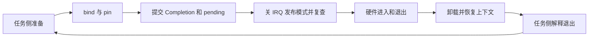
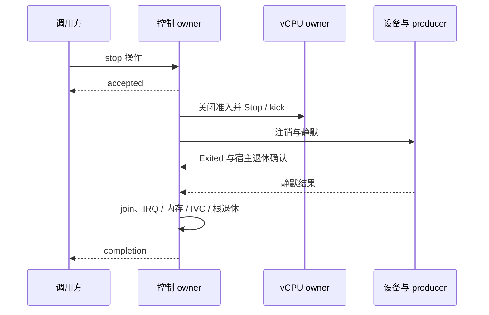

# AxVM 生命周期所有权与退休协议

每个 VM 的 `control::Owner` 独占 `AxVM` 资源与状态，各 vCPU 任务独占可变后端。
`VmHandle` 只提供命令与观察能力。公共后置条件见 [生命周期 API](lifecycle.md)，
架构取舍与接口边界见 [所有权与锁分层](../../../docs/design/axvm-ownership-lock-boundary.md)。

## 1. 所有权与同步

资源是否可释放由参与者确认、producer 静默和宿主任务退休决定。状态快照与计数用于查询，
不取得执行资源所有权，也不能单独证明资源退休。

### 1.1 管理所有者

`src/manager.rs` 的 `VmManager` 拥有注册表与 IVC 服务；`src/control/mod.rs` 的
`Owner` 拥有实例资源、当前操作与 `RunState`。普通命令串行，内部事件在确认等待期间继续处理。

| 对象 | 权威写入者 | 对外能力 |
| --- | --- | --- |
| 注册表与 ID 预约 | `VmManager` | 复制 `VmHandle`，锁外执行操作 |
| 生命周期、资源转换 | `Owner` | mailbox 命令与 `VmOperation` |
| 可变架构后端 | 对应 vCPU owner | 拥有值，硬件入口使用 `&mut` |
| 设备路由 | 一次运行的 `RunServices` | 不可变共享路由与窄端口 |
| IRQ pending／源身份／准入 | `RunSignals` 与底层控制器 | 固定源槽、原子或短 raw 临界区 |
| 查询进展 | `VcpuProgress` | 原子计数，不保留 task 或后端 |

管理状态、mailbox、完成状态及设备普通状态使用睡眠 mutex。生命周期没有一个包围全部
回调的共享 raw 锁；设备操作、join、waker 与资源析构在注册表、mailbox、快照和 raw guard 外执行。

### 1.2 运行与激活身份

`src/identity.rs` 的 `VmKey`、`RunId`、`VcpuInstance` 分别标识实例、运行与 vCPU 激活。
运行代次递增使用受检运算。端口直接绑定 `RunId`，不通过 VM ID 查询当前 runtime。

`ConfirmationReceipt` 同时记录激活与 `OperationId`。过期、重复、其他运行的确认不满足等待；
已经退出的参与者只有在对应激活 join 后才能满足允许退休的静默条件。CPU_OFF 后后端在卸载、
退出和任务退休完成后回到控制 owner；下一次 CPU_ON 预约新激活，由新 owner 初始化并确认启动。

## 2. 进入与退出

`src/vcpu.rs` 的通用 engine 编排硬件窗口，`src/runtime/vcpus.rs` 的 vCPU owner 处理
任务命令与退出服务。四架构保留各自指令、CPU-local 状态与 durable exit 类型。

### 2.1 硬件窗口

engine 在任务侧准备后 bind／pin，提交上次 Completion，消费底层 pending，关闭本地 IRQ，
发布进入模式并用成对屏障复查请求与准入。硬件退出捕获拥有值的记录，再卸载并恢复 CPU／IRQ
上下文；只有之后才解释设备访问、guest 请求和普通服务。

```mermaid
flowchart LR
    Prepare[任务侧准备] --> Pin[bind 与 pin]
    Pin --> Commit[提交 Completion 和 pending]
    Commit --> Check[关 IRQ 发布模式并复查]
    Check --> Hardware[硬件进入和退出]
    Hardware --> Unload[卸载并恢复上下文]
    Unload --> Handle[任务侧解释退出]
    Handle --> Prepare
```

准备与 pin 之间迁移时，AArch64 通过 `entry_cpu_is_ready` 取消本次进入，返回任务侧完成远端
timer activation 交接；已提交 Completion 与 drain 的 pending 不丢失。可恢复错误同样经过卸载，
无法恢复硬件加载状态时遵守原致命处理约定，不能伪造卸载成功。

### 2.2 退出与等待

`VcpuAction` 使退出结果明确变成重入 Completion、等待、控制请求、CPU_OFF 或停止。
MMIO／PIO 在 unbound 任务路径直接访问设备，返回的寄存器效果和 PC 推进于下一次进入提交。
等待谓词只读自身请求、pending 和准入，不查询生命周期 mutex。

控制请求等待期间调用 vCPU 已 unbound，并继续处理 park、stop 与取消。目标 startup 取消有
显式握手，过期成功确认不能重新打开准入。最后一个 vCPU 退出仅报告事件，停止终态由 owner
在设备、IRQ、内存访问与任务资源全部退休后提交。

## 3. 生命周期事务

`src/control/lifecycle.rs` 负责准备、启动、暂停恢复及停止；
`src/control/participants.rs` 负责后端转移、确认与回收。资源失败时保持 owner 与关闭入口。

### 3.1 暂停与恢复

pause 发布 `Pausing`，关闭进入准入并 kick，收齐参与者 park 确认，随后静默端口及设备后台
执行，才发布 `Paused`。AArch64 `suspend_vcpu` 退休宿主 timer activation 并 disarm 等待，
保存 guest 寄存器与控制器 pending／active 状态。

resume 恢复设备和端口，等待参与者恢复确认，再打开准入并唤醒。失败执行反向补偿，补偿失败
保留 `Failed` 和关闭入口。运行计数不承担确认责任；生命周期完成与首个客户机执行进展分别观察。

### 3.2 停止与销毁

stop 先关闭进入与新 IRQ 发布准入，给全部参与者发布 Stop 并 kick，再注销外部 producer，
停止设备与后台工作。owner 泵送事件、join 精确激活，等待 IRQ 回调及内存访问结束，退休 worker、
IVC 与翻译根后丢弃运行对象，发布 `Stopped`。

```mermaid
sequenceDiagram
    participant Caller as 调用方
    participant Owner as 控制 owner
    participant Vcpu as vCPU owner
    participant Devices as 设备与 producer
    Caller->>Owner: stop 操作
    Owner-->>Caller: accepted
    Owner->>Vcpu: 关闭准入并 Stop / kick
    Owner->>Devices: 注销与静默
    Vcpu-->>Owner: Exited 与宿主退休确认
    Devices-->>Owner: 静默结果
    Owner->>Owner: join、IRQ / 内存 / IVC / 根退休
    Owner-->>Caller: completion
```

失败的 producer 退休即使当前没有访问租约也不能授权 unmap 或释放 backing。
失败运行保留全部必要资源供重试。destroy 完成停止后交给 `ControlExit`，宿主任务退出链在 owner
及其栈退休后完成资源释放与实例注销，owner 不自行 join；重复 destroy 共享原实例退休结果。

## 4. 内存与跨 VM 服务

`src/control/memory.rs` 在任务上下文准备完整新根，`GuestMemoryPort` 用访问租约固定
revision 与 backing。普通服务只提供受控复制与 scoped DMA，不返回客户机内存的 Rust 引用。

### 4.1 翻译根切换

内存操作准备新映射、页表与 backing，关闭 vCPU 准入并收齐静默确认，暂停 producer，关闭
新内存访问并等待在途租约，然后向 owner 安装新根。所有可能缓存旧翻译的 pCPU 失效确认完成后，
发布新 `MemoryRevision`，退休旧根与被移除 backing，再按原状态恢复。

准备失败不改变原运行；安装或失效失败保留新旧根和资源、保持入口关闭。直通设备缺少 DMA
撤销能力时明确拒绝更新，不能以 guest CPU 静默代替 DMA 静默。

### 4.2 IVC 退休

`src/runtime/ivc.rs` 的通道表归 manager 所有，发布者使用 `VmKey`，通知端口绑定目标
`RunId`，guest ABI 保持原 VM ID 与 channel key。

端点先关闭新操作，owner 撤销自身映射并确认翻译失效，释放 aperture 后提交通道绑定移除。
共享页由最后一个 backing owner 释放；一个 VM 退出不能释放另一 VM 仍持有的共享页。
跨 VM 通知在通道表锁外使用已绑定端口发送。

## 5. 验证证据边界

组件测试保护受控交错中的确认、取消、回滚、操作等待、内存租约和 IVC backing 所有权。
系统测试保护实际 scheduler、硬件进入、IRQ、timer、文件 worker 与控制面装配。

### 5.1 组件协议

`src/control/confirmations.rs` 验证陈旧确认不完成操作，`src/operation.rs` 验证同步／异步观察
与通知，`src/manager.rs` 的测试验证命令接收与实例退休协议。确定性错误测试须证明同一判定在
错误实现上失败；纯锁改名复用原生与 bridge 测试，不增加源码扫描或字段回读测试。

### 5.2 真实运行

Axvisor 的 `http-control-plane` 覆盖完整管理旅程，GICv2／v3 timer、RISC-V SMP IPI、x86
VMX／SVM 和 LoongArch LVZ 用例分别验证硬件契约。使用 `cargo xtask` 入口，构建成功、组件
模型或其他架构通过均不能代替目标真实运行。当前执行记录与尚未验证的板卡应在 PR 中逐项说明。
