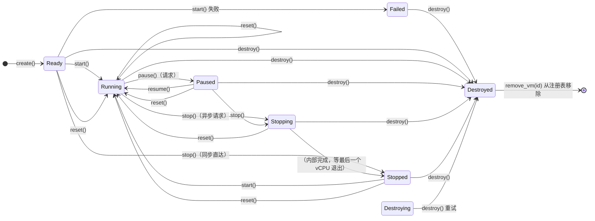

# axvm VM 生命周期模型（API 使用指南）

面向调用 axvm 公共 API 的 VMM 与控制面（shell 命令、HTTP 管理面、CLI、其他 VMM 等）。本文档
回答一个问题：**调用某个生命周期方法后，状态如何变化、什么时候算完成**。只讲对外可观测的契约，
不含实现细节。

> **涉及文件**
>
> - `src/vm/mod.rs` —— `AxVM` 公共生命周期 API 的实现（`new`/`start`/`pause`/`resume`/`stop`/
>   `reset`/`destroy`/`status`）。
> - `src/lifecycle/status.rs` —— 对外枚举 `VmStatus` / `StopReason` 的定义。
> - [lifecycle-internals.md](lifecycle-internals.md) —— 实现者视角：`Machine<R,H>` 状态机、转换
>   方法、runtime 资源双维度、锁语义与源码级行号对照。

## 1. Overview

**axvm 的控制状态转换是同步的；部分操作涉及异步的执行面收敛。**

- `start()` / `resume()`：**同步**，返回即完成状态转换。
- `reset()` / `destroy()`：**同步阻塞**操作。成功返回时保证清理完成、达到目标状态；失败返回时
  不保证（如停止等待超时返回 `AxVmError::InvalidState`，见 §4）。阻塞是**协作式等待**：调用 task 通过
  `yield_now`/`join` **让出 CPU** 等 vCPU 退出，不忙等；但完成时机不固定（见 §4）。
- `stop()` / `pause()`：**状态立即更新**（`Stopping`/`Paused`），但执行面收敛由运行中的 vCPU
  异步完成，调用方无法预知何时生效。

**状态是"请求已接受"的信号，不是"执行面已静默"的确认**：禁止中断并持续执行 guest loop 的 guest
永不 VM-exit → 状态声称 `Paused`/`Stopping` 而 vCPU 实际仍在跑（wedged）。需要确认完成的操作
（`stop()` 须轮询到 `Stopped`；`destroy()` 是阻塞调用，返回即见结果）依赖 vCPU 是否真正收敛。

最典型的误用：把 `stop()` 的返回当成停止完成。`stop()` 返回只表示请求已接受（`Stopping`），
`Stopped` 要等最后一个 vCPU 退出；wedged guest 可能让 `Stopping` 无限期停留。正确做法见 §7。

## 2. VM states

状态由 `AxVM::status()` 返回（`VmStatus`）。实际运行中只能观测到下列 8 个状态：7 个常规稳定态 + 1 个异常可观测态 `Destroying`（仅 `destroy()` 资源清理失败时出现，见 §4）。创建用
`AxVM::new(config)`（→ `Ready`，见 §7）；`new()` 本身不注册到全局注册表，注册由 manager
（`register_vm` / AxVisor 的 `create_vm_from_toml`）完成。

| 状态 | 含义 |
|------|------|
| `Ready` | 已创建，尚未启动 |
| `Running` | `start()` 已完成，VM 进入运行状态，可接受 `pause()`/`stop()`/`reset()`/`destroy()` 请求；**不保证 guest 已执行第一条指令** |
| `Paused` | 暂停请求已接受（置暂停标志并挂起设备，vCPU 会停止执行 guest 等待 `resume`）；**不保证暂停已完成** |
| `Stopping` | 停止请求已接受，执行面收敛中 |
| `Stopped` | 所有 vCPU 已停止执行 guest（vCPU 运行循环已结束），VM 不再执行 guest；**VM 对象与资源（内存/vCPU 后端/设备）仍保留**（runtime 是否已回收是内部细节，API 不承诺），可通过 `start()`/`reset()`/`destroy()` 继续管理 |
| `Destroying` | **异常可观测态**（仅 `destroy()` 资源清理失败时停留于此，见 §4）；重试 `destroy()` 可到 `Destroyed`，属可恢复 |
| `Failed` | 生命周期进入失败状态，不能继续启动或恢复；需 `destroy()` 后重新创建 VM |
| `Destroyed` | VM 已销毁，不能继续使用；重复 `destroy()` 幂等接受（返回成功、无副作用） |

> `pausing` 是内部瞬态，正常完成时观测不到（瞬态发生在持锁期间，`status()` 须等锁释放，因此只
> 返回释放后的稳定态）；`Destroying` 平时同是瞬态，但 `destroy()` 资源清理失败时会停留并变为可
> 观测（见上表该行与 §4）。`Failed`/`Destroyed` 是**终态**；`Stopped` 是**静默态**（quiescent），
> 不是终态——可 `start()`/`reset()` 恢复。
>
> `destroy()` 释放 VM 资源（→`Destroyed`），但**不从全局注册表移除**；`remove_vm(id)` 才移除
> （此后 `get_vm_by_id(id)` 返回 `None`）。`remove_vm` 对不存在或已移除的 id 返回 `None`
> （幂等，不报错）。`Destroyed` 状态的 VM 仍可通过 `get_vm_by_id` 查到。

### 2.1 Allowed operations

控制面校验请求时以本表为准；状态不满足转换条件时返回 `InvalidTransition`（§5），状态不变。

| 状态 | 允许的操作 |
|------|-----------|
| `Ready` | `start()` / `stop()` / `reset()` / `destroy()` |
| `Running` | `pause()` / `stop()` / `reset()` / `destroy()` |
| `Paused` | `resume()` / `stop()` / `reset()` / `destroy()` |
| `Stopping` | `destroy()`（强制删除路径，阻塞等待停止完成） / `reset()`（先等 stop 完成） |
| `Stopped` | `start()` / `reset()` / `destroy()` |
| `Destroying` | `destroy()`（重试；内部不再重复清理，§4） |
| `Failed` | `destroy()` |
| `Destroyed` | `destroy()`（幂等 no-op：重复调用返回 `Ok`、状态不变） |

> 上表列出**控制面推荐使用路径**。从 `Stopping` 直接 `destroy()` 是支持的**强制删除路径**
> （内部阻塞等待停止完成）；控制面也可先 `stop()` 轮询到 `Stopped` 再 `destroy()`。两种模式
> 都合法（见 §4）。
>
> **重试安全（当前实现已验证，供重试逻辑参考）**：`stop()` 在 `Stopping`/`Stopped` 上重复调用
> 返回 `Ok`（状态不变）。`destroy()` 在 `Destroyed` 上的幂等 no-op 已列主表。

## 3. Lifecycle diagram



文本版（不支持 mermaid 的阅读器）——状态转换一览（每个操作列出"从哪些状态出发 → 到哪个状态"）：

```
  create()          → Ready
  start()           → Running    从 Ready / Stopped（同步）
  pause()(请求)      → Paused     从 Running；状态立即更新，不保证 vCPU 已暂停
  resume()          → Running    从 Paused（同步）
  stop()(异步请求)   → Stopping   从 Running / Paused；须轮询 status() 到 Stopped
  stop()(同步直达)   → Stopped    从 Ready
  （内部完成）        → Stopped    Stopping 等最后一个 vCPU 退出后进入
  start()（重启）    → Running    从 Stopped
  reset()           → Running    从 Ready / Running / Paused / Stopping / Stopped（见 §4）
  destroy()         → Destroyed  可从任何状态发起（含 Failed；成功时，失败返回错误，见 §4）
  destroy()（重试）  → Destroyed  从 Destroying（资源清理失败后的异常可观测态，见 §4）
```

> `Paused*`：**仅状态机翻转，不保证 vCPU 已暂停**（*state transition only, vCPU quiescence not
> guaranteed*）。图中 `destroy()` 边是**一步简写**：运行态实际先停止等待/清理再释放资源（见 §4），
> 只表示**成功时**的最终结果；失败路径见 §4。`reset()` 边同理：从非 `Stopped` 状态发起时，内部
> 先停止/清理旧状态再启动（见 §4）。

## 4. Operation semantics

| 操作 | 状态转换 | 完成语义 |
|------|---------|---------|
| `start()` | `Ready` / `Stopped` → `Running` | **同步**，返回即完成；失败：`Ready`→`Failed`，`Stopped`→保持 `Stopped` |
| `stop()` | `Running` / `Paused` → `Stopping`（`Ready` → `Stopped` 直达） | 状态立即更新；执行面收敛**异步**，须轮询到 `Stopped`（从 `Ready` 直达：vCPU 从未运行，无需收敛） |
| `pause()` | `Running` → `Paused` | 置暂停标志并挂起设备；vCPU 观察到后停止执行并等待 `resume`；**无确认 API** 保证暂停已完成（生效时机为 vCPU 下次 VM-exit，通常微秒级，取决于 guest 退出频率；掩中断忙循环的 guest 可能长时间不生效） |
| `resume()` | `Paused` → `Running` | **同步**，返回即完成 |
| `reset()` | `Ready` / `Running` / `Paused` / `Stopping` / `Stopped` → `Running`（内部经 `Ready` 瞬态） | **阻塞同步**：成功返回即完成清理与重启。失败分两类：停止等待超时 → 返回错误，VM **始终停留在 `Stopping`**（不回滚到原状态），可稍后重试；重建失败（`reset_transient_resources` 出错）→ 进入 `Failed`（`AxVMResources` 已在失败路径释放，VM 对象不可复用，`destroy()` 后重建）。从 `Stopping` 发起时，内部**先等本次 stop 完成**（`wait_until_stopped`）再重建，**不是取消 stop**，此时超时即本次 stop 等待超时（状态停留 `Stopping`）。`Failed`/`Destroyed` 不可 reset |
| `destroy()` | 任何可销毁状态 → `Destroyed`（**成功时**） | **阻塞同步**：成功返回即资源释放完成；失败时返回错误，VM 停在 `Stopping`（等待超时）或 `Destroying`（清理失败），不进入 `Destroyed`（详见下方 bullet） |

关键语义：

- **`stop()` 是请求不是完成**：返回只表示"已接受"（`Stopping`），真正完成是最后一个 vCPU 退出时
  （内部路径）。控制面轮询到 `Stopped` 可确认停止完成再 `destroy()`/重建；直接从 `Stopping`
  调 `destroy()` 也允许（内部阻塞等待停止完成），但无法先确认停止是否成功。**重试安全**：在
  `Stopping`/`Stopped` 上重复 `stop()` 返回 `Ok`（状态不变），轮询/重试逻辑无需特判。
- **`pause()` 与 `stop()` 语义不同**：`stop()` 请求 vCPU 退出、最终有 `Stopped` 终态；`pause()`
  置暂停标志并挂起设备，vCPU 观察到后停止执行并等待 `resume`，但**没有确认 API** 能证明暂停已
  完成。若需确认（快照/迁移场景），当前无 API 手段，属已知限制——需 guest 侧协作或后续扩展。
  **变通方案（部署层，非 axvm 契约）**：在 guest 内部署 agent，通过虚拟串口/PV 通道向控制面
  带外上报"已暂停"事件，控制面结合该信号与本地 `status()` 综合判断。该方案仅适用于 vCPU 正常
  退出但暂停确认延迟的场景；wedged guest（永不 VM-exit）连 agent 都无法执行，无法上报。
  **两者观察机制相同**：暂停/停止标志都只在 vCPU 下次 VM-exit 时被观察到；通知仅唤醒正等待在
  等待队列上的 vCPU（不注入 guest 中断）。因此掩中断的忙循环 guest（永不 VM-exit）对两者都
  不可见——`Paused`/`Stopping` 只是状态机翻转，vCPU 实际仍在跑；`Paused` 下 `stop()` 同样
  不能兜底这种 wedged vCPU（它依赖的也是 VM-exit）。
- **`Stopped` 下 `start()` vs `reset()`**：两者都 `Stopped → Running`，且都会**重新初始化 vCPU/
  设备/中断架构**——`start()` 从 `Stopped` 会调 `prepare()`（内部 `reset_transient_resources`
  + 按配置重建 vCPU/设备/中断架构）；`reset()` 同样经 `prepare()` 重建，只是额外显式多一次
  `reset_transient_resources` 并经 `Ready` 瞬态。**两者都不从上次执行点恢复 guest**。从
  `Running`/`Paused`/`Stopping` 重启只能 `reset()`（`start()` 返回 `InvalidTransition`）。
  **guest 视角**：无论 `start()`（从 `Stopped`）还是 `reset()`，guest 都从配置的启动入口重新
  开始（warm reboot，非 resume）；物理内存内容保留（重映射复用同一批 backing page），vCPU
  寄存器/设备/中断架构被重建/清除。**安全提示**：重启**不清零物理内存**——若 VM 将分配给不同
  安全域/租户，调用者须在重启前自行清零或重新分配 backing page。
- **`reset()` ≠ 直接 `Stopped → Running`**：它先清理旧状态，再重新启动（内部经 `Ready` 瞬态），
  外部看起来是"一次调用 → `Running`"（`start()` 从 `Stopped` 同样先 `prepare()` 重建，但不经
  `Ready` 瞬态，见上）。
- **`StopReason`**：`Clean`（正常）/ `SystemDown`（系统关机）/ `Forced`（强制）/ `Fault(String)`
  （故障）。reason 仅记录停止原因（存入 `Stopped`），**不改变停止机制**；控制面按语义选值。
  `Fault` 的 `String` 为自由文本（错误描述），仅作记录。
- **`destroy()` 从运行态不是一步 `Running → Destroyed`**：内部先停止再释放资源，**成功**返回即
  资源释放完成。失败分两类，`status()` 返回值确定：**① 停止等待超时**（从 `Running`/`Paused`/
  `Stopping` 发起）→ VM **始终停留在 `Stopping`**（不回滚到 `Running`/`Paused`），`status()`
  返回 `Stopping`；`Stopping` 允许 `destroy()`，直接重试 `destroy()` 会再次发起强制停止。**② 资源
  清理失败**（`cleanup_resource_set` 出错，从 `Ready`/`Stopped` 或等待完成后发起）→ 机器停留在
  `Destroying` 且可观测，`status()` 返回 `Destroying`；重试 `destroy()` 仍可到 `Destroyed`（已
  部分释放的资源不再重复清理）。阻塞是
  **协作式等待**（`wait_until_stopped` 循环
  `yield_now` + vCPU `task.join`），调用
  task 让出 CPU 而非忙等，但**占用时间不固定**——依赖 vCPU 何时退出，无法预知何时返回。等待
  期间**不持有生命周期锁**：同一 VM 上其他 task 调 `status()` 可正常返回当前状态（如
  `Stopping`），不会被 `destroy()`/`reset()` 的等待阻塞（`status()` 只读、单次锁获取，§6）。等待有
  上界：内部 `wait_until_stopped` 最多让出 10,000 次，超时返回错误（`AxVmError::InvalidState`，见 §5），因此 wedged
  guest 会让 `destroy()` 长时间占用调用 task 甚至最终报错，而非无限卡死。**控制面实现
  `destroy()` 时应避免同步等待**（如 HTTP `DELETE /vm/{id}`），包装为异步删除任务并配
  timeout（§6）。

## 5. Error handling

会改变状态的**生命周期操作**（`start()` / `pause()` / `resume()` / `stop()` / `reset()` /
`destroy()`）统一返回 `AxVmResult = Result<(), AxVmError>`：`Ok(())` 表示请求被接受（同步操作
同时表示完成），`Err` 携带 `AxVmError`。**构造与查询 API 不适用此签名**：构造 `new(config) ->
AxVmResult<AxVMRef>`（返回新建 VM 句柄）；查询 `status() -> VmStatus`、`running()`/`stopping()`/
`stopped() -> bool`——查询不会失败，直接返回值。生命周期操作的主要错误：

| 错误 | 含义 | 建议处理 |
|------|------|---------|
| `InvalidTransition` | 当前状态下不允许该操作（如在 `Running` 上 `start()`、非 `Paused` 上 `resume()`） | 状态不变；先查 `status()` 再重试 |
| `ResourceUnavailable` / `OutOfMemory` | 资源不足 | 稍后重试 |
| 转换初始化失败 | `start()`（从 `Ready`）或 `stop()`（从 `Ready`）的准备步骤失败；`reset()` 重建步骤失败 | 进入 `Failed`（不可恢复），`destroy()` 后重建 |
| 停止等待超时 | `reset()`/`destroy()` 内部 `wait_until_stopped` 超时 | 返回 **`AxVmError::InvalidState`**（错误枚举无 `Timeout` 变体），**不进入目标状态**；VM 处于 `Stopping`（§4），可直接重试 |

`Failed` 是终态，只能 `destroy()` 离开；当前无独立 API 查询失败原因（原因随错误返回值提供）。
`start()` 从 `Stopped` 失败则保持 `Stopped`（可重试），不进入 `Failed`。

并发请求到达时，状态不满足转换条件的一方会收到 `InvalidTransition`（状态不变）；生命周期 API
**不保证并发调用顺序**，控制面应避免对同一 VM 同时发起多个生命周期操作（见 §6）。

## 6. Controller guidelines

控制面本质是**状态机客户端**：发起请求 → 轮询状态 → 等待终态 → 继续下一操作。

```
request operation（如 stop()）
        │
        ▼
   poll status()（带 timeout）
        │
        ▼
  等待终态（Stopped / Destroyed）
        │
        ▼
   继续下一个操作
```

**轮询必须带 timeout**，否则 wedged guest 会让调用方死循环：

```rust
let deadline = Instant::now() + timeout;
loop {
    if vm.status() == VmStatus::Stopped { break; }
    if Instant::now() >= deadline { return Err(Timeout); }
    sleep(Duration::from_millis(10));
}
```

**`status()` 是只读查询，线程安全**（内部一次锁获取 + O(1) 状态匹配，不遍历 vCPU，开销低），
控制面可从多线程轮询，每 VM 每秒百次量级轮询可忽略，全局巡检频率不受它约束；但**生命周期操作**
仍应串行化（见下）。状态查询只有 **VM 粒度**（无按 vCPU 查询的 API）；示例中的 10ms 轮询间隔
是保守建议值，非硬性下限。`destroy()`/`reset()` 内部 `wait_until_stopped` 的 10,000 次让出
是**硬编码活跃性上界**，不是时间保证——在核隔离的空闲核上单次 `yield_now` 为微秒级，10,000
次通常远小于 1 秒；但若 vCPU 与等待 task 同核（未隔离），等待 task 无法调度（这正是核隔离的
原因）。控制面**不要依赖该计数**，应设秒级 timeout（如 30–60s），超时后重试。

**并发语义：** 生命周期 API 不保证并发调用顺序。控制面应避免对同一 VM 同时执行多个生命周期
操作（如同时 `pause()` 与 `stop()`）；收到 `InvalidTransition` 表示状态不满足，应重新查询
`status()` 后再决定。

> **安全底线：** 并发调用是**内存安全**的——所有生命周期操作与 `status()` 共用 `AxVM.machine`
> 内部 `Mutex` 串行化（`Mutex<Machine<..>>`），最坏结果是一方收到 `InvalidTransition`（状态
> 不变），不会 panic、无未定义行为、不会损坏 VM 状态。因此控制面**不需要**额外锁来防 crash，
> 只需在逻辑上处理 `InvalidTransition` 与超时。

**竞态例子**：两个请求并发到达同一 VM——

```
T1: stop()   → Running → Stopping（请求接受）
T2: start()  → InvalidTransition（Running 上 start 非法，状态不变）
```

生产控制面应串行化对同一 VM 的生命周期请求（如 per-VM 操作队列），避免依赖时序。

**wedged guest 的恢复**：没有跳过 vCPU 等待的强制 API（资源释放依赖 vCPU 退出）。缓解（部署
层面建议）：核隔离让僵死 vCPU 只烧自己的核、不阻塞管理面；`destroy()`/`stop()` 超时后可稍后
重试。若 guest 永不恢复，vCPU 执行资源会滞留，需从 guest 侧治理（如加看门狗）。

## 7. Examples

轮询 stop（带 timeout）后再销毁：

```rust
use axvm::{AxvmRuntime, StopReason, VmStatus, get_vm_by_id};

let vm = get_vm_by_id(id).ok_or(VmGone)?;   // 从全局注册表取句柄（不存在 → 404）
vm.stop(StopReason::Clean)?;                 // 请求停止 → Stopping

let deadline = Instant::now() + timeout;
loop {
    match vm.status() {
        VmStatus::Stopped => break,
        VmStatus::Destroyed => return Err(VmGone),      // 其他路径已 destroy
        VmStatus::Failed => return Err(VmFailed),       // 并发 reset 重建失败等
        VmStatus::Destroying => return Err(VmDestroying), // 并发 destroy 清理失败；或改重试 destroy()
        _ if Instant::now() >= deadline => return Err(Timeout),
        _ => sleep(Duration::from_millis(10)),
    }
}

vm.destroy()?;                // 阻塞；成功 → Destroyed，资源释放完成
AxvmRuntime::remove_vm(id);   // 从注册表移除（此后 get_vm_by_id(id) → None）
```

完整生命周期：

```rust
use axvm::{AxVM, StopReason};

let vm = AxVM::new(config)?;      // Ready
vm.start()?;                      // Running（同步）
vm.pause()?;                      // Paused（状态立即更新；不保证 vCPU 已停）
vm.resume()?;                     // Running（同步）
vm.stop(StopReason::Clean)?;      // Stopping（请求；轮询到 Stopped，见上）
vm.destroy()?;                    // Destroyed（阻塞，资源释放完成）
```

## 8. Contract summary

对任何生命周期操作：

1. **API 调用结果表示请求是否被接受**（同步操作同时表示完成；`stop()`/`pause()` 仅表示已接受）。
2. **`status()` 表示生命周期状态**，调用后据此判断下一步。
3. **状态语义 ≠ 操作完成语义**：
   - `start()` / `resume()`：返回即完成 → `Running`
   - `stop()`：完成是 `Stopped`（须轮询）；`Stopped` 是**静默态**，不是终态，可 `start()`/`reset()` 恢复
   - `pause()`：无完成确认，vCPU 静默不可保证（同 `stop()`）
   - `destroy()`：完成是成功返回 → `Destroyed`（终态）；失败返回不保证达到目标状态
   - `Failed`：不可恢复错误态（终态）
   `Stopping`/`Paused` 不代表执行面已静默；`Destroying` 是**异常可观测态**（destroy 清理失败），
   重试 `destroy()` 可达 `Destroyed`。
4. **控制面必须处理 timeout 与 `InvalidTransition`**（见 §5、§6）。

> **行为基准：** 本文描述的契约以提交 `31f341abc`（dev 分支，2026-07-31）为准；源码级行号对照
> 见 [lifecycle-internals.md](lifecycle-internals.md)。
